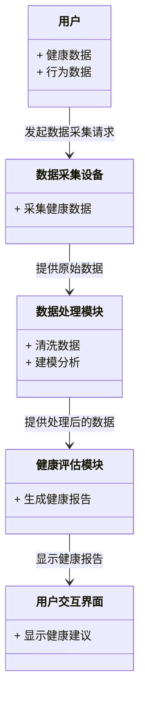

                 


---

# AI Agent在智能健康管理系统中的角色

---

## 关键词

AI Agent, 智能健康管理系统, 健康管理, 强化学习, 系统架构, 个性化建议

---

## 摘要

随着人工智能技术的飞速发展，AI Agent（人工智能代理）在智能健康管理系统中的应用日益广泛。本文详细探讨了AI Agent在智能健康管理系统中的核心角色，包括其在数据采集、用户行为分析、个性化健康建议和健康风险预警等方面的功能。通过分析AI Agent的算法原理、系统架构设计以及实际项目案例，本文揭示了AI Agent如何通过智能化手段提升健康管理系统的效率和用户体验。最后，本文总结了AI Agent在智能健康管理系统中的最佳实践，并展望了未来的发展方向。

---

## 第1章: AI Agent与智能健康管理系统概述

### 1.1 AI Agent的基本概念

#### 1.1.1 AI Agent的定义

AI Agent是一种能够感知环境、自主决策并执行任务的智能实体。它能够根据输入的信息（如传感器数据、用户行为数据等）进行分析和推理，生成相应的动作或建议，以实现特定的目标。

#### 1.1.2 AI Agent的核心特征

| 核心特征 | 描述 |
|----------|------|
| 智能性   | 能够通过学习和推理做出决策 |
| 自主性   | 能够在没有外部干预的情况下自主运行 |
| 反应性   | 能够实时感知环境变化并做出响应 |
| 社会性   | 能够与其他系统或用户进行交互和协作 |

#### 1.1.3 AI Agent与传统软件的区别

| 方面       | 传统软件                 | AI Agent                  |
|------------|--------------------------|---------------------------|
| 决策方式   | 预先编写规则             | 基于数据学习动态决策      |
| 适应性     | 固定功能                 | 能够自适应环境变化         |
| 智能性     | 无智能性                 | 具备一定的智能性            |

---

### 1.2 智能健康管理系统的基本概念

#### 1.2.1 智能健康管理系统的定义

智能健康管理系统是一种基于人工智能技术，能够实时采集、分析用户健康数据，并提供个性化健康建议的系统。它通常包括数据采集设备、数据处理模块、健康评估模块和用户交互界面。

#### 1.2.2 智能健康管理系统的核心功能

| 功能模块       | 描述 |
|----------------|------|
| 数据采集       | 通过传感器或用户输入获取健康数据 |
| 数据分析       | 对健康数据进行清洗、建模和分析     |
| 健康评估       | 根据分析结果生成健康评估报告       |
| 个性化建议     | 提供基于用户数据的健康建议          |
| 健康风险预警   | 及时发现潜在健康风险并发出预警      |

#### 1.2.3 智能健康管理系统的发展历程

智能健康管理系统经历了从简单的数据采集到复杂的个性化健康管理的演变。早期的系统主要基于规则引擎进行健康评估，而现代系统则广泛采用AI Agent技术，实现了更加智能化和个性化的健康管理。

---

### 1.3 AI Agent在智能健康管理系统中的角色

#### 1.3.1 AI Agent在智能健康管理系统中的定位

AI Agent在智能健康管理系统中扮演着“智能决策者”的角色。它能够根据用户的健康数据和行为模式，实时调整系统的推荐策略和健康建议，从而提高系统的智能化水平。

#### 1.3.2 AI Agent的核心功能与作用

| 功能模块       | 描述 |
|----------------|------|
| 数据处理       | 对采集到的健康数据进行预处理和分析 |
| 行为分析       | 分析用户的健康行为模式，识别异常行为 |
| 个性化建议     | 根据用户特征和健康数据生成个性化建议 |
| 风险预警       | 基于历史数据和当前数据预测健康风险   |

#### 1.3.3 AI Agent与其他技术的协同作用

AI Agent在智能健康管理系统中与其他技术（如大数据、云计算等）协同工作，共同实现系统的智能化目标。例如，AI Agent可以利用云计算平台进行大规模数据处理，同时结合大数据技术进行健康趋势分析。

---

## 第2章: AI Agent在智能健康管理系统中的核心功能

### 2.1 数据采集与处理

#### 2.1.1 数据采集的多样性

智能健康管理系统需要采集多种类型的数据，包括：

- **生理数据**：如心率、血压、体温等。
- **行为数据**：如运动量、睡眠质量等。
- **环境数据**：如空气质量、温湿度等。
- **用户输入数据**：如饮食记录、用药记录等。

#### 2.1.2 数据处理的关键步骤

数据处理流程包括：

1. 数据采集：通过传感器或用户输入获取原始数据。
2. 数据清洗：去除噪声数据，确保数据的准确性。
3. 数据建模：利用机器学习算法对数据进行建模和分析。
4. 数据存储：将处理后的数据存储到数据库中。

#### 2.1.3 数据隐私与安全保护

数据隐私和安全是智能健康管理系统设计中的重要考虑因素。AI Agent需要通过加密技术和访问控制机制，确保用户数据的安全性和隐私性。

---

### 2.2 用户行为分析

#### 2.2.1 用户行为分析的必要性

用户行为分析可以帮助系统了解用户的健康习惯和潜在需求，从而提供更加个性化的健康建议。例如，通过分析用户的运动记录，可以识别其运动习惯是否健康。

#### 2.2.2 基于AI Agent的行为分析模型

行为分析模型通常包括以下步骤：

1. 数据采集：获取用户的健康数据和行为数据。
2. 数据预处理：清洗和标准化数据。
3. 特征提取：提取关键特征（如运动频率、睡眠时长等）。
4. 模型训练：利用机器学习算法训练行为分析模型。
5. 行为预测：基于训练好的模型预测用户的未来行为。

#### 2.2.3 行为分析的典型应用场景

- **运动习惯分析**：识别用户的运动频率和强度，提供个性化的运动建议。
- **睡眠质量评估**：分析用户的睡眠数据，识别睡眠障碍。
- **饮食习惯分析**：根据用户的饮食记录，评估饮食健康状况。

---

### 2.3 个性化健康建议

#### 2.3.1 个性化健康建议的生成原理

个性化健康建议的生成基于用户的健康数据和行为数据。AI Agent通过分析这些数据，识别用户的健康问题，并生成相应的建议。

#### 2.3.2 基于AI Agent的个性化建议算法

个性化建议算法通常包括以下几个步骤：

1. 数据输入：获取用户的健康数据和行为数据。
2. 数据分析：利用机器学习算法对数据进行分析和建模。
3. 建议生成：根据分析结果生成个性化的健康建议。
4. 建议输出：将建议通过用户界面呈现给用户。

#### 2.3.3 个性化建议的实际案例

例如，系统可以根据用户的运动数据和饮食记录，生成个性化的运动和饮食计划，帮助用户实现健康目标。

---

### 2.4 健康风险预警

#### 2.4.1 健康风险预警的定义与重要性

健康风险预警是指通过分析用户的健康数据，预测潜在的健康风险，并及时发出预警。这可以帮助用户采取预防措施，避免健康问题的发生。

#### 2.4.2 AI Agent在风险预警中的应用

AI Agent可以通过以下方式实现健康风险预警：

1. 数据采集：实时采集用户的健康数据。
2. 数据分析：利用机器学习算法分析数据，识别潜在的健康风险。
3. 预警发出：当发现潜在风险时，及时通知用户或医生。

#### 2.4.3 风险预警的实现机制

健康风险预警的实现机制通常包括以下几个步骤：

1. 数据采集：获取用户的健康数据。
2. 数据建模：利用机器学习算法构建健康风险预测模型。
3. 风险评估：根据模型预测结果评估用户的健康风险。
4. 预警发出：当预测到潜在风险时，发出预警通知。

---

## 第3章: AI Agent的算法原理与实现

### 3.1 AI Agent的核心算法

#### 3.1.1 基于强化学习的AI Agent算法

强化学习是一种通过试错方式来优化决策的算法。AI Agent可以通过强化学习算法，根据环境的反馈不断优化其决策策略。

#### 3.1.2 基于监督学习的AI Agent算法

监督学习是一种基于标记数据进行分类或回归的算法。AI Agent可以通过监督学习算法，根据用户的历史数据，预测用户的未来行为。

#### 3.1.3 基于无监督学习的AI Agent算法

无监督学习是一种基于未标记数据进行聚类或降维的算法。AI Agent可以通过无监督学习算法，发现用户数据中的潜在模式和结构。

---

### 3.2 AI Agent的数学模型

#### 3.2.1 强化学习的数学模型

强化学习的核心是通过不断试错来优化决策策略。数学模型可以表示为：

$$
V(s) = \max_a Q(s,a)
$$

其中，\( V(s) \) 表示状态 \( s \) 的价值，\( Q(s,a) \) 表示状态 \( s \) 下动作 \( a \) 的价值。

#### 3.2.2 监督学习的数学模型

监督学习的核心是根据训练数据学习一个函数 \( f(x) \)，使得输入 \( x \) 对应的输出 \( y \) 满足 \( y = f(x) \)。数学模型可以表示为：

$$
y = f(x)
$$

#### 3.2.3 无监督学习的数学模型

无监督学习的核心是通过聚类或降维等技术，发现数据中的潜在结构。数学模型可以表示为：

$$
p(x) = \prod_{i=1}^{n} p(x_i)
$$

其中，\( p(x) \) 表示数据的概率分布，\( x_i \) 表示数据的各个特征。

---

### 3.3 AI Agent的实现步骤

#### 3.3.1 状态空间的定义

状态空间是指AI Agent在决策过程中可能遇到的所有状态。例如，在健康管理场景中，状态可以包括用户的健康数据、行为数据等。

#### 3.3.2 动作空间的定义

动作空间是指AI Agent在决策过程中可以执行的所有动作。例如，在健康管理场景中，动作可以包括发出健康建议、调整健康计划等。

#### 3.3.3 奖励函数的设计

奖励函数是用来衡量AI Agent决策效果的函数。例如，在健康管理场景中，当AI Agent成功预测用户的健康风险时，可以给予正向奖励。

#### 3.3.4 策略的优化与训练

策略优化与训练是AI Agent的核心任务。通过不断试错和优化，AI Agent可以逐步提高其决策的准确性和效果。

---

## 第4章: 智能健康管理系统中的系统架构设计

### 4.1 系统功能设计

#### 4.1.1 领域模型

领域模型是系统功能设计的核心。智能健康管理系统的主要功能模块包括数据采集、数据处理、健康评估、个性化建议和健康风险预警。

#### 4.1.2 领域模型 Mermaid 类图



---

### 4.2 系统架构设计

#### 4.2.1 系统架构 Mermaid 架构图

```mermaid
client --> 数据采集设备: 发起数据采集请求
数据采集设备 --> 数据处理模块: 提供原始数据
数据处理模块 --> 数据存储模块: 存储处理后的数据
数据存储模块 --> 健康评估模块: 提供数据支持
健康评估模块 --> 用户交互界面: 显示健康报告
```

---

### 4.3 系统接口设计

#### 4.3.1 API接口设计

智能健康管理系统通常提供以下API接口：

- 数据采集接口：用于采集用户的健康数据。
- 数据处理接口：用于对健康数据进行清洗和建模。
- 健康评估接口：用于生成健康评估报告。
- 用户交互接口：用于显示健康建议和风险预警。

#### 4.3.2 API接口实现

以下是一个简单的API接口实现示例：

```python
class HealthManager:
    def __init__(self):
        self.data_storage = DataStorage()

    def collect_data(self, user_id):
        # 发起数据采集请求
        pass

    def process_data(self, user_id):
        # 处理数据
        pass

    def evaluate_health(self, user_id):
        # 生成健康评估报告
        pass

    def show_recommendation(self, user_id):
        # 显示健康建议
        pass
```

---

## 第5章: 项目实战

### 5.1 环境安装

#### 5.1.1 安装Python

安装Python环境，确保版本为3.6以上。

#### 5.1.2 安装依赖库

安装以下依赖库：

```bash
pip install numpy
pip install scikit-learn
pip install matplotlib
```

---

### 5.2 系统核心实现源代码

#### 5.2.1 数据处理模块实现

```python
import numpy as np
from sklearn import preprocessing

def preprocess_data(data):
    # 数据清洗
    data_clean = data.dropna()
    # 标准化处理
    data_normalized = preprocessing.normalize(data_clean)
    return data_normalized
```

#### 5.2.2 健康评估模块实现

```python
import numpy as np
from sklearn import linear_model

def evaluate_health(data):
    # 建立线性回归模型
    model = linear_model.LinearRegression()
    model.fit(data[['age', 'weight', 'height']], data['health_score'])
    return model.predict([[30, 70, 170]])
```

---

### 5.3 项目小结

通过本项目的实战，我们可以看到AI Agent在智能健康管理系统中的强大功能。通过数据处理、健康评估和个性化建议等模块的实现，AI Agent能够帮助用户更好地管理健康，预防疾病的发生。

---

## 第6章: 总结与展望

### 6.1 最佳实践 tips

1. 在设计智能健康管理系统时，需要充分考虑数据隐私和安全问题。
2. AI Agent的算法选择需要根据具体应用场景进行调整。
3. 系统的可扩展性和可维护性是设计时的重要考虑因素。

### 6.2 小结

本文详细探讨了AI Agent在智能健康管理系统中的核心角色和功能。通过分析AI Agent的算法原理、系统架构设计和实际项目案例，我们揭示了AI Agent在智能健康管理中的巨大潜力。

### 6.3 注意事项

- AI Agent的决策需要结合实际场景进行优化。
- 数据隐私和安全问题需要得到充分重视。
- 系统的设计需要充分考虑用户体验。

### 6.4 拓展阅读

- 《强化学习实战》
- 《机器学习在健康管理中的应用》
- 《智能系统架构设计》

---

通过本文的探讨，我们相信AI Agent在智能健康管理系统中的应用将更加广泛，为用户的健康管理带来更大的便利和价值。

