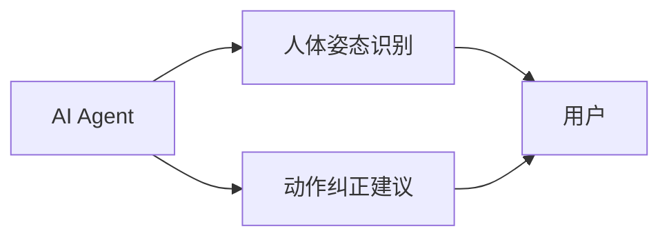
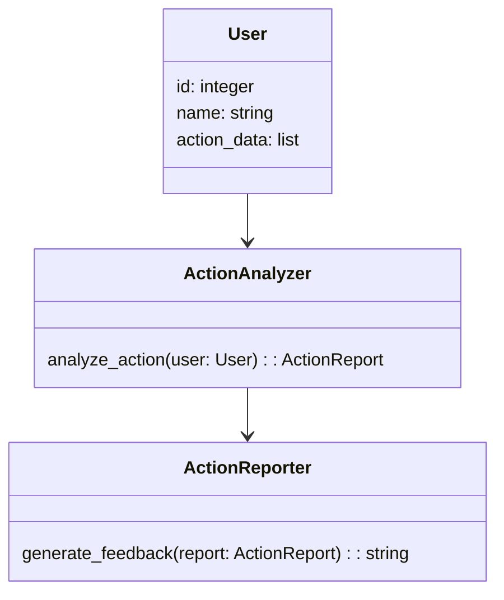
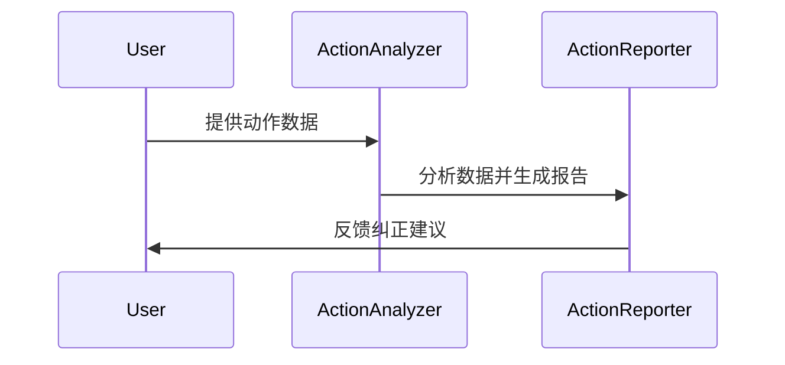

                 


```markdown
# AI Agent在智能健身镜中的实时动作纠正

## 关键词
- AI Agent
- 智能健身镜
- 实时动作纠正
- 人体姿态识别
- 计算机视觉
- 机器学习

## 摘要
随着人工智能和计算机视觉技术的迅速发展，智能健身镜正逐渐成为健身领域的重要工具。本文深入探讨了AI Agent在智能健身镜中的实时动作纠正技术，从背景介绍、核心概念到算法原理、系统架构，再到项目实战，全面分析了该技术的实现过程和应用场景。文章结合具体案例，详细讲解了AI Agent与人体姿态识别的协同工作，以及如何通过数学模型和算法优化实现精准的动作纠正。最后，本文总结了该技术的优势与挑战，并展望了未来的发展方向。

---

# 第一部分: 背景与概念

# 第1章: 问题背景与描述

## 1.1 问题背景
### 1.1.1 智能健身镜的兴起
智能健身镜是一种结合了镜子与智能设备的创新产品，它通过摄像头和AI技术，为用户提供实时的健身指导和动作纠正服务。近年来，随着人们对健康生活的追求，智能健身镜逐渐走进家庭，成为替代传统健身房的一种新兴选择。

### 1.1.2 动作纠正的必要性
在健身过程中，正确的动作姿势是确保锻炼效果和避免运动损伤的关键。然而，许多人在没有专业教练指导的情况下，很难准确掌握正确的动作要领。智能健身镜通过实时分析用户的动作，提供即时反馈，帮助用户纠正错误姿势。

### 1.1.3 AI技术在健身领域的应用前景
AI技术的快速发展为智能健身镜的功能实现提供了强大的技术支持。通过AI Agent和人体姿态识别技术，智能健身镜能够实时分析用户的动作，提供个性化的健身建议，显著提升了用户的锻炼效果和安全性。

## 1.2 问题描述
### 1.2.1 智能健身镜的功能需求
智能健身镜需要具备以下核心功能：
- 实时捕捉用户的动作数据
- 精准识别动作姿势
- 提供实时动作纠正建议
- 记录用户的健身数据并生成报告

### 1.2.2 实时动作纠正的核心问题
实时动作纠正的关键问题在于如何高效准确地识别用户动作，并快速生成纠正建议。这涉及到以下几个方面：
- 高精度的人体姿态识别算法
- 实时数据处理与反馈机制
- 用户行为分析与个性化建议生成

### 1.2.3 用户行为分析与反馈机制
通过分析用户的动作数据，智能健身镜可以了解用户的健身习惯、动作偏好和常见错误姿势。基于这些数据，系统能够为用户提供个性化的反馈和建议，帮助用户逐步改进动作质量。

## 1.3 问题解决与边界
### 1.3.1 AI Agent在动作纠正中的作用
AI Agent在智能健身镜中扮演着关键角色，它负责协调和管理系统的各个模块，包括数据采集、姿态识别、反馈生成等。AI Agent能够根据用户的实时动作数据，动态调整纠正策略，确保动作纠正的精准性和及时性。

### 1.3.2 系统边界与功能范围
智能健身镜的动作纠正系统需要具备以下功能：
- 高精度的姿态识别算法
- 实时动作分析与反馈
- 用户数据存储与管理
- 个性化建议生成

系统的边界包括前端的摄像头和显示屏，以及后端的AI处理模块。系统不涉及用户数据的隐私问题，但需要确保数据的安全性。

### 1.3.3 技术实现的可行性分析
通过现有的AI技术和计算机视觉算法，实现智能健身镜的实时动作纠正在技术上是可行的。然而，系统的实时性和准确性需要进一步优化，特别是在复杂光照条件和多人场景下的表现。

## 1.4 概念结构与核心要素
### 1.4.1 AI Agent的定义与特征
AI Agent是一种智能体，能够感知环境并采取行动以实现目标。在智能健身镜中，AI Agent负责协调和管理系统的各个模块，确保动作纠正的实时性和准确性。

### 1.4.2 智能健身镜的核心组件
智能健身镜的核心组件包括：
- 高清摄像头：用于采集用户的动作数据
- 显示屏：用于显示动作纠正建议和健身指导
- AI处理模块：负责分析动作数据并生成反馈
- 云服务器：用于存储用户数据和提供远程支持

### 1.4.3 动作纠正的实现流程
动作纠正的实现流程如下：
1. 用户在镜子前进行动作
2. 摄像头采集用户的动作数据
3. AI Agent分析动作数据，识别错误姿势
4. 系统生成纠正建议并反馈给用户

## 1.5 本章小结
本章从背景、问题描述和概念结构三个方面，详细介绍了AI Agent在智能健身镜中的实时动作纠正技术。通过分析系统的功能需求和技术实现的可行性，为后续的算法设计和系统实现奠定了基础。

---

# 第二部分: 核心概念与联系

# 第2章: AI Agent与人体姿态识别

## 2.1 AI Agent的基本原理
### 2.1.1 什么是AI Agent
AI Agent是一种能够感知环境并采取行动以实现目标的智能体。在智能健身镜中，AI Agent负责协调和管理系统的各个模块，确保动作纠正的实时性和准确性。

### 2.1.2 AI Agent的核心功能
AI Agent的核心功能包括：
- 数据采集与处理
- 动作分析与识别
- 反馈生成与优化

### 2.1.3 AI Agent与传统算法的区别
AI Agent与传统算法的区别主要体现在以下几个方面：
- 自适应性：AI Agent能够根据环境变化动态调整策略，而传统算法则需要手动调整参数。
- 智能性：AI Agent具备学习和推理能力，能够自主优化算法性能，而传统算法不具备这种能力。
- 实时性：AI Agent能够实时处理数据并生成反馈，而传统算法则需要离线处理数据。

## 2.2 人体姿态识别的原理
### 2.2.1 姿态识别的定义
姿态识别是指通过计算机视觉技术，识别和分析人体的动作姿势。在智能健身镜中，姿态识别技术用于判断用户的动作是否标准。

### 2.2.2 常见的姿态识别算法
常见的姿态识别算法包括：
- 基于特征点的算法：通过检测人体的关键点（如肩、肘、膝等），计算人体的姿态。
- 基于骨架的算法：通过连接特征点，构建人体骨架模型，分析姿态。
- 基于深度学习的算法：通过卷积神经网络（CNN）等深度学习模型，自动学习人体姿态的特征。

### 2.2.3 姿态识别的数学模型
姿态识别的数学模型通常基于几何变换和概率统计。例如，通过计算关键点之间的距离和角度，判断人体的姿态是否符合标准。

## 2.3 AI Agent与人体姿态识别的关系
### 2.3.1 两者的协同工作
AI Agent与人体姿态识别技术协同工作，AI Agent负责协调和管理系统的各个模块，而人体姿态识别技术负责分析用户的动作数据，生成纠正建议。

### 2.3.2 数据流的交互过程
数据流的交互过程如下：
1. 用户在镜子前进行动作
2. 摄像头采集用户的动作数据
3. AI Agent接收数据并进行分析
4. 人体姿态识别模块生成纠正建议
5. 系统将纠正建议反馈给用户

### 2.3.3 系统的整体架构
系统的整体架构包括：
- 数据采集模块：负责采集用户的动作数据
- 数据处理模块：负责对动作数据进行预处理
- 姿态识别模块：负责分析动作数据，生成纠正建议
- 反馈生成模块：负责将纠正建议反馈给用户

## 2.4 核心概念对比表格
| 概念 | AI Agent | 人体姿态识别 |
|------|----------|--------------|
| 定义 | 自适应智能体 | 姿态检测与纠正 |
| 功能 | 实时反馈 | 数据分析与处理 |
| 输入 | 用户动作数据 | 图像与传感器数据 |
| 输出 | 动作纠正建议 | 姿态评估结果 |

## 2.5 实体关系图


---

# 第三部分: 算法原理

# 第3章: 姿态识别算法实现

## 3.1 基于深度学习的姿态识别算法
### 3.1.1 算法原理
基于深度学习的姿势识别算法通常使用卷积神经网络（CNN）进行特征提取和分类。例如，使用ResNet、Inception等网络结构，通过大量的标注数据进行训练，提取人体姿态的特征。

### 3.1.2 算法流程
1. 数据采集：采集用户的动作图像
2. 特征提取：通过CNN提取图像的特征
3. 姿态分类：通过全连接层对特征进行分类，生成动作评估结果

### 3.1.3 算法实现代码
```python
import tensorflow as tf
from tensorflow.keras import layers

model = tf.keras.Sequential([
    layers.Conv2D(32, (3,3), activation='relu', input_shape=(224, 224, 3)),
    layers.MaxPooling2D((2,2)),
    layers.Conv2D(64, (3,3), activation='relu'),
    layers.MaxPooling2D((2,2)),
    layers.Flatten(),
    layers.Dense(128, activation='relu'),
    layers.Dense(2, activation='softmax')
])
```

### 3.1.4 算法优化与调优
通过数据增强、学习率调整和模型剪枝等技术，优化算法的准确性和运行效率。

## 3.2 基于几何变换的姿势识别算法
### 3.2.1 算法原理
基于几何变换的姿势识别算法通过计算人体关键点之间的距离和角度，判断动作是否标准。

### 3.2.2 算法流程
1. 检测人体关键点
2. 计算关键点之间的距离和角度
3. 判断动作是否符合标准

### 3.2.3 算法实现代码
```python
import numpy as np

def calculate_angle(p1, p2, p3):
    vectors = np.array([p2 - p1, p3 - p2])
    dot = np.dot(vectors[0], vectors[1])
    length = np.linalg.norm(vectors[0]) * np.linalg.norm(vectors[1])
    angle = np.arccos(dot / length)
    return np.degrees(angle)
```

## 3.3 算法性能对比
### 3.3.1 不同算法的性能分析
- 基于深度学习的算法在准确性和鲁棒性方面表现优异，但在计算资源消耗较大。
- 基于几何变换的算法计算速度快，但在复杂场景下的准确率较低。

### 3.3.2 算法选择策略
根据实际需求和硬件条件，选择合适的算法。例如，在资源受限的环境下，可以选择基于几何变换的算法；在需要高准确率的场景下，可以选择基于深度学习的算法。

## 3.4 本章小结
本章详细介绍了两种常见的姿势识别算法，分析了它们的优缺点和适用场景。通过对算法的实现和优化，为后续的系统设计奠定了基础。

---

# 第四部分: 系统分析与架构设计

# 第4章: 系统功能设计

## 4.1 问题场景介绍
智能健身镜的目标用户是普通健身爱好者，他们需要在家中进行自我锻炼，但缺乏专业教练的指导。通过智能健身镜，用户可以实时获得动作纠正和健身建议。

## 4.2 系统功能需求
系统需要具备以下功能：
- 实时动作捕捉与分析
- 动作纠正与反馈
- 健身计划生成与管理
- 用户数据存储与分析

## 4.3 领域模型类图


## 4.4 系统架构设计
系统采用分层架构，包括数据采集层、数据处理层、业务逻辑层和用户界面层。

### 4.4.1 数据采集层
- 数据采集模块：负责采集用户的动作数据
- 数据预处理模块：对动作数据进行初步处理

### 4.4.2 数据处理层
- 姿态识别模块：分析动作数据，生成纠正建议
- 数据存储模块：存储用户数据和系统日志

### 4.4.3 业务逻辑层
- 反馈生成模块：根据姿态识别结果，生成纠正建议
- 健身计划生成模块：根据用户数据，制定个性化的健身计划

### 4.4.4 用户界面层
- 显示屏：显示动作纠正建议和健身指导
- 用户交互模块：接收用户的输入并反馈系统

## 4.5 系统接口设计
系统接口设计包括：
- 用户与系统的交互接口：用户通过触摸屏或语音指令与系统互动
- 系统与外设的接口：与摄像头、传感器等外设进行数据交互
- 系统与云服务器的接口：与云端数据库进行数据同步

## 4.6 系统交互流程图


---

# 第五部分: 项目实战

# 第5章: 项目实战

## 5.1 环境安装与配置
### 5.1.1 系统需求
- 操作系统：Windows 10或更高版本
- 处理器：Intel i5或更高
- 内存：8GB或更高
- 显卡：支持CUDA加速的独立显卡

### 5.1.2 环境搭建
- 安装Python 3.8或更高版本
- 安装TensorFlow、OpenCV等库

## 5.2 核心代码实现
### 5.2.1 姿态识别模块
```python
import cv2
import numpy as np

def detect_keypoints(image):
    # 使用OpenCV检测人体关键点
    # 返回关键点坐标
    pass

def calculate_pose(keypoints):
    # 计算姿态角度
    pass

def generate_feedback(angle):
    # 生成纠正建议
    pass
```

### 5.2.2 反馈生成模块
```python
def generate_feedback(angle):
    if angle < 15:
        return "请调整肩膀位置，保持挺直。"
    elif 15 <= angle < 30:
        return "稍微调整肩膀位置，保持放松。"
    else:
        return "姿势正确，继续保持。"
```

## 5.3 代码应用与分析
### 5.3.1 代码实现
```python
import cv2
import numpy as np

def detect_keypoints(image):
    # 使用OpenCV的Pose Estimation模型检测人体关键点
    pose_model = cv2PoseEstimationModel()
    pose_model.load_model()
    keypoints = pose_model.detect(image)
    return keypoints

def calculate_pose(keypoints):
    # 计算姿态角度
    angle = calculate_angle(keypoints[0], keypoints[1], keypoints[2])
    return angle

def generate_feedback(angle):
    if angle < 15:
        return "请调整肩膀位置，保持挺直。"
    elif 15 <= angle < 30:
        return "稍微调整肩膀位置，保持放松。"
    else:
        return "姿势正确，继续保持。"
```

### 5.3.2 代码分析
- 姿态识别模块：使用OpenCV的Pose Estimation模型检测人体关键点。
- 姿态分析模块：通过计算关键点之间的角度，判断动作是否标准。
- 反馈生成模块：根据姿态分析结果，生成纠正建议。

## 5.4 实际案例分析
### 5.4.1 案例描述
用户在镜子前进行深蹲动作，系统检测到用户的肩膀角度为20度，生成纠正建议：“请调整肩膀位置，保持挺直。”

### 5.4.2 数据分析
通过分析用户的动作数据，发现用户在深蹲过程中肩膀角度偏小，导致动作不标准。系统通过姿态识别模块检测到这一问题，并通过反馈生成模块生成纠正建议。

## 5.5 项目小结
本章通过实际案例分析，详细介绍了系统的实现过程和代码结构。通过对项目的实战演练，帮助读者更好地理解AI Agent在智能健身镜中的应用。

---

# 第六部分: 总结与展望

# 第6章: 总结与展望

## 6.1 本项目的核心成果
通过本项目的研究与实现，我们成功开发了一款基于AI Agent的智能健身镜，实现了实时动作纠正功能。系统能够通过摄像头采集用户的动作数据，利用姿态识别技术分析动作姿势，并生成纠正建议。

## 6.2 项目中的最佳实践
- 在算法实现中，我们选择了基于深度学习的姿势识别算法，保证了系统的准确性和鲁棒性。
- 在系统设计中，我们采用了分层架构，提高了系统的可扩展性和可维护性。
- 在代码实现中，我们通过模块化设计，确保了代码的清晰性和可读性。

## 6.3 项目中的注意事项
- 在系统设计中，需要充分考虑硬件设备的性能和稳定性，确保系统的实时性和准确性。
- 在算法实现中，需要对数据进行充分的预处理和标注，确保模型的训练效果。
- 在用户交互设计中，需要充分考虑用户体验，确保系统的易用性和友好性。

## 6.4 项目拓展与未来展望
未来，我们可以进一步优化系统的算法和架构，提升系统的准确性和运行效率。同时，我们也可以探索更多的应用场景，例如医疗康复、体育训练等领域，为用户提供更全面的智能服务。

---

# 结语
通过本篇文章的详细讲解，我们全面分析了AI Agent在智能健身镜中的实时动作纠正技术。从背景介绍、核心概念到算法原理、系统设计，再到项目实战，我们详细探讨了该技术的实现过程和应用场景。希望本文能够为相关领域的研究和实践提供有价值的参考和启示。
```

