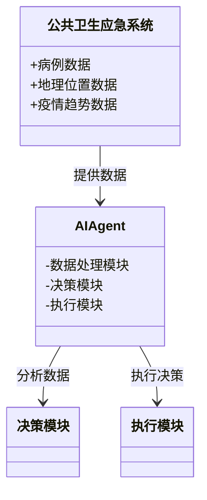

                 


```markdown
# AI Agent在智能公共卫生应急中的角色

> 关键词：AI Agent, 公共卫生应急, 人工智能, 应急响应, 多智能体系统

> 摘要：本文探讨AI Agent在公共卫生应急中的角色，分析其核心概念、算法原理、系统架构，并通过案例分析展示其实际应用，最后总结最佳实践。

---

## 第一部分: AI Agent在智能公共卫生应急中的背景与概念

### 第1章: 公共卫生应急的现状与挑战

#### 1.1 公共卫生应急的定义与特征
- **公共卫生应急的定义**：公共卫生应急是指在突发公共卫生事件中，政府和社会采取的一系列措施，以控制和减少事件的影响。
- **公共卫生应急的核心特征**：
  - 突发性
  - 复杂性
  - 社会影响广泛
- **典型案例**：如新冠疫情、H1N1流感等。

#### 1.2 AI Agent的基本概念与优势
- **AI Agent的定义**：AI Agent是一种能够感知环境、自主决策并执行任务的智能体。
- **优势**：
  - 实时数据分析
  - 高效决策
  - 自适应学习

#### 1.3 AI Agent在公共卫生应急中的应用前景
- **应用场景**：疫情监测、资源分配、风险评估。
- **优势**：提高响应速度和准确性，优化资源配置。
- **挑战**：数据隐私、系统可靠性。

### 第2章: AI Agent在公共卫生应急中的角色

#### 2.1 AI Agent的核心功能
- **数据收集与处理**：整合多源数据，如病例报告、地理信息。
- **情况分析与预测**：使用机器学习模型预测疫情扩散。
- **决策支持与执行**：基于分析结果，制定和执行应急计划。

#### 2.2 AI Agent的角色定位
- **数据分析师**：实时监控疫情动态，识别异常情况。
- **决策支持者**：提供基于数据的决策建议。
- **应急响应者**：协调资源，执行应急措施。

#### 2.3 AI Agent与其他技术的协同作用
- **大数据技术**：处理海量数据，提高分析效率。
- **云计算**：提供弹性计算资源，支持大规模数据处理。
- **物联网**：实时收集和传输数据，增强感知能力。

---

## 第二部分: AI Agent的核心概念与原理

### 第3章: AI Agent的核心概念与属性

#### 3.1 AI Agent的概念模型
- **组成要素**：感知模块、决策模块、执行模块。
- **属性对比表**：

| 属性       | 传统方法 | AI Agent |
|------------|----------|----------|
| 响应时间   | 较慢     | 实时     |
| 分析精度   | 低       | 高       |
| 自适应性   | 无       | 有       |

- **ER实体关系图**：

```mermaid
er
actor(Agent) -[发送数据]-> 数据源
Agent -[接收数据]-> 数据处理模块
数据处理模块 -[触发决策]-> 决策模块
决策模块 -[执行命令]-> 执行模块
```

---

## 第三部分: 系统分析与架构设计

### 第4章: 系统分析与架构设计

#### 4.1 系统场景介绍
- 公共卫生应急系统需要实时处理大量数据，快速响应。

#### 4.2 领域模型设计
- **类图**：



#### 4.3 系统架构设计
- **架构图**：

```mermaid
graph TD
    I1 --> S1: 数据输入
    S1 --> A: AI Agent处理
    A --> O1: 输出决策
    O1 --> E: 执行系统
```

#### 4.4 接口设计与交互
- **接口设计**：
  - 数据输入接口：接收病例数据。
  - 决策输出接口：提供应急措施建议。

---

## 第四部分: 项目实战

### 第5章: 项目实战

#### 5.1 环境安装
- 安装Python、TensorFlow、Keras等工具。

#### 5.2 核心代码实现
- 数据处理模块：

```python
import pandas as pd
import numpy as np

# 数据预处理
data = pd.read_csv('cases.csv')
data = data.dropna()
```

- 决策模块：

```python
import tensorflow as tf
from tensorflow.keras import layers

model = tf.keras.Sequential([
    layers.Dense(64, activation='relu'),
    layers.Dense(1, activation='sigmoid')
])
model.compile(optimizer='adam', loss='binary_crossentropy')
model.fit(data, labels, epochs=10)
```

#### 5.3 案例分析
- 分析某地区疫情数据，预测传播趋势，制定隔离措施。

---

## 第五部分: 最佳实践

### 第6章: 最佳实践

#### 6.1 小结
- AI Agent在公共卫生应急中具有巨大潜力，但需克服技术与数据挑战。

#### 6.2 注意事项
- 数据隐私保护
- 系统稳定性
- 人机协作效率

#### 6.3 拓展阅读
- 推荐相关书籍和论文，深入学习AI在公共卫生中的应用。

---

## 结论

AI Agent通过实时数据分析和智能决策，显著提升了公共卫生应急的效率和效果。随着技术进步，AI Agent将在未来发挥更大作用。

---

感谢阅读！如需进一步探讨，请随时联系。
```

