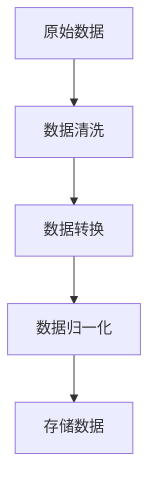
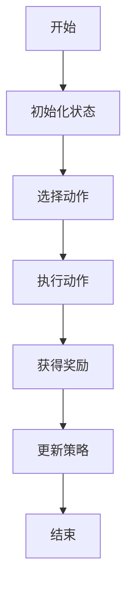
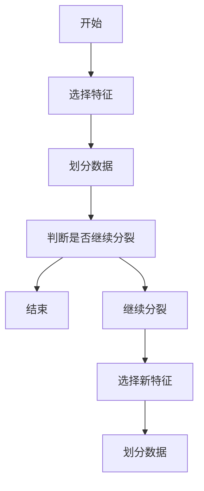
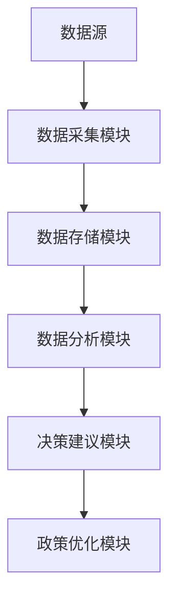
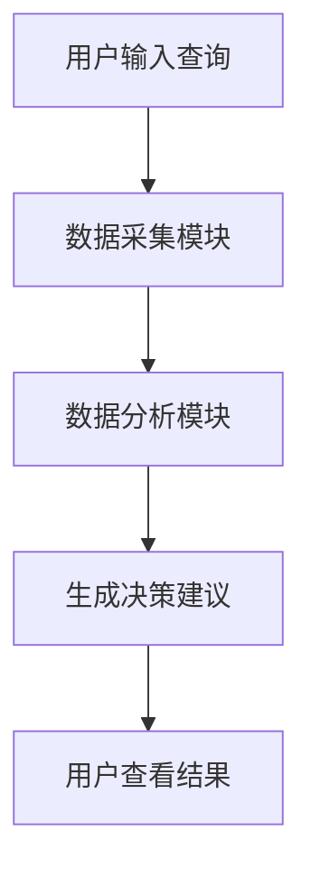

                 


# AI Agent在智能公共卫生政策制定中的角色

**关键词**：AI Agent，公共卫生，政策制定，机器学习，数据驱动，决策优化

**摘要**：随着人工智能技术的快速发展，AI Agent在公共卫生政策制定中的作用日益重要。本文详细探讨了AI Agent的核心概念、算法原理、数学模型及其在公共卫生政策制定中的应用。通过分析AI Agent如何利用数据驱动的方法优化决策过程，本文为公共卫生政策制定者提供了一种高效、智能的决策支持工具，帮助他们在复杂多变的公共卫生事件中做出更明智的决策。

---

## 第一部分：AI Agent在智能公共卫生政策制定中的背景与基础

### 第1章：AI Agent与公共卫生政策制定概述

#### 1.1 AI Agent的基本概念与定义
- **1.1.1 AI Agent的定义与核心特征**
  - AI Agent是一种能够感知环境、自主决策并执行任务的智能实体。
  - 核心特征包括自主性、反应性、目标导向和学习能力。
  - 与传统决策模型相比，AI Agent能够实时适应环境变化，提供动态优化的解决方案。

- **1.1.2 AI Agent与传统决策模型的区别**
  - 传统决策模型基于固定规则和静态数据，而AI Agent能够利用实时数据和机器学习模型进行动态决策。
  - AI Agent具备自适应能力，能够根据反馈不断优化决策策略。

- **1.1.3 公共卫生政策制定中的AI Agent应用背景**
  - 公共卫生政策制定涉及复杂的社会、经济和医学因素，传统方法难以应对日益复杂的公共卫生挑战。
  - AI Agent能够整合多源数据，提供数据驱动的决策支持，帮助政策制定者更高效地应对公共卫生问题。

#### 1.2 公共卫生政策制定的现状与挑战
- **1.2.1 公共卫生政策的传统制定流程**
  - 传统流程依赖专家经验和历史数据，决策过程耗时且难以量化。
  - 数据来源单一，缺乏实时更新，难以应对突发公共卫生事件。

- **1.2.2 当前公共卫生政策制定中的主要问题**
  - 数据碎片化：不同部门和机构的数据难以整合，导致决策缺乏全面性。
  - 决策滞后：传统方法难以快速响应突发事件。
  - 资源分配不均：如何在有限资源下优化政策效果是关键挑战。

- **1.2.3 AI技术在公共卫生领域的应用潜力**
  - AI技术能够整合多源数据，提供实时分析和预测，帮助政策制定者做出更明智的决策。
  - AI Agent能够在复杂环境中自主决策，提高政策制定的效率和效果。

#### 1.3 AI Agent在公共卫生政策中的角色定位
- **1.3.1 AI Agent在公共卫生决策中的功能定位**
  - 数据收集与分析：AI Agent能够实时收集、整理和分析多源数据，为政策制定提供数据支持。
  - 决策支持：通过机器学习模型，AI Agent能够预测政策效果，优化决策方案。
  - 应急响应：在突发公共卫生事件中，AI Agent能够快速生成应急响应方案，协助政策制定者应对危机。

- **1.3.2 AI Agent如何辅助政策制定者**
  - 提供实时数据支持：AI Agent能够整合医疗、人口、经济等数据，帮助政策制定者全面了解问题。
  - 模拟政策效果：通过模拟不同政策的实施效果，AI Agent能够帮助制定者选择最优方案。
  - 自动化决策：在某些情况下，AI Agent可以自动生成决策建议，提高决策效率。

- **1.3.3 AI Agent在公共卫生危机中的应急作用**
  - 快速响应：在突发公共卫生事件中，AI Agent能够快速分析数据，提供应急响应方案。
  - 协调资源：AI Agent能够优化资源配置，确保资源在最需要的地方得到充分利用。
  - 风险评估：通过实时数据分析，AI Agent能够评估公共卫生事件的风险，并制定预防措施。

#### 1.4 本章小结
- 本章介绍了AI Agent的基本概念和核心特征，分析了公共卫生政策制定的现状与挑战，探讨了AI Agent在公共卫生政策中的角色定位。AI Agent通过数据驱动的方法，能够显著提高公共卫生政策制定的效率和效果。

---

## 第2章：AI Agent的核心概念与理论基础

### 2.1 AI Agent的类型与分类
- **2.1.1 基于知识的AI Agent**
  - 基于知识的AI Agent依赖于预定义的知识库，通过规则推理进行决策。
  - 优点：决策过程清晰可解释；缺点：难以应对未知情况。

- **2.1.2 基于学习的AI Agent**
  - 基于学习的AI Agent通过机器学习算法从数据中学习决策策略。
  - 优点：能够适应新数据，决策效果更好；缺点：需要大量数据支持，决策过程可能不可解释。

- **2.1.3 混合型AI Agent**
  - 混合型AI Agent结合了基于知识和基于学习的优势，能够在复杂环境中灵活决策。
  - 优点：兼具规则推理和数据驱动的优势；缺点：实现复杂，需要大量计算资源。

#### AI Agent类型的对比表格
| 类型                | 基于知识的AI Agent | 基于学习的AI Agent | 混合型AI Agent |
|---------------------|-------------------|-------------------|---------------|
| 数据依赖            | 低                | 高                | 中             |
| 可解释性            | 高                | 低                | 中             |
| 适应性              | 低                | 高                | 高             |
| 适用场景            | 简单、规则明确的场景 | 复杂、数据丰富的场景 | 综合场景        |

### 2.2 AI Agent的工作原理
- **2.2.1 信息收集与处理**
  - AI Agent通过多种渠道收集数据，包括传感器数据、文本数据和图像数据。
  - 数据预处理：清洗、转换和归一化，确保数据质量。
  - 数据存储：使用数据库或大数据平台存储数据。

- **2.2.2 决策过程**
  - 数据分析：通过机器学习模型分析数据，提取有用信息。
  - 模型选择：根据问题类型选择合适的算法，如分类、回归或聚类。
  - 决策生成：基于分析结果生成决策建议。

- **2.2.3 行动执行**
  - 根据决策结果，AI Agent执行相应操作，如触发警报、调整资源配置或生成报告。

### 2.3 AI Agent在公共卫生政策制定中的核心要素
- **2.3.1 数据来源与处理**
  - 数据来源：医疗记录、人口统计数据、社交媒体数据、环境数据等。
  - 数据预处理：清洗、去重、标准化等，确保数据质量。

- **2.3.2 决策模型构建**
  - 选择合适的算法：如随机森林、支持向量机、神经网络等。
  - 模型训练：使用训练数据训练模型，优化参数。
  - 模型评估：通过交叉验证评估模型性能。

- **2.3.3 政策效果评估**
  - 通过模拟实验评估政策效果，如A/B测试。
  - 收集反馈数据，优化模型。

#### 2.3.1 数据预处理流程图（使用mermaid）


### 2.4 本章小结
- 本章介绍了AI Agent的类型与分类，分析了其工作原理，并探讨了在公共卫生政策制定中的核心要素。AI Agent通过数据驱动的方法，能够显著提高决策的准确性和效率。

---

## 第3章：AI Agent的算法原理与数学模型

### 3.1 常见AI Agent算法介绍
- **3.1.1 强化学习算法**
  - 强化学习是一种通过试错方式学习策略的方法。
  - 核心概念：状态、动作、奖励、策略。
  - 应用场景：需要动态决策的任务，如游戏、机器人控制。

- **3.1.2 监督学习算法**
  - 监督学习通过标签数据训练模型，预测新数据的标签。
  - 常见算法：线性回归、支持向量机、随机森林。
  - 应用场景：分类、回归问题。

- **3.1.3 聚类分析算法**
  - 聚类分析是将数据分成若干组的过程。
  - 常见算法：K-means、层次聚类。
  - 应用场景：识别数据中的自然群体。

#### 3.1.1 强化学习流程图（使用mermaid）


### 3.2 AI Agent的数学模型与公式
- **3.2.1 决策树模型**
  - 决策树是一种树状结构，用于分类和回归。
  - 常见算法：ID3、C4.5、CART。
  - 基本公式：信息增益计算。

- **3.2.2 马尔可夫决策过程**
  - 马尔可夫决策过程（MDP）是一种用于描述决策过程的数学模型。
  - 状态空间、动作空间、奖励函数和转移概率。
  - 最大化期望奖励的公式。

- **3.2.3 贝叶斯网络**
  - 贝叶斯网络是一种有向无环图，用于表示变量之间的概率关系。
  - 结构学习和参数学习。
  - 条件概率公式。

#### 3.2.2 马尔可夫决策过程公式
$$ V(s) = \max_{a} [r(s, a) + \gamma \sum_{s'} P(s'|s,a) V(s')] $$

### 3.3 算法流程图与代码实现
- **3.3.1 强化学习算法流程图（使用mermaid）**


- **3.3.2 强化学习代码示例**
```python
import gym
import numpy as np

env = gym.make('CartPole-v0')
env.seed(42)

# 策略参数
theta = np.zeros(env.observation_space.shape, dtype=np.float32)
learning_rate = 0.01
gamma = 0.99

# 策略函数
def policy(obs):
    return np.argmax(theta[obs])

# 训练循环
for episode in range(1000):
    obs = env.reset()
    total_reward = 0
    for step in range(1000):
        action = policy(obs)
        next_obs, reward, done, _ = env.step(action)
        total_reward += reward
        if not done:
            theta[obs] += learning_rate * (reward + gamma * np.max(theta[next_obs]) - theta[obs])
        obs = next_obs
        if done:
            break
    print(f'Episode {episode}, Reward: {total_reward}')
```

### 3.4 本章小结
- 本章介绍了常见AI Agent算法，包括强化学习、监督学习和聚类分析，并通过公式和流程图详细讲解了它们的工作原理。同时，提供了强化学习的代码示例，帮助读者理解算法实现。

---

## 第4章：AI Agent的数学模型与公式

### 4.1 决策树模型
- **决策树模型的基本原理**
  - 决策树通过构建树状结构，将数据分成不同的群体，每个群体对应一个决策。
  - 常见算法：ID3、C4.5、CART。

- **信息增益计算公式**
  $$ \text{信息增益} = H(parent) - \sum_{i} p_i H(child_i) $$

- **决策树构建流程图（使用mermaid）**


### 4.2 马尔可夫决策过程
- **马尔可夫决策过程的基本原理**
  - MDP通过状态、动作、奖励和转移概率描述决策过程。
  - 动作选择：基于当前状态选择最优动作，最大化期望奖励。

- **最大值方程**
$$ V(s) = \max_{a} [r(s, a) + \gamma \sum_{s'} P(s'|s,a) V(s')] $$

### 4.3 贝叶斯网络
- **贝叶斯网络的基本原理**
  - 贝叶斯网络通过概率关系描述变量之间的依赖关系。
  - 结构学习：构建网络结构；参数学习：估计概率参数。

- **条件概率公式**
$$ P(A|B) = \frac{P(B|A) P(A)}{P(B)} $$

### 4.4 本章小结
- 本章详细讲解了AI Agent中的数学模型，包括决策树、马尔可夫决策过程和贝叶斯网络。通过公式和流程图，帮助读者理解这些模型的原理和应用。

---

## 第5章：系统分析与架构设计方案

### 5.1 公共卫生政策制定的系统架构
- **系统功能设计**
  - 数据采集：整合多源数据，如医疗记录、人口统计数据。
  - 数据分析：使用机器学习模型分析数据，生成决策建议。
  - 政策优化：模拟不同政策的效果，优化决策方案。

- **系统架构图（使用mermaid）**


### 5.2 系统接口设计
- **数据接口**
  - 数据输入接口：接收来自不同数据源的数据。
  - 数据输出接口：将分析结果输出到其他系统。

- **用户接口**
  - �界面对话框：供政策制定者输入查询和查看结果。
  - 可视化界面：展示数据分析结果和决策建议。

### 5.3 系统交互流程图（使用mermaid）


### 5.4 本章小结
- 本章分析了公共卫生政策制定系统的架构设计，包括功能设计、数据流和接口设计。通过系统架构图和交互流程图，帮助读者理解系统的整体结构和工作流程。

---

## 第6章：项目实战

### 6.1 环境安装
- 安装Python环境
  ```bash
  python --version
  ```
- 安装必要的库
  ```bash
  pip install numpy pandas scikit-learn gym
  ```

### 6.2 核心代码实现
- **数据预处理代码**
```python
import pandas as pd
import numpy as np

# 读取数据
data = pd.read_csv('public_health.csv')

# 数据清洗
data = data.dropna()
data = data.drop_duplicates()

# 数据转换
data['age'] = data['age'].astype(int)
```

- **机器学习模型实现**
```python
from sklearn.tree import DecisionTreeClassifier
from sklearn.model_selection import train_test_split

# 数据分割
X_train, X_test, y_train, y_test = train_test_split(data.drop('target', axis=1), data['target'], test_size=0.2)

# 训练决策树模型
model = DecisionTreeClassifier()
model.fit(X_train, y_train)

# 预测
y_pred = model.predict(X_test)
print('Accuracy:', model.score(X_test, y_pred))
```

### 6.3 实际案例分析
- **案例分析：流感疫苗接种政策**
  - 数据来源：流感疫苗接种记录、人口统计数据、流感发病率数据。
  - 数据分析：使用决策树模型预测疫苗接种效果。
  - 政策优化：根据模型结果优化疫苗接种策略。

### 6.4 项目总结
- 通过项目实战，读者可以掌握AI Agent在公共卫生政策制定中的实际应用。
- 代码实现展示了如何使用机器学习模型优化政策制定过程。
- 案例分析帮助读者理解AI Agent在实际中的应用效果。

### 6.5 本章小结
- 本章通过项目实战，详细讲解了AI Agent在公共卫生政策制定中的实际应用。通过环境安装、数据预处理、模型实现和案例分析，帮助读者掌握AI Agent的核心技术。

---

## 第7章：最佳实践、小结、注意事项与拓展阅读

### 7.1 最佳实践
- **数据质量的重要性**
  - 确保数据的准确性和完整性，避免数据偏差。
- **模型的可解释性**
  - 在公共卫生政策制定中，模型的可解释性非常重要，尤其是在需要向公众解释政策决策时。
- **隐私保护**
  - 在处理个人数据时，必须遵守相关法律法规，保护个人隐私。

### 7.2 小结
- 本文详细探讨了AI Agent在公共卫生政策制定中的角色和应用，包括核心概念、算法原理、数学模型和系统架构设计。
- 通过项目实战，读者可以掌握AI Agent的核心技术，并了解其在实际中的应用效果。

### 7.3 注意事项
- **模型的局限性**
  - AI Agent无法完全替代人类的决策，特别是在涉及伦理和价值判断的问题上。
- **数据的实时性**
  - 公共卫生政策制定需要实时数据支持，确保模型的决策基于最新的信息。
- **模型的可扩展性**
  - 在大规模数据和复杂场景下，AI Agent的性能和扩展性需要进一步优化。

### 7.4 拓展阅读
- **推荐书籍**
  - 《机器学习实战》
  - 《人工智能：一种现代的方法》
- **推荐论文**
  - “Reinforcement Learning for Public Health Policy Making”
  - “Data-driven Decision Making in Public Health”

### 7.5 本章小结
- 本章总结了全文的主要内容，提出了最佳实践建议，并展望了未来的研究方向。AI Agent在公共卫生政策制定中的应用前景广阔，但仍需进一步研究和优化。

---

## 附录
- **附录A：常用机器学习算法总结**
- **附录B：数学公式汇总**
- **附录C：代码示例集锦**

---

**致谢**：感谢读者的耐心阅读，希望本文能够为公共卫生政策制定者和AI技术爱好者提供有价值的参考。

