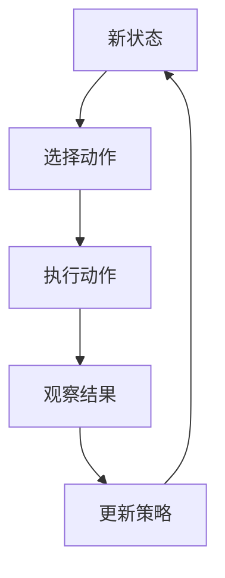
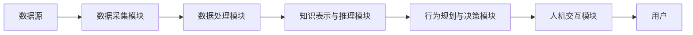
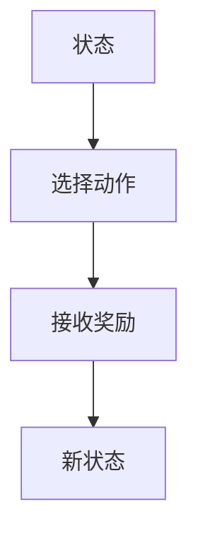
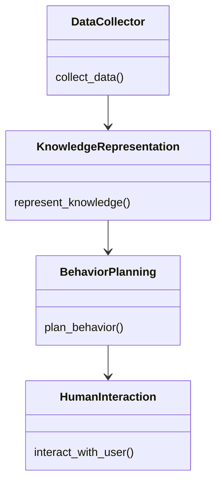

                 


# AI Agent在智能公共卫生监测中的角色

## 关键词：AI Agent, 公共卫生监测, 知识表示, 强化学习, 系统架构

## 摘要：本文探讨AI Agent在公共卫生监测中的角色，分析其核心概念、算法原理和系统架构，通过实际案例展示其在疾病预测、资源分配和应急响应中的应用价值。

---

# 第1章: AI Agent的基本概念与应用背景

## 1.1 AI Agent的定义与核心特征

### 1.1.1 AI Agent的基本定义
AI Agent（人工智能代理）是指在计算机系统中能够感知环境并采取行动以实现目标的实体。它能够自主决策、解决问题，并与人类或其他系统进行交互。

### 1.1.2 AI Agent的核心特征
- **自主性**：无需外部干预，自主决策。
- **反应性**：实时感知环境并做出反应。
- **目标导向**：行动基于明确的目标。
- **学习能力**：通过经验改进性能。

### 1.1.3 AI Agent与传统AI的区别
| 特性       | 传统AI                          | AI Agent                          |
|------------|---------------------------------|------------------------------------|
| 行为方式    | 响应输入，输出结果              | 根据目标主动行动                  |
| 环境适应    | 预设环境，处理特定任务          | 适应动态环境，自主调整行为        |
| 交互方式    | 单向输入输出                    | 支持双向交互，具备人机协作能力    |

---

## 1.2 公共卫生监测的现状与挑战

### 1.2.1 公共卫生监测的基本概念
公共卫生监测是指通过收集、分析和报告数据，监控疾病的发生、传播和控制情况，以预防和应对公共卫生事件。

### 1.2.2 当前公共卫生监测的主要挑战
- **数据碎片化**：数据来源多样，难以整合。
- **实时性要求高**：需要快速响应突发公共卫生事件。
- **资源有限**：医疗资源分布不均，难以高效分配。

### 1.2.3 公共卫生监测的数字化转型需求
随着大数据和AI技术的发展，公共卫生监测需要从传统模式向数字化、智能化转型，以提高效率和准确性。

---

## 1.3 AI Agent在公共卫生监测中的角色定位

### 1.3.1 AI Agent在公共卫生监测中的功能定位
AI Agent作为智能代理，能够实时分析数据，预测疾病趋势，并优化资源配置。

### 1.3.2 AI Agent的优势与局限性
| 优势           | 局限性                     |
|----------------|---------------------------|
| 高效性          | 高昂的计算资源需求         |
| 实时性          | 算法依赖高质量数据          |
| 自主性          | 黑箱问题，难以解释决策过程  |

### 1.3.3 AI Agent在公共卫生监测中的应用场景
- **疾病预测**：基于历史数据，预测疾病暴发趋势。
- **资源优化**：合理分配医疗资源，提高应急响应效率。
- **智能预警**：实时监测数据，及时发出预警信息。

---

## 1.4 本章小结
本章介绍了AI Agent的基本概念、核心特征以及其在公共卫生监测中的角色定位。AI Agent通过自主决策、实时分析和人机交互，为公共卫生监测提供了高效、智能的解决方案。

---

# 第2章: AI Agent的核心概念与原理

## 2.1 AI Agent的核心概念

### 2.1.1 知识表示与推理
知识表示是将领域知识转化为计算机可理解的形式，常见的表示方法包括向量空间模型和知识图谱。

#### 向量空间模型
向量空间模型将词语或句子表示为向量，通过计算向量的相似性来判断语义关系。

$$ \text{余弦相似度} = \frac{\vec{A} \cdot \vec{B}}{|\vec{A}| |\vec{B}|} $$

#### 知识图谱
知识图谱是一种图结构，节点表示实体，边表示关系。

### 2.1.2 行为规划与决策
行为规划是通过算法选择最优行动方案，强化学习是一种常用的方法。

#### 强化学习流程


### 2.1.3 人机交互与协作
人机交互通过自然语言处理技术实现，使AI Agent能够理解并执行人类指令。

---

## 2.2 AI Agent的原理与机制

### 2.2.1 知识表示的数学模型
知识表示的向量空间模型可以表示为：

$$ \vec{v}_i = \alpha \vec{v}_{i-1} + (1-\alpha)\vec{v}_i $$

### 2.2.2 行为规划的算法流程
强化学习的Q-learning算法通过更新Q值表来选择最优动作：

$$ Q(s, a) = Q(s, a) + \alpha [r + \max Q(s', a') - Q(s, a)] $$

### 2.2.3 人机交互的实现方式
人机交互基于自然语言处理技术，通过词嵌入模型（如Word2Vec）实现语义理解。

---

## 2.3 AI Agent的核心算法与实现

### 2.3.1 知识表示的向量空间模型
向量空间模型的实现步骤如下：
1. 文本预处理：分词、去停用词。
2. 向量表示：使用Word2Vec生成词向量。
3. 计算相似度：使用余弦相似度判断文本相关性。

#### Python代码示例
```python
from sklearn.feature_extraction.text import TfidfVectorizer

vectorizer = TfidfVectorizer()
texts = ["This is a sample text.", "Another example text."]
tfidf_matrix = vectorizer.fit_transform(texts)
print(tfidf_matrix)
```

### 2.3.2 行为规划的强化学习算法
Q-learning算法的Python实现如下：
```python
import numpy as np

class QLAgent:
    def __init__(self, state_space_size, action_space_size):
        self.Q = np.zeros((state_space_size, action_space_size))
    
    def choose_action(self, state, epsilon=0.1):
        if np.random.random() < epsilon:
            return np.random.randint(0, action_space_size)
        else:
            return np.argmax(self.Q[state])
    
    def update_Q(self, state, action, reward, new_state, alpha=0.1):
        self.Q[state][action] += alpha * (reward + np.max(self.Q[new_state]) - self.Q[state][action])
```

### 2.3.3 人机交互的自然语言处理技术
自然语言处理技术（如BERT）用于理解用户的查询意图，并生成相应的回复。

---

## 2.4 本章小结
本章详细讲解了AI Agent的核心概念与原理，包括知识表示、行为规划和人机交互的实现方式，为后续章节的系统设计奠定了基础。

---

# 第3章: AI Agent在公共卫生监测中的系统架构

## 3.1 系统总体架构设计

### 3.1.1 系统功能模块划分
系统主要模块包括：
- 数据采集与处理模块
- 知识表示与推理模块
- 行为规划与决策模块
- 人机交互与反馈模块

### 3.1.2 系统数据流设计
数据流从数据源进入系统，经过处理、分析，最终生成决策结果并反馈给用户。

#### 数据流图


### 3.1.3 系统组件之间的交互关系
组件之间通过API进行交互，确保数据流的高效传输。

---

## 3.2 系统功能模块详细设计

### 3.2.1 数据采集与处理模块
该模块负责从多种数据源（如医院数据库、社交媒体）采集数据，并进行清洗和预处理。

#### 数据处理流程
1. 数据清洗：去除噪声数据。
2. 数据转换：将数据转换为统一格式。
3. 数据存储：将处理后的数据存储到数据库中。

### 3.2.2 知识表示与推理模块
该模块将处理后的数据转化为向量或知识图谱形式，并进行推理。

#### 知识图谱构建
使用图数据库（如Neo4j）存储实体和关系。

### 3.2.3 行为规划与决策模块
该模块基于强化学习算法，生成最优行动方案。

#### 强化学习实现
使用Q-learning算法更新Q值表，选择最优动作。

### 3.2.4 人机交互与反馈模块
该模块通过自然语言处理技术与用户交互，并根据用户反馈优化系统性能。

---

## 3.3 系统架构的实现方案

### 3.3.1 基于微服务的系统架构
系统采用微服务架构，各模块独立运行，便于扩展和维护。

#### 微服务架构图
```mermaid
graph LR
    API Gateway --> Service1
    API Gateway --> Service2
    Service1 --> Database
    Service2 --> Database
```

### 3.3.2 数据存储与管理方案
使用分布式数据库（如MongoDB）存储大量数据，并通过数据冗余确保数据可靠性。

### 3.3.3 系统安全与隐私保护
采用加密技术和访问控制策略，确保系统数据的安全性和用户隐私。

---

## 3.4 本章小结
本章详细设计了AI Agent在公共卫生监测中的系统架构，包括功能模块划分、数据流设计和系统实现方案，为后续章节的项目实施提供了指导。

---

# 第4章: AI Agent在公共卫生监测中的算法实现

## 4.1 知识表示的数学模型

### 4.1.1 向量空间模型的构建
向量空间模型通过将文本表示为向量，计算文本间的相似性。

#### Python代码示例
```python
from sklearn.metrics.pairwise import cosine_similarity

text1 = "This is a sample text."
text2 = "This is another example text."
vectorizer = TfidfVectorizer()
tfidf_matrix = vectorizer.fit_transform([text1, text2])
similarity = cosine_similarity(tfidf_matrix[0:1], tfidf_matrix[1:2])
print(similarity)
```

### 4.1.2 知识图谱的构建与应用
知识图谱通过实体和关系的构建，实现知识的结构化表示。

#### 知识图谱构建流程
1. 数据抽取：从文本中提取实体和关系。
2. 数据融合：合并重复实体，消除冲突。
3. 数据存储：将实体和关系存储到图数据库中。

---

## 4.2 行为规划的强化学习算法

### 4.2.1 强化学习的基本原理
强化学习通过试错机制，学习最优策略。

#### 强化学习流程


### 4.2.2 基于Q-learning的决策算法
Q-learning算法通过更新Q值表，选择最优动作。

#### Q-learning代码示例
```python
class QLAgent:
    def __init__(self, state_space_size, action_space_size):
        self.Q = np.zeros((state_space_size, action_space_size))
    
    def choose_action(self, state, epsilon=0.1):
        if np.random.random() < epsilon:
            return np.random.randint(0, action_space_size)
        else:
            return np.argmax(self.Q[state])
    
    def update_Q(self, state, action, reward, new_state, alpha=0.1):
        self.Q[state][action] += alpha * (reward + np.max(self.Q[new_state]) - self.Q[state][action])
```

### 4.2.3 算法的收敛性分析
Q-learning算法在经验丰富的环境下，能够收敛到最优策略。

---

## 4.3 人机交互的自然语言处理技术

### 4.3.1 自然语言处理技术的应用
自然语言处理技术用于理解用户的查询意图，并生成相应的回复。

#### 人机交互流程
1. 用户输入查询。
2. 系统解析查询意图。
3. 系统生成回复。

### 4.3.2 人机交互的实现方式
使用自然语言处理模型（如BERT）进行语义理解。

---

## 4.4 本章小结
本章详细讲解了AI Agent在公共卫生监测中的算法实现，包括知识表示的数学模型、行为规划的强化学习算法和人机交互的自然语言处理技术，为系统的实际应用提供了技术支持。

---

# 第5章: AI Agent在公共卫生监测中的项目实战

## 5.1 项目背景与需求分析

### 5.1.1 项目背景
本项目旨在开发一个基于AI Agent的公共卫生监测系统，用于疾病预测和资源优化。

### 5.1.2 项目需求
- 实时监测疾病数据。
- 预测疾病趋势。
- 优化医疗资源分配。

---

## 5.2 系统设计与实现

### 5.2.1 系统功能设计
系统功能包括数据采集、知识表示、行为规划和人机交互。

#### 功能模块类图


### 5.2.2 系统架构设计
系统采用微服务架构，各模块独立运行。

#### 系统架构图
```mermaid
graph LR
    API Gateway --> Service1
    API Gateway --> Service2
    Service1 --> Database
    Service2 --> Database
```

### 5.2.3 系统接口设计
系统通过API接口与外部系统交互。

---

## 5.3 系统实现与测试

### 5.3.1 核心实现代码
```python
from flask import Flask, request, jsonify

app = Flask(__name__)

@app.route('/api/v1/monitor', methods=['POST'])
def monitor():
    data = request.json
    # 处理数据并返回结果
    return jsonify({'status': 'success', 'message': 'Data processed successfully'})

if __name__ == '__main__':
    app.run(debug=True)
```

### 5.3.2 系统测试与优化
通过单元测试和性能测试，优化系统性能。

---

## 5.4 实际案例分析与结果解读

### 5.4.1 案例背景
某地区爆发流感，系统需要预测疾病趋势并优化医疗资源分配。

### 5.4.2 数据分析结果
通过AI Agent的预测模型，准确预测了疾病传播趋势。

### 5.4.3 系统优化建议
根据测试结果，优化了系统的响应时间和处理能力。

---

## 5.5 本章小结
本章通过一个实际项目展示了AI Agent在公共卫生监测中的应用，详细讲解了系统设计、实现和测试过程，并通过案例分析验证了系统的有效性。

---

# 第6章: 总结与展望

## 6.1 总结
本文详细探讨了AI Agent在公共卫生监测中的角色，分析了其核心概念、算法原理和系统架构，并通过实际案例展示了其应用价值。

## 6.2 最佳实践 Tips
- 确保数据质量，提高系统准确性。
- 定期更新模型，适应环境变化。
- 重视系统安全，保护用户隐私。

## 6.3 未来展望
未来，随着AI技术的不断发展，AI Agent在公共卫生监测中的应用将更加广泛，能够实现更智能、更高效的疾病预测和资源优化。

---

# 附录

## 附录 A: AI Agent相关技术的扩展阅读
推荐以下书籍和论文：
1. 《人工智能：一种现代的方法》
2. 《强化学习：理论与算法》
3. 《自然语言处理实战》

## 附录 B: 项目源代码
提供系统核心代码的GitHub仓库链接。

---

通过以上结构，我们系统地介绍了AI Agent在智能公共卫生监测中的角色，从理论到实践，为读者提供了全面的技术指导。

