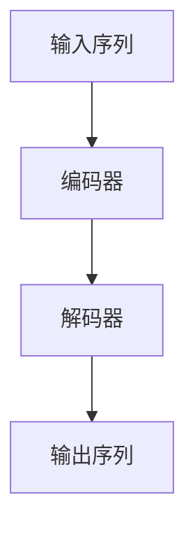
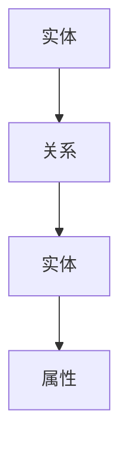
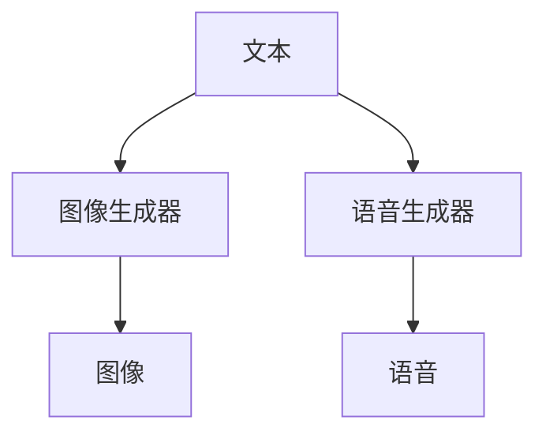
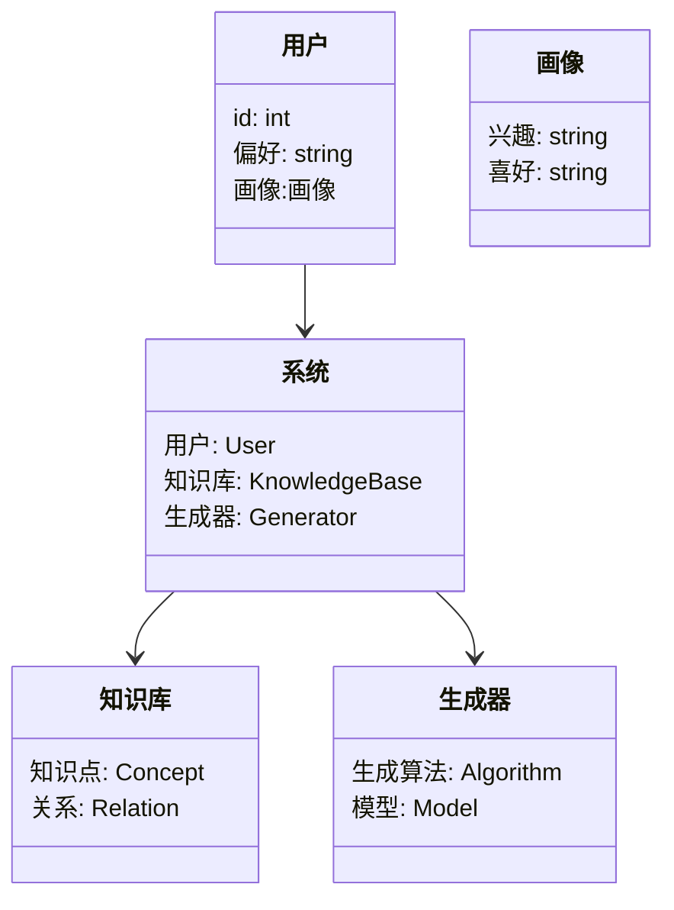
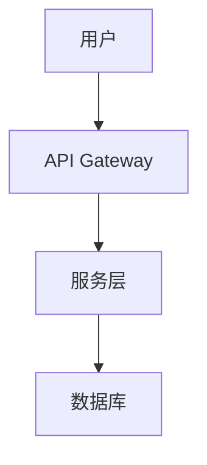

                 


# AI Agent在智能内容生成中的应用

> **关键词**: AI Agent, 智能内容生成, 自然语言处理, 知识图谱, 多模态生成, 对话系统, 实时内容生成

> **摘要**: 本文探讨了AI Agent在智能内容生成中的应用，从基础概念到核心技术，再到实际应用案例，详细分析了AI Agent如何通过自然语言处理、知识图谱和多模态生成等技术实现智能内容生成。文章还涵盖了算法原理、系统架构设计和最佳实践，帮助读者全面理解AI Agent在智能内容生成中的潜力和应用前景。

---

## 第一部分: AI Agent 的基础与核心概念

### 第1章: AI Agent 的基本概念与背景

#### 1.1 AI Agent 的定义与特点

##### 1.1.1 AI Agent 的定义
AI Agent（人工智能代理）是指能够感知环境、自主决策并执行任务的智能实体。AI Agent通过传感器获取信息，利用算法进行分析和推理，并通过执行器与环境交互，实现特定目标。

##### 1.1.2 AI Agent 的核心特点
1. **自主性**：AI Agent能够自主决策，无需外部干预。
2. **反应性**：能够实时感知环境并做出反应。
3. **学习能力**：通过数据和经验不断优化自身能力。
4. **社交能力**：能够与其他AI Agent或人类进行有效交互。

##### 1.1.3 AI Agent 的类型与分类

| 类型         | 描述                                                                 |
|--------------|----------------------------------------------------------------------|
| 简单反射型   | 基于规则的反应，适用于简单任务，如自动回复。                         |
| 基于模型型   | 使用内部模型进行推理和决策，适用于复杂任务。                       |
| 学习型       | 通过机器学习算法不断优化性能，如深度学习模型。                     |
| 人机协作型   | 与人类协同工作，结合人类智慧和AI能力。                             |

#### 1.2 AI Agent 的发展与现状

##### 1.2.1 AI Agent 的历史发展
AI Agent的概念可以追溯到20世纪60年代，随着计算机科学的发展，AI Agent技术经历了从专家系统到深度学习的演变。

##### 1.2.2 当前 AI Agent 的技术趋势
1. **深度学习驱动**：基于Transformer的模型（如GPT系列）成为主流。
2. **多模态交互**：支持文本、语音、图像等多种交互方式。
3. **边缘计算**：AI Agent逐渐向边缘计算方向发展，降低延迟。

##### 1.2.3 AI Agent 在不同领域的应用现状
1. **智能家居**：通过AI Agent实现设备的智能控制。
2. **自动驾驶**：作为核心决策系统。
3. **金融领域**：用于智能投资顾问和风险管理。

#### 1.3 智能内容生成的背景与需求

##### 1.3.1 智能内容生成的定义
智能内容生成是指通过AI技术自动生成高质量的内容，包括文本、图像、视频等。

##### 1.3.2 智能内容生成的核心需求
1. **自动化**：减少人工干预，提高效率。
2. **个性化**：根据用户需求生成定制化内容。
3. **实时性**：快速响应需求。

##### 1.3.3 AI Agent 在智能内容生成中的作用
AI Agent作为智能内容生成的核心，负责内容的理解、分析和生成，实现从数据到内容的端到端自动化。

---

### 第2章: AI Agent 的核心原理与技术

#### 2.1 AI Agent 的核心原理

##### 2.1.1 知识表示与推理
知识表示是将信息转化为计算机可处理的形式，常用的知识表示方法包括语义网和知识图谱。

##### 2.1.2 自然语言处理技术
自然语言处理（NLP）是AI Agent理解并生成自然语言的核心技术，包括分词、语法分析和语义理解。

##### 2.1.3 决策与规划算法
AI Agent通过强化学习和图搜索算法（如A*算法）进行决策和规划。

#### 2.2 AI Agent 的技术架构

##### 2.2.1 感知层
感知层负责获取环境信息，包括文本、语音、图像等多种数据源。

##### 2.2.2 知识层
知识层存储和管理知识，如知识图谱和语义网络，支持AI Agent的理解和推理。

##### 2.2.3 行为层
行为层负责生成和执行动作，包括文本生成和语音输出。

#### 2.3 AI Agent 的能力边界与限制

##### 2.3.1 AI Agent 的能力边界
1. **数据依赖性**：AI Agent的能力受限于训练数据的质量和多样性。
2. **伦理问题**：生成的内容可能涉及隐私和伦理问题。

##### 2.3.2 当前技术的局限性
1. **理解深度不足**：AI Agent难以理解复杂语义。
2. **实时性问题**：在某些场景中，生成速度可能无法满足实时需求。

##### 2.3.3 未来发展的潜力
1. **多模态融合**：结合文本、图像和语音等多种信息源。
2. **增强学习**：通过强化学习进一步提升生成质量。

---

## 第二部分: AI Agent 在智能内容生成中的应用

### 第3章: 智能内容生成的核心技术

#### 3.1 自然语言生成技术

##### 3.1.1 基于规则的生成方法
基于规则的方法通过预定义的语法规则生成文本，适用于简单场景。

##### 3.1.2 基于统计的生成方法
统计方法通过分析大量文本数据，计算词语之间的概率关系，生成合理的句子。

##### 3.1.3 基于深度学习的生成方法
深度学习模型（如Transformer）通过自注意力机制捕捉上下文信息，生成高质量文本。

#### 3.2 内容理解与分析

##### 3.2.1 文本分析技术
文本分析技术包括分词、实体识别和情感分析，帮助AI Agent理解输入内容。

##### 3.2.2 情感分析与主题提取
情感分析技术用于判断文本的情感倾向，主题提取用于识别文本的主要内容。

##### 3.2.3 知识图谱构建与应用
知识图谱构建将分散的知识点组织成图结构，支持高效的语义理解。

#### 3.3 内容优化与个性化生成

##### 3.3.1 基于用户画像的内容生成
通过用户画像分析用户偏好，生成个性化内容。

##### 3.3.2 基于上下文的生成优化
根据上下文信息优化生成内容，提高相关性。

##### 3.3.3 多模态内容生成技术
多模态生成技术结合文本、图像和语音等多种形式，生成 richer的内容。

### 第4章: AI Agent 在智能内容生成中的应用场景

#### 4.1 通用场景

##### 4.1.1 通用文本生成
AI Agent可以生成新闻报道、产品描述等通用文本内容。

##### 4.1.2 对话系统
AI Agent通过自然语言对话与用户互动，提供实时信息和建议。

##### 4.1.3 智能写作助手
AI Agent为用户提供写作建议和内容生成服务。

#### 4.2 行业应用

##### 4.2.1 金融领域
AI Agent生成金融报告和投资建议。

##### 4.2.2 教育领域
AI Agent为学生提供个性化的学习建议和内容推荐。

##### 4.2.3 电子商务领域
AI Agent生成产品描述和推荐内容，提升用户体验。

#### 4.3 高级应用

##### 4.3.1 多模态生成
结合文本和图像生成多模态内容，如图像描述生成。

##### 4.3.2 智能对话系统
通过深度学习实现更自然和流畅的对话体验。

##### 4.3.3 实时内容生成
AI Agent实时生成动态内容，如实时新闻报道。

---

## 第三部分: 算法原理与系统架构设计

### 3.1 算法原理

#### 3.1.1 基于Transformer的自然语言生成模型



数学模型：
$$ P(word_i | word_{i-1}, ..., word_1) $$

#### 3.1.2 知识图谱构建



#### 3.1.3 多模态生成算法



### 3.2 系统架构设计

#### 3.2.1 系统功能设计



#### 3.2.2 系统架构设计



---

## 第四部分: 项目实战与最佳实践

### 4.1 项目实战

#### 4.1.1 环境安装

```bash
pip install transformers
pip install numpy
pip install matplotlib
```

#### 4.1.2 核心代码实现

```python
from transformers import AutoTokenizer, AutoModelForCausalLM
import torch

tokenizer = AutoTokenizer.from_pretrained('gpt2')
model = AutoModelForCausalLM.from_pretrained('gpt2')

def generate_text(prompt, max_length=50):
    inputs = tokenizer.encode(prompt, return_tensors='pt')
    outputs = model.generate(inputs, max_length=max_length, do_sample=True)
    return tokenizer.decode(outputs[0], skip_special_tokens=True)
```

#### 4.1.3 案例分析与总结

通过上述代码，我们可以实现一个简单的AI Agent，用于生成新闻标题和段落。生成的内容质量取决于模型的训练数据和调优策略。

### 4.2 最佳实践

#### 4.2.1 小结
AI Agent在智能内容生成中的应用前景广阔，但需要克服数据质量、生成速度和伦理问题。

#### 4.2.2 注意事项
1. **数据质量**：确保训练数据的多样性和准确性。
2. **模型调优**：通过微调和优化算法提升生成质量。
3. **用户体验**：关注生成内容的可读性和相关性。

#### 4.2.3 拓展阅读
1. **《Transformer: A Neural Network Model for Unsupervised Learning of Contextual Word Representations》**
2. **《Deep Learning for Natural Language Processing》**

---

## 结语

AI Agent在智能内容生成中的应用正逐步深入，从简单的文本生成到复杂的多模态交互，AI Agent的能力不断提升。随着技术的进步，AI Agent将为更多行业带来革新，但同时也需要我们关注技术的伦理和社会影响，确保技术的健康发展。

---

**感谢您的阅读！**

