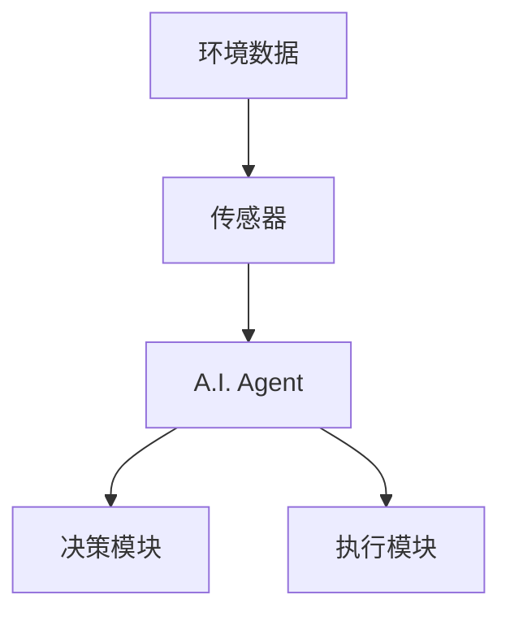
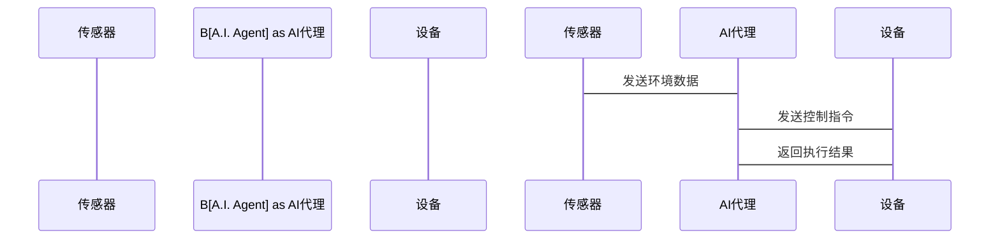
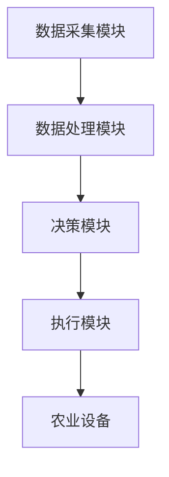

                 


# AI Agent在智能农业中的应用

> 关键词：AI Agent, 智能农业, 人工智能, 算法原理, 系统架构, 项目实战

> 摘要：本文将深入探讨AI Agent在智能农业中的应用，从背景介绍、核心概念到算法原理、系统架构设计，再到项目实战，全面解析AI Agent如何助力现代农业实现智能化、高效化和可持续化发展。通过具体案例分析和代码实现，帮助读者理解AI Agent在智能农业中的实际应用价值和未来发展方向。

---

# 第1章: AI Agent与智能农业的背景介绍

## 1.1 AI Agent的基本概念

### 1.1.1 什么是AI Agent
AI Agent（人工智能代理）是一种能够感知环境、自主决策并执行任务的智能实体。它通过传感器获取数据，利用算法进行分析和推理，最终做出决策并执行操作。

- **AI Agent的核心特征**：
  - 感知能力：通过传感器或数据接口获取环境信息。
  - 决策能力：基于获取的信息进行分析和推理，生成决策方案。
  - 执行能力：根据决策结果执行具体操作，如控制设备或输出指令。

### 1.1.2 AI Agent的核心特征
1. **自主性**：AI Agent能够在没有外部干预的情况下自主运行。
2. **反应性**：能够实时感知环境变化并做出响应。
3. **学习能力**：通过机器学习算法不断优化自身的决策能力。
4. **协作性**：能够与其他AI Agent或系统协同工作。

### 1.1.3 AI Agent的分类与应用场景
- **按功能分类**：
  - 监测型Agent：用于环境监测，如土壤湿度、温度、光照等。
  - 控制型Agent：用于设备控制，如自动灌溉、施肥等。
  - 决策型Agent：用于数据分析和决策支持。
- **应用场景**：
  - 农作物生长监测
  - 环境数据采集与分析
  - 农业资源优化配置

## 1.2 智能农业的定义与发展

### 1.2.1 智能农业的定义
智能农业是指利用人工智能、物联网、大数据等技术，对农业生产过程进行智能化管理，以提高生产效率、降低成本、减少资源浪费。

### 1.2.2 智能农业的发展历程
1. **传统农业**：依赖人工劳动，资源利用率低。
2. **现代农业**：引入机械和化肥，提高产量。
3. **智能农业**：利用科技手段实现精准化、智能化管理。

### 1.2.3 智能农业的现状与挑战
- **现状**：
  - 物联网设备广泛应用于农业监测。
  - 机器学习算法用于作物预测和病虫害识别。
  - 自动化设备（如无人机、机器人）用于农田管理。
- **挑战**：
  - 数据采集的准确性和实时性问题。
  - 系统的稳定性和可靠性问题。
  - 技术成本较高，难以在小规模农户中普及。

## 1.3 AI Agent在智能农业中的结合

### 1.3.1 AI Agent与农业的结合点
- **环境监测**：AI Agent可以实时监测土壤湿度、温度、光照等环境参数。
- **作物管理**：AI Agent可以根据作物生长周期和环境数据，制定精准的灌溉和施肥方案。
- **病虫害预测**：AI Agent可以通过图像识别技术，快速识别作物病虫害，并提出防治建议。

### 1.3.2 AI Agent在智能农业中的优势
1. **高效性**：AI Agent可以24/7工作，实时响应环境变化。
2. **精准性**：基于数据和算法，做出最优决策。
3. **可扩展性**：AI Agent可以轻松扩展到更大规模的农业场景。

### 1.3.3 AI Agent在智能农业中的应用前景
- **精准农业**：通过AI Agent实现作物生长的精准管理。
- **资源优化**：通过智能决策减少水、肥、药的浪费。
- **可持续发展**：AI Agent可以帮助农民实现绿色农业，减少对环境的负面影响。

---

# 第2章: AI Agent在智能农业中的核心概念

## 2.1 AI Agent的核心原理

### 2.1.1 AI Agent的感知层

#### 2.1.1.1 传感器数据采集
AI Agent通过多种传感器（如温度传感器、湿度传感器、光照传感器等）采集环境数据。



#### 2.1.1.2 数据预处理
传感器数据通常需要预处理，包括去噪、归一化等步骤。

### 2.1.2 AI Agent的决策层

#### 2.1.2.1 机器学习模型
AI Agent的核心决策模块通常基于机器学习模型，如随机森林、支持向量机（SVM）等。

#### 2.1.2.2 决策逻辑
基于预处理后的数据，机器学习模型生成决策结果。

### 2.1.3 AI Agent的执行层

#### 2.1.3.1 执行指令
根据决策结果，AI Agent生成执行指令，如“打开灌溉系统”、“关闭通风系统”等。

#### 2.1.3.2 设备控制
AI Agent通过物联网设备（如智能阀门、电机等）执行具体操作。

---

## 2.2 AI Agent与智能农业的关系

### 2.2.1 AI Agent在农业中的角色
AI Agent在农业中扮演着“智能大脑”的角色，负责数据处理、决策制定和设备控制。

### 2.2.2 AI Agent与农业系统的交互


### 2.2.3 AI Agent在农业中的功能模块

#### 2.2.3.1 环境监测模块
负责采集和处理环境数据。

#### 2.2.3.2 农作物生长预测模块
基于历史数据和当前环境数据，预测作物生长情况。

#### 2.2.3.3 农业决策支持模块
根据预测结果，生成最优决策方案。

---

## 2.3 AI Agent在智能农业中的系统架构

### 2.3.1 系统输入与输出

#### 2.3.1.1 输入
- 环境数据：土壤湿度、温度、光照强度等。
- 用户输入：如种植作物类型、目标产量等。

#### 2.3.1.2 输出
- 决策指令：如灌溉、施肥等。
- 预测结果：如作物生长周期、病虫害风险等。

### 2.3.2 系统功能模块划分

#### 2.3.2.1 数据采集模块
负责采集环境数据。

#### 2.3.2.2 数据处理模块
对采集到的数据进行预处理和特征提取。

#### 2.3.2.3 决策模块
基于处理后的数据，生成决策方案。

#### 2.3.2.4 执行模块
根据决策结果，控制农业设备。

### 2.3.3 系统架构的层次结构



---

# 第3章: AI Agent在智能农业中的算法原理

## 3.1 AI Agent的核心算法

### 3.1.1 机器学习算法

#### 3.1.1.1 随机森林
随机森林是一种基于决策树的集成学习算法，常用于分类和回归任务。

```python
from sklearn.ensemble import RandomForestClassifier
# 假设X为特征向量，y为标签
model = RandomForestClassifier(n_estimators=100)
model.fit(X, y)
```

#### 3.1.1.2 支持向量机（SVM）
SVM适用于小样本数据的分类任务。

```python
from sklearn import svm
model = svm.SVC(kernel='rb

