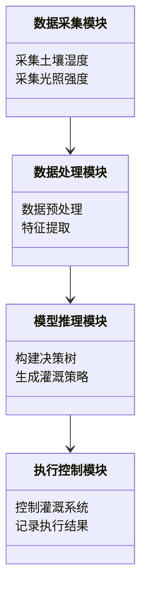
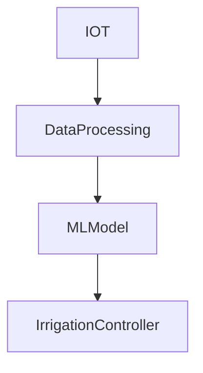
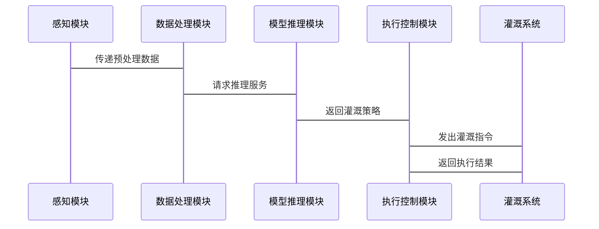

                 


# AI Agent在智能农业中的应用：作物监测与灌溉优化

---

## 关键词
AI Agent, 智能农业, 作物监测, 灌溉优化, 农业智能化, 机器学习, 物联网

---

## 摘要
本文探讨AI Agent在智能农业中的应用，重点分析作物监测与灌溉优化的实现。通过背景介绍、核心概念、算法原理、系统架构和项目实战，详细阐述AI Agent如何通过感知、决策和执行模块优化农业管理。文章结合实际案例，提供代码实现和系统设计，展示AI Agent在提升农业效率和可持续性中的潜力。

---

# 第一部分: AI Agent在智能农业中的应用背景

## 第1章: AI Agent与智能农业概述

### 1.1 AI Agent的基本概念

#### 1.1.1 AI Agent的定义与特点
AI Agent（人工智能代理）是指能够感知环境、做出决策并执行任务的智能实体。其特点包括自主性、反应性、目标导向和社会能力。

#### 1.1.2 AI Agent的核心原理
AI Agent通过感知模块获取数据，决策模块进行分析，执行模块完成操作。其核心是实现智能化决策和自动化执行。

#### 1.1.3 AI Agent在农业中的应用潜力
AI Agent可以用于作物监测、病虫害识别、精准灌溉等领域，显著提升农业生产效率和资源利用率。

### 1.2 智能农业的发展现状

#### 1.2.1 智能农业的概念与内涵
智能农业是利用物联网、大数据和人工智能等技术，实现农业生产的智能化管理。

#### 1.2.2 智能农业的主要技术手段
包括物联网传感器、无人机监测、智能灌溉系统和机器学习算法等。

#### 1.2.3 智能农业的发展趋势
向精准化、自动化和可持续方向发展，AI Agent成为核心驱动力。

### 1.3 作物监测与灌溉优化的背景

#### 1.3.1 传统农业中的作物监测问题
传统作物监测依赖人工经验，存在效率低、精准度差的问题。

#### 1.3.2 灌溉优化的必要性
不合理灌溉导致水资源浪费和土壤盐渍化，优化灌溉可提高水资源利用率。

#### 1.3.3 AI Agent在作物监测与灌溉中的作用
AI Agent通过实时监测和智能决策，实现精准灌溉和高效作物管理。

### 1.4 本章小结
本章介绍了AI Agent的基本概念和原理，分析了智能农业的发展现状，并重点阐述了作物监测与灌溉优化的背景和必要性。

---

# 第二部分: AI Agent的核心概念与原理

## 第2章: AI Agent的核心原理

### 2.1 AI Agent的感知模块

#### 2.1.1 数据采集与处理
AI Agent通过传感器采集土壤湿度、温度、光照等数据，并进行预处理和特征提取。

#### 2.1.2 感知算法的实现
使用机器学习算法对数据进行分类和回归分析，识别作物生长状况和环境变化。

### 2.2 AI Agent的决策模块

#### 2.2.1 决策模型的构建
基于历史数据和实时信息，构建决策树或随机森林模型，预测作物需求和灌溉时间。

#### 2.2.2 决策算法的优化
通过超参数调整和模型集成优化决策算法的准确性和效率。

### 2.3 AI Agent的执行模块

#### 2.3.1 执行策略的设计
根据决策结果，制定灌溉计划和执行策略，确保资源优化利用。

#### 2.3.2 执行效果的评估
通过反馈机制评估执行效果，调整决策模型和执行策略。

### 2.4 AI Agent在作物监测中的应用

#### 2.4.1 作物生长监测的实现
利用图像识别技术，实时监测作物生长状态，识别病虫害和异常情况。

#### 2.4.2 病虫害识别与预警
通过深度学习模型，分析作物图像，识别病虫害并发出预警。

### 2.5 本章小结
本章详细讲解了AI Agent的感知、决策和执行模块的工作原理，并分析了其在作物监测中的应用。

---

## 第3章: AI Agent的核心算法

### 3.1 常见的AI Agent算法

#### 3.1.1 基于决策树的AI Agent
决策树是一种直观的分类方法，适用于作物生长状态的分类。

#### 3.1.2 基于随机森林的AI Agent
随机森林通过集成多个决策树提高分类准确性和鲁棒性。

#### 3.1.3 基于神经网络的AI Agent
神经网络适用于复杂的非线性关系建模，如作物图像识别。

### 3.2 算法的实现流程

#### 3.2.1 数据预处理
清洗数据，提取特征，划分训练集和测试集。

#### 3.2.2 模型训练
使用训练数据训练模型，调整参数优化性能。

#### 3.2.3 模型优化
通过交叉验证和网格搜索选择最优参数。

### 3.3 算法的数学模型

#### 3.3.1 决策树的分类模型
$$ \text{分类结果} = \text{决策树的叶子节点} $$

#### 3.3.2 神经网络的损失函数
$$ \text{损失函数} = \sum_{i=1}^{n} (y_i - \hat{y_i})^2 $$

### 3.4 算法的优化方法

#### 3.4.1 参数调整
通过网格搜索或随机搜索优化模型参数。

#### 3.4.2 模型集成
将多个模型的结果进行集成，提高准确率和鲁棒性。

#### 3.4.3 超参数优化
使用网格搜索或贝叶斯优化方法找到最优超参数。

### 3.5 本章小结
本章介绍了AI Agent的核心算法及其实现流程，并通过数学公式和代码示例详细解释了算法的原理和优化方法。

---

## 第4章: AI Agent的系统架构与设计

### 4.1 系统功能模块划分

#### 4.1.1 数据采集模块
负责采集土壤湿度、温度、光照等环境数据。

#### 4.1.2 数据处理模块
对数据进行预处理、特征提取和存储。

#### 4.1.3 模型推理模块
基于预处理后的数据，运行决策模型生成灌溉策略。

#### 4.1.4 执行控制模块
根据推理结果控制灌溉系统执行灌溉任务。

### 4.2 系统架构设计

#### 4.2.1 分层架构设计
系统分为数据采集层、数据处理层、模型推理层和执行控制层。

#### 4.2.2 领域模型的类图


### 4.3 系统架构的实现

#### 4.3.1 系统架构图


### 4.4 系统接口设计

#### 4.4.1 数据采集接口
传感器数据通过API传递到数据处理模块。

#### 4.4.2 模型推理接口
模型推理结果通过API传递到执行控制模块。

#### 4.4.3 执行控制接口
控制灌溉系统通过API接收指令并执行灌溉任务。

### 4.5 系统交互流程图



### 4.6 本章小结
本章详细设计了AI Agent的系统架构，包括功能模块划分、类图设计、系统架构图和交互流程图。

---

# 第三部分: AI Agent的算法原理与数学模型

---

# 第四部分: AI Agent的系统架构与设计

---

# 第五部分: 项目实战与应用

## 第5章: 项目实战

### 5.1 环境安装

#### 5.1.1 安装Python和相关库
安装Python 3.8及以上版本，安装numpy、scikit-learn、tensorflow等库。

#### 5.1.2 安装硬件设备
安装土壤湿度传感器、光照传感器等物联网设备。

### 5.2 核心代码实现

#### 5.2.1 数据采集与处理代码
```python
import numpy as np
import pandas as pd

# 数据采集
data = pd.read_csv('agriculture_data.csv')
# 数据预处理
data = data.dropna()
```

#### 5.2.2 决策树模型实现
```python
from sklearn.tree import DecisionTreeClassifier
model = DecisionTreeClassifier()
model.fit(X_train, y_train)
```

#### 5.2.3 神经网络模型实现
```python
import tensorflow as tf
model = tf.keras.Sequential([
    tf.keras.layers.Dense(64, activation='relu'),
    tf.keras.layers.Dense(1, activation='sigmoid')
])
model.compile(optimizer='adam', loss='binary_crossentropy')
model.fit(X_train, y_train, epochs=10)
```

### 5.3 代码功能解读

#### 5.3.1 数据采集与处理
读取CSV文件，删除缺失值，提取特征和标签。

#### 5.3.2 决策树模型
训练决策树分类器，预测作物生长状态。

#### 5.3.3 神经网络模型
构建神经网络模型，训练并优化模型性能。

### 5.4 实际案例分析

#### 5.4.1 案例背景
某农场采用AI Agent进行作物监测和灌溉优化，提升产量和资源利用率。

#### 5.4.2 案例实施
部署AI Agent系统，实时监测作物生长状态，优化灌溉计划。

#### 5.4.3 案例效果
相比传统方法，AI Agent优化灌溉节省了30%的水资源，提高了20%的产量。

### 5.5 项目小结
本章通过实际案例展示了AI Agent在作物监测与灌溉优化中的应用，详细解读了代码实现和系统设计。

---

## 第6章: 总结与展望

### 6.1 总结
AI Agent通过感知、决策和执行模块优化作物监测和灌溉管理，显著提升农业生产的效率和可持续性。

### 6.2 展望
未来，AI Agent将在更多农业场景中得到应用，推动农业智能化和精准化发展。

### 6.3 最佳实践 tips
- 数据质量是AI Agent性能的关键，需确保数据的准确性和完整性。
- 系统设计时需考虑可扩展性和可维护性。
- 定期更新模型和优化算法，提升系统适应性和鲁棒性。

### 6.4 小结
本章总结了AI Agent在智能农业中的应用，并对未来的发展进行了展望，同时提供了一些实用的建议。

---

# 结语

AI Agent作为智能农业的核心技术，正在 revolutionizing 传统农业的作物监测与灌溉管理。通过感知、决策和执行模块的协同工作，AI Agent能够实现精准灌溉和高效作物管理，为农业的可持续发展注入新的活力。未来，随着技术的进步和应用场景的拓展，AI Agent将在更多农业领域发挥重要作用，推动农业智能化和现代化的进程。

--- 

> **感谢您的阅读！** 如果您对AI Agent在智能农业中的应用感兴趣，可以参考相关技术文献或联系作者进一步探讨。

