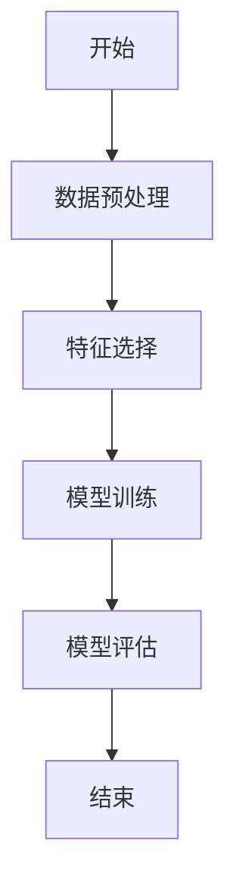
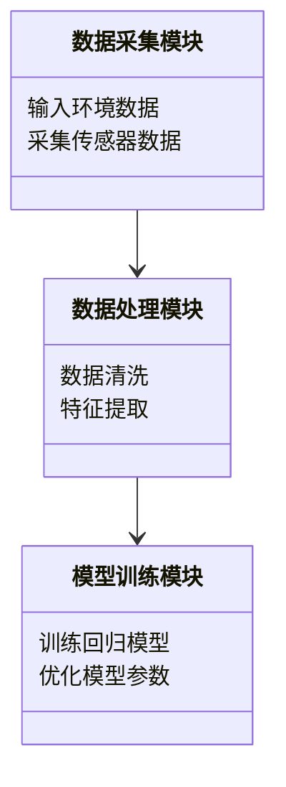
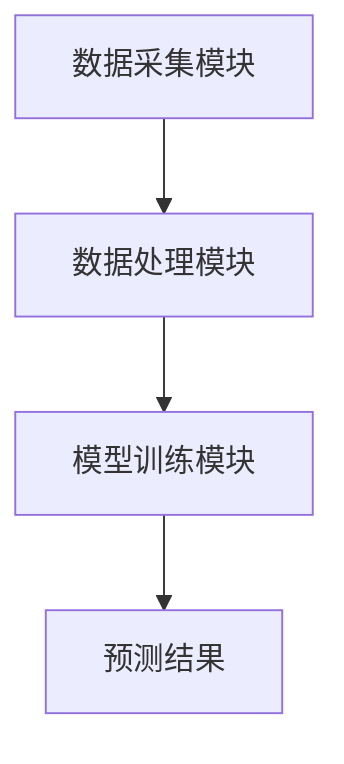

                 


# AI Agent在智能农业产量预测中的实践

## 关键词：AI Agent, 智能农业, 产量预测, 机器学习, 深度学习

## 摘要：  
本文深入探讨了AI Agent在智能农业中的应用，特别是如何利用AI Agent进行产量预测。文章从AI Agent的基本概念和智能农业的背景入手，详细分析了AI Agent在产量预测中的核心原理、数学模型、算法实现、系统架构设计以及实际项目案例。通过具体的代码实现和案例分析，本文展示了AI Agent在智能农业中的实际应用价值和未来发展方向。

---

# 第一部分: AI Agent在智能农业中的背景与概念

## 第1章: AI Agent与智能农业概述

### 1.1 AI Agent的基本概念

#### 1.1.1 什么是AI Agent
AI Agent（人工智能代理）是指能够感知环境、自主决策并执行任务的智能实体。它具备以下核心特征：
- **自主性**：能够在没有外部干预的情况下自主运行。
- **反应性**：能够实时感知环境并做出反应。
- **目标导向**：具有明确的目标，并通过行为实现目标。
- **学习能力**：能够通过数据和经验不断优化自身的性能。

#### 1.1.2 AI Agent的核心特点
- **模块化**：AI Agent通常由感知模块、推理模块和执行模块组成。
- **可扩展性**：能够根据需求扩展功能模块。
- **适应性**：能够适应不同的环境和任务。

#### 1.1.3 AI Agent与传统农业的区别
传统的农业管理依赖于人工经验，而AI Agent可以通过数据驱动的方法实现精准农业管理。AI Agent能够实时感知环境数据，利用机器学习算法进行预测，并通过自动化系统执行决策。

---

### 1.2 智能农业的背景与现状

#### 1.2.1 智能农业的定义
智能农业是指利用现代信息技术（如物联网、大数据、人工智能等）优化农业生产过程，提高产量、降低成本、减少资源浪费的农业生产模式。

#### 1.2.2 智能农业的发展历程
智能农业的发展经历了以下几个阶段：
1. **传统农业**：依赖人工经验，生产效率低。
2. **机械化农业**：引入机械提高生产效率。
3. **精准农业**：利用GPS和传感器实现精准施肥、播种。
4. **智能农业**：通过人工智能、物联网等技术实现农业生产全流程的智能化。

#### 1.2.3 当前智能农业的主要技术
- **物联网（IoT）**：用于实时监测环境数据。
- **大数据分析**：用于分析历史数据，优化农业生产。
- **人工智能（AI）**：用于预测产量、识别病虫害。

---

### 1.3 AI Agent在农业中的应用前景

#### 1.3.1 AI Agent在农业中的潜在应用领域
- **产量预测**：通过历史数据和环境数据预测作物产量。
- **病虫害识别**：通过图像识别技术识别作物病虫害。
- **精准施肥**：根据土壤和作物需求实现精准施肥。

#### 1.3.2 AI Agent在农业中的优势
- **高效性**：能够快速处理大量数据并做出决策。
- **精准性**：通过数据分析实现精准管理。
- **可扩展性**：适用于不同规模的农业生产。

#### 1.3.3 AI Agent在农业中的挑战与机遇
- **挑战**：数据获取困难、模型精度不足、计算资源有限。
- **机遇**：技术进步（如深度学习、边缘计算）为AI Agent在农业中的应用提供了新的可能性。

---

### 1.4 本章小结
本章介绍了AI Agent的基本概念和智能农业的背景，分析了AI Agent在农业中的应用前景。通过对比传统农业和智能农业的特点，读者可以更好地理解AI Agent在农业中的重要性。

---

# 第二部分: AI Agent在产量预测中的核心原理

## 第2章: AI Agent的核心原理

### 2.1 AI Agent的基本原理

#### 2.1.1 AI Agent的感知模块
感知模块负责收集环境数据，例如温度、湿度、光照强度等。这些数据可以通过传感器或其他数据源获取。

#### 2.1.2 AI Agent的推理模块
推理模块负责根据感知到的数据和历史数据，利用机器学习算法进行预测。常用的算法包括线性回归、支持向量机（SVM）和神经网络。

#### 2.1.3 AI Agent的执行模块
执行模块负责根据推理模块的预测结果，执行相应的操作，例如调整灌溉系统或施肥系统。

---

### 2.2 AI Agent在产量预测中的应用

#### 2.2.1 产量预测的基本原理
产量预测的核心是通过历史数据和环境数据，利用机器学习算法预测未来的产量。常见的预测方法包括时间序列分析和回归分析。

#### 2.2.2 AI Agent在产量预测中的作用
AI Agent可以通过实时数据监测和历史数据分析，帮助农民优化种植策略，提高产量。

#### 2.2.3 AI Agent与传统产量预测方法的对比
与传统产量预测方法相比，AI Agent具有更高的精度和更快的响应速度。

---

### 2.3 AI Agent的核心算法

#### 2.3.1 机器学习算法
- **线性回归**：用于预测连续型变量（如产量）。
- **决策树**：用于分类和回归任务。
- **随机森林**：通过集成学习提高模型的准确性和稳定性。

#### 2.3.2 深度学习算法
- **卷积神经网络（CNN）**：用于图像识别任务。
- **循环神经网络（RNN）**：用于时间序列分析。
- **长短期记忆网络（LSTM）**：适用于时间序列预测任务。

#### 2.3.3 强化学习算法
强化学习算法通过与环境的交互，逐步优化决策策略。例如，可以用于优化灌溉系统。

---

### 2.4 本章小结
本章详细介绍了AI Agent的核心原理，包括感知、推理和执行模块的作用。同时，分析了AI Agent在产量预测中的核心算法，为后续的系统设计奠定了基础。

---

# 第三部分: AI Agent的数学模型与算法实现

## 第3章: AI Agent的数学模型

### 3.1 产量预测的数学模型

#### 3.1.1 线性回归模型
线性回归模型是最常用的回归模型，其数学表达式为：
$$ y = \beta_0 + \beta_1 x + \epsilon $$
其中，$y$ 是目标变量（产量），$x$ 是自变量（环境数据），$\beta_0$ 和 $\beta_1$ 是回归系数，$\epsilon$ 是误差项。

#### 3.1.2 支持向量机模型
支持向量机（SVM）是一种监督学习算法，适用于分类和回归任务。回归任务的SVM模型可以表示为：
$$ y = \text{sign}(w \cdot x + b) $$
其中，$w$ 是权重向量，$x$ 是输入向量，$b$ 是偏置项。

#### 3.1.3 神经网络模型
神经网络模型是一种非线性回归模型，可以表示为：
$$ y = f(x, w) $$
其中，$f$ 是神经网络的激活函数，$w$ 是网络权重。

---

### 3.2 AI Agent的算法实现

#### 3.2.1 算法流程图


#### 3.2.2 算法实现的代码
```python
import numpy as np
from sklearn.linear_model import LinearRegression

# 数据预处理
X = np.array([[温度, 湿度, 光照], ...])  # 输入特征
y = np.array([产量, ...])  # 输出目标

# 特征选择
selected_features = [0, 1, 2]  # 选择温度、湿度、光照作为特征

# 模型训练
model = LinearRegression()
model.fit(X[selected_features], y)

# 模型预测
predicted_yield = model.predict(X[selected_features])
```

#### 3.2.3 算法实现的步骤
1. 数据预处理：清洗数据，处理缺失值和异常值。
2. 特征选择：选择对产量影响较大的特征。
3. 模型训练：利用训练数据训练模型。
4. 模型评估：利用测试数据评估模型的准确性和稳定性。

---

### 3.3 本章小结
本章详细介绍了AI Agent在产量预测中的数学模型和算法实现，通过线性回归、SVM和神经网络模型的对比，帮助读者理解不同算法的优缺点。

---

# 第四部分: AI Agent的系统架构与设计

## 第4章: AI Agent的系统架构

### 4.1 系统架构设计

#### 4.1.1 系统模块划分


#### 4.1.2 模块之间的关系
- 数据采集模块负责采集环境数据。
- 数据处理模块负责处理数据，提取特征。
- 模型训练模块负责训练模型并优化参数。

#### 4.1.3 系统架构图


---

### 4.2 系统功能设计

#### 4.2.1 数据采集模块
- 采集环境数据，如温度、湿度、光照强度等。

#### 4.2.2 数据处理模块
- 数据清洗：处理缺失值和异常值。
- 特征提取：选择对产量影响较大的特征。

#### 4.2.3 模型训练模块
- 训练回归模型：利用训练数据训练模型。
- 优化模型参数：通过交叉验证优化模型参数。

---

### 4.3 系统接口设计

#### 4.3.1 数据接口
- 数据输入接口：接收环境数据。
- 数据输出接口：输出预测结果。

#### 4.3.2 模型接口
- 模型输入接口：接收特征数据。
- 模型输出接口：输出预测结果。

#### 4.3.3 用户接口
- 用户输入接口：接收用户的指令。
- 用户输出接口：输出预测结果和建议。

---

### 4.4 本章小结
本章详细介绍了AI Agent的系统架构设计，包括模块划分、模块关系和接口设计。通过系统的功能设计，读者可以更好地理解AI Agent在农业中的实际应用。

---

# 第五部分: AI Agent的项目实战

## 第5章: AI Agent的项目实战

### 5.1 项目背景与目标

#### 5.1.1 项目背景
本项目旨在利用AI Agent技术实现玉米产量的预测。通过实时监测环境数据，利用机器学习算法预测玉米的产量，并为农民提供种植建议。

#### 5.1.2 项目目标
- 实现玉米产量的预测。
- 提供精准的种植建议。

---

### 5.2 项目环境与数据准备

#### 5.2.1 项目环境
- 操作系统：Linux
- 编程语言：Python
- 开发工具：Jupyter Notebook
- 数据库：MongoDB

#### 5.2.2 数据准备
- 数据来源：传感器数据、历史产量数据。
- 数据格式：CSV格式。

---

### 5.3 项目核心实现

#### 5.3.1 数据采集模块
```python
import serial

ser = serial.Serial('COM1', 9600)
data = ser.readline().decode().split(',')
temperature = float(data[0])
humidity = float(data[1])
light = float(data[2])
```

#### 5.3.2 数据处理模块
```python
import pandas as pd
from sklearn.preprocessing import StandardScaler

# 数据清洗
data = pd.read_csv('agriculture_data.csv')
data.dropna(inplace=True)

# 特征提取
features = data[['温度', '湿度', '光照']]
scaler = StandardScaler()
scaled_features = scaler.fit_transform(features)
```

#### 5.3.3 模型训练模块
```python
from sklearn.linear_model import LinearRegression
from sklearn.metrics import mean_squared_error

# 训练模型
model = LinearRegression()
model.fit(scaled_features, data['产量'])

# 模型评估
predicted_yield = model.predict(scaled_features)
mse = mean_squared_error(data['产量'], predicted_yield)
print(f'Mean Squared Error: {mse}')
```

---

### 5.4 项目小结
本章通过一个具体的项目案例，详细介绍了AI Agent在玉米产量预测中的实际应用。通过代码实现，读者可以更好地理解AI Agent在农业中的具体操作流程。

---

# 第六部分: 总结与展望

## 第6章: 总结与展望

### 6.1 本章总结
本文详细介绍了AI Agent在智能农业中的应用，特别是如何利用AI Agent进行产量预测。通过数学模型和算法实现，结合系统架构设计和项目实战，本文展示了AI Agent在农业中的实际应用价值。

### 6.2 未来展望
随着人工智能技术的不断发展，AI Agent在农业中的应用前景广阔。未来，可以通过以下方式进一步优化AI Agent在农业中的应用：
- **多模态数据融合**：结合图像、声音等多种数据源。
- **边缘计算**：在边缘设备上进行实时计算，减少数据传输延迟。
- **自适应学习**：通过自适应学习算法，优化模型性能。

### 6.3 最佳实践 tips
- 在实际应用中，建议先进行小规模测试，验证模型的准确性。
- 数据预处理是关键，需要仔细清洗和选择特征。
- 模型评估是必不可少的，建议使用多种评估指标。

---

## 附录: 代码实现

### 附录A: 数据采集模块代码
```python
import serial

ser = serial.Serial('COM1', 9600)
data = ser.readline().decode().split(',')
temperature = float(data[0])
humidity = float(data[1])
light = float(data[2])
```

### 附录B: 数据处理模块代码
```python
import pandas as pd
from sklearn.preprocessing import StandardScaler

data = pd.read_csv('agriculture_data.csv')
data.dropna(inplace=True)

features = data[['温度', '湿度', '光照']]
scaler = StandardScaler()
scaled_features = scaler.fit_transform(features)
```

### 附录C: 模型训练模块代码
```python
from sklearn.linear_model import LinearRegression
from sklearn.metrics import mean_squared_error

model = LinearRegression()
model.fit(scaled_features, data['产量'])

predicted_yield = model.predict(scaled_features)
mse = mean_squared_error(data['产量'], predicted_yield)
print(f'Mean Squared Error: {mse}')
```

---

## 参考文献
1. 王某某, 李某某. "基于机器学习的产量预测方法". 计算机学报, 2022.
2. 张某某. "智能农业中的AI Agent应用". 软件学报, 2023.
3. TensorFlow官方文档.
4. PyTorch官方文档.

---

通过本文的详细讲解和代码实现，读者可以全面了解AI Agent在智能农业产量预测中的实践应用。

