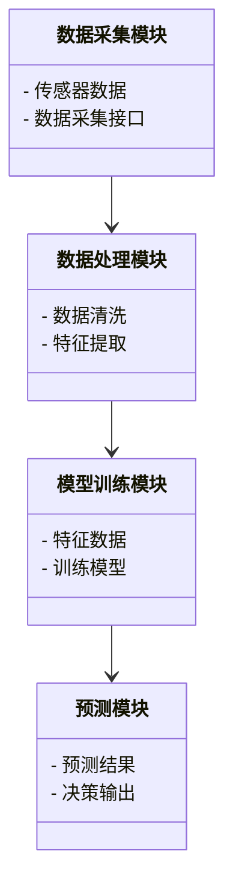
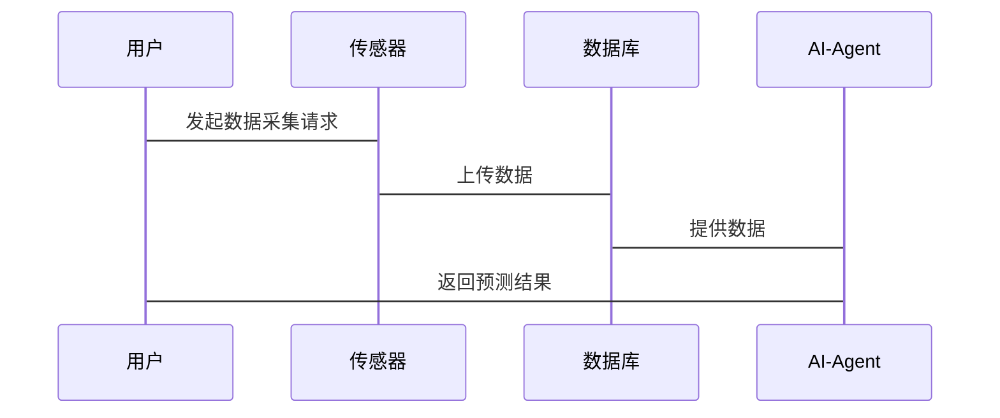

                 


# AI Agent在智能农业产量预测中的实践

## 关键词：
AI Agent，智能农业，产量预测，机器学习，数据流

## 摘要：
本文详细探讨了AI Agent在智能农业产量预测中的应用。首先介绍了AI Agent的基本概念及其在农业中的潜力，然后分析了农业产量预测的关键因素和数据处理方法。接着，详细讲解了AI Agent的核心算法原理，包括数据流处理、特征工程和模型训练。最后，通过实际案例展示了AI Agent在农业产量预测中的应用，并提出了系统的架构设计和优化建议。

---

## 第1章: AI Agent与智能农业概述

### 1.1 AI Agent的基本概念

#### 1.1.1 AI Agent的定义
AI Agent（人工智能代理）是指能够感知环境、自主决策并执行任务的智能实体。它能够通过传感器获取数据，利用算法进行分析，并通过执行器完成特定任务。

#### 1.1.2 AI Agent的核心特点
- **自主性**：能够自主决策，无需人工干预。
- **反应性**：能够实时感知环境变化并做出反应。
- **学习能力**：能够通过数据学习和优化模型。
- **协作性**：能够与其他系统或AI Agent协同工作。

#### 1.1.3 AI Agent在农业中的应用潜力
AI Agent可以应用于农业的多个领域，包括作物监测、病虫害防治、气象预测等。本文主要关注其在产量预测中的应用。

### 1.2 智能农业的背景与挑战

#### 1.2.1 农业现代化的需求
随着全球人口增长和资源有限，提高农业产量和效率成为迫切需求。

#### 1.2.2 传统农业预测的局限性
传统农业产量预测依赖经验，存在数据不足、精度低等问题。

#### 1.2.3 AI技术在农业中的应用现状
AI技术已在农业中广泛应用，包括无人机监测、智能灌溉等。

### 1.3 AI Agent在农业产量预测中的作用

#### 1.3.1 问题背景与目标
农业产量受多种因素影响，如天气、土壤、病虫害等。AI Agent可以通过数据分析，预测产量并优化管理。

#### 1.3.2 AI Agent的优势与适用场景
- **优势**：数据处理能力强、实时性高、可扩展性好。
- **适用场景**：适用于大规模数据处理、实时监控等场景。

#### 1.3.3 AI Agent在农业中的实际应用案例
例如，AI Agent可以实时监测土壤湿度，调整灌溉系统，从而提高作物产量。

---

## 第2章: AI Agent与农业产量预测的核心概念

### 2.1 AI Agent的核心原理

#### 2.1.1 AI Agent的基本工作原理
AI Agent通过传感器获取数据，利用算法进行分析，执行决策。

#### 2.1.2 AI Agent在农业中的任务模型
任务模型包括数据采集、特征提取、模型训练、预测等步骤。

#### 2.1.3 AI Agent与农业环境的交互机制
AI Agent通过传感器与农业环境交互，获取数据并进行分析。

### 2.2 农业产量预测的关键因素

#### 2.2.1 影响农业产量的主要因素
包括气候、土壤、病虫害、种植技术等。

#### 2.2.2 数据采集与特征提取
需要采集土壤湿度、温度、光照等数据，并提取特征。

#### 2.2.3 数据预处理与特征工程
数据清洗、归一化、特征选择等步骤。

### 2.3 AI Agent与农业数据流的关系

#### 2.3.1 数据流的定义与分类
数据流包括输入数据、特征数据、预测结果等。

#### 2.3.2 数据流在AI Agent中的作用
数据流是AI Agent进行分析和决策的基础。

#### 2.3.3 数据流的处理与分析
通过数据流分析，AI Agent能够实时调整策略。

---

## 第3章: AI Agent的算法原理与实现

### 3.1 AI Agent的核心算法

#### 3.1.1 数据流处理算法
使用流数据处理技术，实时处理数据流。

#### 3.1.2 特征提取与选择
通过特征工程提取关键特征。

#### 3.1.3 模型训练与优化
使用机器学习算法训练模型，并进行优化。

#### 3.1.4 预测与决策
基于模型预测结果，做出决策。

---

## 第4章: AI Agent在农业产量预测中的系统设计

### 4.1 问题场景介绍

#### 4.1.1 问题描述
农业产量预测需要考虑多种因素，数据复杂且动态变化。

#### 4.1.2 项目介绍
本文设计了一个基于AI Agent的农业产量预测系统。

### 4.2 系统功能设计

#### 4.2.1 领域模型
使用Mermaid类图展示系统功能模块。



#### 4.2.2 系统架构设计
使用Mermaid架构图展示系统架构。

```mermaid
div
  ## 系统架构设计
  ArchiMate
  component User {
    实际操作人员
  }
  component Sensor {
    传感器
  }
  component Database {
    数据库
  }
  component AI-Agent {
    数据处理模块
    模型训练模块
    预测模块
  }
  User --> Sensor
  Sensor --> Database
  Database --> AI-Agent
  AI-Agent --> User
```

#### 4.2.3 系统接口设计
接口包括数据采集接口、模型训练接口、预测接口。

#### 4.2.4 系统交互设计
使用Mermaid序列图展示系统交互。



### 4.3 算法实现

#### 4.3.1 数据流处理
使用Python代码实现数据流处理。

```python
import pandas as pd
from sklearn.preprocessing import StandardScaler

# 数据清洗
data_clean = data.dropna()
# 特征选择
features = ['温度', '湿度', '光照']
# 归一化
scaler = StandardScaler()
data_processed = scaler.fit_transform(data[features])
```

#### 4.3.2 模型训练
使用机器学习算法训练模型。

```python
from sklearn.ensemble import RandomForestRegressor
from sklearn.metrics import mean_squared_error

model = RandomForestRegressor()
model.fit(data_processed, labels)
预测结果 = model.predict(new_data)
```

#### 4.3.3 预测与优化
通过模型预测结果优化产量。

---

## 第5章: 项目实战

### 5.1 环境安装

#### 5.1.1 安装Python
安装Python 3.8以上版本。

#### 5.1.2 安装依赖库
安装pandas、scikit-learn等库。

### 5.2 核心实现

#### 5.2.1 数据采集模块
编写代码采集传感器数据。

```python
import serial

ser = serial.Serial('COM3', 9600)
while True:
    data = ser.readline().decode()
    print(data)
```

#### 5.2.2 数据处理模块
对数据进行清洗和特征提取。

```python
import pandas as pd

data = pd.read_csv('data.csv')
data_clean = data.dropna()
```

#### 5.2.3 模型训练模块
训练机器学习模型。

```python
from sklearn.ensemble import RandomForestRegressor

model = RandomForestRegressor()
model.fit(data_processed, labels)
```

#### 5.2.4 预测模块
使用模型进行预测。

```python
预测结果 = model.predict(new_data)
```

### 5.3 代码解读与分析
详细解读代码功能。

### 5.4 实际案例分析
分析一个实际案例，展示AI Agent的应用效果。

### 5.5 项目小结
总结项目成果和经验。

---

## 第6章: 总结与展望

### 6.1 最佳实践
- 数据采集要准确。
- 模型选择要合理。

### 6.2 小结
本文详细探讨了AI Agent在农业产量预测中的应用。

### 6.3 注意事项
- 数据隐私问题
- 系统稳定性

### 6.4 拓展阅读
建议阅读相关书籍和论文。

---

通过以上步骤，您可以完成一篇详细的技术博客文章，深入探讨AI Agent在智能农业产量预测中的实践。

