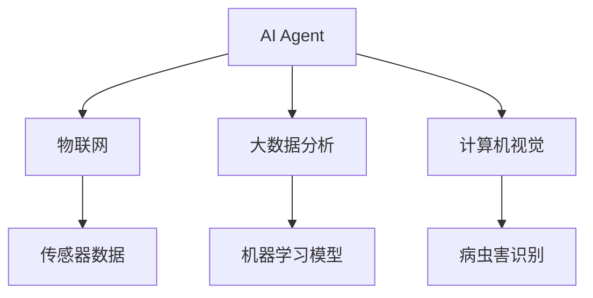
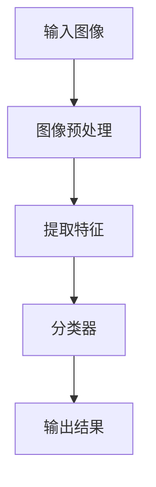
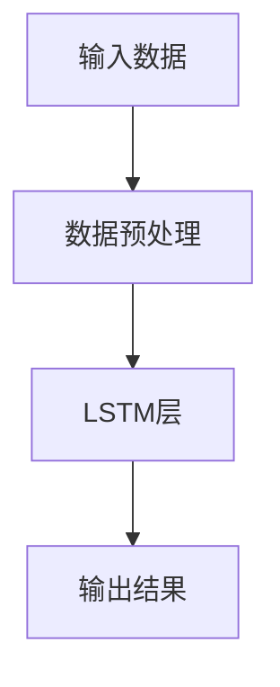
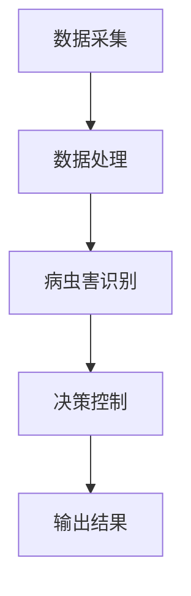
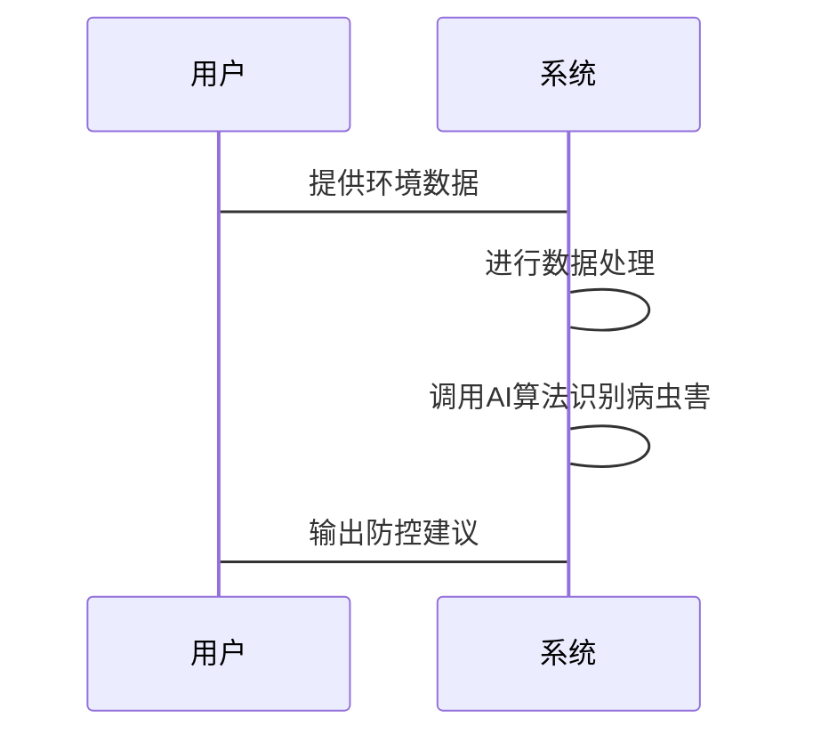

                 


# AI Agent在智能农业病虫害防控中的应用

> 关键词：AI Agent、智能农业、病虫害防控、图像识别、机器学习、数据采集、系统架构

> 摘要：本文探讨了AI Agent在智能农业病虫害防控中的应用，分析了其技术原理、系统架构和实际应用案例，展示了如何利用AI技术提升农业病虫害防控的效率和精准度。

---

# 第一部分: 背景介绍

## 第1章: 问题背景与应用前景

### 1.1 问题背景

#### 1.1.1 病虫害对农业生产的威胁
病虫害是影响农业生产的主要因素之一。据统计，全球每年因病虫害导致的农业损失高达数百亿美元。传统病虫害防控方法依赖人工经验，效率低且容易遗漏问题。

#### 1.1.2 传统病虫害防控的局限性
传统方法通常依赖农药喷洒，这种方式不仅成本高，还可能导致环境污染和抗药性问题。此外，人工检查的效率较低，难以覆盖大面积的农田。

#### 1.1.3 智能化农业的发展趋势
随着科技的进步，智能化农业逐渐成为主流。AI技术的应用可以显著提高病虫害防控的效率和精准度，减少资源浪费。

### 1.2 问题描述

#### 1.2.1 病虫害防控的复杂性
病虫害的发生受多种因素影响，如天气、土壤条件、植物种类等。传统方法难以实时监测和分析这些复杂因素。

#### 1.2.2 数据采集与处理的挑战
农田中产生的数据种类繁多，包括图像、传感器数据等。如何高效采集和处理这些数据是关键问题。

#### 1.2.3 农业智能化的需求
农业智能化要求实时监测、精准防控和优化管理，这需要借助先进的AI技术来实现。

### 1.3 问题解决思路

#### 1.3.1 引入AI Agent的必要性
AI Agent能够实时感知环境变化，自动做出决策，是实现智能化病虫害防控的理想选择。

#### 1.3.2 AI Agent在病虫害防控中的核心作用
AI Agent可以通过图像识别技术快速识别病虫害种类，结合环境数据进行精准预测和防控。

#### 1.3.3 技术实现的可行性分析
通过AI Agent整合图像识别、机器学习和物联网技术，可以实现病虫害的实时监测和智能化管理。

### 1.4 应用范围与边界

#### 1.4.1 病虫害防控的主要场景
AI Agent可以应用于田间实时监测、病虫害早期预警、精准施药等领域。

#### 1.4.2 AI Agent的应用边界
目前，AI Agent的应用仍需依赖高质量的数据和稳定的网络环境，且在复杂环境下可能存在一定的局限性。

#### 1.4.3 相关技术的外延与限制
AI Agent的应用需要结合其他技术如物联网、大数据等，但其核心作用仍集中在病虫害的识别和预测上。

## 第2章: AI Agent与智能农业的核心概念

### 2.1 AI Agent的基本概念

#### 2.1.1 AI Agent的定义
AI Agent是一种能够感知环境、自主决策并采取行动的智能体，广泛应用于各个领域。

#### 2.1.2 AI Agent的核心属性
- 感知能力：通过传感器和摄像头等设备获取环境数据。
- 决策能力：基于数据进行分析和决策。
- 执行能力：根据决策执行相应动作。

#### 2.1.3 AI Agent的分类与特点
- 分类：基于任务类型可分为服务型AI Agent、监控型AI Agent等。
- 特点：自主性、反应性、目标导向。

### 2.2 智能农业的关键技术

#### 2.2.1 物联网技术在农业中的应用
物联网技术通过传感器实时监测农田环境，为AI Agent提供数据支持。

#### 2.2.2 大数据与机器学习在农业中的应用
大数据分析和机器学习算法帮助AI Agent进行病虫害预测和分类。

#### 2.2.3 计算机视觉在病虫害识别中的作用
计算机视觉技术能够快速识别病虫害特征，提高诊断准确率。

### 2.3 AI Agent

---

### 2.3.1 AI Agent在病虫害防控中的作用
AI Agent能够实时监测农田环境，识别病虫害并采取相应措施。

### 2.3.2 AI Agent与其他技术的协同工作
AI Agent需要与物联网、大数据等技术协同工作，才能实现智能化病虫害防控。

---

# 第二部分: 核心概念与联系

## 第3章: 核心概念的对比分析

### 3.1 AI Agent与传统病虫害防控方法的对比

| **对比维度** | **AI Agent** | **传统方法** |
|--------------|--------------|--------------|
| 检测效率 | 高 | 低 |
| 精准度 | 高 | 低 |
| 成本 | 低 | 高 |
| 可扩展性 | 高 | 低 |

### 3.2 AI Agent与智能农业其他技术的关系



### 3.3 实体关系图

```mermaid
er
   _actor(农民)
    system(AI Agent)
    database(环境数据)
    process(病虫害预测)
    actor --> system: 提供数据
    system --> database: 存储数据
    system --> process: 进行预测
    process --> actor: 提供结果
```

---

# 第三部分: 算法原理讲解

## 第4章: AI Agent的算法原理

### 4.1 病虫害识别算法

#### 4.1.1 图像分类算法
使用卷积神经网络（CNN）进行图像分类，识别病虫害种类。



#### 4.1.2 代码实现

```python
import tensorflow as tf
from tensorflow.keras import layers

model = tf.keras.Sequential([
    layers.Conv2D(32, (3,3), activation='relu', input_shape=(224, 224, 3)),
    layers.MaxPooling2D((2,2)),
    layers.Conv2D(64, (3,3), activation='relu'),
    layers.MaxPooling2D((2,2)),
    layers.Flatten(),
    layers.Dense(128, activation='relu'),
    layers.Dense(10, activation='softmax')
])

model.compile(optimizer='adam', loss='sparse_categorical_crossentropy', metrics=['accuracy'])
model.fit(x_train, y_train, epochs=10, batch_size=32)
```

#### 4.1.3 数学模型

$$ \text{损失函数} = -\sum_{i=1}^{n} y_i \log(p_i) + (1 - y_i) \log(1 - p_i) $$

其中，$y_i$ 是真实标签，$p_i$ 是预测概率。

### 4.2 病虫害预测模型

#### 4.2.1 时间序列分析

使用LSTM进行病虫害预测。



#### 4.2.2 代码实现

```python
import numpy as np
from tensorflow.keras import layers

model = tf.keras.Sequential([
    layers.LSTM(64, return_sequences=True),
    layers.LSTM(32),
    layers.Dense(10, activation='softmax')
])

model.compile(optimizer='adam', loss='sparse_categorical_crossentropy', metrics=['accuracy'])
model.fit(x_train, y_train, epochs=10, batch_size=32)
```

#### 4.2.3 数学模型

$$ \text{LSTM} = \text{ gates}(f_t, i_t, o_t) \times \text{cell state} $$

其中，$f_t$ 是遗忘门，$i_t$ 是输入门，$o_t$ 是输出门。

---

# 第四部分: 系统分析与架构设计

## 第5章: 系统架构设计

### 5.1 系统功能设计

#### 5.1.1 功能模块划分
- 数据采集模块：负责采集农田环境数据。
- 数据处理模块：对数据进行预处理和分析。
- 病虫害识别模块：基于AI算法识别病虫害。
- 决策控制模块：根据识别结果制定防控策略。

#### 5.1.2 功能流程图



### 5.2 系统架构设计

#### 5.2.1 分层架构


#### 5.2.2 接口设计
- 数据采集接口：负责接收传感器数据。
- AI识别接口：负责调用AI算法进行识别。
- 决策控制接口：负责输出防控策略。

#### 5.2.3 交互流程图



---

# 第五部分: 项目实战

## 第6章: 项目实现与案例分析

### 6.1 环境安装

```bash
pip install tensorflow keras numpy
pip install mermaid
```

### 6.2 核心代码实现

#### 6.2.1 图像分类代码

```python
import numpy as np
from tensorflow.keras import layers

model = tf.keras.Sequential([
    layers.Conv2D(32, (3,3), activation='relu', input_shape=(224, 224, 3)),
    layers.MaxPooling2D((2,2)),
    layers.Conv2D(64, (3,3), activation='relu'),
    layers.MaxPooling2D((2,2)),
    layers.Flatten(),
    layers.Dense(128, activation='relu'),
    layers.Dense(10, activation='softmax')
])

model.compile(optimizer='adam', loss='sparse_categorical_crossentropy', metrics=['accuracy'])
model.fit(x_train, y_train, epochs=10, batch_size=32)
```

#### 6.2.2 病虫害预测代码

```python
import numpy as np
from tensorflow.keras import layers

model = tf.keras.Sequential([
    layers.LSTM(64, return_sequences=True),
    layers.LSTM(32),
    layers.Dense(10, activation='softmax')
])

model.compile(optimizer='adam', loss='sparse_categorical_crossentropy', metrics=['accuracy'])
model.fit(x_train, y_train, epochs=10, batch_size=32)
```

### 6.3 案例分析

#### 6.3.1 数据采集与处理
- 使用摄像头采集农田图像，通过数据预处理提取特征。

#### 6.3.2 病虫害识别与预测
- 使用训练好的模型识别病虫害种类，并预测未来趋势。

#### 6.3.3 决策与控制
- 根据识别结果制定防控策略，如喷洒农药或调整灌溉方案。

### 6.4 项目小结
通过AI Agent的应用，病虫害防控的效率和精准度显著提高，减少了资源浪费和环境污染。

---

# 第六部分: 最佳实践与总结

## 第7章: 最佳实践与注意事项

### 7.1 总结
AI Agent在智能农业病虫害防控中的应用具有显著优势，能够提高农业生产的效率和可持续性。

### 7.2 注意事项
- 数据质量：确保数据的准确性和完整性。
- 模型优化：定期更新模型，提高识别准确率。
- 系统维护：保持系统的稳定性和安全性。

### 7.3 拓展阅读
- 《深度学习入门》
- 《机器学习实战》
- 《物联网技术与应用》

---

# 结语

通过本文的详细讲解，我们了解了AI Agent在智能农业病虫害防控中的重要作用和实现方法。希望这些内容能够为读者在实际应用中提供有价值的参考和指导。

