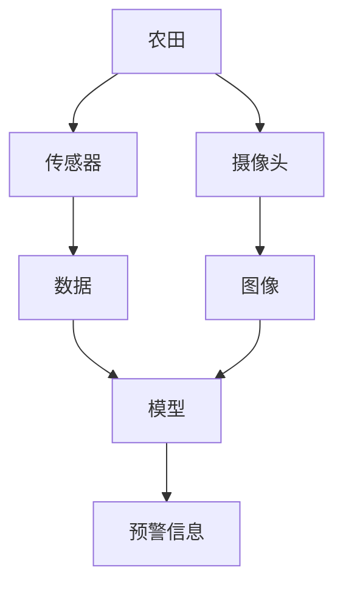
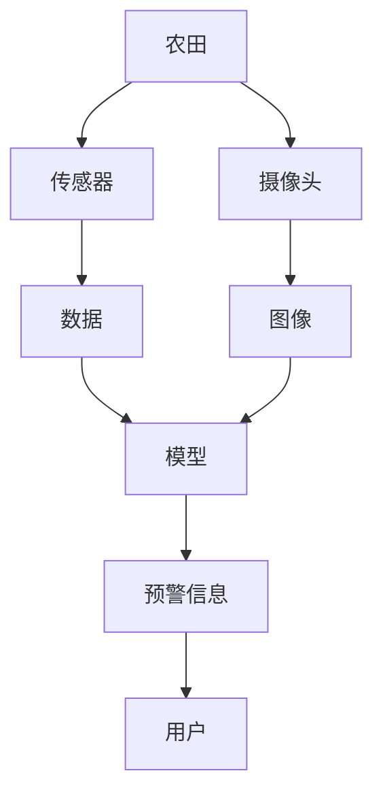
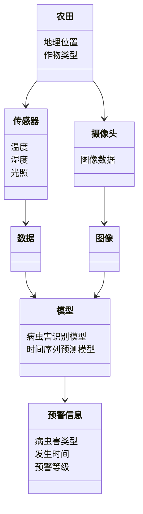
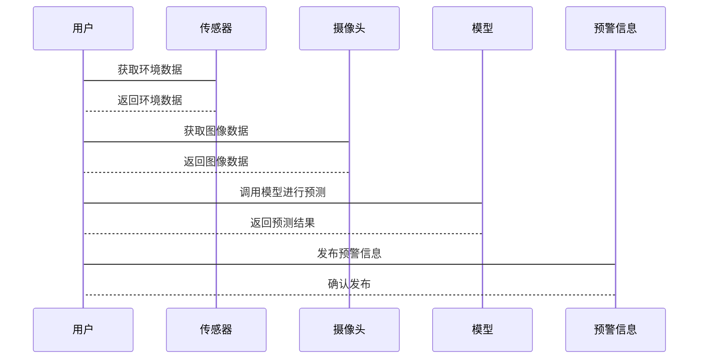

                 


# AI Agent在智能农业病虫害预警中的实践

## 关键词：AI Agent，农业病虫害预警，智能农业，图像识别，机器学习

## 摘要：本文深入探讨了AI Agent在智能农业病虫害预警中的应用，分析了其核心算法和系统架构，并通过实际案例展示了AI Agent如何实现病虫害的早期预警和精准防治。文章从背景介绍、核心概念、算法原理、系统架构到项目实战，全面解析了AI Agent在农业病虫害预警中的实践应用。

---

## 第一部分: AI Agent与智能农业病虫害预警的背景介绍

### 第1章: AI Agent与农业病虫害预警的背景

#### 1.1 AI Agent的基本概念

##### 1.1.1 AI Agent的定义与特点
AI Agent（人工智能代理）是指能够感知环境、自主决策并执行任务的智能体。其特点包括：
- **自主性**：能够独立完成任务，无需人工干预。
- **反应性**：能够实时感知环境并做出反应。
- **学习能力**：通过数据和经验不断优化性能。
- **协作性**：能够与其他系统或人类协作完成复杂任务。

##### 1.1.2 AI Agent在农业中的应用潜力
AI Agent在农业中的应用潜力巨大，尤其是在精准农业和智能监测领域。通过AI Agent，农民可以实现作物生长监测、病虫害预警、资源优化配置等功能。

##### 1.1.3 农业病虫害预警的现状与挑战
目前，农业病虫害预警主要依赖人工监测和简单的传感器数据，存在效率低、精度差、响应慢等问题。AI Agent的引入可以有效解决这些问题，实现病虫害的早期预警和精准防治。

#### 1.2 农业病虫害预警的核心问题

##### 1.2.1 病虫害预警的定义与目标
病虫害预警是指通过监测作物生长环境和病虫害症状，预测病虫害的发生概率和严重程度，并及时发出预警信息。其目标是帮助农民采取预防措施，减少病虫害带来的损失。

##### 1.2.2 病虫害预警的关键技术
病虫害预警的关键技术包括：
- **图像识别**：通过摄像头采集作物图像，识别病虫害症状。
- **数据采集**：通过传感器采集环境数据（如温度、湿度、光照等）。
- **数据处理与分析**：利用机器学习算法分析数据，预测病虫害的发生。

##### 1.2.3 AI Agent在病虫害预警中的作用
AI Agent在病虫害预警中的作用主要体现在以下几个方面：
- **实时监测**：通过传感器和摄像头实时采集数据，感知环境变化。
- **智能分析**：利用机器学习算法分析数据，识别病虫害特征。
- **决策与执行**：根据分析结果，制定防治策略并执行相应操作。

#### 1.3 AI Agent与农业病虫害预警的结合

##### 1.3.1 AI Agent在农业病虫害预警中的应用场景
AI Agent在农业病虫害预警中的应用场景包括：
- **实时监测**：通过物联网设备实时采集农田数据。
- **智能识别**：利用图像识别技术识别病虫害症状。
- **预警与决策**：根据分析结果发出预警，并制定防治方案。

##### 1.3.2 AI Agent的优势与局限性
**优势**：
- **高效性**：能够快速处理大量数据，提高预警效率。
- **准确性**：通过机器学习算法提高病虫害识别的准确性。
- **可扩展性**：能够适应不同规模和类型的农田。

**局限性**：
- **数据依赖性**：需要大量高质量的数据支持模型训练。
- **环境适应性**：在复杂多变的环境中可能面临性能下降的问题。
- **成本问题**：AI Agent的引入需要一定的初期投资。

##### 1.3.3 系统的整体架构与功能模块
**整体架构**：
AI Agent农业病虫害预警系统包括以下几个功能模块：
- **数据采集模块**：通过传感器和摄像头采集农田数据。
- **数据处理模块**：对采集的数据进行清洗和预处理。
- **模型训练模块**：利用机器学习算法训练病虫害识别模型。
- **预警与决策模块**：根据模型预测结果发出预警，并制定防治策略。
- **执行模块**：根据决策结果执行相应的防治操作（如喷洒农药、调整灌溉等）。

---

### 第2章: AI Agent与农业病虫害预警的核心概念

#### 2.1 AI Agent的核心原理

##### 2.1.1 AI Agent的基本工作原理
AI Agent的核心原理包括以下几个步骤：
1. **感知环境**：通过传感器和摄像头感知环境数据。
2. **数据处理**：对感知的数据进行清洗和预处理。
3. **模型训练**：利用机器学习算法训练模型。
4. **决策与执行**：根据模型预测结果制定决策并执行操作。

##### 2.1.2 AI Agent的感知与决策机制
AI Agent的感知与决策机制包括：
- **感知机制**：通过多模态传感器（如摄像头、温度传感器、湿度传感器等）感知环境数据。
- **决策机制**：基于感知数据和模型预测结果，制定最优决策。

##### 2.1.3 AI Agent的学习与自适应能力
AI Agent具有学习与自适应能力，能够通过不断更新模型参数，提高识别准确率和预测精度。

#### 2.2 农业病虫害预警系统的实体关系图

##### 2.2.1 实体关系图的构建
农业病虫害预警系统的实体关系图包括以下几个核心实体：
- **农田**：农田的基本信息（如地理位置、作物类型等）。
- **传感器**：用于采集环境数据的传感器（如温度传感器、湿度传感器等）。
- **摄像头**：用于采集作物图像的摄像头。
- **模型**：用于病虫害识别的机器学习模型。
- **预警信息**：系统生成的预警信息。

##### 2.2.2 实体之间的关系与属性
通过Mermaid图展示实体之间的关系与属性：



##### 2.2.3 系统的核心实体与交互流程
通过Mermaid图展示系统的核心实体与交互流程：



---

#### 2.3 AI Agent与农业病虫害预警系统的联系

##### 2.3.1 AI Agent在系统中的角色
AI Agent在农业病虫害预警系统中扮演着感知、分析和决策的核心角色。

##### 2.3.2 AI Agent与系统其他模块的交互
AI Agent与其他模块的交互流程如下：


##### 2.3.3 系统的整体逻辑与流程
系统整体逻辑与流程包括以下几个步骤：
1. **数据采集**：通过传感器和摄像头采集农田数据。
2. **数据处理**：对采集的数据进行清洗和预处理。
3. **模型训练**：利用机器学习算法训练病虫害识别模型。
4. **预警与决策**：根据模型预测结果发出预警，并制定防治策略。
5. **执行操作**：根据决策结果执行相应的防治操作。

---

## 第三部分: AI Agent在农业病虫害预警中的算法原理

### 第3章: AI Agent的核心算法

#### 3.1 病虫害图像识别的算法原理

##### 3.1.1 图像分类算法
图像分类算法用于对作物图像进行分类，识别病虫害类型。常用算法包括：
- **逻辑回归**：适用于二分类问题。
- **支持向量机（SVM）**：适用于小样本数据。
- **随机森林**：适用于高维数据。

##### 3.1.2 目标检测算法
目标检测算法用于在图像中定位病虫害的位置。常用算法包括：
- **Faster R-CNN**：适用于目标检测任务。
- **YOLO**：适用于实时目标检测。

##### 3.1.3 图像分割算法
图像分割算法用于分割图像中的病虫害区域。常用算法包括：
- **U-Net**：适用于医学图像分割。
- **Mask R-CNN**：适用于实例分割。

#### 3.2 病虫害预测的算法原理

##### 3.2.1 时间序列预测算法
时间序列预测算法用于预测病虫害的发生时间。常用算法包括：
- **ARIMA**：适用于线性时间序列数据。
- **LSTM**：适用于非线性时间序列数据。

##### 3.2.2 回归算法
回归算法用于预测病虫害的严重程度。常用算法包括：
- **线性回归**：适用于线性关系。
- **XGBoost**：适用于非线性关系。

##### 3.2.3 聚类算法
聚类算法用于将病虫害类型进行分类。常用算法包括：
- **K-means**：适用于无监督学习。
- **DBSCAN**：适用于密度聚类。

#### 3.3 AI Agent的决策算法

##### 3.3.1 基于规则的决策算法
基于规则的决策算法通过预定义规则进行决策。例如，如果温度高于30℃且湿度高于60%，则预测病虫害可能发生。

##### 3.3.2 基于机器学习的决策算法
基于机器学习的决策算法通过训练模型进行决策。例如，利用随机森林模型预测病虫害的发生概率。

##### 3.3.3 基于强化学习的决策算法
基于强化学习的决策算法通过与环境交互进行决策优化。例如，通过模拟环境变化，优化喷洒农药的策略。

---

### 第4章: 算法实现与代码示例

#### 4.1 病虫害图像识别的代码示例

##### 4.1.1 使用逻辑回归进行图像分类
```python
import numpy as np
from sklearn.linear_model import LogisticRegression
from sklearn.datasets import load_digits
from sklearn.model_selection import train_test_split

# 加载数据集
digits = load_digits()
X = digits.data
y = digits.target

# 划分训练集和测试集
X_train, X_test, y_train, y_test = train_test_split(X, y, test_size=0.2, random_state=42)

# 训练逻辑回归模型
model = LogisticRegression(max_iter=1000)
model.fit(X_train, y_train)

# 预测测试集
y_pred = model.predict(X_test)

# 输出准确率
print("Accuracy:", np.mean(y_pred == y_test))
```

##### 4.1.2 使用Faster R-CNN进行目标检测
```python
import tensorflow as tf
from tensorflow.keras import layers

# 定义Faster R-CNN模型
def build_model():
    inputs = layers.Input(shape=(None, None, 3))
    backbone = tf.keras.applications.ResNet50(weights='imagenet', include_top=False)(inputs)
    ...  # 其他层的定义
    return model

# 训练模型
model = build_model()
model.compile(optimizer='adam', loss='binary_crossentropy', metrics=['accuracy'])
model.fit(X_train, y_train, epochs=10, batch_size=32)
```

##### 4.1.3 使用U-Net进行图像分割
```python
import tensorflow as tf
from tensorflow.keras.layers import Conv2D, UpSampling2D, Concatenate

# 定义U-Net模型
def build_model():
    inputs = layers.Input(shape=(256, 256, 3))
    conv1 = Conv2D(64, (3, 3), activation='relu')(inputs)
    conv2 = Conv2D(128, (3, 3), activation='relu')(conv1)
    ...  # 其他层的定义
    return model

# 训练模型
model = build_model()
model.compile(optimizer='adam', loss='binary_crossentropy', metrics=['accuracy'])
model.fit(X_train, y_train, epochs=10, batch_size=32)
```

#### 4.2 病虫害预测的代码示例

##### 4.2.1 使用LSTM进行时间序列预测
```python
import numpy as np
from tensorflow.keras.models import Sequential
from tensorflow.keras.layers import LSTM, Dense

# 定义LSTM模型
model = Sequential()
model.add(LSTM(50, input_shape=(timesteps, features)))
model.add(Dense(1))
model.compile(optimizer='adam', loss='mean_squared_error')

# 训练模型
model.fit(X_train, y_train, epochs=50, batch_size=32)
```

##### 4.2.2 使用XGBoost进行回归预测
```python
import xgboost as xgb

# 定义XGBoost模型
model = xgb.XGBRegressor(n_estimators=100, learning_rate=0.1, max_depth=3)

# 训练模型
model.fit(X_train, y_train)

# 预测测试集
y_pred = model.predict(X_test)
```

##### 4.2.3 使用DBSCAN进行聚类
```python
from sklearn.cluster import DBSCAN
from sklearn.preprocessing import StandardScaler

# 数据标准化
scaler = StandardScaler()
X_scaled = scaler.fit_transform(X)

# 训练DBSCAN模型
model = DBSCAN(eps=0.5, min_samples=5)
model.fit(X_scaled)

# 获取聚类结果
y_pred = model.labels_
```

#### 4.3 AI Agent的决策算法

##### 4.3.1 基于规则的决策算法
```python
# 示例规则：如果温度高于30℃且湿度高于60%，则预警病虫害
if temperature > 30 and humidity > 60:
    send_warning()
```

##### 4.3.2 基于机器学习的决策算法
```python
# 示例决策逻辑
if model.predict([current_conditions]) == 1:
    send_warning()
```

##### 4.3.3 基于强化学习的决策算法
```python
# 示例强化学习策略
action = agent.act(state)
next_state, reward = env.step(action)
agent.learn(state, action, reward, next_state)
```

---

## 第三部分: 系统分析与架构设计方案

### 第5章: 系统分析与架构设计方案

#### 5.1 问题场景介绍
农业病虫害预警系统需要实时监测农田环境数据，识别病虫害症状，并根据预测结果发出预警信息。系统需要具备高精度、实时性和可扩展性。

#### 5.2 系统功能设计

##### 5.2.1 领域模型
通过Mermaid类图展示领域模型：



#### 5.3 系统架构设计

##### 5.3.1 系统架构图
通过Mermaid架构图展示系统架构：


#### 5.4 系统接口设计

##### 5.4.1 接口设计
系统接口设计包括：
- **数据采集接口**：传感器和摄像头的数据采集接口。
- **模型调用接口**：模型的调用接口。
- **预警信息接口**：预警信息的发布接口。

##### 5.4.2 接口交互流程
通过Mermaid序列图展示接口交互流程：



---

## 第四部分: 项目实战

### 第6章: 项目实战

#### 6.1 环境安装

##### 6.1.1 安装Python
安装Python 3.8及以上版本。

##### 6.1.2 安装依赖库
安装以下依赖库：
- `numpy`
- `tensorflow`
- `xgboost`
- `mermaid`

#### 6.2 系统核心实现

##### 6.2.1 数据采集模块
```python
import pandas as pd
from sklearn.datasets import load_digits

# 加载数据集
digits = load_digits()
X = digits.data
y = digits.target
```

##### 6.2.2 数据处理模块
```python
from sklearn.model_selection import train_test_split

# 划分训练集和测试集
X_train, X_test, y_train, y_test = train_test_split(X, y, test_size=0.2, random_state=42)
```

##### 6.2.3 模型训练模块
```python
from sklearn.linear_model import LogisticRegression

# 训练逻辑回归模型
model = LogisticRegression(max_iter=1000)
model.fit(X_train, y_train)
```

##### 6.2.4 预警与决策模块
```python
# 预测测试集
y_pred = model.predict(X_test)

# 输出准确率
print("Accuracy:", np.mean(y_pred == y_test))
```

#### 6.3 案例分析与详细讲解
通过实际案例分析，展示AI Agent在病虫害预警中的应用效果。例如，利用图像识别技术识别作物病害，利用时间序列预测模型预测病虫害发生时间，利用决策算法制定防治策略。

#### 6.4 项目小结
总结项目实施过程中的经验教训，分析系统的优缺点，并提出改进建议。

---

## 第五部分: 最佳实践、小结与注意事项

### 第7章: 最佳实践与注意事项

#### 7.1 最佳实践
- **数据质量**：确保数据的准确性和完整性。
- **模型优化**：通过调参和模型融合提高预测精度。
- **系统维护**：定期更新模型和优化系统架构。

#### 7.2 小结
本文详细介绍了AI Agent在智能农业病虫害预警中的实践，从背景介绍、核心概念、算法原理到系统架构和项目实战，全面解析了AI Agent在病虫害预警中的应用。

#### 7.3 注意事项
- **数据隐私**：注意保护农田数据的隐私和安全。
- **环境适应性**：确保系统在不同环境下的适应性。
- **成本控制**：合理控制系统的建设和运行成本。

#### 7.4 拓展阅读
- 推荐阅读《机器学习实战》、《深度学习入门》等相关书籍。
- 参考GitHub上的相关开源项目，学习更多AI Agent的应用案例。

---

## 结语
通过本文的深入分析，读者可以全面了解AI Agent在智能农业病虫害预警中的实践应用。希望本文能为相关领域的研究和实践提供有价值的参考和启示。

