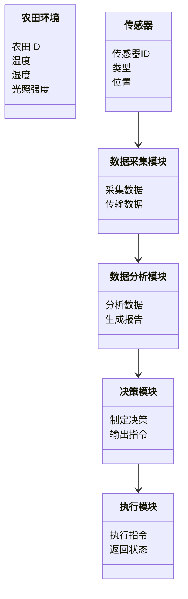
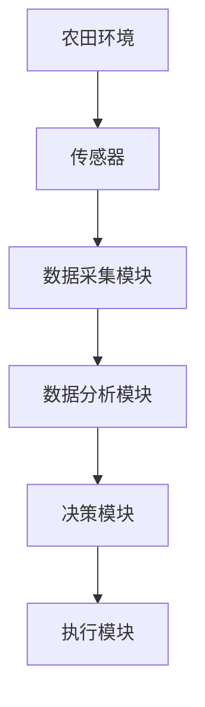
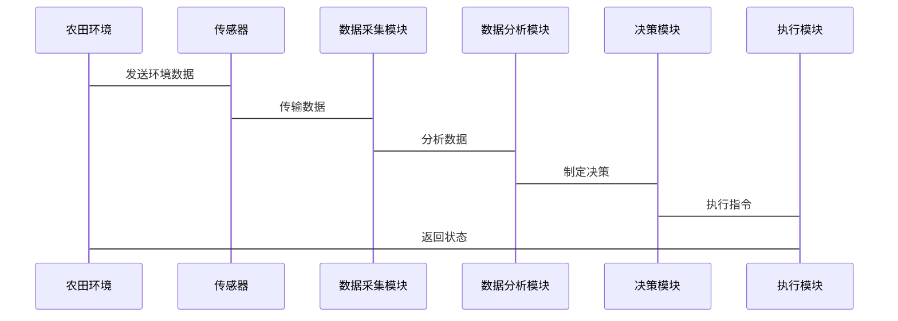

                 


# AI Agent在智能农业监测中的应用

> 关键词：AI Agent, 智能农业, 农业监测, 人工智能, 算法原理

> 摘要：本文探讨了AI Agent在智能农业监测中的应用，从概念、算法、系统架构到项目实战，详细阐述了AI Agent在农业监测中的作用及其实现方式。通过分析AI Agent的核心原理、算法选择、系统设计和项目案例，展示了如何利用AI技术提升农业监测的效率和准确性。

---

# 第一部分: AI Agent与智能农业监测的背景介绍

## 第1章: AI Agent与智能农业监测概述

### 1.1 AI Agent的基本概念

#### 1.1.1 AI Agent的定义
AI Agent（人工智能代理）是一种能够感知环境、做出决策并执行任务的智能实体。它可以是一个软件程序、机器人或任何能够自主行动的系统，旨在实现特定目标。

#### 1.1.2 AI Agent的核心特点
- **自主性**：能够自主决策，无需外部干预。
- **反应性**：能够实时感知环境并做出响应。
- **学习性**：通过数据和经验不断优化性能。
- **交互性**：能够与人类或其他系统进行交互。

#### 1.1.3 AI Agent与传统自动化系统的区别
| 特性 | AI Agent | 传统自动化系统 |
|------|----------|----------------|
| 决策能力 | 高度智能，可自适应 | 基于固定规则，不可变 |
| 学习能力 | 能够学习和优化 | 无法学习和优化 |
| 交互能力 | 支持与人类和其他系统的交互 | 仅限于预定义的交互方式 |

### 1.2 智能农业监测的背景与意义

#### 1.2.1 智能农业监测的定义
智能农业监测是指利用传感器、物联网、人工智能等技术，实时采集和分析农田环境数据，以优化农业生产过程。

#### 1.2.2 智能农业监测的应用场景
- **环境监测**：如温度、湿度、光照强度等。
- **作物监测**：如作物生长状态、病虫害检测。
- **资源管理**：如水资源、肥料的优化使用。

#### 1.2.3 智能农业监测的重要性
- 提高农业生产效率。
- 节约资源，降低成本。
- 实现精准农业，减少环境影响。

### 1.3 AI Agent在智能农业监测中的应用前景

#### 1.3.1 AI Agent在农业监测中的潜在应用
- **智能传感器数据处理**：AI Agent可以实时分析传感器数据，识别异常情况。
- **预测与决策支持**：基于历史数据和当前数据，预测作物生长情况并提出决策建议。
- **自动化管理**：AI Agent可以控制灌溉、施肥等设备，实现自动化管理。

#### 1.3.2 企业采用AI Agent的优势
- 提高生产效率，降低成本。
- 增强数据处理能力，优化资源利用。
- 提升产品质量，增强市场竞争力。

#### 1.3.3 AI Agent应用的挑战与机遇
- **挑战**：数据获取难度大、模型训练复杂、环境复杂多变。
- **机遇**：技术进步、政策支持、市场需求增长。

---

## 第2章: AI Agent的核心概念与联系

### 2.1 AI Agent的原理与机制

#### 2.1.1 AI Agent的基本原理
AI Agent通过感知环境、分析数据、制定决策并执行动作来实现目标。其核心机制包括数据采集、知识表示、推理与决策、行为执行。

#### 2.1.2 AI Agent的感知与决策机制
- **感知**：通过传感器或其他数据源获取环境信息。
- **分析**：对获取的数据进行处理和分析。
- **决策**：基于分析结果制定行动计划。
- **执行**：通过执行机构完成动作。

#### 2.1.3 AI Agent的学习与优化算法
AI Agent通过强化学习、监督学习和无监督学习等算法不断优化自身的决策能力。例如，强化学习通过奖励机制训练AI Agent，使其在复杂环境中做出最优决策。

### 2.2 AI Agent的核心要素组成

#### 2.2.1 数据采集与处理
AI Agent需要实时采集农田环境数据，如温度、湿度、光照强度等，并进行预处理和特征提取。

#### 2.2.2 知识表示与推理
AI Agent需要将采集到的数据转化为知识，并通过推理引擎进行逻辑推理，以支持决策过程。

#### 2.2.3 行为规划与执行
AI Agent根据推理结果制定行动计划，并通过执行机构（如灌溉系统）完成任务。

### 2.3 AI Agent的实体关系图

#### 2.3.1 ER实体关系图的构建
```mermaid
erDiagram
    class 农田环境 {
        农田ID
        温度
        湿度
        光照强度
    }
    class 传感器 {
        传感器ID
        类型
        位置
    }
    class AI Agent {
        AgentID
        状态
        决策结果
    }
    class 决策规则 {
        规则ID
        条件
        行动
    }
    农田环境 --o 传感器 : "被监测的环境数据"
    传感器 --o AI Agent : "提供实时数据"
    AI Agent --o 决策规则 : "应用规则进行决策"
```

#### 2.3.2 实体关系图的分析与解释
农田环境数据通过传感器采集，AI Agent接收数据后应用决策规则进行推理，最终输出决策结果。这种结构确保了数据流的高效传递和处理。

---

## 第3章: AI Agent的核心算法原理

### 3.1 基于强化学习的AI Agent算法

#### 3.1.1 强化学习的基本原理
强化学习是一种通过试错机制来训练模型的方法。AI Agent通过与环境交互，不断调整策略以最大化累计奖励。

#### 3.1.2 AI Agent的Q-learning算法
Q-learning是一种常用的强化学习算法，其核心公式为：
$$ Q(s, a) = r + \gamma \max Q(s', a') $$
其中，$s$是当前状态，$a$是动作，$r$是奖励，$\gamma$是折扣因子，$s'$是下一个状态。

#### 3.1.3 算法的数学模型与公式
- 状态转移概率：$P(s' | s, a)$
- 状态值函数：$V(s) = \max_a Q(s, a)$
- 动作值函数：$Q(s, a) = E[r_t | s, a] + \gamma V(s')$

### 3.2 基于监督学习的AI Agent算法

#### 3.2.1 监督学习的基本原理
监督学习是通过标记数据训练模型，使其能够对新数据进行分类或回归预测。

#### 3.2.2 AI Agent的分类与回归算法
- 分类算法：如随机森林、支持向量机（SVM）。
- 回归算法：如线性回归、决策树回归。

#### 3.2.3 算法的数学模型与公式
- 线性回归：$$ y = \theta x + b $$
- 支持向量机：$$ \text{maximize} \sum_{i=1}^{n} \xi_i $$
  $$ \text{subject to} \quad y_i (w \cdot x_i + b) \geq 1 - \xi_i $$
  $$ \xi_i \geq 0 $$

### 3.3 基于无监督学习的AI Agent算法

#### 3.3.1 无监督学习的基本原理
无监督学习是通过数据内在结构发现隐含模式，无需标记数据。

#### 3.3.2 AI Agent的聚类与降维算法
- 聚类算法：如K-means、DBSCAN。
- 降维算法：如主成分分析（PCA）、t-SNE。

#### 3.3.3 算法的数学模型与公式
- K-means目标函数：$$ \min \sum_{i=1}^{n} \sum_{k=1}^{K} w_{ik} \|x_i - \mu_k\|^2 $$
  其中，$w_{ik}$是样本$i$属于簇$k$的指示变量，$\mu_k$是簇$k$的中心。

---

## 第4章: 智能农业监测系统的需求分析

### 4.1 系统功能需求分析
智能农业监测系统需要实现以下功能：
1. 数据采集与处理：实时采集农田环境数据。
2. 数据分析与推理：通过AI算法分析数据，识别异常情况。
3. 决策支持：基于分析结果提出管理建议。
4. 自动化控制：通过物联网设备实现自动灌溉、施肥等操作。

### 4.2 系统功能设计

#### 4.2.1 领域模型类图


### 4.3 系统架构设计

#### 4.3.1 系统架构图


#### 4.3.2 系统交互序列图


---

## 第5章: 项目实战

### 5.1 环境安装

#### 5.1.1 安装Python环境
使用Anaconda安装Python 3.8及以上版本。

#### 5.1.2 安装依赖库
安装必要的库：
```bash
pip install numpy pandas scikit-learn matplotlib
```

### 5.2 核心代码实现

#### 5.2.1 数据采集模块
```python
import numpy as np
import pandas as pd

def collect_data(sensor_type, location):
    # 模拟传感器数据采集
    data = {
        'timestamp': pd.date_range(start='2023-01-01', periods=10, freq='H'),
        'temperature': np.random.normal(20, 2, 10),
        'humidity': np.random.uniform(30, 90, 10)
    }
    return pd.DataFrame(data)
```

#### 5.2.2 数据分析模块
```python
from sklearn.ensemble import RandomForestRegressor

def analyze_data(df):
    # 训练回归模型
    X = df[['temperature', 'humidity']]
    y = df['timestamp']
    model = RandomForestRegressor(n_estimators=100)
    model.fit(X, y)
    return model
```

#### 5.2.3 决策模块
```python
def make_decision(model, current_data):
    # 预测决策
    prediction = model.predict(current_data)
    if prediction > threshold:
        return '开启灌溉系统'
    else:
        return '关闭灌溉系统'
```

#### 5.2.4 执行模块
```python
def execute_action(decision):
    if decision == '开启灌溉系统':
        print("启动灌溉系统")
    else:
        print("关闭灌溉系统")
```

### 5.3 案例分析与解读
假设我们有一个监测温度和湿度的智能农业系统，当温度超过30度时，AI Agent会启动灌溉系统降温。

### 5.4 项目总结
通过本项目，我们实现了AI Agent在智能农业监测中的应用，展示了如何利用数据采集、分析和决策模块来优化农业生产过程。

---

## 第6章: 最佳实践与注意事项

### 6.1 最佳实践
- **数据质量**：确保数据的准确性和完整性。
- **模型优化**：定期更新模型，提高预测准确性。
- **系统维护**：定期检查设备和软件，确保系统稳定运行。

### 6.2 小结
本文详细探讨了AI Agent在智能农业监测中的应用，从概念、算法到系统设计和项目实战，展示了如何利用AI技术提升农业监测的效率和准确性。

### 6.3 注意事项
- AI Agent的决策依赖于数据质量和模型准确性，需谨慎处理。
- 系统的安全性和隐私保护也是需要重点关注的方面。

### 6.4 拓展阅读
- 推荐阅读《机器学习实战》、《深度学习入门》等相关书籍，深入了解AI算法和应用。

---

# 结语

通过本文的探讨，我们深入分析了AI Agent在智能农业监测中的应用，从理论到实践，展示了其在提高农业生产效率、降低成本和优化资源利用方面的巨大潜力。未来，随着技术的进步和AI Agent算法的优化，其在农业领域的应用将更加广泛和深入。

