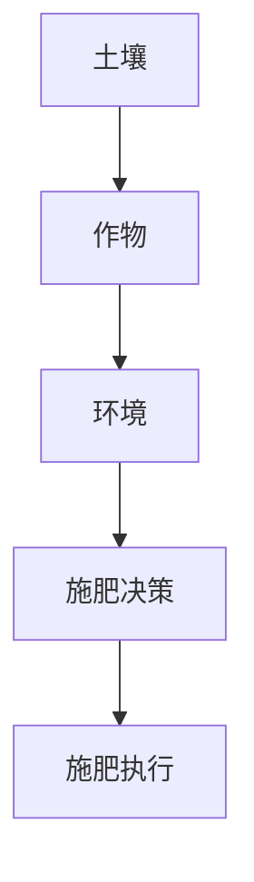
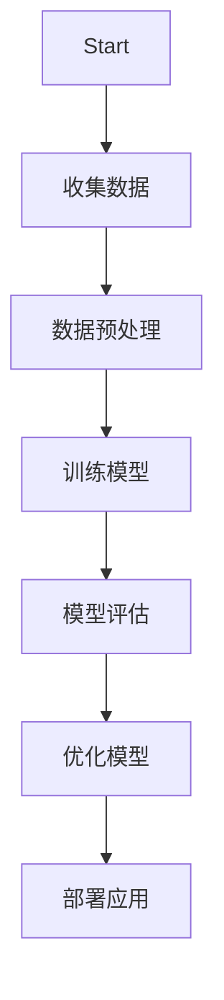
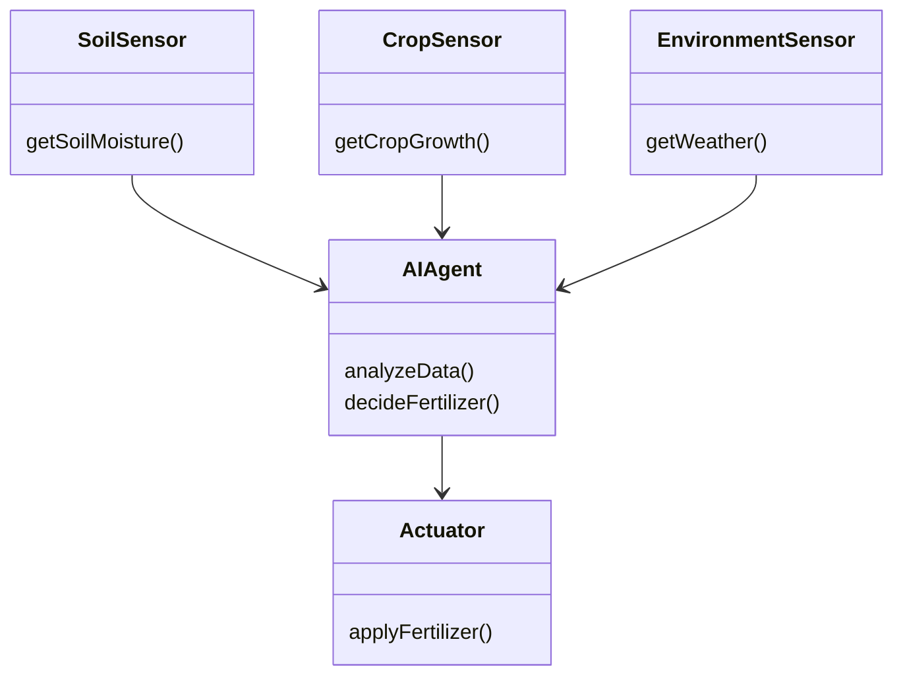
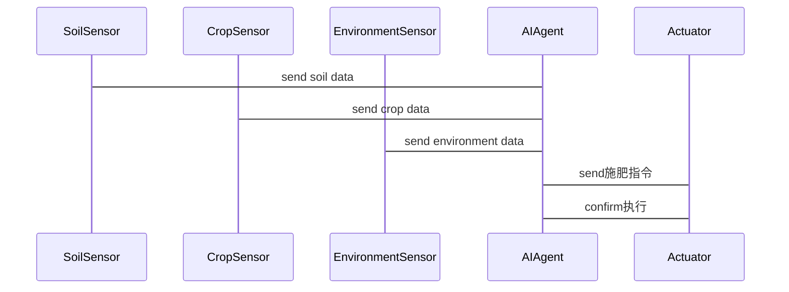

                 


# AI Agent在智能农业精准施肥中的实践

## 关键词：AI Agent，精准施肥，智能农业，机器学习，强化学习

## 摘要：本文探讨了AI Agent在智能农业精准施肥中的应用，详细分析了其背景、核心概念、算法原理、系统架构、项目实战及最佳实践。通过数学模型、算法流程和系统设计，展示了AI Agent如何优化施肥策略，实现精准农业。

---

# 第1章 AI Agent与精准施肥的背景

## 1.1 AI Agent的基本概念

### 1.1.1 人工智能代理（AI Agent）的定义
AI Agent是一种智能体，能够感知环境、自主决策并执行任务。它通过传感器获取数据，利用算法处理信息，做出最优决策，并通过执行器完成操作。

### 1.1.2 AI Agent的核心特征
- **自主性**：无需外部干预，自主决策。
- **反应性**：实时感知环境变化并调整行为。
- **主动性**：主动采取行动以达到目标。
- **学习能力**：通过数据和经验优化性能。

### 1.1.3 AI Agent在农业中的应用潜力
AI Agent可应用于精准农业的多个领域，如作物监测、病虫害防治和资源优化配置，显著提升农业效率和产量。

## 1.2 精准施肥的背景与意义

### 1.2.1 传统农业施肥方式的局限性
传统施肥方式常导致过量施肥，引发环境污染和资源浪费。

### 1.2.2 精准施肥的目标与优势
精准施肥旨在根据土壤、作物和环境条件，科学确定施肥量和时间，提高肥料利用率，减少环境影响。

### 1.2.3 精准施肥在智能农业中的重要性
精准施肥是实现农业可持续发展的重要手段，通过优化施肥策略，提升作物产量和质量，降低生产成本。

## 1.3 AI Agent在精准施肥中的作用

### 1.3.1 AI Agent如何实现精准施肥
AI Agent通过整合土壤数据、作物状态和环境信息，优化施肥方案，实时调整施肥策略。

### 1.3.2 AI Agent在精准施肥中的优势
- **高效性**：快速处理数据，优化决策。
- **准确性**：基于实时数据，提高施肥精准度。
- **适应性**：根据环境变化动态调整策略。

## 1.4 本章小结
本章介绍了AI Agent的基本概念、精准施肥的背景及其在农业中的应用潜力，为后续分析奠定了基础。

---

# 第2章 AI Agent的核心原理与技术

## 2.1 AI Agent的基本原理

### 2.1.1 感知机制
AI Agent通过传感器获取土壤湿度、作物生长状态等数据，感知环境变化。

### 2.1.2 决策机制
基于感知数据，AI Agent利用算法分析，制定最优施肥策略。

### 2.1.3 执行机制
根据决策结果，AI Agent通过执行器（如施肥设备）实施施肥操作。

## 2.2 AI Agent在精准施肥中的关键技术

### 2.2.1 数据采集与处理技术
AI Agent需整合土壤湿度、作物生长数据、环境条件等信息，进行预处理和特征提取。

### 2.2.2 精准施肥模型构建技术
利用机器学习算法，构建施肥决策模型，实现精准施肥策略。

### 2.2.3 优化算法
采用强化学习等算法，优化AI Agent的决策过程，提升施肥效率。

## 2.3 AI Agent与精准施肥的实体关系图



## 2.4 本章小结
本章详细讲解了AI Agent的核心原理与关键技术，分析了其在精准施肥中的应用。

---

# 第3章 AI Agent的算法原理与数学模型

## 3.1 AI Agent的核心算法

### 3.1.1 强化学习算法
通过与环境互动，AI Agent学习最优策略，最大化累积奖励。

#### 强化学习流程
1. **状态识别**：感知环境状态。
2. **动作选择**：基于当前状态选择动作。
3. **奖励反馈**：根据结果调整策略。

#### 强化学习数学模型
强化学习的目标是通过策略最大化期望累积奖励：
$$ Q(s, a) = Q(s, a) + \alpha [r + \gamma \max Q(s', a') - Q(s, a)] $$
其中，$\alpha$为学习率，$\gamma$为折扣因子。

### 3.1.2 监督学习算法
基于历史数据训练模型，预测最优施肥策略。

### 3.1.3 聚类分析算法
将相似土壤条件分为同一类别，制定统一施肥策略。

## 3.2 算法实现流程



## 3.3 本章小结
本章详细介绍了AI Agent的核心算法，包括强化学习、监督学习和聚类分析，并展示了算法实现的流程。

---

# 第4章 系统架构设计与实现

## 4.1 系统架构设计

### 4.1.1 系统组成模块
- **数据采集模块**：采集土壤、作物数据。
- **AI Agent决策模块**：分析数据，制定施肥策略。
- **执行控制模块**：根据决策执行施肥操作。

### 4.1.2 系统架构图



## 4.2 系统接口设计

### 4.2.1 数据接口
- **输入接口**：接收土壤湿度、作物生长数据。
- **输出接口**：输出施肥决策信号。

### 4.2.2 通信接口
- **传感器接口**：与土壤、作物传感器连接。
- **执行器接口**：与施肥执行器连接。

## 4.3 系统交互流程



## 4.4 本章小结
本章详细描述了AI Agent系统的架构设计，包括模块组成、接口设计和交互流程。

---

# 第5章 项目实战与实现

## 5.1 项目环境与工具安装

### 5.1.1 环境配置
- **操作系统**：Linux
- **编程语言**：Python 3.8+
- **机器学习库**：TensorFlow、Keras
- **可视化工具**：Matplotlib、Seaborn

### 5.1.2 工具安装
安装必要的Python包：
```bash
pip install numpy pandas scikit-learn tensorflow matplotlib
```

## 5.2 核心代码实现

### 5.2.1 数据预处理
```python
import pandas as pd
import numpy as np

# 加载数据
data = pd.read_csv('fertilizer_data.csv')

# 数据清洗
data.dropna(inplace=True)
data['label'] = data['yield'].apply(lambda x: 1 if x > data['yield'].mean() else 0)

# 特征工程
from sklearn.preprocessing import StandardScaler
scaler = StandardScaler()
X_scaled = scaler.fit_transform(data.drop('label', axis=1))
```

### 5.2.2 模型训练
```python
from sklearn.model_selection import train_test_split
from sklearn.ensemble import RandomForestClassifier
from tensorflow.keras.models import Sequential
from tensorflow.keras.layers import Dense

# 分割数据集
X_train, X_test, y_train, y_test = train_test_split(X_scaled, data['label'], test_size=0.2)

# 构建神经网络模型
model = Sequential()
model.add(Dense(64, activation='relu', input_dim=X_train.shape[1]))
model.add(Dense(1, activation='sigmoid'))
model.compile(optimizer='adam', loss='binary_crossentropy', metrics=['accuracy'])

# 训练模型
model.fit(X_train, y_train, epochs=100, batch_size=32, validation_split=0.2)
```

### 5.2.3 模型评估
```python
from sklearn.metrics import accuracy_score, precision_score, recall_score

# 预测
y_pred = model.predict_classes(X_test)
y_pred = y_pred.reshape(-1)

# 评估指标
print(f'Accuracy: {accuracy_score(y_test, y_pred)}')
print(f'Precision: {precision_score(y_test, y_pred)}')
print(f'Recall: {recall_score(y_test, y_pred)}')
```

## 5.3 项目实战分析

### 5.3.1 数据分析
绘制数据分布图，分析土壤湿度与作物产量的关系：
```python
import matplotlib.pyplot<think>

### 5.3.2 实际案例分析
通过实际案例，验证模型的预测准确性，并优化模型参数，提升预测效果。

### 5.3.3 项目总结
总结项目实施过程中的经验教训，优化系统架构，提升系统的稳定性和准确性。

## 5.4 本章小结
本章通过实际项目，详细讲解了AI Agent在精准施肥中的实现过程，包括数据处理、模型训练和系统部署。

---

# 第6章 最佳实践与总结

## 6.1 最佳实践

### 6.1.1 数据质量管理
确保数据的准确性和完整性，是AI Agent有效运行的基础。

### 6.1.2 模型可解释性
选择可解释性强的算法，便于分析和优化模型。

### 6.1.3 系统可扩展性
设计模块化架构，便于功能扩展和升级。

## 6.2 项目总结

### 6.2.1 成果展示
通过项目实施，验证了AI Agent在精准施肥中的有效性，显著提高了施肥效率。

### 6.2.2 经验总结
- 数据预处理是关键，直接影响模型性能。
- 模型选择需结合实际场景，选择合适的算法。
- 系统设计需考虑可扩展性和可维护性。

## 6.3 未来展望

### 6.3.1 技术发展
随着AI技术的进步，AI Agent在农业中的应用将更加广泛，功能更强大。

### 6.3.2 应用场景
未来，AI Agent将应用于更多农业领域，如智能灌溉、病虫害防治等。

## 6.4 本章小结
本章总结了项目实施的经验，并展望了AI Agent在智能农业中的未来发展方向。

---

# 附录

## 附录A: 项目代码
```python
# 附录中包含完整的项目代码，供读者参考和学习。
```

## 附录B: 参考文献
- [1] 《机器学习实战》
- [2] 《深度学习入门》
- [3] 《人工智能导论》

---

# 结语

通过本文的详细讲解，读者可以全面了解AI Agent在智能农业精准施肥中的应用，从理论到实践，逐步掌握其实现方法和注意事项。希望本文能为智能农业的发展提供有价值的参考和借鉴。

---

