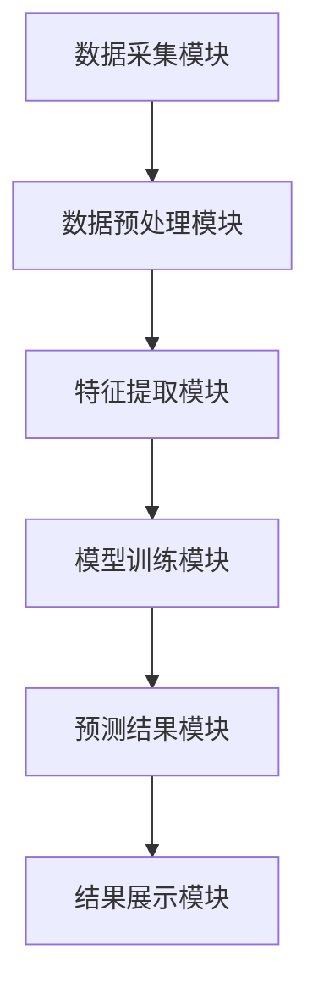

                 

# AI Agent在智能农作物产量预测中的实践

> **关键词**：AI Agent，农作物产量预测，机器学习，知识图谱，系统架构设计

> **摘要**：本文探讨了AI Agent在农作物产量预测中的应用，从背景、核心概念、算法原理到系统架构设计，再到项目实战，详细介绍了如何利用AI Agent技术实现农作物产量的智能预测。通过理论与实践的结合，本文为农业智能化提供了新的思路和解决方案。

---

# 第一部分: AI Agent在智能农作物产量预测中的背景与概念

# 第1章: AI Agent与农作物产量预测概述

## 1.1 问题背景与挑战

### 1.1.1 农作物产量预测的重要性

农作物产量预测是农业领域中的重要问题，直接关系到粮食安全、农业经济和农民收入。传统上，产量预测主要依赖于经验、历史数据和简单的统计方法，但这些方法存在以下问题：

1. **数据不足**：传统方法依赖于有限的历史数据，无法充分利用现代技术提供的大量数据。
2. **预测精度低**：简单统计方法难以捕捉复杂的环境因素和作物生长周期中的变量。
3. **实时性差**：传统方法通常需要较长时间的计算和分析，难以实现实时预测。

### 1.1.2 问题描述

农作物产量预测的核心问题在于如何准确预测作物在生长周期中的产量。影响产量的因素包括：

- **环境因素**：温度、降水量、光照强度等。
- **土壤条件**：土壤肥力、pH值、有机质含量等。
- **种植技术**：播种密度、施肥量、灌溉频率等。
- **病虫害**：病虫害的发生对作物产量的影响。

传统方法难以同时考虑这些复杂因素，而AI Agent技术可以通过整合多源数据和智能推理来解决这一问题。

### 1.1.3 解决方法

AI Agent通过以下方式实现农作物产量预测：

1. **数据整合**：整合土壤、气象、种植技术等多源数据。
2. **智能推理**：利用机器学习和知识图谱进行推理和预测。
3. **实时反馈**：根据环境变化和作物生长状态进行实时调整。

---

## 1.2 AI Agent的核心概念

### 1.2.1 AI Agent的定义与特征

AI Agent（智能代理）是一种能够感知环境、自主决策并执行任务的智能系统。其核心特征包括：

- **自主性**：能够在没有外部干预的情况下运行。
- **反应性**：能够实时感知环境并做出反应。
- **目标导向性**：具有明确的目标，例如提高预测精度。

### 1.2.2 农作物产量预测中的AI Agent角色

在农作物产量预测中，AI Agent主要扮演以下角色：

- **数据采集与处理**：收集和处理土壤、气象等多源数据。
- **模型构建与优化**：构建预测模型并不断优化。
- **预测与反馈**：根据模型预测结果提供实时反馈。

### 1.2.3 AI Agent与传统预测模型的对比

| 对比维度 | AI Agent | 传统预测模型 |
|----------|-----------|--------------|
| 数据来源 | 多源数据整合 | 单一数据源 | 
| 模型复杂度 | 高复杂度，支持深度学习 | 低复杂度，简单统计模型 |
| 实时性 | 实时预测 | 非实时预测 |

---

## 1.3 本章小结

本章介绍了AI Agent在农作物产量预测中的重要性，分析了传统方法的局限性，并提出了AI Agent的解决方案。通过对比AI Agent与传统预测模型，明确了AI Agent在预测中的优势和应用场景。

---

# 第二部分: AI Agent的核心原理与数学模型

# 第2章: AI Agent的核心原理

## 2.1 AI Agent的基本原理

### 2.1.1 知识表示与推理

知识表示是AI Agent的核心技术之一。常用的表示方法包括：

- **语义网络**：通过节点和边表示知识。
- **知识图谱**：通过实体和关系表示知识。

### 2.1.2 行为决策机制

AI Agent的行为决策机制通常包括以下步骤：

1. **感知环境**：通过传感器或数据接口获取环境信息。
2. **知识推理**：利用知识表示和推理算法进行推理。
3. **决策制定**：基于推理结果制定决策。

### 2.1.3 与环境的交互方式

AI Agent通过以下方式与环境交互：

1. **数据输入**：接收多源数据。
2. **模型调用**：调用预测模型进行计算。
3. **结果输出**：输出预测结果并提供反馈。

---

## 2.2 农作物产量预测中的AI Agent模型

### 2.2.1 数据驱动的预测模型

数据驱动的预测模型基于大量历史数据，通过机器学习算法进行预测。常用算法包括：

- **线性回归**：用于线性关系的预测。
- **随机森林**：用于非线性关系的预测。
- **神经网络**：用于复杂的非线性关系的预测。

### 2.2.2 知识驱动的预测模型

知识驱动的预测模型基于领域知识，通过知识图谱和推理引擎进行预测。常用方法包括：

- **规则推理**：基于领域知识制定推理规则。
- **本体推理**：基于知识图谱进行推理。

### 2.2.3 混合驱动的预测模型

混合驱动的预测模型结合了数据驱动和知识驱动的优势，通常通过集成学习方法进行预测。

---

## 2.3 本章小结

本章详细介绍了AI Agent的核心原理，包括知识表示与推理、行为决策机制以及与环境的交互方式。同时，分析了数据驱动、知识驱动和混合驱动的预测模型，为后续的系统设计奠定了基础。

---

# 第3章: AI Agent的数学模型与算法

## 3.1 基于机器学习的预测模型

### 3.1.1 线性回归模型

线性回归模型是最简单的预测模型，适用于线性关系的预测。其数学表达式为：

$$ y = \beta_0 + \beta_1x_1 + \beta_2x_2 + ... + \beta_nx_n $$

其中，$y$ 是预测目标，$\beta_0$ 是截距，$\beta_1, \beta_2, ..., \beta_n$ 是回归系数，$x_1, x_2, ..., x_n$ 是输入特征。

### 3.1.2 支持向量机模型

支持向量机（SVM）是一种常用的分类和回归模型。其核心思想是通过构建超平面将数据分成不同的类别。对于回归问题，SVM 使用ε-Insensitive Loss函数。

### 3.1.3 神经网络模型

神经网络模型是一种基于人工神经网络的预测模型，通常用于处理复杂的非线性关系。其基本结构包括输入层、隐藏层和输出层。

---

## 3.2 基于知识图谱的推理模型

### 3.2.1 知识表示学习

知识表示学习是将知识图谱中的实体和关系映射到低维空间的技术。常用方法包括：

- **Word2Vec**：将实体映射为向量。
- **TransE**：通过翻译嵌入进行知识表示。

### 3.2.2 知识推理算法

知识推理算法用于基于知识图谱进行推理。常用算法包括：

- **路径推理**：通过定义路径进行推理。
- **规则推理**：基于预定义规则进行推理。

---

## 3.3 混合模型的构建与优化

### 3.3.1 混合模型的构建方法

混合模型通常通过集成学习方法构建，例如：

- **投票法**：多个模型投票决定最终结果。
- **加权平均法**：根据模型的性能对结果进行加权平均。

### 3.3.2 模型的优化与调优

模型优化通常包括以下步骤：

1. **参数调优**：通过网格搜索或随机搜索优化模型参数。
2. **特征选择**：通过特征重要性分析选择关键特征。
3. **模型融合**：通过集成学习方法融合多个模型的结果。

---

## 3.4 本章小结

本章详细介绍了AI Agent的数学模型与算法，包括线性回归、支持向量机、神经网络等数据驱动模型，以及知识图谱表示学习和推理算法。同时，分析了混合模型的构建与优化方法，为后续的系统设计提供了理论基础。

---

# 第四部分: 系统架构与设计

# 第4章: 系统架构设计

## 4.1 系统功能设计

### 4.1.1 数据采集与处理模块

数据采集与处理模块负责从多种数据源采集数据并进行预处理。常用的数据源包括：

- **气象数据**：温度、降水量、光照强度等。
- **土壤数据**：pH值、有机质含量、氮磷钾含量等。
- **种植数据**：播种密度、施肥量、灌溉频率等。

### 4.1.2 模型训练与优化模块

模型训练与优化模块负责构建和优化预测模型。主要包括：

- **特征工程**：提取特征并进行标准化处理。
- **模型训练**：基于训练数据训练预测模型。
- **模型优化**：通过调参和特征选择优化模型性能。

### 4.1.3 预测结果展示与分析模块

预测结果展示与分析模块负责展示预测结果并进行分析。主要包括：

- **结果展示**：通过可视化工具展示预测结果。
- **结果分析**：分析预测结果的准确性并提出改进建议。

---

## 4.2 系统架构设计图

---

## 4.3 系统接口设计

### 4.3.1 数据接口

数据接口用于与外部数据源交互。常用接口包括：

- **气象数据接口**：与气象站数据源对接。
- **土壤数据接口**：与土壤传感器数据源对接。

### 4.3.2 模型接口

模型接口用于调用预测模型。主要包括：

- **预测接口**：接收输入数据并返回预测结果。
- **优化接口**：接收模型优化请求并返回优化结果。

### 4.3.3 用户接口

用户接口用于与最终用户交互。主要包括：

- **输入界面**：接收用户输入的参数。
- **输出界面**：展示预测结果和分析报告。

---

## 4.4 本章小结

本章详细介绍了AI Agent系统的架构设计，包括数据采集与处理模块、模型训练与优化模块以及预测结果展示与分析模块。通过系统架构设计图和接口设计，明确了各模块之间的关系和功能。

---

# 第5章: 系统实现与项目实战

## 5.1 环境搭建与数据准备

### 5.1.1 开发环境安装

开发环境通常包括以下工具和库：

- **Python**：编程语言。
- **NumPy**：数值计算库。
- **P

