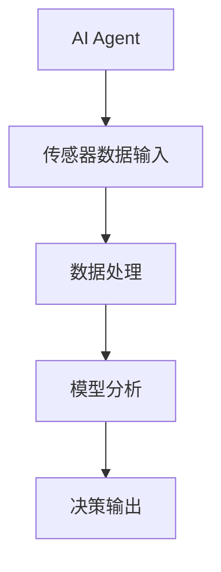
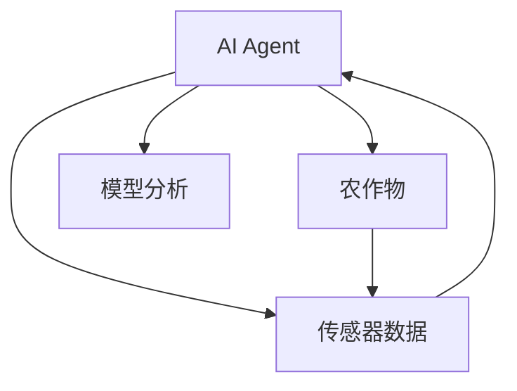
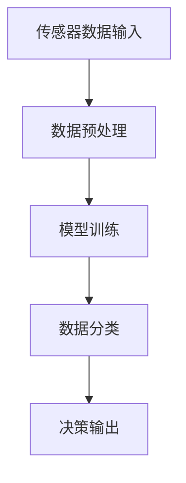

                 


# AI Agent在智能农作物生长监测中的实践

> 关键词：AI Agent，农作物生长监测，智能农业，机器学习，物联网

> 摘要：本文详细探讨了AI Agent在智能农作物生长监测中的应用实践。从问题背景、核心概念、算法原理、系统架构到项目实战，系统性地介绍了AI Agent如何通过感知、分析和决策技术，实现农作物生长的智能化监测与管理。文章结合理论与实践，为农业技术人员和AI开发者提供了深度的技术解读与实践指南。

---

## 第一章: 问题背景与描述

### 1.1 问题背景

随着全球人口的快速增长和耕地资源的有限性，农作物的高效种植和管理变得尤为重要。传统农业依赖人工经验进行作物管理，这种方式不仅效率低下，还容易受到天气、病虫害等不可控因素的影响。近年来，随着人工智能（AI）技术的快速发展，AI Agent（智能体）作为一种能够在复杂环境中自主感知、决策和执行的智能系统，逐渐被引入农业领域，为农作物生长监测提供了新的解决方案。

#### 1.1.1 农作物生长监测的重要性

农作物生长监测是农业管理的核心环节，它包括对作物生长状态、环境条件（如温度、湿度、光照等）以及病虫害的实时监控。通过监测数据，农民可以及时采取措施优化作物生长条件，从而提高产量和质量。然而，传统的人工监测方式效率低、成本高，且难以实现大规模覆盖。

#### 1.1.2 当前监测技术的局限性

目前，农作物生长监测主要依赖于传感器技术和简单的数据采集系统。这些系统能够采集基本的环境数据，但缺乏智能化的分析和决策能力。例如，当传感器检测到土壤湿度不足时，系统只能发出警报，而无法根据作物的生长阶段和天气条件给出具体的灌溉建议。此外，传统系统难以处理复杂多变的环境因素，如不同作物对光照和水分的需求差异。

#### 1.1.3 AI Agent技术的引入与优势

AI Agent是一种具备自主性、反应性和目标导向的智能系统。它能够通过传感器获取数据，结合历史信息和当前环境，自主决策并执行操作。在农作物生长监测中，AI Agent可以通过以下方式提升监测效率：

1. **实时感知**：AI Agent能够实时采集和分析环境数据，如土壤湿度、温度、光照强度等。
2. **智能决策**：基于机器学习模型，AI Agent可以预测作物生长状态，识别病虫害，并提出相应的管理建议。
3. **自主执行**：AI Agent可以与农业设备（如灌溉系统、无人机）联动，自动执行优化操作。

### 1.2 问题描述

AI Agent在农作物生长监测中的应用面临以下核心问题：

1. **数据多样性**：农作物生长涉及多源异构数据，如图像数据、环境传感器数据等，如何有效整合这些数据是关键。
2. **模型复杂性**：AI Agent需要处理非线性关系和复杂场景，如何构建高效的机器学习模型是技术难点。
3. **决策可靠性**：在复杂的农业环境中，AI Agent的决策必须准确可靠，避免误判导致的经济损失。

### 1.3 问题解决与边界

#### 1.3.1 AI Agent如何解决监测问题

AI Agent通过以下方式解决农作物生长监测中的问题：

1. **多源数据融合**：AI Agent能够整合来自传感器、图像识别和环境监测等多种数据源的信息，提供全面的监测能力。
2. **智能分析与预测**：基于机器学习算法，AI Agent可以分析历史数据，预测作物生长趋势，并识别潜在风险。
3. **自主决策与执行**：AI Agent能够根据分析结果，自主决策并触发相应的农业设备执行操作。

#### 1.3.2 解决方案的边界与外延

AI Agent的应用范围主要集中在农作物生长监测和管理，但其技术核心可以扩展到其他领域，如工业自动化、智能交通等。在农业领域，AI Agent的应用边界包括：

1. **数据采集范围**：AI Agent需要采集哪些数据？如何采集？
2. **决策范围**：AI Agent可以自主决策哪些操作？需要人工干预的场景有哪些？
3. **环境适应性**：AI Agent能否适应不同气候、土壤条件和作物类型？

#### 1.3.3 核心概念与系统架构

AI Agent在农作物生长监测中的核心概念包括：

1. **感知层**：通过传感器和图像识别技术获取环境数据。
2. **决策层**：基于机器学习模型进行分析和决策。
3. **执行层**：通过农业设备执行决策操作。

---

## 第二章: AI Agent的核心概念与联系

### 2.1 AI Agent的基本原理

AI Agent是一种具备自主性和目标导向的智能系统，其核心原理包括以下几点：

1. **自主性**：AI Agent能够在没有外部干预的情况下独立运行。
2. **反应性**：AI Agent能够实时感知环境变化并做出响应。
3. **目标导向**：AI Agent的所有行为都是为了实现预设的目标（如最大化作物产量）。

#### 2.1.1 AI Agent的定义与特征

AI Agent的定义与特征如下：

- **定义**：AI Agent是一种能够感知环境、自主决策并执行操作的智能系统。
- **特征**：
  1. 自主性：能够在没有外部干预的情况下运行。
  2. 反应性：能够实时感知环境变化并做出响应。
  3. 目标导向：所有行为都围绕实现预设目标展开。
  4. 学习能力：能够通过数据和经验不断优化自身性能。

#### 2.1.2 AI Agent与传统自动化的区别

AI Agent与传统自动化系统的主要区别如下：

| 特性               | AI Agent                     | 传统自动化系统               |
|--------------------|------------------------------|-----------------------------|
| 智能性             | 高                           | 低                         |
| 自主性             | 高                           | 低                         |
| 适应性             | 高                           | 低                         |
| 决策能力           | 强                           | 弱                         |

#### 2.1.3 AI Agent与传感器数据的关系

AI Agent与传感器数据的关系可以用以下Mermaid图表示：



### 2.2 核心概念对比表

AI Agent与其他技术的核心概念对比如下：

| 概念       | AI Agent                     | 传统AI技术                  | 物联网设备                |
|------------|------------------------------|-----------------------------|---------------------------|
| 自主性     | 高                           | 中                         | 低                       |
| 反应性     | 高                           | 中                         | 低                       |
| 学习能力   | 高                           | 中                         | 无                       |
| 适应性     | 高                           | 中                         | 低                       |

### 2.3 实体关系图

AI Agent与农作物监测系统的实体关系图如下：



---

## 第三章: 算法原理与数学模型

### 3.1 算法流程图

AI Agent的算法流程如下：



### 3.2 算法实现

#### 3.2.1 Python源代码实现

```python
# 示例代码：AI Agent的基本算法实现
import numpy as np
from sklearn import svm

# 数据预处理
def preprocess(data):
    return data / 255.0

# 模型训练
def train_model(X, y):
    clf = svm.SVC()
    clf.fit(X, y)
    return clf

# 决策函数
def decide(model, new_data):
    return model.predict(new_data)
```

#### 3.2.2 算法原理的数学模型

AI Agent的算法原理可以用以下数学模型表示：

$$
y = f(x) = \text{SVM}(x)
$$

其中，$x$是输入数据，$y$是输出决策结果。

---

## 第四章: 系统分析与架构设计方案

### 4.1 系统架构设计

AI Agent在农作物生长监测中的系统架构如下：


### 4.2 系统功能设计

#### 4.2.1 功能模块

系统功能模块如下：

1. **数据采集模块**：负责采集环境数据。
2. **数据处理模块**：对采集的数据进行预处理。
3. **模型分析模块**：对数据进行分析和分类。
4. **决策执行模块**：根据分析结果执行相应的操作。

---

## 第五章: 项目实战

### 5.1 环境安装

要运行AI Agent系统，需要安装以下环境：

- Python 3.8+
- NumPy
- Scikit-learn
- Mermaid

### 5.2 核心代码实现

以下是核心代码实现：

```python
import numpy as np
from sklearn import svm

# 数据预处理
def preprocess(data):
    return data / 255.0

# 模型训练
def train_model(X, y):
    clf = svm.SVC()
    clf.fit(X, y)
    return clf

# 决策函数
def decide(model, new_data):
    return model.predict(new_data)
```

### 5.3 实际案例分析

以下是实际案例分析：

假设我们有一个葡萄园，需要监测土壤湿度、温度和光照强度。AI Agent可以通过传感器采集这些数据，并通过机器学习模型预测葡萄的生长状态。

---

## 第六章: 总结与展望

### 6.1 总结

本文详细介绍了AI Agent在智能农作物生长监测中的应用实践。通过结合AI Agent的核心概念、算法原理和系统架构，展示了如何利用AI技术提升农业生产的效率和质量。

### 6.2 展望

未来，AI Agent在农业领域的应用将更加广泛。随着深度学习和物联网技术的不断发展，AI Agent将具备更强的感知、分析和决策能力，为农业智能化提供更有力的技术支持。

---

以上是《AI Agent在智能农作物生长监测中的实践》的完整目录和内容框架。

