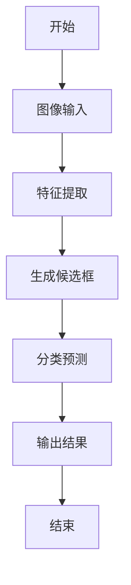
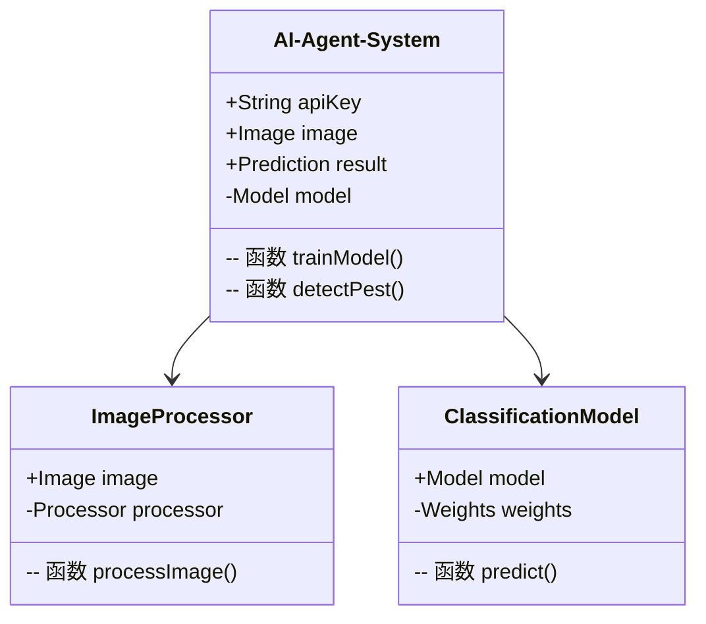
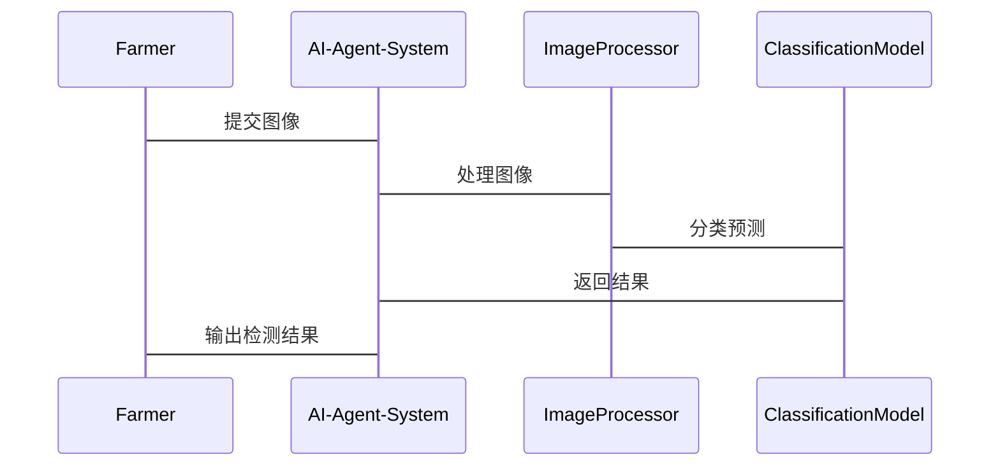

                 


# AI Agent在智能农作物病虫害检测中的实践

> 关键词：AI Agent、农作物病虫害检测、人工智能、图像识别、深度学习、农业智能化、精准农业

> 摘要：本文探讨了AI Agent在农作物病虫害检测中的应用，分析了其技术原理、系统架构及实际案例，展示了如何利用AI技术提升农业生产力和精准性。

---

## 第1章: AI Agent与农作物病虫害检测的背景介绍

### 1.1 AI Agent的基本概念
#### 1.1.1 什么是AI Agent
AI Agent（人工智能代理）是一种智能系统，能够感知环境、自主决策并执行任务，旨在帮助用户完成特定目标。它可以是一个软件程序，也可以是物理设备，具备学习和自适应能力。

#### 1.1.2 AI Agent的核心特征
- **自主性**：能够在没有外部干预的情况下运行。
- **反应性**：能实时感知环境并做出反应。
- **目标导向**：专注于完成特定任务。
- **学习能力**：通过数据和经验提升性能。

#### 1.1.3 AI Agent在农业中的应用潜力
AI Agent在农业中的潜力巨大，特别是在病虫害检测、作物监测和资源管理等方面，能够提高效率和准确性。

### 1.2 农作物病虫害检测的重要性
#### 1.2.1 病虫害对农业产量的影响
病虫害可能导致作物减产、品质下降，严重时甚至导致绝收，造成巨大经济损失。

#### 1.2.2 传统病虫害检测方法的局限性
传统方法依赖人工检查，耗时且效率低，容易漏检或误判，特别是在大规模种植的情况下。

#### 1.2.3 现代化病虫害检测的需求
随着农业现代化，精准、高效的病虫害检测成为迫切需求，AI技术为此提供了解决方案。

### 1.3 AI Agent在病虫害检测中的应用优势
#### 1.3.1 提高检测效率
AI Agent能够快速处理大量图像数据，显著提升检测速度。

#### 1.3.2 增强检测准确性
通过深度学习算法，AI Agent能够识别细微的病虫害特征，准确性远超人工检测。

#### 1.3.3 实现精准农业的目标
AI Agent帮助农民实现精准施药和管理，减少资源浪费，降低环境污染。

### 1.4 本章小结
本章介绍了AI Agent的基本概念及其在农业中的潜力，强调了病虫害检测的重要性，并突出了AI Agent的应用优势。

---

## 第2章: AI Agent与农作物病虫害检测的核心概念与联系

### 2.1 AI Agent的基本原理
#### 2.1.1 AI Agent的工作流程
AI Agent通过感知环境、分析数据、制定策略并执行操作来完成任务。

#### 2.1.2 AI Agent的感知与决策机制
AI Agent利用传感器或图像数据进行感知，基于数据进行决策，通常涉及机器学习模型。

#### 2.1.3 AI Agent的自适应能力
AI Agent能够根据环境变化调整策略，通过反馈机制不断优化性能。

### 2.2 农作物病虫害检测的基本原理
#### 2.2.1 病虫害检测的主要步骤
1. 图像采集：使用无人机或摄像头获取农田图像。
2. 图像处理：通过算法提取病虫害特征。
3. 分类识别：利用模型判断病虫害类型和严重程度。

#### 2.2.2 常用的病虫害检测方法
- **图像分析**：基于颜色、纹理等特征识别病虫害。
- **模式识别**：利用统计学习方法识别病虫害。
- **深度学习**：使用CNN等模型进行目标检测。

#### 2.2.3 数字图像处理技术在病虫害检测中的应用
数字图像处理技术如边缘检测、阈值分割等，帮助提取病虫害特征。

### 2.3 AI Agent与农作物病虫害检测的结合
#### 2.3.1 AI Agent在图像识别中的应用
AI Agent通过图像识别技术快速检测病虫害，帮助农民及时采取措施。

#### 2.3.2 AI Agent在数据处理中的优势
AI Agent能够高效处理大量数据，提供实时反馈，帮助优化农业管理。

#### 2.3.3 AI Agent在决策支持中的作用
AI Agent基于检测结果，提供精准的施药建议和种植指导，实现精准农业。

### 2.4 核心概念的对比分析
#### 2.4.1 AI Agent与传统算法的对比
| 特性       | AI Agent                  | 传统算法                |
|------------|---------------------------|-------------------------|
| 自适应性    | 高                        | 低                      |
| 处理速度    | 快                        | 中                      |
| 精确性      | 高                        | 中                      |

#### 2.4.2 农作物病虫害检测中的关键属性
- **实时性**：快速检测以应对病虫害爆发。
- **准确性**：确保正确识别病虫害类型。
- **鲁棒性**：适应不同光照、天气条件。

#### 2.4.3 实体关系图的ER架构
使用Mermaid绘制ER图，展示AI Agent与病虫害检测系统的关系。

```mermaid
er
    actor Farmer
    actor SystemOperator
    actor PestDisease
    system AI-Agent-System
    system ImageProcessing
    system ClassificationModel
    relation "monitors" Farmer --> AI-Agent-System
    relation "processes" AI-Agent-System --> ImageProcessing
    relation "applies" AI-Agent-System --> ClassificationModel
    relation "outputs" AI-Agent-System --> PestDisease
```

### 2.5 本章小结
本章分析了AI Agent和病虫害检测的核心概念，通过对比和ER图展示了它们的联系，为后续实现奠定了基础。

---

## 第3章: AI Agent在农作物病虫害检测中的算法原理

### 3.1 目标检测算法概述
#### 3.1.1 目标检测的基本概念
目标检测旨在识别图像中的目标并定位其位置。

#### 3.1.2 常见的目标检测算法
- **Faster R-CNN**：基于区域建议的检测方法。
- **YOLO**：单-shot检测器，速度快。

#### 3.1.3 基于深度学习的目标检测模型
使用CNN提取特征，通过区域建议网络生成候选框，最终预测目标类别和位置。

### 3.2 病虫害图像分类算法
#### 3.2.1 图像分类的基本原理
图像分类是将图像归类到预定义类别中的过程。

#### 3.2.2 常用的图像分类算法
- **SVM**：支持向量机，适用于中小规模数据。
- **CNN**：卷积神经网络，适合大规模图像数据。

#### 3.2.3 基于卷积神经网络的图像分类模型
构建CNN模型，训练病虫害图像数据，实现高精度分类。

### 3.3 AI Agent的算法实现
#### 3.3.1 算法流程图
使用Mermaid绘制目标检测算法流程图。



#### 3.3.2 算法实现的代码示例
以下是一个简单的图像分类模型实现代码：

```python
import tensorflow as tf
from tensorflow.keras import layers

model = tf.keras.Sequential([
    layers.Conv2D(32, (3,3), activation='relu', input_shape=(224, 224, 3)),
    layers.MaxPooling2D((2,2)),
    layers.Conv2D(64, (3,3), activation='relu'),
    layers.MaxPooling2D((2,2)),
    layers.Flatten(),
    layers.Dense(128, activation='relu'),
    layers.Dense(num_classes, activation='softmax')
])

model.compile(optimizer='adam', loss='sparse_categorical_crossentropy', metrics=['accuracy'])
model.fit(train_data, epochs=10)
```

#### 3.3.3 算法的数学模型与公式
目标检测中常用的损失函数为：

$$ \text{损失} = \text{分类损失} + \lambda \times \text{定位损失} $$

其中，$\lambda$是平衡参数。

### 3.4 算法的优化与改进
#### 3.4.1 数据增强
通过旋转、翻转、缩放等技术增加训练数据多样性，提升模型鲁棒性。

#### 3.4.2 模型调优
调整学习率、批量大小等超参数，优化模型性能。

### 3.5 本章小结
本章详细讲解了AI Agent在病虫害检测中的算法原理，通过流程图和代码示例展示了实现过程，并分析了优化方法。

---

## 第4章: 系统分析与架构设计方案

### 4.1 项目介绍
本项目旨在开发一个基于AI Agent的病虫害检测系统，帮助农民实现精准农业。

### 4.2 系统功能设计
使用Mermaid绘制类图展示系统功能模块。



### 4.3 系统架构设计
使用Mermaid绘制系统架构图。


### 4.4 系统接口设计
系统接口包括图像输入接口、模型调用接口和结果输出接口，确保各模块协同工作。

### 4.5 系统交互流程
使用Mermaid绘制交互流程图。



### 4.6 本章小结
本章详细设计了系统的架构和交互流程，确保各模块协同工作，为后续实现奠定基础。

---

## 第5章: 项目实战

### 5.1 环境安装
安装Python、TensorFlow、OpenCV等必要的库和工具。

### 5.2 核心代码实现
实现AI Agent的图像处理和分类功能，包括图像采集、预处理、模型训练和预测。

### 5.3 案例分析
通过实际案例展示AI Agent在病虫害检测中的应用效果，分析其优势和局限性。

### 5.4 项目小结
总结项目实现过程中的经验和教训，提出改进建议。

---

## 第6章: 总结与展望

### 6.1 本章总结
回顾文章内容，强调AI Agent在病虫害检测中的重要性和应用前景。

### 6.2 未来展望
展望AI Agent在农业中的发展趋势，包括更高效的算法、更广泛的应用场景以及与物联网的深度融合。

### 6.3 最佳实践 Tips
- 数据质量是关键，确保数据多样化和代表性。
- 模型部署要考虑实际环境，确保运行效率。
- 定期更新模型，适应新的病虫害特征。

### 6.4 本章小结
本章总结了全文内容，并对未来研究方向提出了展望。

---

通过以上结构，文章详细探讨了AI Agent在智能农作物病虫害检测中的应用，从理论到实践，为读者提供了全面的指导和参考。

