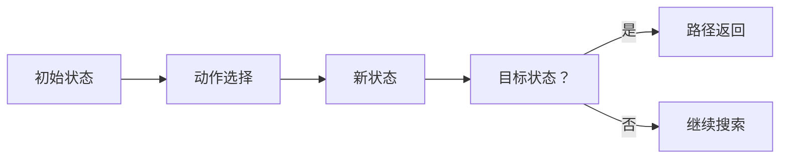
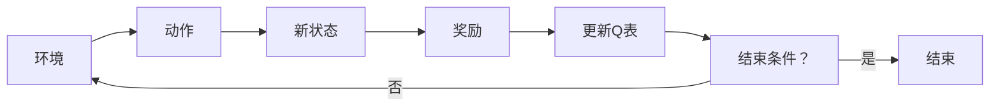
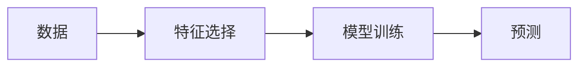
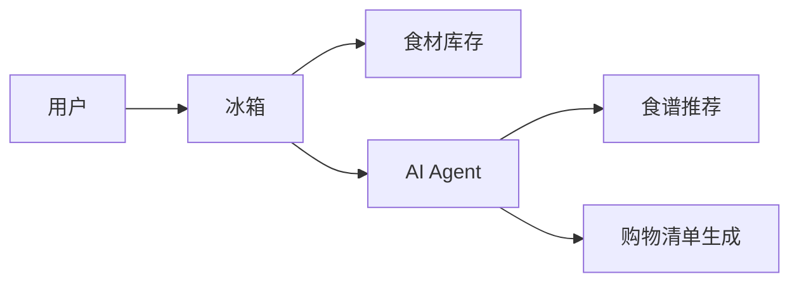
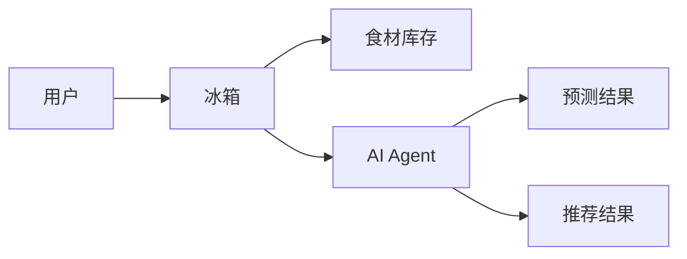

                 


# 第3章: AI Agent的算法原理

## 3.1 基于搜索的AI Agent算法

### 3.1.1 广度优先搜索(BFS)
广度优先搜索是一种常见的算法，用于解决食材管理中的最短路径问题。BFS的核心思想是逐层遍历状态空间，找到最优解。

#### 算法步骤
1. 初始化队列，将起始状态加入队列。
2. 取出队列中的第一个元素，检查是否为目标状态。
3. 如果是目标状态，返回路径。
4. 如果不是，将所有可能的动作应用到当前状态，生成新的状态，并将这些新状态加入队列。

#### 代码实现
```python
from collections import deque

def bfs(initial_state, goal_state):
    queue = deque()
    queue.append(initial_state)
    visited = set()
    visited.add(initial_state)

    while queue:
        current_state = queue.popleft()
        if current_state == goal_state:
            return True
        for action in get_possible_actions(current_state):
            next_state = apply_action(current_state, action)
            if next_state not in visited:
                visited.add(next_state)
                queue.append(next_state)
    return False
```

### 3.1.2 深度优先搜索(DFS)
深度优先搜索适合解决食材管理中的复杂问题，如食谱推荐。DFS通过不断深入探索，找到可能的解决方案。

#### 算法步骤
1. 从初始状态开始，进入递归函数。
2. 检查当前状态是否为目标状态。
3. 如果不是，尝试所有可能的动作，递归进入每个可能的状态。
4. 如果找到目标状态，返回成功；否则，回溯。

#### 代码实现
```python
def dfs(current_state, visited, goal_state):
    if current_state == goal_state:
        return True
    for action in get_possible_actions(current_state):
        next_state = apply_action(current_state, action)
        if next_state not in visited:
            visited.add(next_state)
            if dfs(next_state, visited, goal_state):
                return True
    return False
```

### 3.1.3 A*算法在食材管理中的应用
A*算法结合了BFS和DFS的优点，通过优先级队列优化搜索过程，常用于路径规划和食谱推荐。

#### 算法步骤
1. 初始化优先级队列，将初始状态加入队列。
2. 取出队列中优先级最高的元素，检查是否为目标状态。
3. 如果是目标状态，返回路径。
4. 如果不是，生成所有可能的动作，计算优先级，并将新状态加入队列。

#### 代码实现
```python
import heapq

def a_star(initial_state, goal_state, heuristic):
    visited = set()
    heap = []
    heapq.heappush(heap, (0, initial_state, []))
    
    while heap:
        current_cost, current_state, path = heapq.heappop(heap)
        if current_state == goal_state:
            return path + [current_state]
        if current_state in visited:
            continue
        visited.add(current_state)
        for action in get_possible_actions(current_state):
            next_state = apply_action(current_state, action)
            new_path = path + [current_state, action]
            cost = current_cost + heuristic(next_state, goal_state)
            heapq.heappush(heap, (cost, next_state, new_path))
    return None
```

### 3.1.4 算法流程图


## 3.2 基于强化学习的AI Agent算法

### 3.2.1 Q-learning算法
Q-learning是一种经典的强化学习算法，用于解决食材管理中的动态问题，如库存优化。

#### 算法步骤
1. 初始化Q表，所有动作的初始值为0。
2. 在环境中执行动作，观察状态和奖励。
3. 更新Q表，使用贝尔曼方程。
4. 重复步骤2和3，直到收敛。

#### 代码实现
```python
import numpy as np

class QLearning:
    def __init__(self, state_space, action_space, learning_rate=0.1, gamma=0.9):
        self.state_space = state_space
        self.action_space = action_space
        self.learning_rate = learning_rate
        self.gamma = gamma
        self.Q = np.zeros((state_space, action_space))

    def choose_action(self, state):
        if np.random.random() < 0.9:  # 探索与利用策略
            return np.argmax(self.Q[state])
        else:
            return np.random.randint(self.action_space)

    def update_Q(self, state, action, reward, next_state):
        self.Q[state][action] = self.Q[state][action] + self.learning_rate * (reward + self.gamma * np.max(self.Q[next_state]) - self.Q[state][action])

    def get_Q(self):
        return self.Q
```

### 3.2.2 DQN算法
深度Q网络(DQN)通过神经网络近似Q值函数，解决高维状态空间的食材管理问题。

#### 算法步骤
1. 构建神经网络，用于近似Q值函数。
2. 通过环境交互，收集经验。
3. 使用经验回放，随机抽取样本训练网络。
4. 定期更新目标网络。

#### 代码实现
```python
import torch
import torch.nn as nn
import torch.optim as optim

class DQN(nn.Module):
    def __init__(self, input_dim, output_dim):
        super(DQN, self).__init__()
        self.fc = nn.Linear(input_dim, output_dim)
        self.relu = nn.ReLU()
        self.softmax = nn.Softmax(dim=1)

    def forward(self, x):
        x = self.fc(x)
        x = self.relu(x)
        x = self.softmax(x)
        return x

# 初始化DQN
input_dim = 10  # 状态空间维度
output_dim = 5   # 动作空间维度
dqn = DQN(input_dim, output_dim)
optimizer = optim.Adam(dqn.parameters(), lr=0.001)
criterion = nn.MSELoss()
```

### 3.2.3 算法流程图


## 3.3 基于机器学习的食材管理模型

### 3.3.1 决策树模型
决策树用于分类和回归，适合食材需求预测和保质期监测。

#### 算法步骤
1. 数据预处理，特征选择。
2. 构建决策树，训练模型。
3. 使用模型进行预测。

#### 代码实现
```python
from sklearn.tree import DecisionTreeClassifier

# 数据预处理
data = [...]  # 训练数据
labels = [...]  # 标签

# 构建决策树
clf = DecisionTreeClassifier()
clf.fit(data, labels)

# 预测
new_data = [...]  # 新数据
predicted_labels = clf.predict(new_data)
```

### 3.3.2 随机森林模型
随机森林通过集成学习提高准确率，适用于食材分类和推荐。

#### 代码实现
```python
from sklearn.ensemble import RandomForestClassifier

# 构建随机森林
rf = RandomForestClassifier(n_estimators=100)
rf.fit(data, labels)

# 预测
new_data = [...]  # 新数据
predicted_labels = rf.predict(new_data)
```

### 3.3.3 算法流程图


## 3.4 本章小结
本章详细讲解了AI Agent在食材管理中的算法原理，包括基于搜索的BFS、DFS、A*算法，基于强化学习的Q-learning和DQN算法，以及基于机器学习的决策树和随机森林模型。这些算法为食材管理提供了多种解决方案，适用于不同场景和复杂度。

---

# 第4章: 食材管理的数学模型与公式

## 4.1 基于线性回归的食材需求预测

### 4.1.1 线性回归模型
线性回归用于预测食材需求量，公式如下：
$$ y = \beta_0 + \beta_1 x_1 + \beta_2 x_2 + \cdots + \beta_n x_n + \epsilon $$
其中，$y$是预测的需求量，$x_i$是影响需求的特征，$\beta_i$是回归系数，$\epsilon$是误差项。

### 4.1.2 正则化方法
为防止过拟合，使用Lasso回归（L1正则化）或Ridge回归（L2正则化）：
$$ \text{Lasso: } \sum \beta_i $$
$$ \text{Ridge: } \sum \beta_i^2 $$

## 4.2 基于马尔可夫决策过程的库存优化

### 4.2.1 状态转移概率
马尔可夫决策过程定义了当前状态、动作、下一状态和奖励的关系：
$$ P(s' | s, a) $$
其中，$s$是当前状态，$a$是动作，$s'$是下一状态。

### 4.2.2 Q-learning算法公式
Q-learning的目标是最优化Q值函数：
$$ Q(s, a) = Q(s, a) + \alpha [r + \gamma \max Q(s', a') - Q(s, a)] $$
其中，$\alpha$是学习率，$\gamma$是折扣因子。

## 4.3 本章小结
本章通过数学公式详细推导了食材管理中的预测模型和决策过程，为AI Agent的实现提供了理论基础。

---

# 第5章: 食材管理系统的分析与架构设计

## 5.1 系统功能设计

### 5.1.1 功能模块划分
食材管理系统主要功能包括：
- 食材库存管理
- 食材保质期监测
- 食材需求预测与推荐
- 购物清单生成

### 5.1.2 功能模块接口
- `get_inventory()`：获取当前库存
- `predict_demand()`：预测食材需求
- `generate_shopping_list()`：生成购物清单

## 5.2 系统架构设计

### 5.2.1 总体架构图


### 5.2.2 数据流图


## 5.3 本章小结
本章分析了食材管理系统的功能和架构，为后续的系统实现奠定了基础。

---

# 第6章: 项目实战：AI Agent的实现

## 6.1 环境搭建

### 6.1.1 安装Python环境
- 使用Anaconda或虚拟环境
- 安装必要的库：numpy, pandas, scikit-learn, matplotlib, pytorch

### 6.1.2 数据准备
- 数据来源：本地数据库、API接口
- 数据格式：CSV、JSON

## 6.2 核心功能实现

### 6.2.1 食材库存管理
```python
def manage_inventory(current_inventory, predictions):
    # 预测需求
    predicted_demand = predictions
    # 补充库存
    for item in predicted_demand:
        if current_inventory[item] < predicted_demand[item]:
            # 生成购买请求
            shopping_list.append(item)
```

### 6.2.2 食材保质期监测
```python
def monitor_expiration(inventory):
    for item in inventory:
        if inventory[item]['expiring']:
            # 提醒用户
            print(f"提醒：{item}即将过期，请及时使用。")
```

### 6.2.3 食材需求预测与推荐
```python
def predict_demand(data):
    # 使用随机森林模型进行预测
    model = RandomForestRegressor()
    model.fit(data, targets)
    predictions = model.predict(new_data)
    return predictions
```

## 6.3 项目总结
本章通过实际案例展示了AI Agent在智能冰箱中的具体实现，从环境搭建到功能实现，详细讲解了每个步骤的实现细节。

---

# 第7章: 系统优化与扩展

## 7.1 算法优化

### 7.1.1 模型优化
- 参数调优：网格搜索、随机搜索
- 模型集成：投票集成、堆叠集成

### 7.1.2 性能优化
- 并行计算：使用多线程、多进程
- 优化算法：梯度下降优化器（Adam、SGD）

## 7.2 系统扩展

### 7.2.1 多设备协同
- 智能家居集成：与智能灶具、智能厨具联动
- 数据共享：与其他设备共享食材数据

### 7.2.2 数据安全
- 数据加密：AES、RSA
- 权限管理：基于角色的访问控制

## 7.3 用户体验优化
- 个性化推荐：基于用户偏好
- 可视化界面：图形化展示食材库存、保质期

## 7.4 本章小结
本章讨论了如何优化和扩展AI Agent在智能冰箱中的应用，提出了多种改进方法，确保系统性能和用户体验。

---

# 第8章: 总结与展望

## 8.1 总结
本章总结了AI Agent在智能冰箱中的应用，从背景、算法、系统设计到项目实现，全面回顾了食材管理的核心内容。

## 8.2 展望
随着AI技术的不断发展，未来AI Agent在智能冰箱中的应用将更加智能化和个性化，可能出现的功能包括：
- 更精准的食材需求预测
- 更智能的库存管理
- 更人性化的用户体验

## 8.3 最佳实践Tips
- 数据隐私保护至关重要
- 算法可解释性需要重视
- 系统设计要模块化、扩展性好

## 8.4 本章小结
本章展望了未来的发展方向，并给出了实际应用中的注意事项。

---

# 关键词
AI Agent, 智能冰箱, 食材管理, 算法原理, 系统设计

# 摘要
本文详细探讨了AI Agent在智能冰箱中的食材管理应用，从背景、核心概念、算法原理到系统设计和项目实现，全面解析了AI Agent如何优化食材管理。通过具体案例分析和代码实现，展示了AI Agent在智能冰箱中的实际应用价值，并展望了未来的发展方向。

---

# 结语
AI Agent在智能冰箱中的食材管理不仅提升了用户体验，也推动了智能家居技术的发展。随着技术的不断进步，AI Agent将发挥更大的作用，为智能家电带来更多的可能性。

