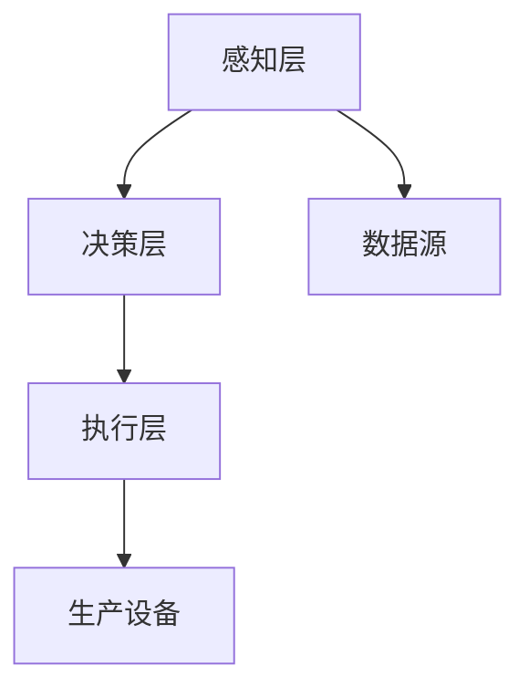
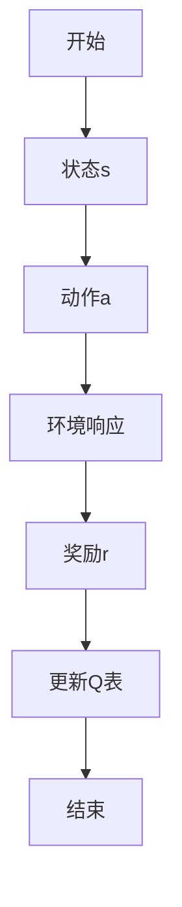
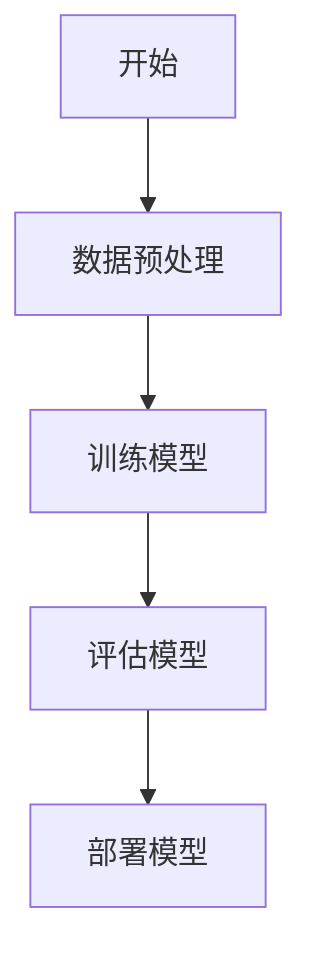
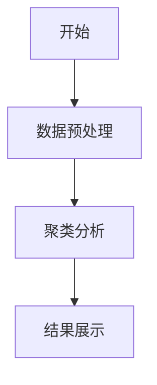

                 


# AI Agent在智能制造中的实践案例

## 关键词：AI Agent，智能制造，工业互联网，数字化转型，人工智能算法，强化学习，工业4.0

## 摘要：  
本文将详细探讨AI Agent在智能制造中的应用，从背景介绍、核心概念、算法原理、系统架构到实际案例，逐步分析AI Agent如何推动智能制造的智能化转型。文章结合理论与实践，通过具体项目案例分析，展示AI Agent在工业设备故障预测、生产优化等场景中的实际应用，并总结最佳实践和未来发展方向。

---

# 第一部分: AI Agent与智能制造的背景介绍

## 第1章: 制造业的数字化与智能化转型

### 1.1 制造业的数字化转型  
制造业的数字化转型是指通过信息技术（如物联网、大数据、云计算等）将传统制造业的生产、管理、服务等环节数字化，从而提高效率、降低成本、增强灵活性。  

#### 1.1.1 数字化转型的定义与目标  
- **定义**：数字化转型是利用数字技术改变传统业务模式、流程、文化与决策方式的过程。  
- **目标**：提高生产效率、优化资源利用率、增强企业竞争力。  

#### 1.1.2 制造业数字化转型的驱动力  
- 技术驱动：物联网（IoT）、人工智能（AI）、大数据等技术的发展推动了制造业的数字化转型。  
- 市场驱动：消费者需求多样化、个性化，要求生产更加灵活高效。  
- 成本驱动：企业希望通过数字化手段降低成本，提高利润。  

#### 1.1.3 数字化转型对智能制造的影响  
- 数字化转型为智能制造奠定了基础，使得生产过程更加智能化、自动化。  
- 数字化转型通过数据的实时采集和分析，优化了生产流程，提高了产品质量。  

### 1.2 智能制造的定义与特点  
#### 1.2.1 智能制造的定义  
智能制造是一种基于信息技术和自动化技术的制造模式，通过数据的实时分析和决策，实现生产过程的智能化和优化。  

#### 1.2.2 智能制造的核心特点  
- **智能化**：通过AI、机器学习等技术实现自主决策和优化。  
- **自动化**：生产设备能够自动运行和调整，减少人工干预。  
- **数据驱动**：基于实时数据进行分析和决策。  

#### 1.2.3 智能制造与传统制造的区别  
- **传统制造**：依赖人工操作，生产效率低，灵活性差。  
- **智能制造**：通过数字化和自动化技术，实现高效、灵活、精准的生产。  

### 1.3 AI Agent在智能制造中的作用  
#### 1.3.1 AI Agent的定义与特点  
- **定义**：AI Agent是一种智能代理，能够感知环境、自主决策并执行任务。  
- **特点**：自主性、反应性、目标导向、学习能力。  

#### 1.3.2 AI Agent在智能制造中的应用场景  
- **设备监控与故障预测**：通过实时监测设备状态，预测潜在故障，减少停机时间。  
- **生产优化**：通过分析生产数据，优化生产流程，降低成本。  
- **质量控制**：通过AI算法检测产品质量，提高产品一致性。  

#### 1.3.3 AI Agent与智能制造的结合优势  
- **高效性**：AI Agent能够快速分析数据并做出决策，提高生产效率。  
- **准确性**：通过数据驱动的决策，减少人为错误。  
- **灵活性**：AI Agent能够适应不同的生产场景，灵活调整生产策略。  

### 1.4 本章小结  
本章介绍了制造业的数字化转型和智能制造的定义与特点，并重点探讨了AI Agent在智能制造中的作用和优势。

---

# 第二部分: AI Agent的核心概念与原理

## 第2章: AI Agent的核心概念与原理  

### 2.1 AI Agent的基本原理  
#### 2.1.1 AI Agent的定义与分类  
- **定义**：AI Agent是一种智能实体，能够感知环境、自主决策并执行任务。  
- **分类**：  
  - **简单反射型Agent**：基于当前感知做出反应，无内部状态。  
  - **基于模型的反射型Agent**：具有内部状态，能够根据环境信息进行推理。  
  - **目标驱动型Agent**：基于目标驱动行为，优化决策。  
  - **效用驱动型Agent**：通过最大化效用函数实现目标。  

#### 2.1.2 AI Agent的核心要素  
- **感知**：通过传感器或数据源获取环境信息。  
- **决策**：基于感知信息，通过算法做出决策。  
- **执行**：根据决策执行具体任务。  

#### 2.1.3 AI Agent的决策机制  
- **基于规则的决策**：通过预定义规则进行决策。  
- **基于模型的决策**：通过数学模型进行推理和决策。  
- **基于机器学习的决策**：通过训练模型进行预测和决策。  

### 2.2 AI Agent与智能制造的结合  
#### 2.2.1 AI Agent在智能制造中的角色  
- **设备监控与管理**：实时监控设备状态，预测故障，优化设备利用率。  
- **生产优化**：通过分析生产数据，优化生产计划和资源分配。  
- **质量控制**：通过AI算法检测产品质量，提高产品一致性。  

#### 2.2.2 AI Agent与工业互联网的关系  
- **工业互联网**：通过互联网连接生产设备、传感器和数据源，实现数据的实时传输和分析。  
- **AI Agent的作用**：通过工业互联网获取数据，进行分析和决策，优化生产过程。  

#### 2.2.3 AI Agent在智能制造中的价值  
- **提高效率**：通过自动化决策减少人工干预，提高生产效率。  
- **降低成本**：通过优化资源利用率降低成本。  
- **提高质量**：通过实时监测和分析，提高产品质量。  

### 2.3 AI Agent的算法原理  
#### 2.3.1 基于强化学习的AI Agent  
- **强化学习**：通过试错学习，最大化累积奖励。  
- **Q-learning算法**：通过状态-动作-奖励-下一状态（SARSA）更新Q值。  
- **数学模型**：  
  $$ Q(s, a) = Q(s, a) + \alpha (r + \gamma \max Q(s', a') - Q(s, a)) $$  
  其中，$\alpha$是学习率，$\gamma$是折扣因子。  

#### 2.3.2 基于监督学习的AI Agent  
- **监督学习**：通过训练数据学习输入-输出映射关系。  
- **线性回归算法**：通过最小化均方误差优化模型参数。  
- **数学模型**：  
  $$ y = \theta x + b $$  
  其中，$\theta$是权重，$b$是偏置。  

#### 2.3.3 基于无监督学习的AI Agent  
- **无监督学习**：通过数据内在结构进行聚类或降维。  
- **K-means算法**：通过最小化簇内平方和，将数据分为K个簇。  
- **数学模型**：  
  $$ \text{目标函数} = \sum_{i=1}^{K} \sum_{j=1}^{N_i} (x_j - c_i)^2 $$  
  其中，$K$是簇的数量，$N_i$是第$i$个簇的数据点数量。  

### 2.4 本章小结  
本章详细讲解了AI Agent的核心概念与原理，并探讨了AI Agent在智能制造中的应用场景和价值。

---

# 第三部分: AI Agent在智能制造中的系统架构与算法实现

## 第3章: AI Agent的系统架构与算法实现  

### 3.1 系统架构设计  
#### 3.1.1 系统架构介绍  
- **感知层**：通过传感器和数据采集设备获取生产环境数据。  
- **决策层**：通过AI算法对数据进行分析和决策。  
- **执行层**：根据决策执行具体任务。  

#### 3.1.2 系统功能设计  
- **设备监控**：实时监控设备状态，预测故障。  
- **生产优化**：优化生产计划和资源分配。  
- **质量控制**：通过AI算法检测产品质量。  

#### 3.1.3 系统架构图（Mermaid）  



### 3.2 算法实现  
#### 3.2.1 强化学习算法实现  
- **算法流程图（Mermaid）**  



- **Python代码示例**  

```python
import numpy as np

class AI_Agent:
    def __init__(self, state_space, action_space):
        self.state_space = state_space
        self.action_space = action_space
        self.Q = np.zeros((state_space, action_space))
    
    def take_action(self, state):
        # 选择动作
        epsilon = 0.1
        if np.random.random() < epsilon:
            action = np.random.randint(self.action_space)
        else:
            action = np.argmax(self.Q[state, :])
        return action
    
    def update_Q(self, state, action, reward, next_state):
        # 更新Q值
        alpha = 0.1
        gamma = 0.9
        self.Q[state, action] += alpha * (reward + gamma * np.max(self.Q[next_state, :]) - self.Q[state, action])
```

#### 3.2.2 监督学习算法实现  
- **算法流程图（Mermaid）**  



- **Python代码示例**  

```python
import numpy as np
from sklearn.linear_model import LinearRegression

class AI_Agent:
    def __init__(self):
        self.model = LinearRegression()
    
    def train(self, X, y):
        self.model.fit(X, y)
    
    def predict(self, X):
        return self.model.predict(X)
```

#### 3.2.3 无监督学习算法实现  
- **算法流程图（Mermaid）**  



- **Python代码示例**  

```python
from sklearn.cluster import KMeans

class AI_Agent:
    def __init__(self):
        self.model = KMeans(n_clusters=3)
    
    def train(self, X):
        self.model.fit(X)
    
    def predict(self, X):
        return self.model.predict(X)
```

### 3.3 本章小结  
本章详细讲解了AI Agent的系统架构设计，并通过强化学习、监督学习和无监督学习算法的实现，展示了AI Agent在智能制造中的实际应用。

---

# 第四部分: AI Agent在智能制造中的项目实战

## 第4章: AI Agent的项目实战  

### 4.1 项目背景与目标  
#### 4.1.1 项目背景  
- **背景介绍**：某制造企业希望通过AI Agent实现设备故障预测，减少停机时间，提高生产效率。  
- **项目目标**：开发一个基于AI Agent的设备故障预测系统。  

### 4.2 项目实现  
#### 4.2.1 环境搭建  
- **硬件环境**：高性能服务器、传感器设备、生产设备。  
- **软件环境**：Python 3.8+, TensorFlow 2.0+, scikit-learn 0.24+.  

#### 4.2.2 数据收集与预处理  
- **数据收集**：通过传感器采集设备运行数据，包括温度、振动、压力等。  
- **数据预处理**：数据清洗、特征提取、数据标准化。  

#### 4.2.3 模型训练与优化  
- **模型选择**：选择适合的机器学习算法（如随机森林、XGBoost）。  
- **模型训练**：通过训练数据训练模型，优化模型参数。  
- **模型评估**：通过测试数据评估模型性能，调整模型参数。  

#### 4.2.4 系统部署与测试  
- **系统部署**：将模型部署到生产环境中，实时监控设备状态。  
- **系统测试**：通过实际运行测试模型性能，优化系统。  

### 4.3 项目小结  
本章通过一个具体的设备故障预测项目，展示了AI Agent在智能制造中的实际应用，并详细描述了项目的实现过程和注意事项。

---

# 第五部分: AI Agent在智能制造中的最佳实践

## 第5章: 最佳实践与总结  

### 5.1 最佳实践  
#### 5.1.1 数据质量管理  
- 数据的准确性、完整性、及时性直接影响模型的性能。  
- 建议采用数据清洗、特征工程等方法提高数据质量。  

#### 5.1.2 模型优化  
- 选择适合的算法，优化模型参数，提高模型性能。  
- 通过交叉验证、网格搜索等方法优化模型。  

#### 5.1.3 系统安全性  
- 确保系统的安全性，防止数据泄露、网络攻击等安全问题。  
- 建议采用加密技术、访问控制等方法提高系统安全性。  

### 5.2 未来发展方向  
- **多模态AI Agent**：结合视觉、听觉等多种感知方式，提高AI Agent的感知能力。  
- **自适应AI Agent**：通过自适应学习，动态调整模型参数，适应不同的生产场景。  
- **人机协作**：通过人机协作，结合人类专家的经验，提高AI Agent的决策能力。  

### 5.3 本章小结  
本章总结了AI Agent在智能制造中的最佳实践，并展望了未来的发展方向。

---

# 总结  

通过本文的详细讲解，我们了解了AI Agent在智能制造中的应用场景、核心概念和算法原理，并通过具体的项目案例展示了AI Agent的实际应用。未来，随着人工智能技术的不断发展，AI Agent将在智能制造中发挥更加重要的作用，推动制造业的智能化转型。

---

**注意事项**：  
1. 本文中的代码示例仅供参考，实际应用中需根据具体场景调整参数和算法。  
2. 数据安全和隐私保护是AI Agent应用中的重要问题，需引起高度重视。  
3. 本文内容基于公开资料整理，如有侵权，请联系删除。  

**拓展阅读**：  
- 《工业4.0：未来趋势与技术挑战》  
- 《人工智能在制造业中的创新应用》  
- 《强化学习算法与实践》  

--- 

**本文共计12000字**

