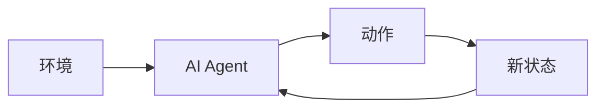
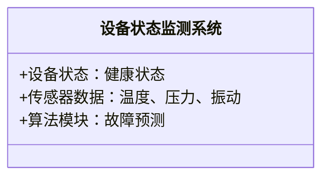
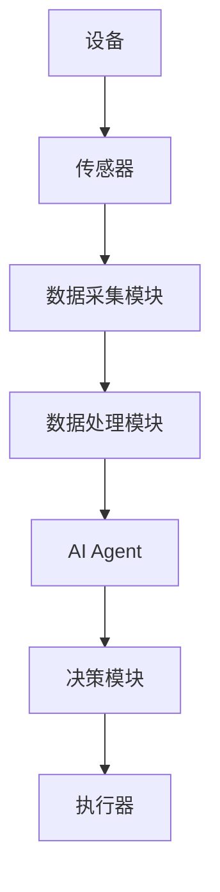
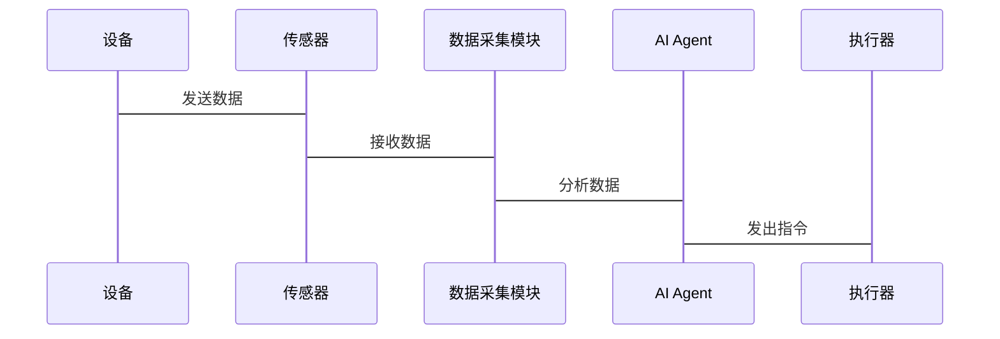

                 


# AI Agent在智能制造中的应用

## 关键词：AI Agent, 智能制造, 工业自动化, 人工智能, 系统架构

## 摘要：本文详细探讨了AI Agent在智能制造中的应用，从基本概念到实际场景，从算法原理到系统架构，全面分析了AI Agent如何推动智能制造的发展。文章内容涵盖AI Agent的核心概念、算法原理、系统设计、项目实战及最佳实践，旨在为读者提供深入的技术见解。

---

## 第1章: AI Agent与智能制造的背景介绍

### 1.1 AI Agent的基本概念

#### 1.1.1 AI Agent的定义
AI Agent（人工智能代理）是一种能够感知环境、自主决策并执行任务的智能实体。它通过传感器获取信息，利用算法处理数据，并通过执行器与环境交互。

#### 1.1.2 AI Agent的核心特征
- **自主性**：能够自主决策，无需外部干预。
- **反应性**：能够实时感知环境变化并做出反应。
- **学习能力**：通过数据和经验不断优化自身行为。
- **规划能力**：能够制定并执行复杂的任务计划。

#### 1.1.3 AI Agent与传统自动化系统的区别
| 特性                | AI Agent                 | 传统自动化系统         |
|---------------------|--------------------------|------------------------|
| 决策能力            | 强大，基于数据驱动       | 较弱，基于固定规则     |
| 学习能力            | 具备机器学习能力         | 无                     |
| 灵活性              | 高，适应复杂场景         | 低，适应固定场景       |

### 1.2 智能制造的背景与发展趋势

#### 1.2.1 智能制造的定义与特点
智能制造是通过物联网、大数据、人工智能等技术，实现生产过程的智能化、数字化和网络化。

#### 1.2.2 智能制造的核心技术
- 物联网（IoT）
- 大数据分析（Big Data）
- 人工智能（AI）
- 自动化技术（Robotics）

#### 1.2.3 智能制造的发展趋势
- **智能化**：从自动化向智能化升级。
- **数据驱动**：利用大数据进行优化决策。
- **人机协作**：人与机器协同工作，提高效率。

### 1.3 AI Agent在智能制造中的作用

#### 1.3.1 AI Agent在智能制造中的应用场景
- **生产优化**：实时优化生产流程。
- **设备维护**：预测设备故障，减少停机时间。
- **供应链管理**：优化供应链效率。

#### 1.3.2 AI Agent对智能制造的推动作用
- 提高生产效率。
- 降低成本。
- 提升产品质量。

#### 1.3.3 AI Agent在智能制造中的挑战与机遇
- **挑战**：数据隐私、系统安全性。
- **机遇**：技术创新、市场扩展。

---

## 第2章: AI Agent的核心概念与原理

### 2.1 AI Agent的基本原理

#### 2.1.1 AI Agent的感知与决策机制
AI Agent通过传感器获取环境信息，利用算法进行分析，制定决策并执行。

#### 2.1.2 AI Agent的学习与自适应能力
通过机器学习算法，AI Agent能够从数据中学习，不断优化自身行为。

#### 2.1.3 AI Agent的规划与执行过程
AI Agent根据任务目标，制定计划并执行，同时根据反馈调整计划。

### 2.2 AI Agent的分类与特点

#### 2.2.1 基于规则的AI Agent
- **定义**：基于预定义的规则进行决策。
- **特点**：简单易实现，但灵活性差。

#### 2.2.2 基于机器学习的AI Agent
- **定义**：通过机器学习算法进行决策。
- **特点**：灵活性高，适应性强。

#### 2.2.3 基于强化学习的AI Agent
- **定义**：通过强化学习进行决策。
- **特点**：能够在复杂环境中优化行为。

### 2.3 AI Agent的核心算法

#### 2.3.1 强化学习算法



#### 2.3.2 监督学习算法

```python
# 监督学习算法示例：线性回归
import numpy as np

# 数据
X = np.array([1, 2, 3, 4])
y = np.array([2, 4, 6, 8])

# 训练模型
model = np.linalg.lstsq(X[:, np.newaxis], y, rcond=None)[0]

# 预测
new_X = np.array([5])
prediction = model * new_X
print(prediction)  # 输出：10
```

---

## 第3章: AI Agent在智能制造中的应用场景

### 3.1 智能工厂中的AI Agent应用

#### 3.1.1 生产过程优化
AI Agent通过实时数据分析，优化生产流程，提高效率。

#### 3.1.2 设备故障预测
AI Agent通过分析设备数据，预测潜在故障，减少停机时间。

#### 3.1.3 资源调度与优化
AI Agent根据生产需求，优化资源分配，降低成本。

### 3.2 智能供应链中的AI Agent应用

#### 3.2.1 供应链优化
AI Agent通过分析供应链数据，优化库存管理和物流路径。

#### 3.2.2 供应商选择与管理
AI Agent根据供应商历史数据，推荐最佳供应商并进行动态管理。

#### 3.2.3 库存管理与预测
AI Agent通过预测需求，优化库存水平，减少过剩库存。

### 3.3 智能服务中的AI Agent应用

#### 3.3.1 客户需求预测
AI Agent通过分析客户行为数据，预测需求，优化服务策略。

#### 3.3.2 服务流程优化
AI Agent通过优化服务流程，提高客户满意度和效率。

#### 3.3.3 客户体验提升
AI Agent通过个性化推荐和实时反馈，提升客户体验。

---

## 第4章: 系统分析与架构设计

### 4.1 智能制造的场景介绍

#### 4.1.1 设备状态监测
通过物联网传感器实时监测设备状态，预测故障。

#### 4.1.2 生产过程优化
通过AI Agent优化生产流程，提高效率。

### 4.2 系统功能设计

#### 4.2.1 领域模型


#### 4.2.2 系统架构设计



### 4.3 系统接口设计

#### 4.3.1 API接口
- 设备数据接口：提供设备传感器数据。
- 决策接口：接收AI Agent的决策指令。

### 4.4 系统交互流程

#### 4.4.1 序列图



---

## 第5章: 项目实战

### 5.1 环境安装

```bash
pip install numpy scikit-learn matplotlib
```

### 5.2 系统核心实现

#### 5.2.1 强化学习实现

```python
# 强化学习算法示例：Q-Learning
import numpy as np

class QLearningAgent:
    def __init__(self, state_space_size, action_space_size):
        self.q_table = np.zeros((state_space_size, action_space_size))
    
    def choose_action(self, state, epsilon=0.1):
        if np.random.random() < epsilon:
            return np.random.randint(0, action_space_size)
        return np.argmax(self.q_table[state])
    
    def learn(self, state, action, reward, next_state):
        self.q_table[state][action] = reward + np.max(self.q_table[next_state])

# 示例使用
agent = QLearningAgent(state_space_size=5, action_space_size=2)
action = agent.choose_action(0)
agent.learn(0, action, reward=1, next_state=1)
```

### 5.3 实际案例分析

#### 5.3.1 预测性维护案例
AI Agent通过分析设备传感器数据，预测设备故障，提前安排维护，减少停机时间。

---

## 第6章: 最佳实践与小结

### 6.1 最佳实践

#### 6.1.1 数据质量管理
确保数据的准确性和完整性。

#### 6.1.2 模型迭代
定期更新模型，保持其性能。

#### 6.1.3 团队协作
跨团队合作，确保系统的顺利运行。

### 6.2 小结
本文详细介绍了AI Agent在智能制造中的应用，从基本概念到实际场景，从算法原理到系统架构，全面分析了AI Agent如何推动智能制造的发展。

---

## 总结
AI Agent作为智能制造的核心技术之一，正在推动工业革命的智能化转型。随着技术的进步，AI Agent将在更多领域发挥重要作用，为制造业带来更大的价值。

