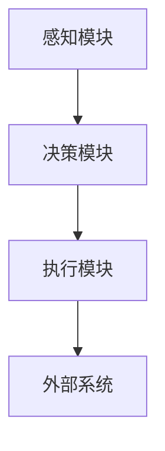
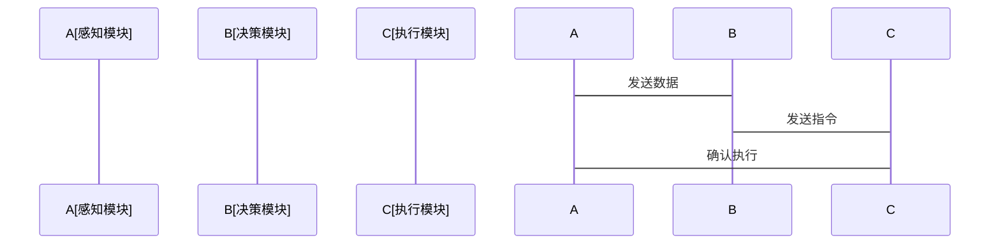

                 


# AI Agent在智能制造中的应用：生产线优化与质量控制

## 关键词：AI Agent, 智能制造, 生产线优化, 质量控制, 机器学习, 强化学习, 生产调度

## 摘要：本文探讨了AI Agent在智能制造中的应用，特别是在生产线优化与质量控制方面。通过分析AI Agent的核心原理、算法模型及实际应用案例，详细阐述了其在提高生产效率、优化资源利用率和实现智能化决策中的重要作用。本文还结合了实际项目案例，展示了如何通过AI Agent技术实现智能制造系统的优化与创新。

---

# 第一部分: AI Agent与智能制造概述

## 第1章: AI Agent与智能制造的背景

### 1.1 AI Agent的基本概念

#### 1.1.1 AI Agent的定义与特点
AI Agent（智能体）是指能够感知环境、采取行动以实现特定目标的智能实体。AI Agent的特点包括自主性、反应性、目标导向性和社会性。  
- 自主性：AI Agent能够独立决策和行动，无需外部干预。  
- 反应性：AI Agent能够根据环境反馈实时调整行为。  
- 目标导向性：AI Agent的行为围绕特定目标展开，优化资源利用。  
- 社会性：AI Agent能够与其他智能体或系统进行协作。

#### 1.1.2 AI Agent的核心原理
AI Agent的核心原理包括知识表示、行为决策和人机交互。  
- 知识表示：通过数据结构和模型描述问题空间，例如使用图论表示知识图谱。  
- 行为决策：基于感知信息，通过算法选择最优行动方案，例如强化学习算法。  
- 人机交互：通过自然语言处理技术与人类用户进行有效沟通。

#### 1.1.3 AI Agent与传统自动化系统的区别
AI Agent与传统自动化系统的区别主要体现在智能性和适应性上。AI Agent能够学习和适应环境变化，而传统自动化系统仅能按照预设规则运行。

### 1.2 智能制造的背景与现状

#### 1.2.1 智能制造的定义与特点
智能制造是一种通过物联网、大数据和人工智能等技术，实现生产过程智能化的新型制造模式。其特点包括智能化、网络化和数据驱动。

#### 1.2.2 智能制造的发展历程
智能制造的发展经历了机械化、自动化、信息化和智能化四个阶段。当前，智能化是智能制造的核心发展方向。

#### 1.2.3 当前智能制造的主要技术与应用
当前智能制造的主要技术包括物联网、大数据分析、机器学习和区块链等。主要应用领域包括智能工厂、智能物流和智能供应链。

### 1.3 AI Agent在智能制造中的优势

#### 1.3.1 提高生产效率
AI Agent能够优化生产调度和资源分配，减少生产周期，提高效率。

#### 1.3.2 优化资源利用率
通过实时监控和动态调整，AI Agent能够优化能源、设备和人力资源的利用率。

#### 1.3.3 实现智能化决策
AI Agent能够基于实时数据和历史信息，提供最优决策支持，降低人为错误。

### 1.4 本章小结
本章介绍了AI Agent的基本概念、智能制造的背景与现状，以及AI Agent在智能制造中的优势。AI Agent作为智能制造的核心技术，能够显著提升生产效率和资源利用率。

---

## 第2章: AI Agent的核心原理与技术

### 2.1 AI Agent的基本架构

#### 2.1.1 知识表示
知识表示是AI Agent理解环境的基础。常用的知识表示方法包括规则表示、语义网络和知识图谱。例如，使用图论表示知识图谱，节点表示实体，边表示关系。

#### 2.1.2 行为决策
行为决策是AI Agent的核心功能。常用算法包括强化学习和监督学习。例如，使用Q-learning算法进行状态转移和奖励函数设计。

#### 2.1.3 人机交互
人机交互是AI Agent与人类用户或系统进行信息交换的关键环节。常用技术包括自然语言处理和语音识别。

### 2.2 AI Agent的算法原理

#### 2.2.1 机器学习算法
机器学习算法用于AI Agent的知识学习和模式识别。例如，使用随机森林算法进行分类和回归分析。

#### 2.2.2 强化学习算法
强化学习算法用于AI Agent的决策优化。例如，使用Q-learning算法进行状态转移和奖励函数设计。

#### 2.2.3 自然语言处理算法
自然语言处理算法用于AI Agent的语义理解和生成。例如，使用BERT模型进行文本分类和问答系统设计。

### 2.3 AI Agent的数学模型与公式

#### 2.3.1 状态空间模型
状态空间模型描述AI Agent可能处的状态集合。例如，使用马尔可夫决策过程（MDP）定义状态空间。

$$ S = \{s_1, s_2, ..., s_n\} $$

#### 2.3.2 动作空间模型
动作空间模型描述AI Agent在每个状态下可执行的动作集合。例如，使用动作树模型设计动作空间。

$$ A(s_i) = \{a_1, a_2, ..., a_m\} $$

#### 2.3.3 奖励函数模型
奖励函数模型定义AI Agent在执行动作后的奖励值。例如，使用折扣奖励函数设计奖励机制。

$$ R(s, a) = r_1, r_2, ..., r_k $$

### 2.4 AI Agent的实现流程

#### 2.4.1 数据采集与预处理
数据采集与预处理是AI Agent运行的基础。例如，使用传感器数据进行特征提取和数据清洗。

#### 2.4.2 模型训练与优化
模型训练与优化是AI Agent学习的关键步骤。例如，使用深度学习框架进行神经网络训练和超参数优化。

#### 2.4.3 系统部署与测试
系统部署与测试是AI Agent应用的最后阶段。例如，使用容器化技术进行系统部署，并通过A/B测试进行性能评估。

### 2.5 本章小结
本章详细讲解了AI Agent的核心原理与技术，包括基本架构、算法原理和数学模型。这些内容为后续章节的应用分析奠定了理论基础。

---

## 第3章: 智能制造中的AI Agent应用现状

### 3.1 智能制造中的关键问题

#### 3.1.1 生产效率低下
生产效率低下是智能制造中的主要问题之一。例如，生产线上设备利用率低，导致整体效率下降。

#### 3.1.2 资源浪费
资源浪费包括能源浪费、材料浪费和时间浪费。例如，设备闲置或生产过程中的等待时间过长。

#### 3.1.3 决策不准确
传统决策方法依赖人工经验，存在主观性和滞后性。例如，市场变化或生产波动可能导致决策失误。

### 3.2 当前AI Agent在智能制造中的应用

#### 3.2.1 生产线优化
AI Agent能够优化生产调度和资源分配。例如，使用强化学习算法优化生产顺序，减少生产瓶颈。

#### 3.2.2 质量控制
AI Agent能够实时监控生产过程，识别异常情况。例如，使用图像识别技术检测产品质量缺陷。

#### 3.2.3 供应链管理
AI Agent能够优化供应链中的库存管理和物流调度。例如，使用预测性维护技术减少设备故障停机时间。

### 3.3 AI Agent在智能制造中的挑战

#### 3.3.1 数据隐私问题
AI Agent需要处理大量敏感数据，存在数据隐私泄露风险。例如，客户数据和生产数据的安全保护。

#### 3.3.2 系统集成难度
AI Agent需要与其他系统和设备无缝集成，存在技术兼容性和接口设计难题。例如，不同设备之间的通信协议差异。

#### 3.3.3 技术成熟度
AI Agent技术在某些领域的应用还不够成熟，存在技术瓶颈。例如，复杂环境下的自主决策能力不足。

### 3.4 本章小结
本章分析了智能制造中的关键问题和AI Agent的应用现状，探讨了当前应用中的挑战和未来发展方向。

---

## 第4章: AI Agent在生产线优化中的应用

### 4.1 生产线优化的背景与目标

#### 4.1.1 生产线优化的必要性
随着市场竞争加剧，企业需要不断提高生产效率和产品质量。例如，缩短生产周期，降低成本。

#### 4.1.2 生产线优化的主要目标
生产线优化的主要目标包括提高设备利用率、降低生产成本和缩短生产周期。

#### 4.1.3 生产线优化的关键指标
生产线优化的关键指标包括设备利用率（OEE）、生产周期时间（Cycle Time）和生产成本（Cost）。

### 4.2 AI Agent在生产线优化中的具体应用

#### 4.2.1 生产调度优化
生产调度优化是AI Agent在生产线优化中的核心应用。例如，使用强化学习算法优化生产顺序，减少设备等待时间。

#### 4.2.2 资源分配优化
资源分配优化包括设备、人员和物料的合理分配。例如，使用遗传算法优化资源分配方案，提高资源利用率。

#### 4.2.3 过程监控与优化
过程监控与优化是AI Agent的另一个重要应用。例如，使用实时数据分析技术监控生产过程，及时发现和解决异常问题。

### 4.3 本章小结
本章详细探讨了AI Agent在生产线优化中的具体应用，包括生产调度优化、资源分配优化和过程监控与优化。

---

## 第5章: AI Agent在质量控制中的应用

### 5.1 质量控制的背景与目标

#### 5.1.1 质量控制的必要性
质量控制是确保产品符合标准的重要环节。例如，减少缺陷产品，提高客户满意度。

#### 5.1.2 质量控制的主要目标
质量控制的主要目标包括提高产品质量、降低质量成本和提高生产效率。

#### 5.1.3 质量控制的关键指标
质量控制的关键指标包括缺陷率（Defect Rate）、返修率（Rework Rate）和质量成本（Quality Cost）。

### 5.2 AI Agent在质量控制中的具体应用

#### 5.2.1 实时质量监控
实时质量监控是AI Agent在质量控制中的核心应用。例如，使用计算机视觉技术实时检测产品质量缺陷。

#### 5.2.2 异常检测与预测
异常检测与预测是AI Agent的另一个重要应用。例如，使用机器学习算法预测潜在的质量问题，提前采取措施。

#### 5.2.3 预测性维护
预测性维护是通过实时监测设备状态，预测设备故障，减少停机时间。例如，使用预测性维护技术延长设备使用寿命。

### 5.3 本章小结
本章详细探讨了AI Agent在质量控制中的具体应用，包括实时质量监控、异常检测与预测和预测性维护。

---

## 第6章: AI Agent的系统架构与集成

### 6.1 系统架构设计

#### 6.1.1 系统功能模块
AI Agent系统通常包括感知模块、决策模块和执行模块。例如，感知模块通过传感器采集数据，决策模块基于数据进行决策，执行模块执行决策动作。

#### 6.1.2 系统架构图
以下是AI Agent系统的架构图：



### 6.2 系统接口设计

#### 6.2.1 标准接口定义
AI Agent系统需要与外部系统进行数据交互，通常采用RESTful API接口。例如，传感器数据接口、决策系统接口和执行系统接口。

#### 6.2.2 数据格式规范
数据格式规范是系统集成的重要内容。例如，使用JSON格式进行数据传输，确保数据一致性和可读性。

### 6.3 系统交互设计

#### 6.3.1 交互流程图
以下是AI Agent系统的交互流程图：



### 6.4 本章小结
本章详细讲解了AI Agent的系统架构与集成，包括架构设计、接口设计和系统交互设计。

---

## 第7章: 项目实战——AI Agent在某制造企业的应用

### 7.1 项目背景介绍

#### 7.1.1 企业概况
某制造企业主要从事汽车零部件生产，面临生产效率低下和质量问题突出的问题。

#### 7.1.2 项目目标
本项目旨在通过引入AI Agent技术，优化生产调度和质量控制，提高生产效率和产品质量。

### 7.2 系统功能设计

#### 7.2.1 生产调度优化
使用强化学习算法优化生产顺序，减少设备等待时间，提高设备利用率。

#### 7.2.2 质量监控与预测
使用计算机视觉技术实时检测产品质量缺陷，预测潜在质量问题，提前采取措施。

### 7.3 系统实现与代码

#### 7.3.1 环境安装
安装Python、TensorFlow和OpenCV等依赖库，配置开发环境。

#### 7.3.2 核心代码实现
以下是AI Agent的核心代码实现：

```python
import tensorflow as tf
import numpy as np

# 定义强化学习模型
class Agent:
    def __init__(self, state_space, action_space):
        self.state_space = state_space
        self.action_space = action_space
        self.model = self.build_model()

    def build_model(self):
        model = tf.keras.Sequential()
        model.add(tf.keras.layers.Dense(64, activation='relu', input_dim=self.state_space))
        model.add(tf.keras.layers.Dense(self.action_space, activation='linear'))
        model.compile(optimizer='adam', loss='mse')
        return model

    def act(self, state):
        state = np.array(state)
        prediction = self.model.predict(state)
        return np.argmax(prediction)

    def remember(self, state, action, reward, next_state):
        # 记忆存储
        pass

    def replay(self):
        # 回放训练
        pass
```

### 7.4 项目小结
本章通过实际案例展示了AI Agent在制造企业的应用，验证了其在生产调度优化和质量控制中的有效性。

---

## 第8章: 未来展望与挑战

### 8.1 未来发展趋势

#### 8.1.1 技术融合
未来，AI Agent将与5G、物联网和区块链等技术深度融合，推动智能制造的进一步发展。

#### 8.1.2 智能决策系统
AI Agent将向更复杂的智能决策系统发展，具备更强的自主决策和问题解决能力。

### 8.2 当前挑战与解决方案

#### 8.2.1 数据隐私问题
通过数据加密和区块链技术，确保数据隐私和安全。

#### 8.2.2 系统集成难度
通过标准化接口和模块化设计，降低系统集成难度。

#### 8.2.3 技术成熟度
通过持续研究和技术创新，提升AI Agent技术的成熟度和可靠性。

### 8.3 本章小结
本章展望了AI Agent在智能制造中的未来发展趋势，并探讨了当前面临的主要挑战和解决方案。

---

## 结语

AI Agent作为智能制造的核心技术，正在推动生产流程的智能化和高效化。通过优化生产调度和质量控制，AI Agent能够显著提高生产效率和产品质量。未来，随着技术的不断发展，AI Agent将在智能制造中发挥更加重要的作用。

---

## 参考文献

1. Russell, S., & Norvig, P. (2010). Artificial Intelligence: A Modern Approach.
2. Zhang, Y., & Lee, J. (2018). Machine Learning in Manufacturing: A Review.
3. Mnih, V., et al. (2016). Deep Q-Networks: Reinforcement Learning in Games.

--- 

希望这个详细的目录和内容安排能够满足您的需求。如果需要进一步补充或调整，请随时告诉我！

