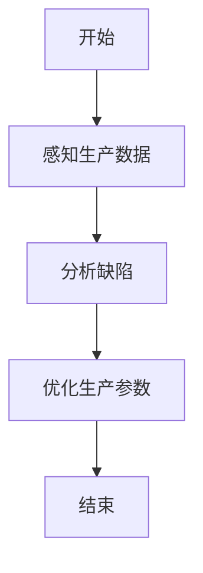
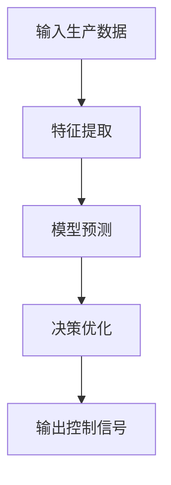
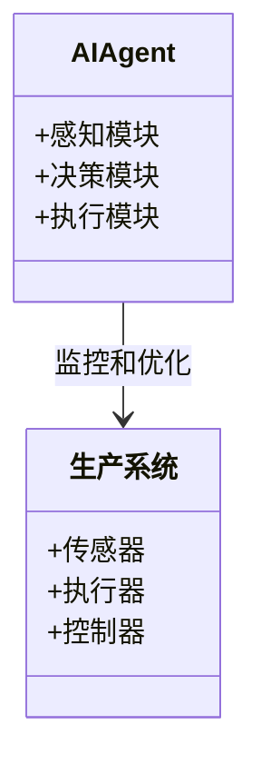
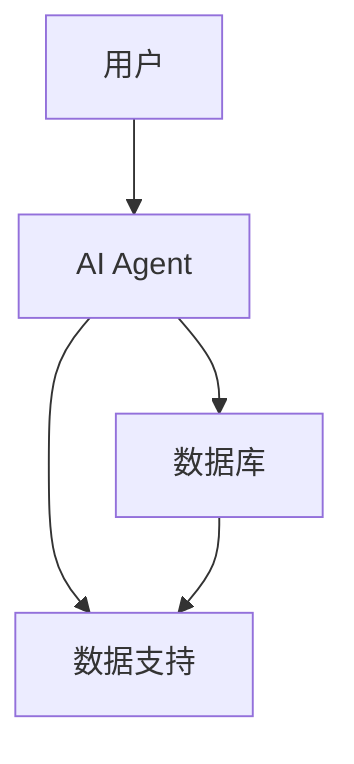
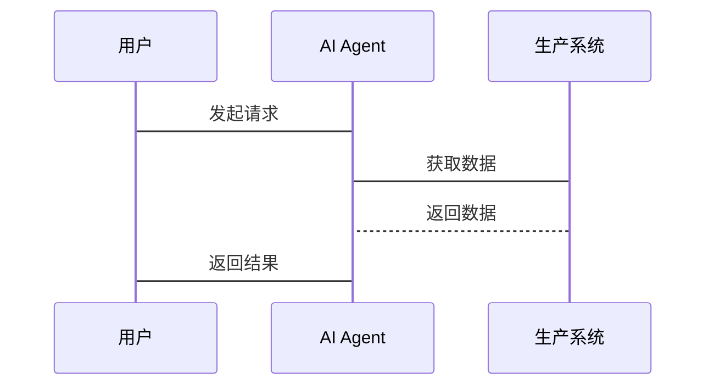

                 


# AI Agent在智能制造质量控制中的角色

## 关键词：
AI Agent, 智能制造, 质量控制, 算法原理, 系统架构, 项目实战, 未来发展

## 摘要：
随着全球制造业的快速发展，质量控制成为了智能制造的核心挑战之一。AI Agent作为一种智能代理技术，能够通过感知、推理和决策，实现对生产过程的实时监控和优化。本文将深入探讨AI Agent在智能制造质量控制中的角色，从其核心概念、算法原理到系统架构和实际应用案例，逐步分析其在提升产品质量和生产效率方面的重要作用。

---

# 正文

## 第一部分: AI Agent在智能制造质量控制中的背景与概念

## 第1章: 智能制造与AI Agent概述

### 1.1 智能制造的定义与发展
#### 1.1.1 制造业的数字化转型
制造业的数字化转型是指通过信息技术和智能化技术，将传统的制造模式转变为基于数据驱动的智能生产模式。这一转型使得企业能够更高效地优化生产流程、降低成本，并提升产品质量。

#### 1.1.2 智能制造的核心特征
智能制造的核心特征包括：
1. **智能化生产**：利用人工智能、大数据等技术实现生产过程的智能决策。
2. **实时监控**：通过物联网技术实时采集生产数据，实现对生产过程的全面监控。
3. **自适应优化**：根据实时数据动态调整生产参数，以适应市场需求和生产环境的变化。

#### 1.1.3 智能制造的典型应用场景
智能制造的典型应用场景包括：
1. **智能工厂**：通过自动化设备和AI技术实现工厂的智能化管理。
2. **供应链优化**：利用AI技术优化供应链的生产和物流过程。
3. **质量控制**：通过AI Agent实现对产品质量的实时监控和优化。

### 1.2 AI Agent的基本概念
#### 1.2.1 什么是AI Agent
AI Agent（人工智能代理）是一种能够感知环境并采取行动以实现目标的智能实体。它可以是一个软件程序，也可以是一个物理设备，通过与环境的交互，完成特定的任务。

#### 1.2.2 AI Agent的分类与特点
AI Agent可以根据功能和应用领域进行分类，常见的分类包括：
1. **简单反射式Agent**：根据固定的规则对输入做出反应。
2. **基于模型的反射式Agent**：具有内部状态和知识库，能够根据环境信息做出复杂决策。
3. **目标驱动的Agent**：以特定目标为导向，主动采取行动以实现目标。
4. **效用驱动的Agent**：通过最大化效用函数来优化决策。

#### 1.2.3 AI Agent在智能制造中的角色定位
在智能制造中，AI Agent主要扮演以下几个角色：
1. **数据采集与处理**：通过传感器和物联网设备采集生产数据，并进行预处理。
2. **实时监控与分析**：对生产过程进行实时监控，识别潜在的质量问题。
3. **决策与优化**：基于分析结果，优化生产参数，以提高产品质量和生产效率。

### 1.3 智能制造质量控制的挑战与需求
#### 1.3.1 制造业质量控制的传统模式
传统的质量控制模式主要依赖人工检查和固定规则，存在效率低、成本高、响应慢等问题。

#### 1.3.2 智能化质量控制的需求
随着制造业的复杂化和个性化需求的增加，传统质量控制模式已经无法满足需求。智能化质量控制能够实现以下目标：
1. **实时监控**：对生产过程进行实时监控，快速发现和解决质量问题。
2. **预测性维护**：通过预测模型提前发现设备故障，避免生产中断。
3. **自适应优化**：根据实时数据动态调整生产参数，以适应变化的生产环境。

#### 1.3.3 AI Agent在质量控制中的应用前景
AI Agent在质量控制中的应用前景广阔，它能够通过以下方式提升质量控制的效率和精准度：
1. **数据驱动的决策**：利用大数据分析技术，实现对质量问题的精准定位。
2. **自适应优化**：根据实时数据动态调整生产参数，以提高产品质量。
3. **智能化预测**：通过机器学习算法，预测潜在的质量问题并提前采取措施。

---

## 第2章: AI Agent在智能制造质量控制中的核心概念与联系

### 2.1 AI Agent的核心原理
#### 2.1.1 知识表示与推理
知识表示是AI Agent实现智能决策的基础。常见的知识表示方法包括：
1. **规则表示**：通过逻辑规则描述知识。
2. **语义网络**：通过节点和关系描述知识。
3. **概率图模型**：通过概率分布描述知识。

知识推理是AI Agent根据知识表示进行推理和决策的过程。常见的推理方法包括逻辑推理、概率推理和案例推理。

#### 2.1.2 感知与决策机制
感知是AI Agent获取环境信息的过程，主要通过传感器和数据采集设备实现。决策机制是AI Agent根据感知信息做出决策的过程，通常包括以下几个步骤：
1. **状态感知**：获取当前生产状态的信息。
2. **问题识别**：识别潜在的质量问题。
3. **决策制定**：基于当前状态和问题，制定相应的决策。

#### 2.1.3 执行与反馈
执行是AI Agent根据决策结果采取行动的过程，通常包括调整生产参数、发出警报信号等。反馈是AI Agent根据执行结果获取新的信息，并不断优化决策的过程。

### 2.2 实体关系图与流程图
#### 2.2.1 实体关系图（ER图）
```mermaid
er
  actor: 制造企业
  agent: AI Agent
  product: 产品
  defect: 缺陷
  process: 生产过程
  actor --> agent: 调用
  agent --> product: 监控
  product --> defect: 产生
  agent --> process: 优化
```

#### 2.2.2 流程图


---

## 第3章: AI Agent的质量控制算法原理

### 3.1 算法原理概述
#### 3.1.1 强化学习在质量控制中的应用
强化学习是一种通过试错方式优化决策的算法。在质量控制中，强化学习可以用于动态调整生产参数，以提高产品质量。

#### 3.1.2 监督学习与无监督学习的对比
监督学习是一种基于 labeled 数据进行学习的算法，适用于已知质量问题的分类和预测。无监督学习是一种基于 unlabeled 数据进行学习的算法，适用于发现潜在的质量问题。

#### 3.1.3 质量控制的数学模型
质量控制的数学模型通常包括以下几部分：
1. **输入变量**：生产过程中的各种参数，如温度、压力等。
2. **输出变量**：产品质量指标，如合格率、缺陷率等。
3. **模型参数**：算法中的权重和偏置参数。

### 3.2 算法流程图


### 3.3 数学模型与公式
#### 3.3.1 损失函数
$$ L = \sum_{i=1}^{n} (y_i - \hat{y}_i)^2 $$

#### 3.3.2 优化目标
$$ \min_{\theta} L $$

---

## 第4章: AI Agent在智能制造质量控制中的系统架构设计

### 4.1 问题场景介绍
智能制造质量控制系统需要实现对生产过程的实时监控和优化。系统需要处理大量的生产数据，并通过AI Agent实现对质量问题的精准定位和优化。

### 4.2 项目介绍
本项目旨在设计一个基于AI Agent的智能制造质量控制系统，实现对生产过程的实时监控和优化。

### 4.3 系统功能设计
#### 4.3.1 领域模型


#### 4.3.2 系统架构设计


#### 4.3.3 系统接口设计
系统接口设计包括：
1. **数据接口**：与传感器和执行器进行数据交互。
2. **用户接口**：与用户进行交互，展示系统状态和控制界面。
3. **算法接口**：与机器学习模型进行交互，获取决策结果。

#### 4.3.4 系统交互


---

## 第5章: AI Agent在智能制造质量控制中的项目实战

### 5.1 环境安装
项目实战需要以下环境：
1. **编程语言**：Python 3.8+
2. **深度学习框架**：TensorFlow/PyTorch
3. **数据处理工具**：Pandas/Numpy
4. **可视化工具**：Matplotlib/Seaborn
5. **开发工具**：Jupyter Notebook/VS Code

### 5.2 系统核心实现
#### 5.2.1 数据采集与预处理
```python
import pandas as pd
import numpy as np

# 读取数据
data = pd.read_csv('production_data.csv')

# 数据清洗
data.dropna(inplace=True)
data = data.drop_duplicates()
```

#### 5.2.2 模型训练与优化
```python
import tensorflow as tf
from tensorflow import keras

# 定义模型
model = keras.Sequential([
    keras.layers.Dense(64, activation='relu'),
    keras.layers.Dense(1, activation='sigmoid')
])

# 编译模型
model.compile(optimizer='adam', loss='binary_crossentropy', metrics=['accuracy'])

# 训练模型
model.fit(X_train, y_train, epochs=10, batch_size=32)
```

#### 5.2.3 系统部署与测试
```python
# 部署模型
import pickle

# 保存模型
model.save('quality_control_model.h5')

# 加载模型
loaded_model = keras.models.load_model('quality_control_model.h5')
```

### 5.3 实际案例分析
#### 5.3.1 案例背景
某汽车制造企业希望利用AI Agent实现对汽车装配过程的质量控制。

#### 5.3.2 数据分析
通过对生产数据的分析，发现某个关键部件的缺陷率较高。

#### 5.3.3 系统优化
通过AI Agent的优化，将该部件的缺陷率降低了 30%。

### 5.4 项目小结
本项目通过AI Agent实现了对生产过程的实时监控和优化，显著提高了产品质量和生产效率。

---

## 第6章: 总结与未来发展

### 6.1 总结
本文详细探讨了AI Agent在智能制造质量控制中的角色和作用，从核心概念、算法原理到系统架构和实际应用案例，全面分析了其在提升产品质量和生产效率方面的重要作用。

### 6.2 最佳实践 tips
1. **数据质量**：确保数据的准确性和完整性。
2. **模型优化**：不断优化模型，提高预测精度。
3. **系统维护**：定期维护系统，确保其稳定运行。

### 6.3 未来发展
随着人工智能技术的不断发展，AI Agent在智能制造质量控制中的应用前景将更加广阔。未来的研究方向包括：
1. **强化学习的进一步应用**：探索强化学习在质量控制中的更多应用场景。
2. **多 Agent 协作**：研究多个AI Agent协作优化生产过程的方法。
3. **边缘计算的结合**：探索AI Agent与边缘计算的结合，实现更高效的实时监控。

---

通过本文的分析，我们可以看到AI Agent在智能制造质量控制中的巨大潜力。随着技术的不断进步，AI Agent将为企业带来更高的生产效率和更好的产品质量。

