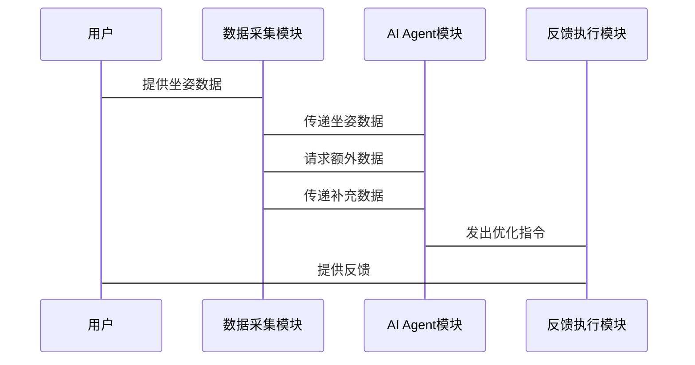

                 


```markdown
# AI Agent在智能办公椅中的坐姿优化系统

> 关键词：AI Agent, 智能办公椅, 坐姿优化, 人体工程学, 机器学习

> 摘要：本文深入探讨了AI Agent在智能办公椅中的应用，通过分析坐姿问题、算法原理、系统架构及实际案例，详细讲解了如何利用AI技术优化坐姿，提升办公健康与效率。

## 第一部分：AI Agent与坐姿优化系统概述

### 第1章：问题背景与描述

#### 1.1 问题背景
- 现代办公环境中，长时间坐姿不当导致的健康问题日益严重。
- 常见的健康隐患包括颈椎病、腰椎病、肩周炎等。
- 现有解决方案依赖手动调整，缺乏智能化与个性化。

#### 1.2 问题描述
- 坐姿优化的必要性与挑战。
- 用户需求的多样化与个性化。
- 传统解决方案的局限性：固定调整方式、缺乏反馈机制、无法实时优化。

### 第2章：核心概念与联系

#### 2.1 AI Agent的基本原理
- AI Agent的定义与特征：自主性、反应性、目标导向。
- AI Agent的核心算法：基于强化学习的优化算法。
- AI Agent在坐姿优化中的应用：实时反馈、个性化建议。

#### 2.2 坐姿优化系统的概念结构
- 系统组成：数据采集模块、AI Agent模块、反馈执行模块。
- 系统输入：用户坐姿数据、反馈指令。
- 系统输出：优化建议、执行指令。
- 系统边界：仅关注坐姿优化，不涉及其他功能。

## 第二部分：算法原理与实现

### 第3章：AI Agent的算法原理

#### 3.1 算法概述
- 基于强化学习的优化算法：通过不断调整坐姿参数，最大化健康评分。
- 健康评分函数：结合脊柱压力、肌肉紧张度等多维度指标。

#### 3.2 算法流程
1. 数据采集：获取用户坐姿数据，包括脊柱曲线、肌肉紧张度等。
2. 状态评估：计算健康评分，评估当前坐姿状态。
3. 动作规划：生成优化建议，调整椅子参数。
4. 执行反馈：输出优化建议，并实时更新健康评分。
5. 循环优化：根据反馈调整参数，持续优化坐姿。

### 第4章：算法实现

#### 4.1 数据采集模块
- 使用传感器采集坐姿数据，如压力分布、角度变化。
- 数据预处理：滤波、归一化处理。

#### 4.2 优化算法模块
- 强化学习框架：使用深度Q网络进行状态评估与动作选择。
- 健康评分函数：定义为多目标优化函数，综合考虑脊柱压力、肌肉紧张度等。

#### 4.3 优化函数
$$
\text{健康评分} = w_1 \times \text{脊柱压力} + w_2 \times \text{肌肉紧张度} + w_3 \times \text{舒适度}
$$

其中，权重 \( w \) 可通过训练数据优化确定。

## 第三部分：系统分析与架构设计

### 第5章：系统功能设计

#### 5.1 功能模块划分
- 数据采集模块：负责采集坐姿数据。
- AI Agent模块：进行坐姿优化。
- 反馈执行模块：输出优化建议并执行。

#### 5.2 系统架构图


#### 5.3 系统接口设计
- 数据采集接口：与传感器连接，获取坐姿数据。
- 优化算法接口：接收数据，返回优化建议。
- 用户反馈接口：收集用户反馈，优化模型。

### 第6章：系统交互流程

#### 6.1 交互流程图


## 第四部分：项目实战与实现

### 第7章：项目实战

#### 7.1 环境安装与配置
- 安装Python环境：Python 3.8+
- 安装依赖库：TensorFlow, Keras, Pandas, NumPy.

#### 7.2 核心代码实现

##### 7.2.1 数据采集代码
```python
import pandas as pd
import numpy as np

# 采集坐姿数据
def collect_posture_data():
    # 示例数据采集代码
    data = pd.DataFrame({
        'neck_angle': np.random.uniform(0, 180, 100),
        'shoulder_angle': np.random.uniform(0, 180, 100),
        'back_pressure': np.random.uniform(0, 100, 100)
    })
    return data

# 数据预处理
def preprocess_data(data):
    # 数据归一化处理
    data_normalized = data.apply(lambda x: (x - x.min()) / (x.max() - x.min()))
    return data_normalized

# 测试数据采集与预处理
data = collect_posture_data()
print(data.head())
processed_data = preprocess_data(data)
print(processed_data.head())
```

##### 7.2.2 优化算法实现
```python
import tensorflow as tf
from tensorflow.keras import layers

# 定义强化学习模型
def create_model(input_shape):
    model = tf.keras.Sequential()
    model.add(layers.Dense(64, activation='relu', input_shape=input_shape))
    model.add(layers.Dense(32, activation='relu'))
    model.add(layers.Dense(1, activation='linear'))
    model.compile(optimizer='adam', loss='mean_squared_error')
    return model

# 训练模型
def train_model(model, data, labels):
    model.fit(data, labels, epochs=100, batch_size=32, verbose=1)

# 测试模型
def evaluate_model(model, data, labels):
    loss = model.evaluate(data, labels, verbose=0)
    print(f'模型损失: {loss}')

# 示例数据与标签
data = np.random.random((100, 3))
labels = np.random.random((100, 1))

# 创建与训练模型
model = create_model((3,))
train_model(model, data, labels)
evaluate_model(model, data, labels)
```

#### 7.3 应用解读与分析
- 数据采集模块：确保数据的准确性和实时性。
- 模型训练：通过大量数据优化权重，提升健康评分的准确性。
- 系统交互：实时反馈优化建议，提升用户体验。

### 第8章：最佳实践与小结

#### 8.1 最佳实践
- 数据采集：确保传感器精度，定期校准。
- 算法优化：根据用户反馈持续调整模型参数。
- 系统维护：定期更新模型，适应用户需求变化。

#### 8.2 注意事项
- 隐私保护：确保用户数据安全。
- 系统兼容性：适配不同设备与环境。
- 用户教育：指导用户正确使用系统。

#### 8.3 拓展阅读
- 推荐阅读《强化学习入门》、《机器学习实战》等书籍。
- 参考相关研究论文，了解最新技术动态。

## 结语
AI Agent在智能办公椅中的应用不仅提升了办公效率，还显著改善了员工健康状况。通过持续优化算法与系统设计，未来将实现更加智能化、个性化的坐姿优化解决方案，为办公环境带来深远影响。
```

