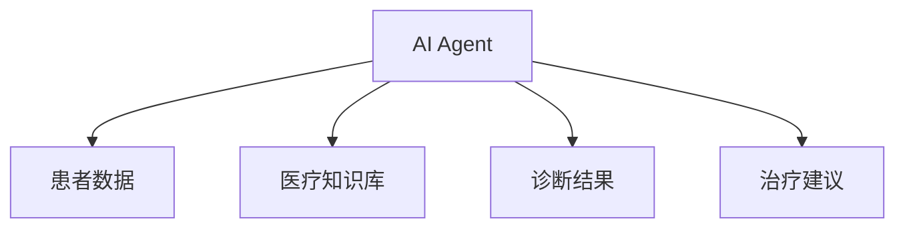
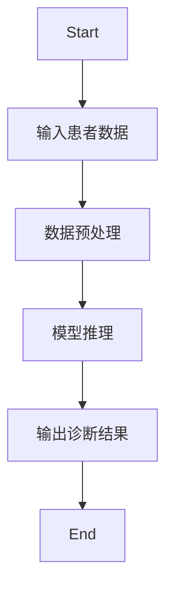
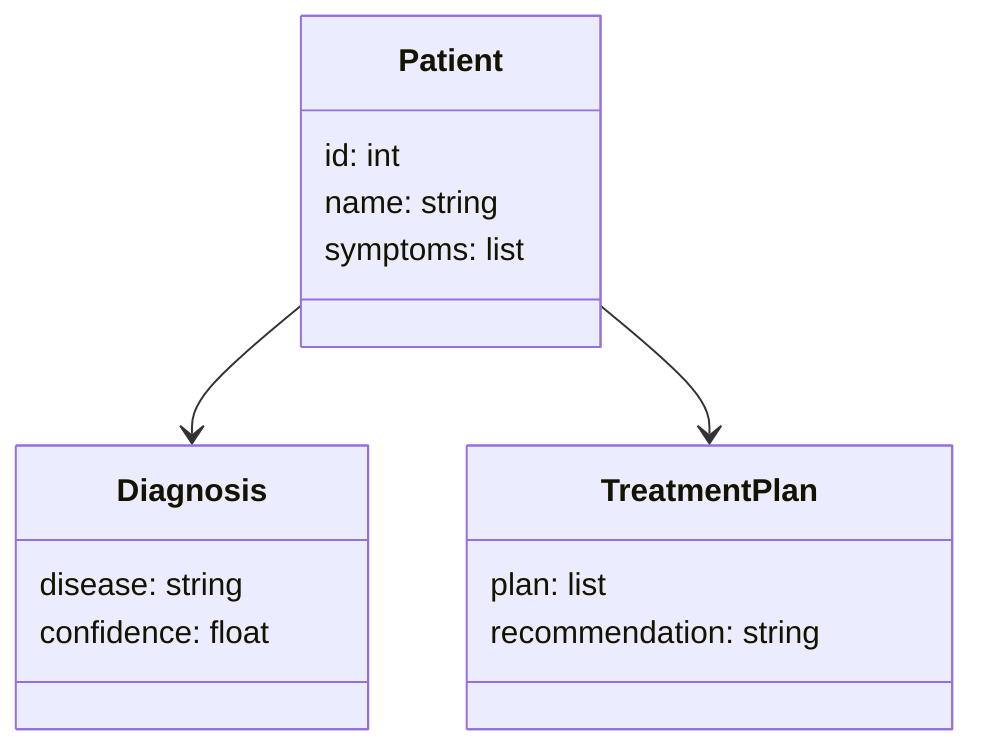
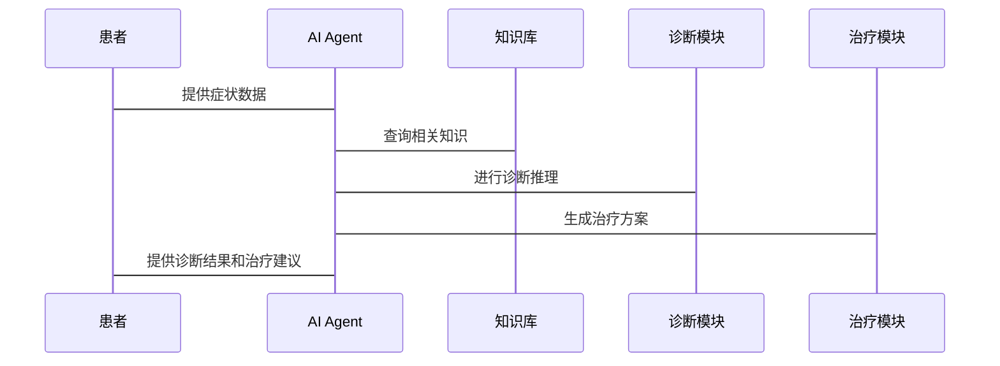

                 


# AI Agent在智能医疗中的应用：辅助诊断与治疗方案制定

> 关键词：AI Agent，智能医疗，诊断辅助，治疗方案，医疗智能化，人工智能技术

> 摘要：随着人工智能技术的快速发展，AI Agent在智能医疗中的应用越来越广泛，尤其是在辅助诊断和治疗方案制定方面。本文从AI Agent的基本概念出发，详细探讨其在医疗领域的核心原理、算法实现、系统架构设计以及实际应用案例。通过理论与实践相结合的方式，分析AI Agent在智能医疗中的优势与挑战，并展望未来的发展方向。

---

## 第一部分: AI Agent与智能医疗的背景介绍

### 第1章: AI Agent的基本概念与医疗背景

#### 1.1 AI Agent的核心概念
- 1.1.1 什么是AI Agent
  - AI Agent的定义
  - AI Agent的基本特征
- 1.1.2 AI Agent与传统AI的区别
  - 基于规则的AI与基于学习的AI对比
- 1.1.3 AI Agent在医疗中的潜力
  - 提高诊断效率
  - 优化治疗方案
  - 实现个性化医疗

#### 1.2 智能医疗的背景与现状
- 1.2.1 医疗行业的数字化转型
  - 电子健康记录（EHR）的普及
- 1.2.2 AI技术在医疗领域的应用现状
  - 辅助诊断系统的应用
  - 治疗方案推荐系统的发展
- 1.2.3 AI Agent在智能医疗中的定位
  - 作为医疗决策支持工具的角色

#### 1.3 医疗中的问题背景
- 1.3.1 医疗资源分配不均的问题
  - 医疗资源的地域分布不均
  - 医疗专家的短缺
- 1.3.2 医疗诊断的准确性和效率问题
  - 诊断错误率
  - 诊断时间过长
- 1.3.3 治疗方案的个性化需求
  - 患者个体差异
  - 疾病复杂性

#### 1.4 本章小结
  - 总结AI Agent在智能医疗中的应用背景和核心问题

---

## 第二部分: AI Agent的核心概念与原理

### 第2章: AI Agent的核心原理与联系

#### 2.1 AI Agent的核心原理
- 2.1.1 知识表示与推理
  - 知识图谱的构建
  - 逻辑推理的基本方法
- 2.1.2 问题求解与规划
  - 问题建模
  - 规划算法
- 2.1.3 自然语言处理与对话系统
  - NLP技术在医疗对话中的应用
  - 对话系统的工作流程

#### 2.2 AI Agent的属性特征对比
- 2.2.1 不同AI Agent的特征对比
  - 基于规则的AI Agent vs. 基于学习的AI Agent
  - 简单反射型AI vs. 复杂推理型AI
- 2.2.2 基于Mermaid的实体关系图


#### 2.3 AI Agent的算法原理
- 2.3.1 基于规则的推理算法
  - 规则引擎的实现
  - 规则库的构建
- 2.3.2 基于机器学习的诊断模型
  - 诊断模型的训练过程
  - 模型评估指标
- 2.3.3 基于强化学习的治疗方案优化
  - 强化学习的基本原理
  - 治疗方案优化的数学模型

---

## 第三部分: AI Agent在医疗中的算法实现

### 第3章: AI Agent的算法实现

#### 3.1 算法原理概述
- 3.1.1 基于深度学习的诊断模型
  - 卷积神经网络（CNN）在医学影像分析中的应用
  - 循环神经网络（RNN）在医疗文本分析中的应用
- 3.1.2 基于强化学习的治疗方案优化
  - 强化学习在治疗方案推荐中的应用
  - 模型训练的数学表达
- 3.1.3 算法流程图


#### 3.2 数学模型与公式
- 3.2.1 诊断模型的数学表达
  $$P(dx|e) = \frac{P(e|dx)P(dx)}{P(e)}$$
  其中，$dx$ 表示疾病，$e$ 表示症状。
- 3.2.2 治疗方案优化的数学模型
  $$\text{目标函数} = \sum_{i=1}^{n} w_i x_i + \lambda R(x)$$
  其中，$w_i$ 表示权重，$x_i$ 表示决策变量，$\lambda$ 是正则化系数，$R(x)$ 是正则化项。

---

## 第四部分: AI Agent的系统分析与架构设计

### 第4章: AI Agent的系统架构设计

#### 4.1 问题场景介绍
- 系统目标：构建一个基于AI Agent的智能医疗辅助系统
- 系统范围：涵盖诊断和治疗方案制定两大模块
- 项目介绍：系统功能概述

#### 4.2 系统功能设计
- 4.2.1 领域模型设计
  - 基于Mermaid的类图


- 4.2.2 系统架构设计
  - 基于Mermaid的架构图


- 4.2.3 系统接口设计
  - 输入接口：患者症状数据
  - 输出接口：诊断结果和治疗建议
- 4.2.4 系统交互设计
  - 基于Mermaid的序列图


---

## 第五部分: 项目实战

### 第5章: 项目实战

#### 5.1 环境安装与配置
- 安装Python
- 安装必要的库（如TensorFlow、Keras、scikit-learn）

#### 5.2 系统核心实现
- 5.2.1 诊断模型实现
  ```python
  import tensorflow as tf
  model = tf.keras.Sequential([
      tf.keras.layers.Conv2D(32, (3,3), activation='relu', input_shape=(64,64,3)),
      tf.keras.layers.MaxPooling2D((2,2)),
      tf.keras.layers.Flatten(),
      tf.keras.layers.Dense(128, activation='relu'),
      tf.keras.layers.Dense(10, activation='softmax')
  ])
  model.compile(optimizer='adam', loss='sparse_categorical_crossentropy', metrics=['accuracy'])
  model.fit(x_train, y_train, epochs=10, batch_size=32)
  ```

- 5.2.2 治疗方案优化实现
  ```python
  import numpy as np
  from tensorflow.keras import layers

  model = tf.keras.Sequential([
      layers.Dense(64, activation='relu', input_dim=10),
      layers.Dense(1, activation='linear')
  ])
  model.compile(optimizer='adam', loss='mean_squared_error')
  model.fit(x_train, y_train, epochs=50, batch_size=32)
  ```

#### 5.3 代码应用解读与分析
- 代码功能解读
- 代码实现的细节分析
- 代码优化建议

#### 5.4 实际案例分析
- 5.4.1 案例背景
- 5.4.2 数据收集与处理
- 5.4.3 模型训练与验证
- 5.4.4 实验结果与分析

#### 5.5 项目小结
  - 总结项目的实现过程
  - 提出改进建议

---

## 第六部分: 总结与展望

### 第6章: 总结与展望

#### 6.1 本章小结
- 总结全文的核心内容
- 强调AI Agent在智能医疗中的重要性

#### 6.2 未来展望
- AI Agent技术的进一步发展
- AI Agent在医疗中的更多应用场景
- 技术挑战与解决方案

---

## 附录

### 附录A: 常用AI工具与框架
- TensorFlow
- PyTorch
- scikit-learn
- spaCy

### 附录B: 数据集介绍
- MNIST医疗数据集
- CIFAR-10医疗数据集
- 基因组数据集

---

通过以上目录结构，您可以逐步展开每一部分的内容，深入探讨AI Agent在智能医疗中的应用细节。每一章都详细地介绍了理论、原理、系统设计和实战应用，帮助读者全面理解AI Agent在医疗领域的重要性和实现方式。

