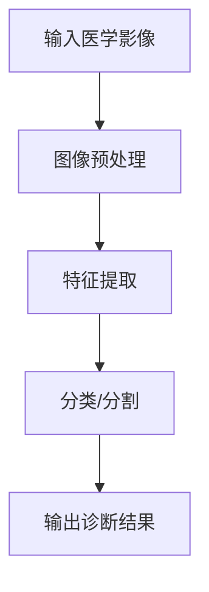
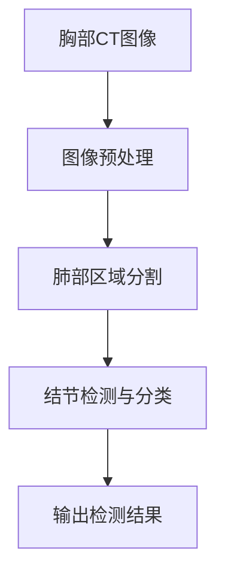
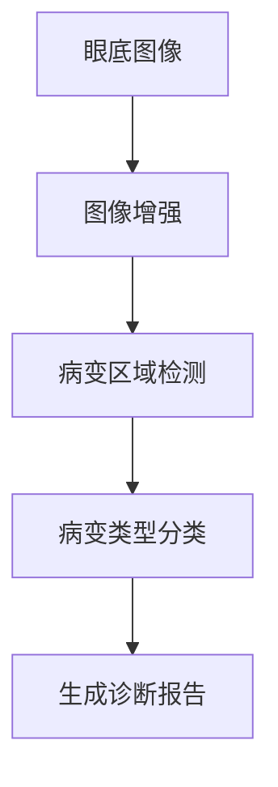
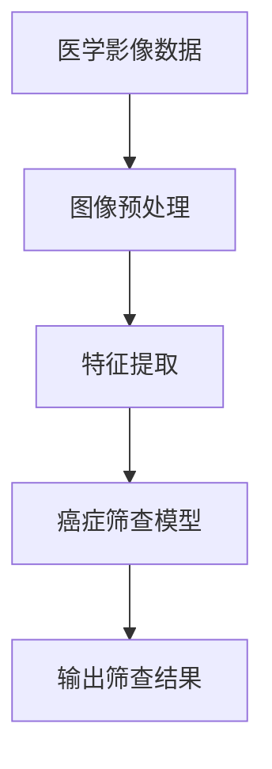
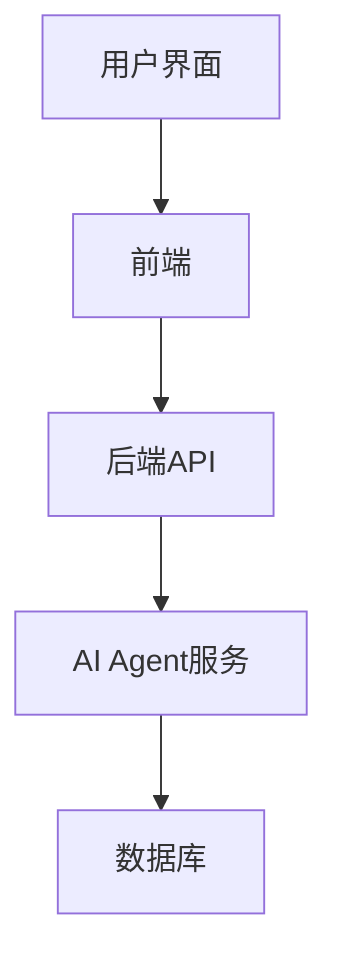
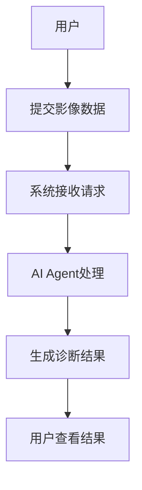

                 


# AI Agent在智能医疗影像分析与诊断中的角色

## 关键词
AI Agent, 智能医疗, 医疗影像分析, 诊断辅助, 深度学习, 医疗决策支持

## 摘要
AI Agent在智能医疗影像分析与诊断中的角色日益重要。通过AI Agent，医疗影像分析的效率和准确性得到了显著提升。本文将深入探讨AI Agent的核心概念、技术原理及其在医疗影像分析中的具体应用，包括算法实现、系统设计和项目实战。

# 目录

## 第一部分: AI Agent 的基础与背景

### 第1章: AI Agent 的基本概念与类型

#### 1.1 AI Agent 的定义与特点
- 1.1.1 AI Agent 的定义
- 1.1.2 AI Agent 的核心特点
- 1.1.3 AI Agent 与传统AI 的区别

#### 1.2 AI Agent 的类型
- 1.2.1 知识驱动型 AI Agent
- 1.2.2 数据驱动型 AI Agent
- 1.2.3 混合型 AI Agent

#### 1.3 医疗影像分析中的 AI Agent 应用背景
- 1.3.1 医疗影像分析的挑战
- 1.3.2 AI Agent 在医疗影像分析中的优势
- 1.3.3 AI Agent 的潜在应用场景

### 第2章: AI Agent 在医疗影像分析中的角色

#### 2.1 医疗影像分析的核心问题
- 2.1.1 影像数据的复杂性
- 2.1.2 诊断的准确性和效率
- 2.1.3 医疗决策的辅助需求

#### 2.2 AI Agent 在医疗影像分析中的角色定位
- 2.2.1 数据处理与分析
- 2.2.2 诊断辅助与决策支持
- 2.2.3 持续学习与优化

#### 2.3 AI Agent 在医疗影像分析中的核心任务
- 2.3.1 图像分割与识别
- 2.3.2 病变检测与分类
- 2.3.3 病理报告生成与优化

## 第二部分: AI Agent 的核心原理与技术

### 第3章: AI Agent 的感知与决策机制

#### 3.1 感知模块
- 3.1.1 图像处理与特征提取
- 3.1.2 医学影像数据的预处理
- 3.1.3 多模态数据的融合

#### 3.2 决策模块
- 3.2.1 基于规则的决策
- 3.2.2 基于深度学习的决策
- 3.2.3 决策的可解释性

#### 3.3 执行与反馈机制
- 3.3.1 行动规划与执行
- 3.3.2 反馈机制与自适应调整
- 3.3.3 系统的鲁棒性与容错能力

### 第4章: AI Agent 的算法原理与实现

#### 4.1 深度学习在 AI Agent 中的应用
- 4.1.1 卷积神经网络（CNN）在图像识别中的应用
- 4.1.2 图像分割算法（如U-Net）
- 4.1.3 图像生成模型（如GAN）

#### 4.2 医疗影像分析中的算法流程图


#### 4.3 基于深度学习的病变检测算法实现
```python
import torch
import torch.nn as nn

class LesionDetector(nn.Module):
    def __init__(self):
        super(LesionDetector, self).__init__()
        self.conv1 = nn.Conv2d(3, 64, kernel_size=3, padding=1)
        self.relu = nn.ReLU()
        self.pool = nn.MaxPool2d(2, 2)
        self.conv2 = nn.Conv2d(64, 128, kernel_size=3, padding=1)
        self.fc1 = nn.Linear(128*64*64, 512)
        self.fc2 = nn.Linear(512, 2)

    def forward(self, x):
        x = self.conv1(x)
        x = self.relu(x)
        x = self.pool(x)
        x = self.conv2(x)
        x = self.relu(x)
        x = self.pool(x)
        x = x.view(-1, 128*64*64)
        x = self.fc1(x)
        x = self.relu(x)
        x = self.fc2(x)
        return x

model = LesionDetector()
```

## 第三部分: 医疗影像分析的基础

### 第5章: 医疗影像分析的基础知识

#### 5.1 医学影像的特点
- 5.1.1 影像类型：X光、CT、MRI等
- 5.1.2 数据量与分辨率
- 5.1.3 领域知识的重要性

#### 5.2 医疗影像分析的常用技术
- 5.2.1 图像分割
- 5.2.2 图像配准
- 5.2.3 图像融合

#### 5.3 医疗影像数据的标注与处理
- 5.3.1 数据标注的挑战
- 5.3.2 数据增强技术
- 5.3.3 数据集的构建与管理

## 第四部分: AI Agent 在医疗影像分析中的应用

### 第6章: 肺结节检测中的 AI Agent 应用

#### 6.1 背景与挑战
- 6.1.1 肺结节的早期检测的重要性
- 6.1.2 传统方法的局限性
- 6.1.3 AI Agent 在肺结节检测中的优势

#### 6.2 基于AI Agent 的肺结节检测算法


### 第7章: 眼底病变分析中的 AI Agent 应用

#### 7.1 眼底病变分析的重要性
- 7.1.1 糖尿病视网膜病变的早期检测
- 7.1.2 其他眼底病变的诊断
- 7.1.3 AI Agent 在眼底病变分析中的作用

#### 7.2 基于AI Agent 的眼底病变分析算法


### 第8章: 癌症筛查中的 AI Agent 应用

#### 8.1 癌症筛查的挑战
- 8.1.1 影像数据的多样性
- 8.1.2 病理诊断的复杂性
- 8.1.3 AI Agent 在癌症筛查中的优势

#### 8.2 基于AI Agent 的癌症筛查算法


## 第五部分: 系统设计与实现

### 第9章: 医疗影像分析系统的整体架构

#### 9.1 系统功能模块
- 9.1.1 图像采集与上传
- 9.1.2 图像处理与分析
- 9.1.3 诊断结果展示
- 9.1.4 报告生成与管理

#### 9.2 系统架构设计


### 第10章: AI Agent 在医疗影像分析系统中的具体实现

#### 10.1 系统接口设计
- 10.1.1 图像上传接口
- 10.1.2 分析请求接口
- 10.1.3 结果查询接口

#### 10.2 系统交互流程


## 第六部分: 项目实战

### 第11章: 医疗影像分析项目的实战

#### 11.1 项目环境配置
- 11.1.1 安装必要的Python库
- 11.1.2 安装深度学习框架（如TensorFlow或PyTorch）
- 11.1.3 下载和安装医学影像数据集

#### 11.2 项目核心代码实现
```python
import torch
import torch.nn as nn
import torch.optim as optim

class MedicalImageClassifier(nn.Module):
    def __init__(self):
        super(MedicalImageClassifier, self).__init__()
        self.conv1 = nn.Conv2d(3, 64, kernel_size=3, padding=1)
        self.relu = nn.ReLU()
        self.pool = nn.MaxPool2d(2, 2)
        self.conv2 = nn.Conv2d(64, 128, kernel_size=3, padding=1)
        self.fc1 = nn.Linear(128*32*32, 512)
        self.fc2 = nn.Linear(512, 2)

    def forward(self, x):
        x = self.conv1(x)
        x = self.relu(x)
        x = self.pool(x)
        x = self.conv2(x)
        x = self.relu(x)
        x = self.pool(x)
        x = x.view(-1, 128*32*32)
        x = self.fc1(x)
        x = self.relu(x)
        x = self.fc2(x)
        return x

model = MedicalImageClassifier()
criterion = nn.CrossEntropyLoss()
optimizer = optim.Adam(model.parameters(), lr=0.001)
```

#### 11.3 项目优化与部署
- 11.3.1 模型优化策略
- 11.3.2 系统部署方案
- 11.3.3 性能评估与优化

## 第七部分: 总结与展望

### 第12章: 总结与展望

#### 12.1 总结
- 12.1.1 AI Agent 在医疗影像分析中的作用
- 12.1.2 本文的主要工作与成果
- 12.1.3 项目的价值与意义

#### 12.2 展望
- 12.2.1 AI Agent 在医疗影像分析中的未来发展方向
- 12.2.2 新技术（如AI大语言模型）的潜在应用
- 12.2.3 挑战与机遇

### 第13章: 最佳实践与注意事项

#### 13.1 最佳实践
- 13.1.1 数据预处理的重要性
- 13.1.2 模型选择与优化策略
- 13.1.3 系统设计中的模块化与可扩展性

#### 13.2 注意事项
- 13.2.1 数据隐私与安全
- 13.2.2 模型的可解释性
- 13.2.3 系统的稳定性和可靠性

### 第14章: 拓展阅读与深入学习

#### 14.1 深度学习在医疗影像分析中的最新进展
- 14.1.1 最新算法与技术
- 14.1.2 医疗影像数据的标注与共享
- 14.1.3 多模态数据的融合与应用

#### 14.2 AI Agent 在其他医疗领域的应用
- 14.2.1 病理学中的应用
- 14.2.2 药物研发中的应用
- 14.2.3 个性化治疗中的应用

#### 14.3 医疗AI伦理与法规
- 14.3.1 医疗AI的伦理问题
- 14.3.2 相关法规与政策
- 14.3.3 医疗AI的未来发展

---

这个大纲涵盖了从基础到应用的各个方面，适合撰写一篇深入且全面的技术博客文章。每个部分都详细地展开了关键内容，确保读者能够系统地理解和掌握AI Agent在智能医疗影像分析与诊断中的角色和应用。

