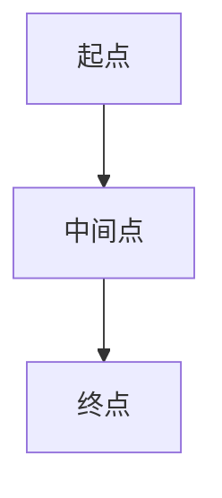

                 


# AI Agent在智能医疗设备管理中的角色

> 关键词：AI Agent, 智能医疗设备, 医疗设备管理, 多智能体系统, 强化学习, 任务规划

> 摘要：本文探讨AI Agent在智能医疗设备管理中的作用，分析其核心概念、算法原理及系统架构，通过实际案例展示其应用价值，为医疗设备管理的智能化提供新思路。

---

# 第一部分: AI Agent在智能医疗设备管理中的背景与概念

## 第1章: AI Agent的基本概念与背景

### 1.1 AI Agent的定义与特点

#### 1.1.1 什么是AI Agent
AI Agent（人工智能代理）是一种能够感知环境并采取行动以实现目标的智能实体。它可以自主决策，无需人工干预。

#### 1.1.2 AI Agent的核心特点
- **自主性**：无需外部控制，自主决策。
- **反应性**：能实时感知环境变化并做出反应。
- **目标导向**：所有行动基于明确的目标。
- **学习能力**：通过经验改进性能。

#### 1.1.3 AI Agent与传统软件的区别
传统软件遵循预设逻辑，而AI Agent具备学习和适应能力，能处理不确定性和复杂性。

### 1.2 医疗设备管理的现状

#### 1.2.1 医疗设备管理的挑战
- 设备种类繁多，管理复杂。
- 维护成本高，效率低下。
- 数据孤岛，难以整合。

#### 1.2.2 当前医疗设备管理的主要模式
- 人工管理：效率低，易出错。
- 半自动化：依赖部分自动化系统，但缺乏智能决策。

#### 1.2.3 医疗设备管理的未来趋势
向智能化、自动化、数据驱动方向发展，AI Agent将发挥关键作用。

### 1.3 AI Agent在医疗设备管理中的角色

#### 1.3.1 AI Agent在医疗设备管理中的作用
- **智能监控**：实时监控设备状态，预测故障。
- **优化维护**：制定最优维护计划，减少停机时间。
- **数据整合**：整合多源数据，提供决策支持。

#### 1.3.2 AI Agent与医疗设备管理的结合点
- 设备状态监测
- 维护计划优化
- 数据分析与决策

#### 1.3.3 AI Agent在医疗设备管理中的优势
- 提高管理效率
- 降低维护成本
- 增强决策准确性

---

## 第2章: AI Agent的核心概念与原理

### 2.1 多智能体系统

#### 2.1.1 多智能体系统的定义
由多个智能体协作完成任务的系统，各智能体具有独立性，但协作完成目标。

#### 2.1.2 多智能体系统的特点
- 分布式：各智能体独立运作。
- 协作性：智能体间协作完成复杂任务。
- 反应性：实时感知环境变化。

#### 2.1.3 多智能体系统的分类
- 基于任务分工：各智能体负责不同任务。
- 基于角色分配：智能体根据角色协同工作。

### 2.2 任务规划算法

#### 2.2.1 任务规划的基本概念
根据目标生成一系列行动步骤的过程，确保行动顺序合理，结果最优。

#### 2.2.2 常见的任务规划算法
- **贪心算法**：逐层选择当前最优解。
- **动态规划**：分解问题，解决子问题。
- **A*算法**：结合启发式搜索，找到最短路径。

#### 2.2.3 基于状态空间的任务规划
将问题分解为多个状态，通过状态转移寻找最优路径。

### 2.3 知识表示与推理

#### 2.3.1 知识表示的基本概念
用符号或数据结构表示知识，便于计算机处理。

#### 2.3.2 常见的知识表示方法
- **语义网络**：用节点和边表示概念及其关系。
- **规则表示法**：用条件逻辑表示知识。
- **框架表示法**：用框架结构表示对象属性。

#### 2.3.3 知识推理的基本原理
根据已有知识推导新结论，通常采用逻辑推理或概率推理。

---

## 第3章: AI Agent在医疗设备管理中的核心算法

### 3.1 任务规划算法

#### 3.1.1 A*算法
A*算法结合了贪心算法和动态规划，适合路径规划问题。



#### 3.1.2 Dijkstra算法
用于无权图的最短路径问题，适用于设备间路径规划。

#### 3.1.3 BFS算法
广度优先搜索，适用于设备状态探索。

### 3.2 基于强化学习的AI Agent

#### 3.2.1 强化学习的基本概念
通过试错学习，智能体通过与环境互动，获得最大累计奖励。

#### 3.2.2 Q-learning算法
Q-learning通过更新Q值表，学习最优策略。

```python
# Q-learning算法示例
import numpy as np

class QLearning:
    def __init__(self, state_space, action_space):
        self.q_table = np.zeros((state_space, action_space))

    def update(self, state, action, reward, next_state):
        self.q_table[state][action] = reward + np.max(self.q_table[next_state])
```

#### 3.2.3 Deep Q-Network (DQN)算法
使用深度神经网络近似Q值函数，适合复杂环境。

---

## 第4章: AI Agent在医疗设备管理中的系统架构

### 4.1 系统分析与设计

#### 4.1.1 问题场景介绍
医疗设备分布广，状态监测和维护计划是管理的重点。

#### 4.1.2 系统功能设计
- 设备状态监测：实时采集设备数据。
- 维护计划优化：基于历史数据制定计划。
- 数据分析与决策：提供决策支持。

#### 4.1.3 系统架构设计
- **数据采集层**：收集设备数据。
- **服务层**：处理数据，提供服务。
- **应用层**：用户交互，展示结果。

### 4.2 项目实战

#### 4.2.1 环境安装
安装Python、TensorFlow、Keras等依赖库。

#### 4.2.2 核心代码实现
```python
# 示例代码：AI Agent实现设备状态监测
class AI-Agent:
    def __init__(self, devices):
        self.devices = devices
        self.states = {}  # 设备状态

    def monitor(self):
        # 实时监测设备状态
        for device in self.devices:
            status = device.check_status()
            self.states[device] = status
        return self.states
```

#### 4.2.3 案例分析
通过具体案例，展示AI Agent如何优化设备维护计划，减少停机时间。

---

## 第5章: 最佳实践与注意事项

### 5.1 最佳实践
- 数据质量管理：确保数据准确性和完整性。
- 系统安全性：保护设备数据安全。
- 持续优化：定期更新模型，适应新需求。

### 5.2 注意事项
- 避免过度依赖AI：确保有人工干预的可能。
- 确保系统稳定性：避免因算法错误导致服务中断。

### 5.3 拓展阅读
推荐相关书籍和论文，深入学习AI Agent和医疗设备管理的知识。

---

通过以上结构，文章系统地介绍了AI Agent在智能医疗设备管理中的应用，从基础概念到实际案例，帮助读者全面理解其价值和实现方法。

