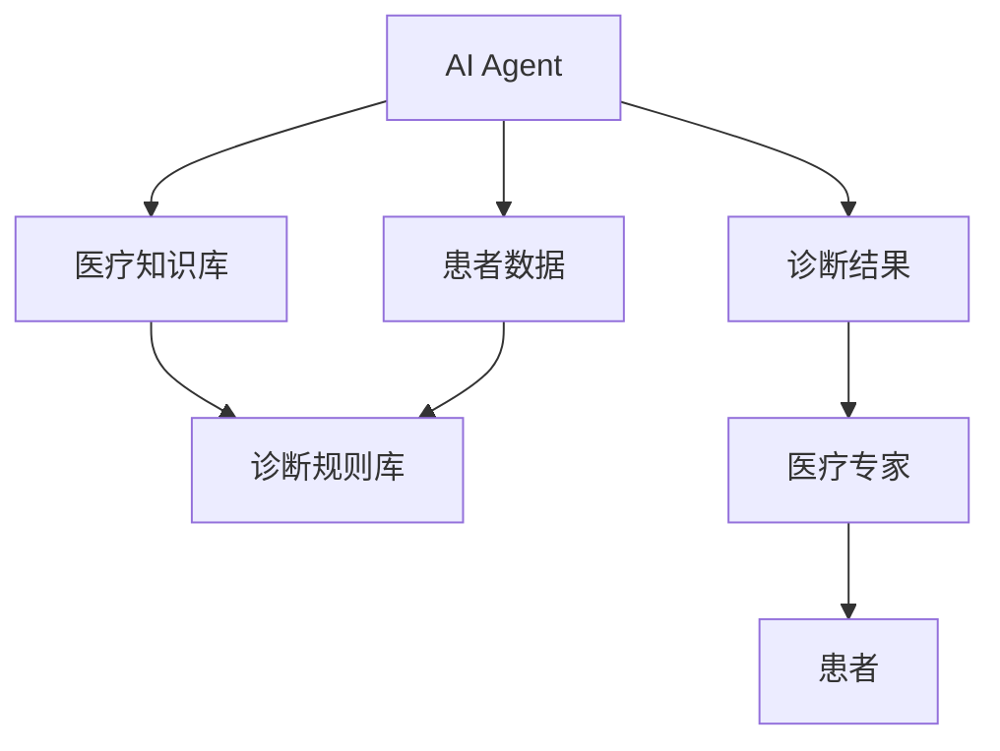

                 

# 第二章: AI Agent的核心概念与联系

## 2.1 AI Agent的核心概念

### 2.1.1 知识表示与推理
AI Agent在智能医疗诊断中的知识表示与推理是实现智能诊断的基础。我们需要将医疗知识表示为某种数据结构，然后通过推理算法得出诊断结果。

#### 知识表示
知识表示是将医疗领域的知识以某种形式存储的过程。常见的知识表示方法包括：
- **符号表示**：使用符号逻辑表示医疗知识，例如症状、疾病、检查项目等。
- **语义网络**：通过节点和边表示医疗概念及其关系。
- **知识图谱**：将医疗知识以图的形式表示，节点代表实体（如疾病、症状），边代表关系（如“症状属于疾病”）。

#### 推理算法
推理是基于已有的知识和输入的信息，推导出新的结论。常用的推理算法有：
- **逻辑推理**：基于命题逻辑或谓词逻辑进行推理，例如使用DPLL算法解决逻辑约束问题。
- **概率推理**：基于贝叶斯网络进行概率推断，例如计算某种疾病在给定症状下的概率。

### 2.1.2 问题求解与决策
AI Agent需要根据输入的患者信息，解决诊断问题并做出决策。这涉及到多种问题求解与决策算法。

#### 状态空间搜索
状态空间搜索是一种常用的问题求解方法，例如：
- **深度优先搜索（DFS）**：适用于问题空间较深的情况，但可能在复杂问题中导致栈溢出。
- **广度优先搜索（BFS）**：适用于问题空间较广的情况，但可能需要较大的内存空间。

#### 决策树
决策树是一种直观的问题求解与决策方法，适用于分类问题。例如：
- **ID3算法**：基于信息增益构建决策树，适用于医疗诊断中的症状分类。
- **C4.5算法**：ID3的改进版本，使用信息增益率作为分裂标准。

### 2.1.3 自然语言处理与对话系统
在智能医疗诊断中，AI Agent需要与患者或医生进行自然语言对话，理解意图并生成相应的回复。

#### 自然语言处理
自然语言处理（NLP）技术包括：
- **分词与句法分析**：将自然语言文本分割成词语，并分析其语法结构。
- **实体识别**：识别文本中的医学实体，例如疾病名称、症状名称等。
- **意图识别**：理解用户输入的意图，例如“查询疾病症状”或“预约检查”。

#### 对话生成
对话生成技术包括：
- **基于规则的对话生成**：根据预定义的规则生成回复。
- **基于统计模型的对话生成**：使用统计模型（如马尔可夫链）生成回复。
- **基于深度学习的对话生成**：使用神经网络（如Transformer）生成回复。

### 2.1.4 AI Agent与医疗诊断的核心要素
AI Agent在医疗诊断中的核心要素包括：
- **医疗知识库**：存储医疗领域的知识，例如疾病症状、检查项目、诊断规则等。
- **诊断规则库**：存储诊断规则，例如基于症状的疾病诊断规则。
- **患者数据**：输入的患者信息，例如症状、检查结果等。
- **诊断结果**：AI Agent输出的诊断结论。

### 2.1.5 实体关系图
以下是AI Agent在医疗诊断中的实体关系图：

## 2.2 AI Agent的核心概念与联系

### 2.2.1 知识表示与推理
知识表示与推理是AI Agent实现智能诊断的基础。我们需要将医疗知识表示为某种数据结构，并通过推理算法得出诊断结果。

#### 知识表示
知识表示是将医疗领域的知识以某种形式存储的过程。常见的知识表示方法包括符号表示、语义网络和知识图谱。

#### 推理算法
推理算法包括逻辑推理和概率推理。逻辑推理基于命题逻辑或谓词逻辑进行推理，概率推理基于贝叶斯网络进行概率推断。

### 2.2.2 问题求解与决策
问题求解与决策是AI Agent的核心功能之一。我们需要根据输入的患者信息，解决诊断问题并做出决策。

#### 状态空间搜索
状态空间搜索包括深度优先搜索（DFS）和广度优先搜索（BFS）。

#### 决策树
决策树包括ID3算法和C4.5算法。

### 2.2.3 自然语言处理与对话系统
自然语言处理与对话系统是AI Agent与用户交互的重要组成部分。我们需要实现自然语言理解与对话生成。

#### 自然语言处理
自然语言处理技术包括分词、句法分析、实体识别和意图识别。

#### 对话生成
对话生成技术包括基于规则、基于统计模型和基于深度学习的对话生成。

### 2.2.4 核心要素对比表格

| 核心要素 | 描述 | 示例 |
|----------|------|------|
| 知识表示 | 将医疗知识表示为数据结构 | 符号表示、语义网络、知识图谱 |
| 推理算法 | 通过推理得出结论 | 逻辑推理、概率推理 |
| 问题求解 | 解决诊断问题 | DFS、BFS、决策树 |
| 对话系统 | 与用户进行自然语言交互 | 分词、实体识别、意图识别 |

### 2.2.5 实体关系图
以下是AI Agent在医疗诊断中的实体关系图：

## 2.3 AI Agent与医疗诊断的核心要素

### 2.3.1 医疗知识库
医疗知识库是AI Agent实现智能诊断的基础，存储了医疗领域的知识，例如疾病症状、检查项目、诊断规则等。

### 2.3.2 诊断规则库
诊断规则库存储了诊断规则，例如基于症状的疾病诊断规则。

### 2.3.3 患者数据
患者数据是输入的患者信息，例如症状、检查结果等。

### 2.3.4 诊断结果
诊断结果是AI Agent输出的诊断结论。

### 2.3.5 医疗专家
医疗专家是AI Agent的用户，负责指导和验证诊断结果。

### 2.3.6 患者
患者是AI Agent的服务对象，输入症状和检查结果，输出诊断结论。

## 2.4 本章小结

本章详细介绍了AI Agent的核心概念与联系，包括知识表示与推理、问题求解与决策、自然语言处理与对话系统。通过对比表格和实体关系图，我们明确了AI Agent在医疗诊断中的核心要素及其关系。这些内容为后续章节的算法实现与系统设计奠定了基础。

--- 

接下来将按照以下步骤继续撰写文章：

1. **算法原理与实现**：详细讲解AI Agent在医疗诊断中的算法原理，包括知识表示与推理、问题求解与决策、自然语言处理与对话生成的算法实现。
2. **系统分析与架构设计**：描述AI Agent在医疗诊断中的系统分析与架构设计，包括问题场景介绍、系统功能设计、系统架构设计、系统接口设计和系统交互设计。
3. **项目实战**：通过具体案例（如糖尿病诊断系统）展示AI Agent在医疗诊断中的实际应用，包括环境配置、系统实现、案例分析等。
4. **总结与展望**：总结全文内容，展望未来的研究方向和应用前景。

通过以上步骤，我们可以系统地了解AI Agent在智能医疗诊断中的应用，从理论到实践，逐步深入，最终实现对医疗诊断的智能化支持。

