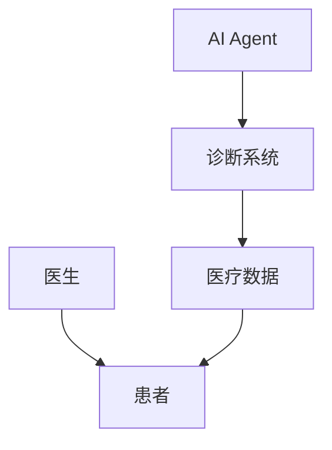

                 


# AI Agent在智能医疗诊断中的突破

> **关键词**：AI Agent, 智能医疗, 诊断突破, 算法原理, 系统架构, 医疗影像, 个性化治疗

> **摘要**：  
> 随着人工智能技术的飞速发展，AI Agent（人工智能代理）在医疗诊断领域的应用取得了显著突破。本文从AI Agent的基本概念出发，详细探讨其在智能医疗诊断中的核心原理、应用场景、系统架构及算法实现。通过结合实际案例，分析AI Agent在医疗影像诊断、辅助诊断系统及个性化治疗中的具体应用，揭示其如何通过感知、推理、决策和执行能力，显著提升医疗诊断的效率与准确性。同时，本文还深入探讨了AI Agent在智能医疗诊断中的技术挑战及未来发展方向。

---

# 第1章: AI Agent与智能医疗诊断概述

## 1.1 AI Agent的基本概念

### 1.1.1 AI Agent的定义与特点
AI Agent（人工智能代理）是指能够感知环境、理解问题、做出决策并执行行动的智能实体。其核心特点包括：
- **自主性**：能够在没有外部干预的情况下独立运行。
- **反应性**：能够实时感知环境并做出反应。
- **学习能力**：通过数据和经验不断优化自身性能。
- **可解释性**：决策过程需要具备可解释性，以满足医疗领域的严格要求。

### 1.1.2 智能医疗诊断的定义与范围
智能医疗诊断是指利用人工智能技术辅助医生进行疾病诊断的过程。其范围涵盖从初步症状分析、影像识别到个性化治疗方案推荐等多个环节。智能医疗诊断的目标是提高诊断效率、减少误诊率并降低医疗成本。

### 1.1.3 AI Agent在智能医疗诊断中的作用
AI Agent在智能医疗诊断中的作用主要体现在以下几个方面：
- **数据采集与处理**：通过传感器或医疗设备收集患者的生理数据。
- **知识推理**：基于医学知识库和患者数据，推理出可能的诊断结果。
- **决策支持**：为医生提供多种诊断方案，并推荐最优解。
- **实时反馈**：根据患者病情变化实时调整诊断策略。

---

## 1.2 智能医疗诊断的背景与现状

### 1.2.1 医疗诊断的传统模式
传统医疗诊断主要依赖医生的经验和知识，通过问诊、检查和实验室检测等方式进行。这种方式存在效率低、误诊率高、资源浪费等问题。

### 1.2.2 智能医疗诊断的发展历程
随着计算机技术的发展，医疗诊断逐渐从传统模式向智能化模式转变。从早期的规则-based系统到现在的深度学习算法，智能医疗诊断技术经历了多个阶段的演进。

### 1.2.3 当前智能医疗诊断的主要技术与挑战
当前智能医疗诊断的主要技术包括：
- **机器学习**：用于疾病分类和预测。
- **自然语言处理**：用于医疗文档分析。
- **计算机视觉**：用于医学影像识别。

主要挑战包括数据隐私、模型可解释性、算法泛化能力等问题。

---

## 1.3 AI Agent在智能医疗诊断中的突破

### 1.3.1 AI Agent的核心技术突破
AI Agent在智能医疗诊断中的核心技术突破主要体现在以下几个方面：
- **多模态数据融合**：能够同时处理图像、文本、生理数据等多种数据类型。
- **实时推理能力**：能够在短时间内完成复杂推理任务。
- **可解释性增强**：通过可视化技术提升模型决策的透明度。

### 1.3.2 智能医疗诊断中的关键问题
智能医疗诊断中的关键问题包括：
- **数据质量**：医疗数据的不完整性和噪声对模型性能的影响。
- **模型泛化能力**：如何在不同场景下保持模型的准确性。
- **伦理问题**：AI诊断的误诊责任归属。

### 1.3.3 AI Agent如何解决这些问题
AI Agent通过以下方式解决这些问题：
- **数据预处理**：利用先进的数据清洗技术提升数据质量。
- **模型优化**：采用迁移学习和小样本学习技术提升模型泛化能力。
- **伦理框架设计**：建立明确的责任划分机制，确保AI诊断的伦理合规性。

---

## 1.4 本章小结

本章从AI Agent的基本概念出发，介绍了智能医疗诊断的传统模式和当前技术发展现状。重点分析了AI Agent在智能医疗诊断中的核心技术突破及其在解决实际问题中的应用价值。通过对比传统诊断模式与智能诊断模式的优劣，揭示了AI Agent在医疗诊断领域的潜力与挑战。

---

# 第2章: AI Agent的核心概念与原理

## 2.1 AI Agent的核心概念

### 2.1.1 感知层：数据采集与处理
感知层是AI Agent的“眼睛和耳朵”，负责从环境中获取数据。在医疗诊断中，感知层主要通过医疗设备和传感器采集患者的生理数据。



---

### 2.1.2 推理层：知识表示与推理
推理层是AI Agent的核心，负责根据感知层获取的数据进行推理。常见的推理方法包括基于规则的推理和基于概率的推理。

### 2.1.3 决策层：策略制定与优化
决策层基于推理结果制定最优决策。在医疗诊断中，决策层需要综合考虑多种因素，如患者的病情、治疗方案的可行性等。

### 2.1.4 执行层：行动与反馈
执行层负责将决策层制定的策略转化为具体行动，并通过反馈机制不断优化自身性能。

---

## 2.2 AI Agent的算法原理

### 2.2.1 基于规则的推理
基于规则的推理是一种简单的推理方法，适用于规则明确的场景。例如，在诊断某些常见病时，可以通过预设的规则进行判断。

### 2.2.2 基于概率的推理
基于概率的推理适用于不确定性较高的场景。例如，在诊断罕见病时，可以通过贝叶斯网络进行概率推理。

### 2.2.3 基于深度学习的推理
基于深度学习的推理是当前研究的热点。通过训练深度神经网络，AI Agent可以自动提取数据中的特征并进行分类。

---

## 2.3 本章小结

本章详细介绍了AI Agent的核心概念与算法原理。通过分析感知层、推理层、决策层和执行层的功能，揭示了AI Agent在智能医疗诊断中的工作原理。同时，通过对不同推理方法的对比，为后续章节的算法实现奠定了基础。

---

# 第3章: AI Agent在医疗诊断中的应用场景

## 3.1 医疗影像诊断

### 3.1.1 基于AI Agent的影像识别技术
医疗影像诊断是AI Agent在智能医疗中的重要应用之一。通过计算机视觉技术，AI Agent可以辅助医生快速识别病灶。

### 3.1.2 AI Agent在影像诊断中的优势
- **高效性**：能够快速处理大量影像数据。
- **准确性**：通过深度学习算法提升诊断的准确性。
- **可扩展性**：能够应用于多种类型的医疗影像。

### 3.1.3 实际案例分析
以肺癌筛查为例，AI Agent可以通过分析CT影像，帮助医生发现早期病灶。

---

## 3.2 智能辅助诊断系统

### 3.2.1 系统构成与功能
智能辅助诊断系统通常包括数据采集模块、推理模块和人机交互模块。医生可以通过该系统快速获取诊断建议。

### 3.2.2 AI Agent在辅助诊断中的具体应用
- **症状分析**：通过自然语言处理技术分析患者的症状。
- **诊断建议**：基于知识库提供多种诊断可能性。

### 3.2.3 实际案例分析
以心脏病诊断为例，AI Agent可以通过分析心电图数据，辅助医生快速诊断。

---

## 3.3 个性化治疗

### 3.3.1 个性化治疗的定义与意义
个性化治疗是指根据患者的个体特征制定个性化治疗方案。AI Agent可以通过分析患者的基因信息、生活习惯等数据，提供个性化的治疗建议。

### 3.3.2 AI Agent在个性化治疗中的应用
- **药物推荐**：根据患者的基因信息推荐个性化用药方案。
- **治疗方案优化**：通过模拟不同治疗方案的效果，选择最优解。

### 3.3.3 实际案例分析
以癌症治疗为例，AI Agent可以通过分析患者的肿瘤基因信息，推荐个性化化疗方案。

---

## 3.4 本章小结

本章通过分析AI Agent在医疗影像诊断、智能辅助诊断系统和个性化治疗中的具体应用，揭示了其在智能医疗诊断中的巨大潜力。通过实际案例分析，进一步验证了AI Agent在提高诊断效率和准确性方面的有效性。

---

# 第4章: AI Agent的算法实现与优化

## 4.1 算法实现

### 4.1.1 数据预处理
数据预处理是AI Agent算法实现的第一步。主要包括数据清洗、特征提取和数据增强。

### 4.1.2 模型训练
模型训练是AI Agent算法实现的核心环节。通过训练深度神经网络，提升模型的分类精度。

### 4.1.3 模型推理
模型推理是AI Agent完成诊断任务的关键步骤。通过输入患者的生理数据，模型生成诊断结果。

---

## 4.2 算法优化

### 4.2.1 数据增强技术
数据增强技术通过生成更多的训练数据，提升模型的泛化能力。

### 4.2.2 模型压缩技术
模型压缩技术通过减少模型的参数数量，降低计算成本。

### 4.2.3 模型融合技术
模型融合技术通过结合多个模型的输出结果，提升诊断的准确性。

---

## 4.3 本章小结

本章详细介绍了AI Agent的算法实现与优化方法。通过数据预处理、模型训练和模型推理等步骤，揭示了AI Agent在智能医疗诊断中的技术细节。同时，通过对数据增强、模型压缩和模型融合技术的分析，为后续章节的系统设计提供了技术支持。

---

# 第5章: AI Agent的系统架构与设计

## 5.1 系统架构

### 5.1.1 系统组成
AI Agent的系统架构通常包括感知层、推理层、决策层和执行层。

### 5.1.2 系统交互流程
系统交互流程包括数据采集、模型推理、结果输出和反馈优化。


---

## 5.2 系统设计

### 5.2.1 领域模型设计
领域模型设计是系统设计的关键。通过构建领域模型，明确系统的功能模块和数据流。

### 5.2.2 系统架构设计
系统架构设计需要考虑系统的扩展性、可靠性和可维护性。

### 5.2.3 接口设计
接口设计是系统与其他模块交互的重要部分。需要定义清晰的接口规范。

---

## 5.3 本章小结

本章详细介绍了AI Agent的系统架构与设计方法。通过领域模型设计、系统架构设计和接口设计，揭示了AI Agent在智能医疗诊断中的技术细节。系统架构设计为后续章节的项目实现奠定了基础。

---

# 第6章: AI Agent的项目实战与案例分析

## 6.1 项目实战

### 6.1.1 环境配置
项目实战需要配置合适的开发环境。推荐使用Python语言和深度学习框架。

### 6.1.2 系统核心实现
系统核心实现包括数据预处理、模型训练和模型推理。

### 6.1.3 代码实现
以下是AI Agent的代码实现示例：

```python
import numpy as np
import tensorflow as tf

model = tf.keras.Sequential([
    tf.keras.layers.Conv2D(32, (3,3), activation='relu', input_shape=(64,64,3)),
    tf.keras.layers.MaxPooling2D((2,2)),
    tf.keras.layers.Conv2D(64, (3,3), activation='relu'),
    tf.keras.layers.MaxPooling2D((2,2)),
    tf.keras.layers.Flatten(),
    tf.keras.layers.Dense(128, activation='relu'),
    tf.keras.layers.Dense(1, activation='sigmoid')
])

model.compile(optimizer='adam', loss='binary_crossentropy', metrics=['accuracy'])
model.fit(x_train, y_train, epochs=10, batch_size=32)
```

---

## 6.2 案例分析

### 6.2.1 案例背景
以肺癌筛查为例，AI Agent可以通过分析CT影像，帮助医生发现早期病灶。

### 6.2.2 数据分析
分析患者的CT影像数据，提取特征并进行分类。

### 6.2.3 模型评估
通过混淆矩阵和ROC曲线评估模型的性能。

---

## 6.3 本章小结

本章通过项目实战和案例分析，详细介绍了AI Agent在智能医疗诊断中的具体实现方法。通过代码实现和案例分析，进一步验证了AI Agent在提高诊断效率和准确性方面的有效性。

---

# 第7章: 总结与展望

## 7.1 总结
本文从AI Agent的基本概念出发，详细探讨了其在智能医疗诊断中的核心原理、应用场景、系统架构及算法实现。通过实际案例分析，揭示了AI Agent在提高诊断效率和准确性方面的巨大潜力。

## 7.2 展望
未来，AI Agent在智能医疗诊断中的应用将更加广泛。随着技术的不断进步，AI Agent将具备更强的感知、推理和决策能力，为医疗诊断领域带来更多突破。

---

# 结语

AI Agent在智能医疗诊断中的突破不仅提高了诊断效率，还为患者提供了更加精准的医疗服务。随着技术的不断发展，AI Agent将在医疗诊断领域发挥更大的作用，为人类健康保驾护航。

---

