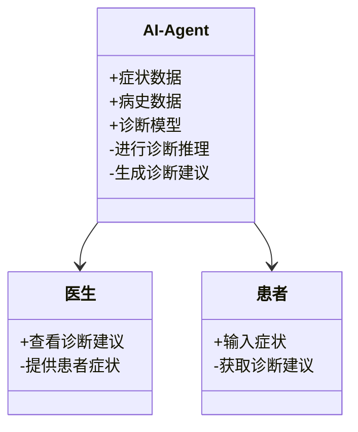
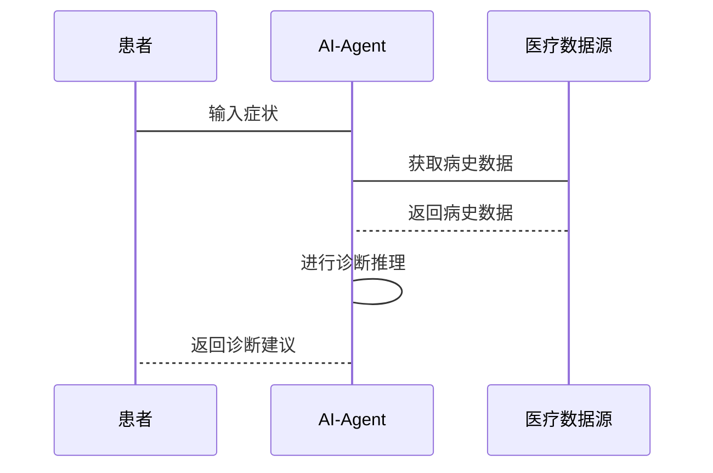

                 


# AI Agent在智能医疗诊断中的角色

---

## 关键词
AI Agent, 智能医疗, 医疗诊断, 机器学习, 自然语言处理, 决策树算法

---

## 摘要
AI Agent（人工智能代理）在智能医疗诊断中扮演着越来越重要的角色。随着人工智能技术的快速发展，AI Agent能够通过机器学习、自然语言处理和知识图谱等技术，辅助医生进行疾病诊断、治疗方案推荐和患者管理。本文详细探讨了AI Agent在医疗诊断中的核心概念、算法原理、系统架构以及实际应用案例，分析了其在提升医疗诊断效率和准确性方面的重要价值，并展望了未来的发展方向。

---

# 第一部分: AI Agent与智能医疗诊断的背景

## 第1章: AI Agent与智能医疗诊断概述

### 1.1 AI Agent的基本概念

#### 1.1.1 AI Agent的定义与特点
AI Agent是一种智能体，能够感知环境、执行任务并做出决策。其特点包括：
- **自主性**：无需外部干预，自主完成任务。
- **反应性**：能够实时感知环境并做出反应。
- **学习能力**：通过数据和经验不断优化性能。
- **社交能力**：能够与人类或其他系统进行交互。

#### 1.1.2 AI Agent在医疗领域的应用背景
医疗领域对AI Agent的需求日益增长，主要体现在：
- **数据量大**：医疗数据的复杂性和多样性要求智能化处理。
- **精准诊断**：通过AI Agent提高诊断的准确性和效率。
- **患者需求**：患者期望获得个性化的医疗建议和快速响应。

#### 1.1.3 AI Agent与智能医疗诊断的关联
AI Agent通过自然语言处理、机器学习等技术，能够帮助医生分析病历、识别症状、预测疾病，从而辅助诊断过程。

---

### 1.2 智能医疗诊断的现状与挑战

#### 1.2.1 当前医疗诊断的主要方式
传统的医疗诊断主要依赖医生的经验和病历分析，存在以下问题：
- **效率低**：医生需要手动分析大量数据。
- **主观性强**：诊断结果受到医生经验的影响。
- **资源有限**：医疗资源分布不均，难以满足需求。

#### 1.2.2 传统医疗诊断的局限性
- **数据孤岛**：不同医院和系统的数据难以共享。
- **诊断错误**：医生可能因为疲劳或经验不足导致误诊。
- **患者参与度低**：患者无法充分参与诊断过程。

#### 1.2.3 AI技术在医疗诊断中的潜力
- **提高效率**：AI Agent可以快速分析大量数据，辅助医生做出决策。
- **减少错误**：通过算法优化，降低误诊率。
- **个性化医疗**：基于患者的个体数据，提供定制化诊断方案。

---

### 1.3 AI Agent在智能医疗诊断中的角色

#### 1.3.1 AI Agent在医疗诊断中的功能定位
AI Agent在医疗诊断中的角色包括：
- **数据处理**：收集、整理和分析医疗数据。
- **诊断推理**：基于数据进行疾病预测和诊断建议。
- **患者交互**：通过自然语言与患者互动，提供医疗建议。

#### 1.3.2 AI Agent与医生、患者的互动模式
- **医生与AI Agent**：医生可以通过AI Agent获取数据支持和诊断建议。
- **患者与AI Agent**：患者可以与AI Agent进行对话，获得初步诊断建议。
- **AI Agent与系统**：AI Agent可以与其他医疗系统（如电子病历）集成，实现数据共享。

#### 1.3.3 AI Agent在医疗诊断中的优势与劣势
- **优势**：
  - 24/7可用性，随时提供服务。
  - 高效的数据处理能力。
- **劣势**：
  - 目前仍依赖于数据质量和算法准确性。
  - 需要与医生协同工作，无法完全替代医生。

---

## 1.4 本章小结
本章介绍了AI Agent的基本概念及其在智能医疗诊断中的角色，分析了传统医疗诊断的局限性以及AI Agent的潜力和优势。通过本章内容，读者可以理解AI Agent在医疗诊断中的重要性及其应用前景。

---

## 第2章: AI Agent的核心概念与技术基础

### 2.1 AI Agent的体系结构

#### 2.1.1 AI Agent的定义与分类
AI Agent可以根据功能和应用场景分为以下几类：
- **推理型AI Agent**：基于知识库进行推理和决策。
- **学习型AI Agent**：通过机器学习不断优化性能。
- **交互型AI Agent**：与人类或其他系统进行实时交互。

#### 2.1.2 AI Agent的基本组成模块
AI Agent的典型组成模块包括：
- **感知模块**：负责数据的采集和解析。
- **推理模块**：基于知识库进行逻辑推理。
- **决策模块**：根据推理结果做出决策。
- **执行模块**：将决策转化为具体操作。

#### 2.1.3 AI Agent的决策机制
AI Agent的决策机制通常包括以下步骤：
1. **感知环境**：收集相关数据。
2. **知识推理**：基于知识库进行推理。
3. **决策选择**：根据推理结果选择最优方案。
4. **执行操作**：将决策付诸实施。

---

### 2.2 AI Agent的功能特性

#### 2.2.1 信息处理能力
AI Agent能够处理多种类型的数据，包括文本、图像和结构化数据。

#### 2.2.2 自然语言理解能力
AI Agent通过NLP技术，能够理解患者的自然语言输入，并生成相应的回应。

#### 2.2.3 知识库构建与管理
AI Agent需要构建和管理庞大的知识库，包括医学知识、临床指南和药物信息。

---

### 2.3 AI Agent在医疗诊断中的具体应用

#### 2.3.1 病症分析与诊断推理
AI Agent可以通过分析患者的症状和病史，辅助医生进行病症分类和诊断推理。

#### 2.3.2 医疗数据的智能处理
AI Agent可以对电子病历、检查报告等医疗数据进行智能处理，提取关键信息。

#### 2.3.3 个性化治疗方案的推荐
AI Agent可以根据患者的个体情况，推荐个性化的治疗方案。

---

## 2.4 本章小结
本章详细介绍了AI Agent的体系结构、功能特性及其在医疗诊断中的具体应用，为后续章节的分析奠定了基础。

---

## 第3章: AI Agent的算法原理与数学模型

### 3.1 机器学习算法基础

#### 3.1.1 监督学习、无监督学习与强化学习
- **监督学习**：基于标注数据进行学习，常用于分类和回归任务。
- **无监督学习**：基于未标注数据进行学习，常用于聚类和降维任务。
- **强化学习**：通过试错机制优化决策策略。

#### 3.1.2 常见的机器学习算法介绍
- **决策树**：通过构建树状结构进行分类和回归。
- **随机森林**：通过集成多个决策树提高模型性能。
- **支持向量机**：用于分类和回归任务，具有良好的泛化能力。
- **神经网络**：通过多层神经元模拟人脑的处理方式。

#### 3.1.3 医疗诊断中的机器学习应用
机器学习在医疗诊断中的应用包括疾病预测、图像识别和药物研发。

---

### 3.2 自然语言处理技术

#### 3.2.1 NLP的核心技术与方法
- **分词**：将文本分割成有意义的词语。
- **实体识别**：识别文本中的命名实体。
- **文本分类**：根据文本内容进行分类。
- **文本生成**：根据输入生成相应的文本。

#### 3.2.2 医疗文本处理的NLP技术
- **医学术语处理**：处理专业术语和缩写。
- **医疗文本分类**：对医疗文档进行分类。
- **医疗对话生成**：生成医生与患者的对话。

#### 3.2.3 NLP在医疗诊断中的应用案例
例如，AI Agent可以通过NLP技术分析患者的症状描述，生成初步诊断建议。

---

### 3.3 AI Agent的决策树算法

#### 3.3.1 决策树的基本原理
决策树是一种树状结构，用于分类和回归任务。每个节点代表一个特征，叶子节点代表最终的分类结果。

#### 3.3.2 ID3算法与信息增益计算
ID3算法通过计算信息增益选择最优特征，构建决策树。信息增益的计算公式如下：

$$ \text{信息增益} = H(\text{原始数据}) - H(\text{特征分割后的数据}) $$

其中，H代表熵的计算，公式为：

$$ H = -\sum p_i \log_2 p_i $$

---

## 3.4 本章小结
本章介绍了AI Agent中常用的机器学习算法和NLP技术，重点讲解了决策树算法的原理和应用，为后续章节的系统设计提供了算法基础。

---

## 第4章: AI Agent的系统设计与架构实现

### 4.1 系统功能设计

#### 4.1.1 问题场景介绍
假设我们开发一个医疗诊断AI Agent，用于辅助医生诊断常见疾病。

#### 4.1.2 系统功能模块
- **数据采集模块**：收集患者的症状、病史和检查结果。
- **诊断推理模块**：基于机器学习模型进行疾病预测。
- **结果呈现模块**：将诊断结果以直观的方式展示给医生和患者。

#### 4.1.3 系统功能流程
1. **数据采集**：患者输入症状，AI Agent收集数据。
2. **诊断推理**：AI Agent基于机器学习模型进行推理，生成诊断建议。
3. **结果呈现**：AI Agent将诊断结果以图表或文本形式呈现。

---

### 4.2 系统架构设计

#### 4.2.1 领域模型设计
通过Mermaid类图展示系统的核心模块及其交互关系：



---

#### 4.2.2 系统架构设计
通过Mermaid架构图展示系统的整体架构：

```mermaid
archi
    title 医疗诊断AI Agent架构图
    国际标准时间
    component 医疗数据源 {
        data 病历数据
        data 检查结果
    }
    component AI-Agent {
        service 数据采集
        service 诊断推理
        service 结果呈现
    }
    component 医生端 {
        service 查看诊断建议
    }
    component 患者端 {
        service 获取诊断建议
    }
    医疗数据源 --> AI-Agent
    AI-Agent --> 医生端
    AI-Agent --> 患者端
```

---

#### 4.2.3 接口与交互设计
通过Mermaid序列图展示系统交互流程：



---

## 4.3 本章小结
本章详细设计了AI Agent的系统功能模块、架构和交互流程，为实际开发提供了参考。

---

## 第5章: AI Agent在医疗诊断中的项目实战

### 5.1 环境搭建

#### 5.1.1 开发工具安装
- **Python**：安装Python 3.8及以上版本。
- **机器学习库**：安装Scikit-learn、XGBoost等。
- **NLP库**：安装spaCy、NLTK等。
- **可视化工具**：安装Matplotlib、Seaborn。

#### 5.1.2 数据集准备
- 数据来源：可以从公开数据集获取医疗数据，或与医院合作获取。
- 数据预处理：清洗、标注和格式化数据。

---

### 5.2 系统核心实现

#### 5.2.1 代码实现

```python
# 示例代码：基于决策树的疾病诊断
from sklearn.tree import DecisionTreeClassifier
from sklearn.model_selection import train_test_split
from sklearn.metrics import accuracy_score

# 数据加载与预处理
data = [...]  # 加载医疗数据
features = [...]  # 特征列
label = [...]     # 标签列

# 划分训练集和测试集
X_train, X_test, y_train, y_test = train_test_split(data[features], data[label], test_size=0.2)

# 模型训练
model = DecisionTreeClassifier()
model.fit(X_train, y_train)

# 模型预测
y_pred = model.predict(X_test)

# 模型评估
print("Accuracy:", accuracy_score(y_test, y_pred))
```

#### 5.2.2 代码解读
- **数据加载与预处理**：加载数据并进行必要的清洗和格式化。
- **模型训练**：使用决策树算法训练模型。
- **模型预测**：对测试数据进行预测。
- **模型评估**：计算准确率，评估模型性能。

---

#### 5.2.3 案例分析
以一个具体的疾病诊断案例为例，展示AI Agent如何通过机器学习模型进行诊断推理。

---

## 5.3 本章小结
本章通过实际项目案例，展示了AI Agent在医疗诊断中的实现过程，包括环境搭建、代码实现和案例分析。

---

## 第6章: 总结与展望

### 6.1 总结
AI Agent在智能医疗诊断中具有重要的应用价值。通过机器学习和NLP技术，AI Agent能够辅助医生提高诊断效率和准确性，同时为患者提供个性化的医疗建议。

---

### 6.2 未来展望
AI Agent在医疗诊断中的发展将朝着以下几个方向推进：
1. **多模态数据处理**：结合图像、文本等多种数据源，提升诊断的准确性。
2. **可解释性增强**：提高AI Agent的决策透明度，便于医生理解和信任。
3. **个性化医疗**：基于患者的个体特征，提供更加个性化的诊断方案。
4. **实时响应**：优化AI Agent的响应速度，实现实时诊断支持。

---

## 第7章: 附录

### 7.1 相关工具与库
- **机器学习**：Scikit-learn、XGBoost、LightGBM。
- **自然语言处理**：spaCy、NLTK、Gensim。
- **可视化工具**：Matplotlib、Seaborn、Plotly。

### 7.2 推荐阅读
- 《Deep Learning》——Ian Goodfellow
- 《Natural Language Processing with Python》——Steven Bird
- 《Medical Imaging and AI》——李飞飞团队

---

## 本章小结
附录部分提供了与AI Agent相关的工具和文献推荐，帮助读者进一步学习和深入研究。

---

通过以上章节的详细展开，我们可以全面了解AI Agent在智能医疗诊断中的角色及其实际应用。希望本文能够为相关领域的研究者和开发者提供有价值的参考和启发。

