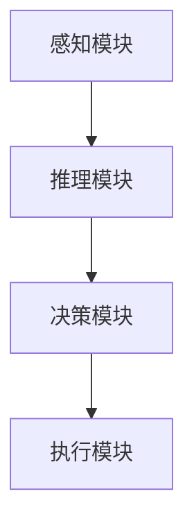
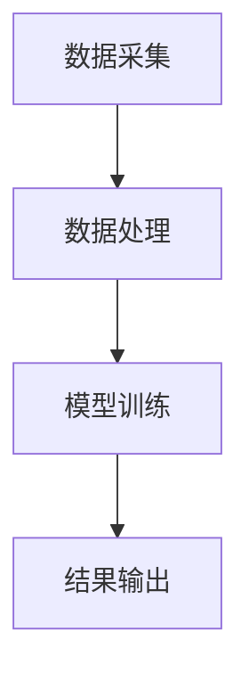
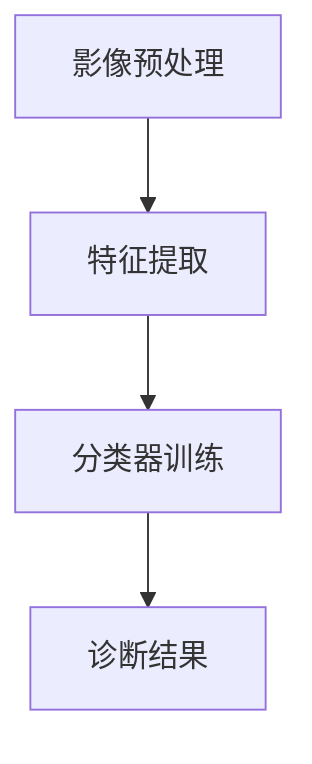
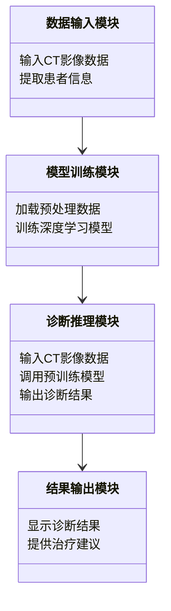
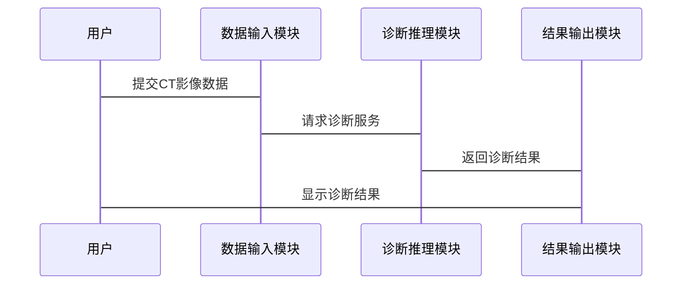

                 


# AI Agent在智能医疗诊断系统中的角色

## 关键词：AI Agent, 智能医疗诊断系统, 机器学习, 深度学习, 医疗影像分析, 诊断系统架构

## 摘要：  
本文深入探讨了AI Agent在智能医疗诊断系统中的角色及其应用价值。通过分析AI Agent的核心概念、算法原理、系统架构及具体应用场景，揭示其在医疗影像诊断、疾病预测和治疗方案优化中的潜力。文章结合实际案例，详细讲解了基于深度学习的疾病诊断系统实现，并对未来发展方向进行了展望。

---

## 正文

### 第一部分：AI Agent与智能医疗诊断的背景

#### 第1章：AI Agent与智能医疗诊断的背景

##### 1.1 AI Agent的基本概念

###### 1.1.1 AI Agent的定义与特点  
AI Agent（人工智能代理）是指能够感知环境、自主决策并执行任务的智能实体。其特点包括：  
- **智能性**：能够通过数据学习和推理，做出决策。  
- **自主性**：无需人工干预，自主完成任务。  
- **适应性**：能够根据环境变化调整行为。  

###### 1.1.2 AI Agent在医疗领域的应用背景  
随着医疗数据的爆炸式增长，传统的人工诊断方式面临效率低下、误诊率高等问题。AI Agent的引入为医疗诊断提供了新的解决方案，能够快速处理海量数据，提高诊断准确率。  

###### 1.1.3 AI Agent与传统医疗诊断的区别  
AI Agent通过机器学习和深度学习等技术，能够从大量数据中提取规律，辅助医生做出更精准的诊断。与传统诊断相比，AI Agent具有更高的效率和准确性。  

##### 1.2 智能医疗诊断的发展现状  

###### 1.2.1 智能医疗诊断的定义与范围  
智能医疗诊断是指利用人工智能技术，通过分析患者的症状、影像、基因数据等，辅助医生进行疾病诊断的过程。  

###### 1.2.2 当前智能医疗诊断的主要技术手段  
当前，智能医疗诊断主要依赖于机器学习、深度学习、自然语言处理等技术。  

###### 1.2.3 AI Agent在智能医疗诊断中的优势  
AI Agent能够快速处理复杂数据，提供个性化的诊断建议，减少人为错误，提高诊断效率。  

---

### 第二部分：AI Agent的核心概念与原理

#### 第2章：AI Agent的核心概念与原理

##### 2.1 AI Agent的核心概念  

###### 2.1.1 AI Agent的定义与分类  
AI Agent可以分为基于规则的AI Agent和基于机器学习的AI Agent。  

| 类型           | 描述                                   |  
|----------------|--------------------------------------|  
| 基于规则的AI Agent | 通过预定义的规则进行决策               |  
| 基于机器学习的AI Agent | 通过数据训练模型进行决策             |  

###### 2.1.2 AI Agent的主要功能模块  
AI Agent的功能模块包括：感知模块、推理模块、决策模块和执行模块。  



##### 2.2 AI Agent的算法原理  

###### 2.2.1 常见的AI Agent算法概述  
常见的AI Agent算法包括监督学习、无监督学习和强化学习。  

###### 2.2.2 机器学习在AI Agent中的应用  
机器学习通过训练数据模型，帮助AI Agent做出预测和决策。  

###### 2.2.3 深度学习在AI Agent中的应用  
深度学习通过多层神经网络，能够从复杂数据中提取特征，提高诊断准确率。  

---

### 第三部分：AI Agent在医疗诊断中的具体应用

#### 第3章：AI Agent在医疗诊断中的具体应用

##### 3.1 基于AI Agent的疾病诊断系统  

###### 3.1.1 系统的总体架构  
基于AI Agent的疾病诊断系统的总体架构包括数据采集、数据处理、模型训练和结果输出四个部分。  



##### 3.2 AI Agent在医疗影像诊断中的应用  

###### 3.2.1 医疗影像数据的处理与分析  
AI Agent能够对医疗影像进行分割、分类和识别，帮助医生快速定位病灶。  

###### 3.2.2 基于AI Agent的影像诊断流程  
AI Agent通过预处理、特征提取和分类器训练，实现对医疗影像的自动化诊断。  



##### 3.3 典型案例分析  
以肺癌早期筛查为例，AI Agent能够从CT影像中识别可疑区域，辅助医生做出诊断。  

---

### 第四部分：AI Agent在智能医疗诊断中的算法实现

#### 第4章：AI Agent的算法实现

##### 4.1 监督学习算法  

###### 4.1.1 监督学习的基本原理  
监督学习通过训练数据模型，学习输入与输出之间的映射关系。  

###### 4.1.2 常见的监督学习算法  
常用的监督学习算法包括支持向量机（SVM）和随机森林（Random Forest）。  

##### 4.2 深度学习算法  

###### 4.2.1 深度学习的基本原理  
深度学习通过多层神经网络，自动提取数据特征。  

###### 4.2.2 常见的深度学习模型  
常用的深度学习模型包括卷积神经网络（CNN）和循环神经网络（RNN）。  

---

### 第五部分：AI Agent在智能医疗诊断系统中的系统分析与架构设计

#### 第5章：系统分析与架构设计

##### 5.1 问题场景介绍  
本文设计了一个基于深度学习的疾病诊断系统，用于辅助医生进行肺癌早期筛查。  

##### 5.2 系统功能设计  

###### 5.2.1 领域模型设计  
系统的主要功能模块包括数据输入、模型训练、诊断推理和结果输出。  



##### 5.3 系统架构设计  

###### 5.3.1 系统架构设计  
系统采用微服务架构，分为数据层、算法层、服务层和用户层。  


##### 5.4 系统接口设计  
系统主要接口包括数据接口、模型调用接口和结果展示接口。  

##### 5.5 系统交互设计  



---

### 第六部分：项目实战

#### 第6章：项目实战

##### 6.1 环境安装  
项目基于Python 3.8及以上版本，需要安装TensorFlow、Keras和Pillow库。  

##### 6.2 系统核心实现  

###### 6.2.1 数据加载  
```python
import tensorflow as tf
from tensorflow.keras import layers

def load_data():
    # 加载CT影像数据
    # 返回训练数据和标签
    pass
```

###### 6.2.2 模型训练  
```python
def train_model(train_data, train_labels):
    model = tf.keras.Sequential([
        layers.Conv2D(32, (3,3), activation='relu', input_shape=(224, 224, 3)),
        layers.MaxPooling2D((2,2)),
        layers.Conv2D(64, (3,3), activation='relu'),
        layers.MaxPooling2D((2,2)),
        layers.Flatten(),
        layers.Dense(64, activation='relu'),
        layers.Dense(1, activation='sigmoid')
    ])
    model.compile(optimizer='adam', loss='binary_crossentropy', metrics=['accuracy'])
    model.fit(train_data, train_labels, epochs=10, batch_size=32)
    return model
```

###### 6.2.3 模型评估  
```python
def evaluate_model(model, test_data, test_labels):
    loss, accuracy = model.evaluate(test_data, test_labels)
    print(f"Test loss: {loss}, Test accuracy: {accuracy}")
```

##### 6.3 项目小结  
通过本项目，我们实现了基于深度学习的疾病诊断系统，验证了AI Agent在医疗诊断中的有效性。  

---

### 第七部分：总结与展望

#### 第7章：总结与展望

##### 7.1 总结  
本文详细探讨了AI Agent在智能医疗诊断系统中的角色，分析了其核心概念、算法原理和系统架构，并通过实际案例展示了其应用价值。  

##### 7.2 展望  
未来，AI Agent在医疗诊断中的应用将更加广泛，尤其是在复杂疾病的诊断和个性化治疗方案的制定方面。同时，需要进一步解决数据隐私、模型可解释性等问题，以推动AI Agent在医疗领域的深入应用。  

---

#### 最佳实践 Tips

- **数据隐私保护**：在处理医疗数据时，需严格遵守相关隐私保护法规。  
- **模型可解释性**：确保AI Agent的决策过程透明，便于医生理解和信任。  
- **持续优化**：定期更新模型，以适应新的医疗数据和诊断需求。  

---

通过以上内容，我们全面探讨了AI Agent在智能医疗诊断系统中的角色及其应用价值。希望本文能够为相关领域的研究和实践提供有价值的参考。

