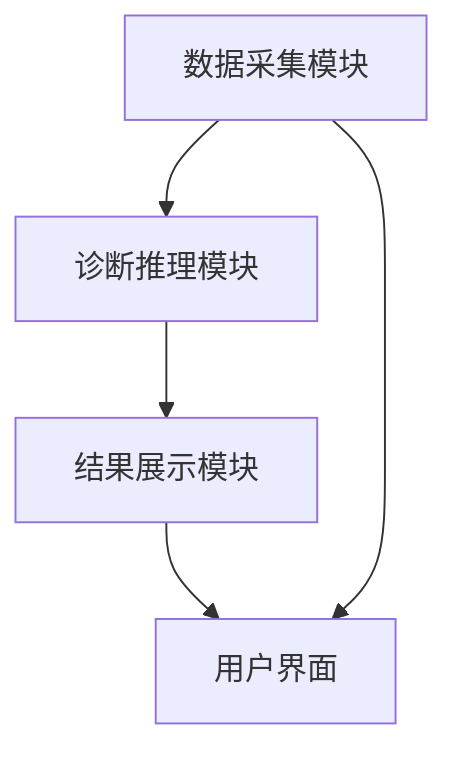
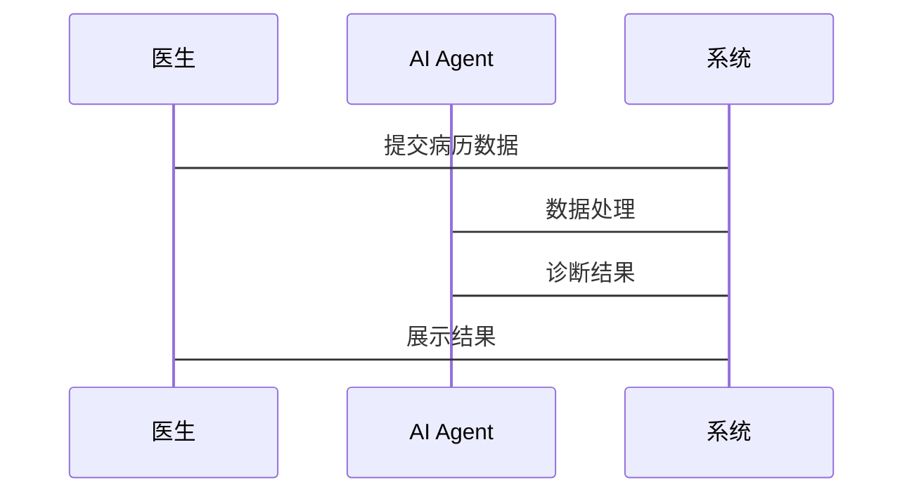

                 


# AI Agent在智能医疗诊断辅助中的角色

**关键词**：AI Agent, 智能医疗, 医疗诊断, 人工智能, 医疗影像分析, 诊断辅助系统

**摘要**：AI Agent在智能医疗诊断中的应用正变得越来越重要，它通过整合先进的人工智能技术，如机器学习和自然语言处理，为医疗诊断提供了高效、准确的辅助工具。本文将详细探讨AI Agent在医疗诊断中的角色，包括其核心概念、技术原理、系统架构以及实际应用场景。通过分析AI Agent的优势与挑战，本文旨在为医疗领域的人工智能应用提供深入的见解。

---

## 第1章 AI Agent与智能医疗诊断概述

### 1.1 AI Agent的基本概念

#### 1.1.1 AI Agent的定义与特点
AI Agent（人工智能代理）是一种能够感知环境、自主决策并执行任务的智能体。它具备以下特点：
- **自主性**：能够在没有外部干预的情况下运行。
- **反应性**：能够根据环境输入实时调整行为。
- **目标导向**：通过设定目标来驱动决策过程。
- **学习能力**：能够通过数据和经验不断优化性能。

#### 1.1.2 AI Agent的核心属性与特征
AI Agent的核心属性包括：
- **感知能力**：通过传感器或数据输入感知环境。
- **推理能力**：基于感知信息进行逻辑推理。
- **决策能力**：根据推理结果做出决策。
- **执行能力**：通过执行机构将决策转化为行动。

#### 1.1.3 AI Agent与传统医疗诊断工具的对比
传统医疗诊断工具主要依赖医生的经验和手动操作，而AI Agent则通过自动化和智能化的方式辅助诊断。下表对比了AI Agent与传统诊断工具的关键差异：

| 特性                 | 传统诊断工具       | AI Agent               |
|----------------------|--------------------|-------------------------|
| 决策速度             | 较慢               | 极快                    |
| 准确率               | 取决于医生经验     | 高，基于大数据分析     |
| 学习能力             | 有限               | 强大，可自适应优化     |
| 处理复杂性           | 低                 | 高                     |

### 1.2 智能医疗诊断的基本概念

#### 1.2.1 智能医疗诊断的定义
智能医疗诊断是指利用人工智能技术，通过分析医疗数据（如病历、影像、基因信息等）来辅助医生进行疾病诊断的过程。

#### 1.2.2 智能医疗诊断的核心技术
智能医疗诊断的核心技术包括：
- **机器学习**：用于模式识别和分类。
- **深度学习**：用于处理复杂的数据结构，如图像和文本。
- **自然语言处理**：用于分析非结构化数据，如病历文本。
- **强化学习**：用于优化诊断流程和决策。

#### 1.2.3 智能医疗诊断的应用场景
AI Agent在智能医疗诊断中的应用场景包括：
- **病症诊断**：通过分析症状和检查结果，辅助医生诊断疾病。
- **医疗影像分析**：识别医学影像中的异常区域，如X光片中的病变。
- **疾病预测**：基于患者的病史和基因信息，预测疾病风险。

### 1.3 AI Agent在智能医疗诊断中的角色

#### 1.3.1 AI Agent在医疗诊断中的功能定位
AI Agent在医疗诊断中主要承担以下功能：
- **数据处理**：整合和分析多种数据源。
- **诊断推理**：基于数据进行推理和预测。
- **决策支持**：为医生提供诊断建议。

#### 1.3.2 AI Agent与医生、患者的交互关系
AI Agent作为辅助工具，与医生和患者的关系如下：
- **与医生的关系**：AI Agent帮助医生提高诊断效率和准确性。
- **与患者的关系**：通过患者界面提供自我诊断和健康建议。

#### 1.3.3 AI Agent在医疗诊断中的优势与局限性
AI Agent的优势包括高效性、准确性、可扩展性等，但其局限性在于依赖数据质量、模型可解释性不足等问题。

---

## 第2章 AI Agent的核心概念与技术原理

### 2.1 AI Agent的核心概念

#### 2.1.1 AI Agent的定义与分类
AI Agent可以根据功能和应用场景进行分类，常见的分类包括：
- **基于规则的AI Agent**：通过预定义的规则进行决策。
- **基于学习的AI Agent**：通过机器学习模型进行预测和决策。
- **基于知识的AI Agent**：利用知识库进行推理。

#### 2.1.2 AI Agent的核心属性与特征
AI Agent的核心属性包括：
- **知识库**：存储领域知识和数据。
- **推理引擎**：用于逻辑推理和决策。
- **学习模块**：用于模型优化和自适应。

#### 2.1.3 AI Agent与智能医疗诊断的关联
AI Agent通过处理医疗数据和知识库，为医疗诊断提供智能化支持。

---

## 第3章 AI Agent在智能医疗诊断中的技术原理

### 3.1 AI Agent的算法原理

#### 3.1.1 机器学习算法
机器学习算法是AI Agent的核心，常用的算法包括：
- **支持向量机（SVM）**：用于分类问题。
- **随机森林**：用于特征提取和分类。

#### 3.1.2 深度学习算法
深度学习算法用于处理复杂数据结构，常用的模型包括：
- **卷积神经网络（CNN）**：用于图像识别。
- **循环神经网络（RNN）**：用于处理序列数据。

#### 3.1.3 强化学习算法
强化学习用于优化诊断流程和决策，常用的算法包括：
- **Q-learning**：用于策略优化。
- **深度强化学习（DQN）**：用于复杂决策问题。

### 3.2 AI Agent的数学模型与公式

#### 3.2.1 机器学习模型
机器学习模型的通用公式为：
$$ f(x) = \theta^T x + b $$
其中，$\theta$为参数，$x$为输入数据，$b$为偏置项。

#### 3.2.2 深度学习模型
深度学习模型的数学表达较为复杂，通常涉及多层非线性变换。例如，卷积层的输出可以表示为：
$$ y = \sigma(Wx + b) $$
其中，$W$为权重矩阵，$b$为偏置向量，$\sigma$为激活函数。

---

## 第4章 AI Agent在智能医疗诊断中的系统架构

### 4.1 系统功能设计

#### 4.1.1 数据采集模块
数据采集模块负责收集医疗数据，包括：
- **病历数据**：患者的病史、症状等。
- **影像数据**：如X光片、MRI图像。

#### 4.1.2 诊断推理模块
诊断推理模块基于数据进行推理和预测，包括：
- **特征提取**：从数据中提取有用的特征。
- **诊断预测**：基于特征进行疾病预测。

#### 4.1.3 结果展示模块
结果展示模块将诊断结果以直观的方式呈现给医生和患者。

### 4.2 系统架构设计

#### 4.2.1 系统架构图
以下是系统架构的Mermaid图：



#### 4.2.2 接口设计
系统接口设计包括：
- **API接口**：用于与其他系统（如医院信息管理系统）对接。
- **用户接口**：用于医生和患者的交互。

### 4.3 系统交互流程

#### 4.3.1 交互流程图
以下是系统交互流程的Mermaid图：



---

## 第5章 项目实战：AI Agent在医疗影像分析中的应用

### 5.1 环境搭建

#### 5.1.1 安装Python和相关库
安装Python和以下库：
- **TensorFlow**：用于深度学习。
- **Keras**：用于模型构建。
- **Pillow**：用于图像处理。

### 5.2 核心代码实现

#### 5.2.1 数据预处理
```python
import numpy as np
from PIL import Image

def preprocess_image(image_path):
    image = Image.open(image_path)
    image = image.resize((224, 224))
    image = np.array(image) / 255.0
    return image
```

#### 5.2.2 模型构建
```python
from tensorflow.keras import layers, Model

def build_model():
    inputs = layers.Input(shape=(224, 224, 3))
    x = layers.Conv2D(32, (3, 3), activation='relu')(inputs)
    x = layers.MaxPooling2D((2, 2))(x)
    x = layers.Conv2D(64, (3, 3), activation='relu')(x)
    x = layers.MaxPooling2D((2, 2))(x)
    x = layers.Flatten()(x)
    x = layers.Dense(256, activation='relu')(x)
    outputs = layers.Dense(2, activation='softmax')(x)
    model = Model(inputs=inputs, outputs=outputs)
    return model
```

#### 5.2.3 模型训练
```python
model = build_model()
model.compile(optimizer='adam', loss='sparse_categorical_crossentropy', metrics=['accuracy'])
model.fit(x_train, y_train, epochs=10, batch_size=32)
```

#### 5.2.4 模型推理
```python
def predict_disease(model, image_path):
    image = preprocess_image(image_path)
    image = np.expand_dims(image, axis=0)
    prediction = model.predict(image)
    return np.argmax(prediction)

result = predict_disease(model, 'image.jpg')
print(result)
```

### 5.3 实际案例分析

#### 5.3.1 案例背景
某医院需要诊断一批X光片中的肺炎病例。

#### 5.3.2 数据准备
准备一批X光片数据，标签分为正常和肺炎两种。

#### 5.3.3 模型训练与推理
训练模型后，使用测试数据进行推理，输出诊断结果。

### 5.4 项目总结

#### 5.4.1 成功经验
- 数据质量高，模型训练效果好。
- 系统架构设计合理，运行效率高。

#### 5.4.2 失败教训
- 数据标注不准确，影响模型性能。
- 模型的可解释性不足，医生难以理解诊断结果。

---

## 第6章 AI Agent在智能医疗诊断中的未来展望

### 6.1 未来发展趋势

#### 6.1.1 技术进步
- 更先进的算法（如大语言模型）的应用。
- 更高效的数据处理技术的发展。

#### 6.1.2 应用场景扩展
- 更多类型的医疗影像分析。
- 基因组学与AI Agent的结合。

### 6.2 挑战与机遇

#### 6.2.1 技术挑战
- 数据隐私与安全问题。
- 模型的可解释性问题。

#### 6.2.2 机遇
- 人工智能技术的快速发展为医疗诊断提供了更多可能性。
- 政策支持和医疗行业的数字化转型为AI Agent的应用提供了良好的环境。

---

## 第7章 最佳实践与注意事项

### 7.1 最佳实践

#### 7.1.1 数据处理
- 确保数据质量和多样性。
- 处理缺失数据和异常值。

#### 7.1.2 模型优化
- 使用交叉验证和网格搜索优化模型。
- 定期更新模型以适应新的数据。

### 7.2 注意事项

#### 7.2.1 数据隐私
- 遵守数据隐私法规，确保患者数据的安全。

#### 7.2.2 模型可解释性
- 提供清晰的解释，帮助医生理解AI Agent的决策过程。

#### 7.2.3 系统稳定性
- 确保系统的稳定性和可靠性，避免因技术问题影响诊断。

---

## 第8章 总结与展望

### 8.1 小结
AI Agent在智能医疗诊断中的应用前景广阔，它通过整合先进的人工智能技术，为医疗诊断提供了高效、准确的辅助工具。然而，其应用也面临数据隐私、模型可解释性等挑战。

### 8.2 未来展望
随着人工智能技术的不断发展，AI Agent在医疗诊断中的作用将更加重要。未来，我们需要在技术进步、数据隐私保护和模型可解释性等方面做出更多努力，以实现AI Agent在医疗诊断中的广泛应用。

---

## 第9章 拓展阅读

### 9.1 推荐书籍
- 《深度学习》——Ian Goodfellow等
- 《人工智能：一种现代的方法》—— Stuart Russell等

### 9.2 推荐论文
- "Deep Learning for Medical Imaging" —— Nature Digital Medicine
- "Artificial Intelligence in Healthcare" ——npj Digital Medicine

### 9.3 推荐在线课程
- Coursera：《人工智能基础》—— Columbia University
- edX：《医疗数据分析与机器学习》—— Harvard University

---

通过以上内容，我们详细探讨了AI Agent在智能医疗诊断辅助中的角色，从基本概念到技术原理，再到实际应用和未来展望，为读者提供了全面的视角。希望本文能为医疗领域的人工智能应用提供有价值的参考和启发。

