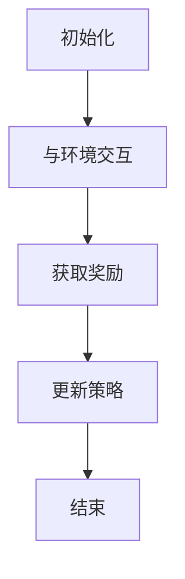
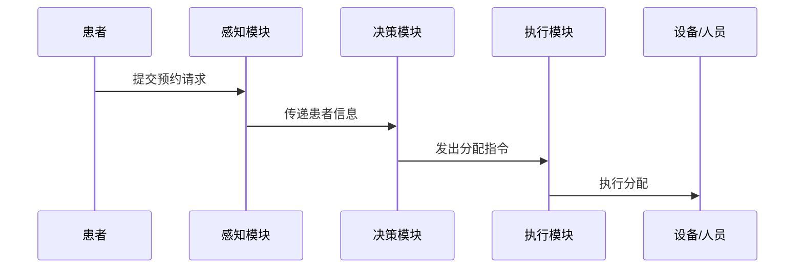

                 


# AI Agent在智能医疗资源分配中的角色

## 关键词：
AI Agent, 智能医疗, 资源分配, 优化算法, 医疗决策

## 摘要：
AI Agent在智能医疗资源分配中扮演着越来越重要的角色。通过分析医疗资源分配的背景、问题和挑战，探讨AI Agent的核心概念、算法原理和系统设计。结合实际案例，展示AI Agent如何通过感知、决策和执行实现医疗资源的智能优化分配，提高医疗系统的效率和患者满意度。文章最后总结了AI Agent在医疗资源分配中的优势与未来发展方向。

---

# 第1章 AI Agent与智能医疗资源分配概述

## 1.1 AI Agent的基本概念
### 1.1.1 人工智能代理的定义
人工智能代理（AI Agent）是指能够感知环境、自主决策并执行任务的智能体。它通过传感器获取信息，利用算法处理数据，并通过执行器与环境交互。

### 1.1.2 AI Agent的核心属性与特征
AI Agent具有以下几个核心属性：
1. **自主性**：能够在没有外部干预的情况下自主决策。
2. **反应性**：能够实时感知环境变化并做出反应。
3. **学习能力**：通过数据和经验不断优化自身的决策能力。
4. **社交能力**：能够与其他系统或人类进行有效通信和协作。

### 1.1.3 AI Agent在医疗资源分配中的应用潜力
AI Agent可以通过优化算法和智能决策帮助医院、诊所等医疗机构高效分配医疗资源，如床位、药品、医护人员等，从而提高医疗服务效率和患者满意度。

---

## 1.2 智能医疗资源分配的背景与挑战
### 1.2.1 医疗资源分配的现状与问题
1. **资源分配不均**：传统医疗资源分配方式可能导致某些地区或科室资源过剩，而其他地方资源不足。
2. **决策复杂性**：医疗资源分配需要考虑患者病情、医护人员数量、设备可用性等多个因素，决策过程复杂。
3. **效率低下**：人工分配资源容易受到主观因素影响，效率较低且容易出错。

### 1.2.2 AI技术在医疗资源分配中的优势
1. **高效性**：AI Agent能够快速处理大量数据，提供最优分配方案。
2. **准确性**：基于数学模型和优化算法，AI Agent可以做出更精确的决策。
3. **实时性**：能够实时监控资源使用情况并动态调整分配策略。

### 1.2.3 医疗资源分配中的边界与外延
医疗资源分配的边界包括医院内部资源分配和跨机构资源分配，外延则涉及患者预约、转运、远程医疗等环节。

---

## 1.3 本章小结
本章介绍了AI Agent的基本概念和核心属性，分析了医疗资源分配的现状和挑战，并阐述了AI Agent在医疗资源分配中的潜力和优势。

---

# 第2章 AI Agent的核心原理与数学模型

## 2.1 AI Agent的决策模型
### 2.1.1 基于概率的决策模型
AI Agent通过分析历史数据和实时信息，利用概率模型预测不同决策的可能结果，从而选择最优方案。例如，可以使用贝叶斯网络进行概率推理。

$$ P(A|B) = \frac{P(B|A)P(A)}{P(B)} $$

### 2.1.2 基于强化学习的决策过程
强化学习是一种通过试错机制优化决策的算法。AI Agent通过与环境交互，不断优化自身的决策策略，以最大化累积奖励。

$$ R(s, a) = r \times s + \gamma \times R(s', a') $$

### 2.1.3 多目标优化的数学表达
在医疗资源分配中，常常需要在多个目标之间进行权衡，例如资源利用率最大化和患者等待时间最小化。可以通过多目标优化模型实现。

$$ f(x) = \sum_{i=1}^{n} w_i x_i $$

---

## 2.2 AI Agent的感知与行动机制
### 2.2.1 感知层的特征提取
AI Agent通过传感器或数据接口获取环境信息，如患者数量、设备状态、医护人员 availability 等。

### 2.2.2 行动层的策略选择
基于感知到的信息，AI Agent选择最优的行动策略，例如分配特定设备或调整医护人员排班。

### 2.2.3 感知与行动的协同优化
感知和行动是AI Agent决策过程中的两个关键环节，需要通过协同优化提高整体效率。

---

## 2.3 AI Agent的数学模型与公式
### 2.3.1 概率模型的公式推导
$$ P(A|B) = \frac{P(B|A)P(A)}{P(B)} $$

### 2.3.2 强化学习的奖励函数
$$ R(s, a) = r \times s + \gamma \times R(s', a') $$

### 2.3.3 多目标优化的权重分配
$$ f(x) = \sum_{i=1}^{n} w_i x_i $$

---

## 2.4 本章小结
本章详细讲解了AI Agent的决策模型、感知与行动机制，并通过数学公式展示了其核心原理。

---

# 第3章 AI Agent在医疗资源分配中的算法与系统设计

## 3.1 AI Agent的算法实现与优化
### 3.1.1 基于强化学习的算法流程
1. 初始化：设定初始状态和奖励函数。
2. 交互：AI Agent与环境交互，获取奖励。
3. 学习：更新策略以最大化累积奖励。

### 3.1.2 基于监督学习的算法流程
1. 数据准备：收集和标注医疗资源分配数据。
2. 模型训练：训练分类器或回归器。
3. 预测：基于模型预测最优分配方案。

### 3.1.3 算法流程的可视化


---

## 3.2 AI Agent的系统设计与架构
### 3.2.1 问题场景介绍
医疗资源分配系统需要处理患者预约、床位分配、设备调度等任务。

### 3.2.2 系统功能设计
1. **感知模块**：收集患者信息、设备状态等数据。
2. **决策模块**：基于算法生成分配方案。
3. **执行模块**：将决策结果发送给相关系统或人员。

### 3.2.3 系统架构设计


### 3.2.4 系统接口设计
1. **输入接口**：接收患者信息和资源状态。
2. **输出接口**：发送分配结果。

### 3.2.5 系统交互流程


---

## 3.3 本章小结
本章详细讲解了AI Agent在医疗资源分配中的算法实现和系统设计，展示了如何通过系统架构和交互流程优化资源分配。

---

# 第4章 项目实战：基于AI Agent的医疗资源分配系统

## 4.1 项目背景与目标
本项目旨在开发一个基于AI Agent的医疗资源分配系统，实现医院资源的智能优化分配。

## 4.2 环境安装与配置
1. **安装Python**：版本3.8及以上。
2. **安装依赖库**：numpy、pandas、scikit-learn、tensorflow等。

## 4.3 核心代码实现
### 4.3.1 感知模块
```python
import numpy as np
import pandas as pd

# 读取患者数据
patients = pd.read_csv('patients.csv')
```

### 4.3.2 决策模块
```python
from sklearn.linear_model import LinearRegression

# 训练分配模型
model = LinearRegression()
model.fit(X, y)
```

### 4.3.3 执行模块
```python
# 执行分配指令
def allocate_resource(request):
    # 调用分配模型
    prediction = model.predict(request)
    return prediction
```

### 4.3.4 算法实现
```python
# 强化学习算法实现
class Agent:
    def __init__(self):
        self.state = initial_state
        self.reward = 0

    def act(self, action):
        # 执行动作
        self.state, self.reward = self.env.step(action)
        return self.state, self.reward

    def remember(self, state, reward):
        # 记忆状态和奖励
        pass
```

## 4.4 代码解读与分析
### 4.4.1 感知模块
感知模块负责读取和解析患者数据，为决策模块提供输入。

### 4.4.2 决策模块
决策模块使用机器学习模型生成最优分配方案。

### 4.4.3 执行模块
执行模块将决策结果发送给相关系统或人员，完成资源分配。

## 4.5 实际案例分析
假设某医院有100个床位，每天接收50名患者，通过AI Agent优化床位分配，减少患者等待时间。

## 4.6 项目小结
本项目展示了如何通过AI Agent实现医疗资源的智能分配，提高了资源利用率和患者满意度。

---

# 第5章 总结与展望

## 5.1 本章总结
本文详细探讨了AI Agent在智能医疗资源分配中的角色，分析了其核心原理和系统设计，并通过实际案例展示了其应用价值。

## 5.2 未来展望
未来，AI Agent在医疗资源分配中的应用将更加广泛，可能会涉及更多复杂场景，如远程医疗、应急响应等。

## 5.3 注意事项
在实际应用中，需要考虑数据隐私、系统稳定性等问题。

## 5.4 拓展阅读
推荐阅读《强化学习入门》、《医疗信息学》等书籍，深入了解AI Agent和医疗资源分配的更多细节。

---

# 结语

AI Agent正在改变医疗资源分配的方式，通过智能化决策和优化算法，帮助医疗机构更高效地管理资源。未来，随着技术的不断发展，AI Agent将在医疗领域发挥更大的作用。

