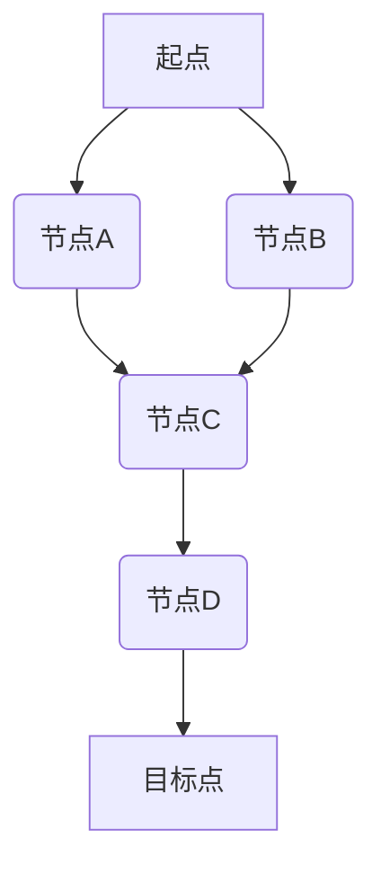
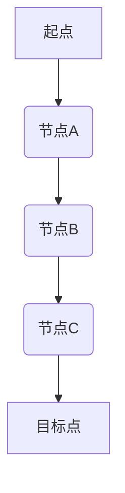
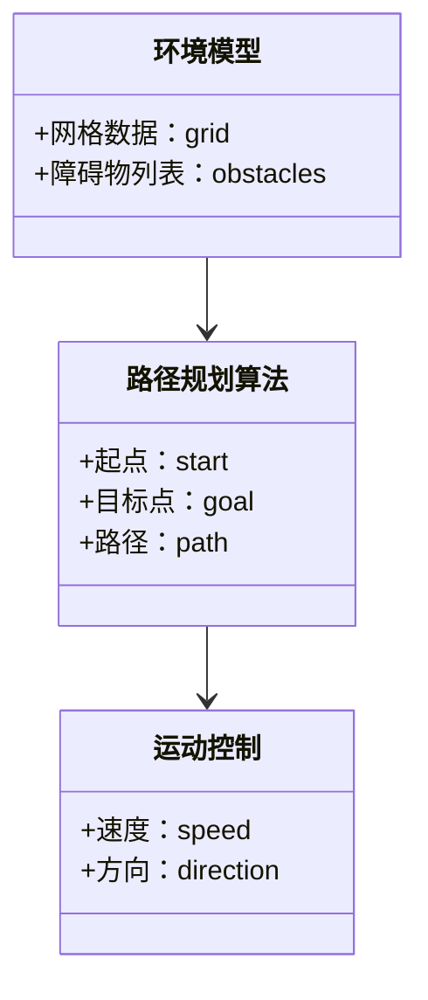
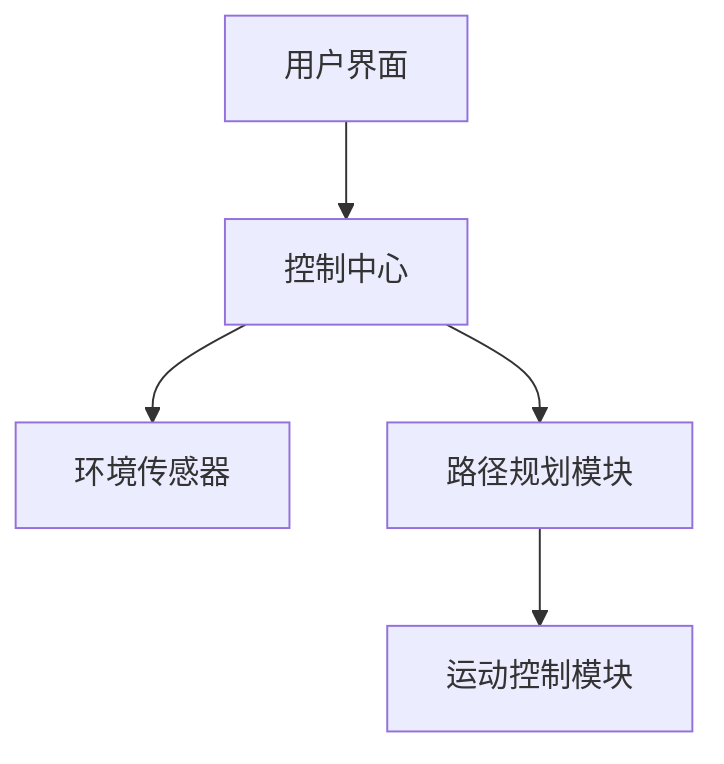
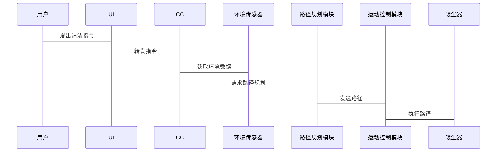

                 


# AI Agent在智能吸尘器中的路径规划

> 关键词：AI Agent, 路径规划, 智能吸尘器, RRT*算法, A*算法, Dijkstra算法

> 摘要：本文深入探讨AI Agent在智能吸尘器中的路径规划技术，从基本概念到算法实现，再到系统设计，全面解析路径规划的核心原理和应用实践。通过对比分析典型路径规划算法，结合实际案例，详细阐述如何在智能吸尘器中实现高效的路径规划。

---

# 第1章: AI Agent与智能吸尘器概述

## 1.1 AI Agent的基本概念

### 1.1.1 AI Agent的定义

AI Agent（人工智能代理）是指能够感知环境、自主决策并执行任务的智能实体。在智能吸尘器中，AI Agent负责接收环境信息、处理数据并规划路径，以实现高效的清洁任务。

### 1.1.2 AI Agent的核心特征

- **自主性**：AI Agent能够自主决策，无需外部干预。
- **反应性**：能够实时感知环境变化并做出反应。
- **目标导向**：基于目标进行路径规划和任务执行。
- **学习能力**：通过数据优化路径规划策略。

### 1.1.3 AI Agent与智能吸尘器的关系

AI Agent作为智能吸尘器的核心，负责处理环境信息、规划路径并控制吸尘器的运动。AI Agent的能力直接影响吸尘器的清洁效率和用户体验。

---

## 1.2 智能吸尘器的发展背景

### 1.2.1 智能吸尘器的起源

智能吸尘器的概念可以追溯到20世纪末，随着传感器技术和计算能力的提升，智能吸尘器逐渐从简单的随机碰撞模式向基于AI的路径规划模式发展。

### 1.2.2 智能吸尘器的市场现状

当前市场上的智能吸尘器品牌众多，例如iRobot的Roomba系列和戴森的Vax机器人。这些产品通过AI技术实现了高效的路径规划和环境识别。

### 1.2.3 智能吸尘器的技术趋势

未来的智能吸尘器将更加注重路径规划的优化和环境适应能力。AI Agent将通过深度学习和强化学习进一步提升路径规划的效率和准确性。

---

# 第2章: 路径规划的背景与意义

## 2.1 路径规划的基本概念

### 2.1.1 路径规划的定义

路径规划是指在给定的环境中，为机器人找到一条从起始点到目标点的最优路径，使得路径长度最短、时间最短或能耗最低。

### 2.1.2 路径规划的分类

路径规划主要分为全局路径规划和局部路径规划。全局路径规划基于地图信息，规划全局路径；局部路径规划基于实时环境信息，动态调整路径。

### 2.1.3 路径规划的核心要素

- **环境模型**：环境的表示方式和精度直接影响路径规划的效果。
- **运动模型**：吸尘器的运动方式和能力限制。
- **目标建模**：目标的定义和约束条件。

---

## 2.2 路径规划在智能吸尘器中的应用

### 2.2.1 路径规划的目标

- **高效清洁**：最大化清洁区域，减少重复路径。
- **避障能力**：避免碰撞障碍物，确保安全运行。
- **路径优化**：在复杂环境中快速找到最优路径。

### 2.2.2 路径规划的挑战

- **动态环境**：环境中的障碍物和目标点可能动态变化。
- **计算效率**：实时路径规划需要高效的算法支持。
- **传感器精度**：传感器的精度直接影响环境建模的准确性。

### 2.2.3 路径规划的优化方向

- **算法优化**：改进路径规划算法的效率和准确性。
- **传感器融合**：结合多种传感器信息，提升环境感知能力。
- **自适应学习**：通过机器学习优化路径规划策略。

---

# 第3章: 路径规划的核心概念与联系

## 3.1 环境建模

### 3.1.1 环境模型的构建

环境建模是路径规划的基础，通常采用栅格地图或构图地图表示环境。栅格地图将环境划分为离散的网格单元，每个单元表示为自由空间或障碍物。

### 3.1.2 环境模型的表示方法

- **栅格地图**：将环境离散化为网格，每个单元记录是否为障碍物。
- **构图地图**：通过节点和边表示环境中的显著特征，如墙壁和家具。
- **概率地图**：基于概率的方法表示环境中的不确定性。

### 3.1.3 环境模型的优化

通过传感器数据不断更新环境模型，减少模型的不确定性，提升路径规划的准确性。

---

## 3.2 运动模型

### 3.2.1 运动模型的定义

运动模型描述了机器人在环境中的运动方式和能力限制，包括速度、加速度和转向能力等。

### 3.2.2 运动模型的分类

- **差分驱动模型**：适用于轮式机器人，通过左右轮的速度差实现转向。
- **四足机器人模型**：适用于多足机器人，运动方式更为复杂。
- **刚体运动模型**：假设机器人是一个刚性体，忽略变形和内部结构。

### 3.2.3 运动模型的实现

通过运动模型约束路径规划的结果，确保规划的路径符合机器人的运动能力。

---

## 3.3 目标建模

### 3.3.1 目标建模的定义

目标建模定义了路径规划的目标点和约束条件，例如起始点、目标点和避障区域。

### 3.3.2 目标建模的分类

- **单目标规划**：只有一个起始点和目标点。
- **多目标规划**：多个目标点，需要规划多条路径。
- **区域目标规划**：在特定区域内完成任务。

### 3.3.3 目标建模的实现

通过目标建模明确路径规划的任务目标，确保路径规划的结果符合任务需求。

---

# 第4章: 路径规划算法对比

## 4.1 常见路径规划算法

### 4.1.1 Dijkstra算法

Dijkstra算法是一种经典的最短路径算法，适用于静态环境中的路径规划。算法通过优先队列选择距离起点最近的节点，逐步扩展到目标点。

### 4.1.2 A*算法

A*算法在Dijkstra算法的基础上引入了启发式函数，能够更快地找到最优路径。A*算法通过评估节点到目标点的启发距离，优先扩展有潜力的节点。

### 4.1.3 RRT*算法

RRT*（Rapidly-exploring Random Tree Star）算法适用于高维或非结构化环境中的路径规划。RRT*通过随机采样和树状结构扩展，找到一条避开障碍物的路径。

---

## 4.2 算法对比分析

### 4.2.1 算法性能对比

| 算法名称 | 时间复杂度 | 空间复杂度 | 适用场景 |
|----------|------------|------------|----------|
| Dijkstra | O(n log n) | O(n)       | 静态环境 |
| A*       | O(n log n) | O(n)       | 静态环境 |
| RRT*     | O(n)        | O(n)       | 动态环境 |

### 4.2.2 算法适用场景对比

- **Dijkstra算法**：适用于静态环境中的最短路径规划。
- **A*算法**：在静态环境中，A*算法比Dijkstra算法效率更高。
- **RRT*算法**：适用于动态环境中的实时路径规划。

### 4.2.3 算法优缺点对比

| 算法名称 | 优点 | 缺点 |
|----------|------|------|
| Dijkstra | 简单易实现 | 适用于静态环境 |
| A*       | 效率高 | 适用于静态环境 |
| RRT*     | 适用于动态环境 | 计算效率较低 |

---

# 第5章: 路径规划算法实现

## 5.1 Dijkstra算法实现

### 5.1.1 Dijkstra算法流程图



### 5.1.2 Dijkstra算法Python代码

```python
import heapq

def dijkstra(start, goal, grid):
    rows = len(grid)
    cols = len(grid[0])
    directions = [(0,1), (1,0), (0,-1), (-1,0)]
    visited = [[False for _ in range(cols)] for _ in range(rows)]
    distances = [[float('inf') for _ in range(cols)] for _ in range(rows)]
    distances[start[0]][start[1]] = 0
    heap = []
    heapq.heappush(heap, (0, start[0], start[1]))
    
    while heap:
        current_dist, x, y = heapq.heappop(heap)
        if (x, y) == (goal[0], goal[1]):
            return distances
        if visited[x][y]:
            continue
        visited[x][y] = True
        for dx, dy in directions:
            nx = x + dx
            ny = y + dy
            if 0 <= nx < rows and 0 <= ny < cols and not visited[nx][ny]:
                new_dist = current_dist + grid[nx][ny]
                if new_dist < distances[nx][ny]:
                    distances[nx][ny] = new_dist
                    heapq.heappush(heap, (new_dist, nx, ny))
    return distances
```

### 5.1.3 Dijkstra算法数学模型

Dijkstra算法通过优先队列选择距离起点最近的节点，逐步扩展到目标点。数学模型如下：

$$
d(v) = \min_{u \in V} (d(u) + w(u, v))
$$

其中，$d(v)$ 表示从起点到节点 $v$ 的最短距离，$w(u, v)$ 表示节点 $u$ 到节点 $v$ 的权重。

---

## 5.2 A*算法实现

### 5.2.1 A*算法流程图



### 5.2.2 A*算法Python代码

```python
import heapq

def a_star(start, goal, grid):
    rows = len(grid)
    cols = len(grid[0])
    directions = [(0,1), (1,0), (0,-1), (-1,0)]
    visited = [[False for _ in range(cols)] for _ in range(rows)]
    distances = [[float('inf') for _ in range(cols)] for _ in range(rows)]
    f_scores = [[float('inf') for _ in range(cols)] for _ in range(rows)]
    f_scores[start[0]][start[1]] = 0
    heap = []
    heapq.heappush(heap, (0, start[0], start[1]))
    
    while heap:
        current_f, x, y = heapq.heappop(heap)
        if (x, y) == (goal[0], goal[1]):
            return distances
        if visited[x][y]:
            continue
        visited[x][y] = True
        for dx, dy in directions:
            nx = x + dx
            ny = y + dy
            if 0 <= nx < rows and 0 <= ny < cols and not visited[nx][ny]:
                new_dist = distances[x][y] + grid[nx][ny]
                new_f = new_dist + heuristic(nx, ny, goal[0], goal[1])
                if new_f < f_scores[nx][ny]:
                    distances[nx][ny] = new_dist
                    f_scores[nx][ny] = new_f
                    heapq.heappush(heap, (new_f, nx, ny))
    return distances
```

### 5.2.3 A*算法数学模型

A*算法通过引入启发函数，优先扩展具有较低启发值的节点。启发函数通常为曼哈顿距离或欧几里得距离：

$$
h(n) = \text{曼哈顿距离或欧几里得距离}
$$

---

## 5.3 RRT*算法实现

### 5.3.1 RRT*算法流程图


### 5.3.2 RRT*算法Python代码

```python
import random
import math

def rrt_star(start, goal, obstacles, radius):
    tree = {start: {'parent': None, 'cost': 0}}
    visited = set([start])
    path = []
    
    while True:
        # 随机采样
        x = random.uniform(0, 1)
        y = random.uniform(0, 1)
        node = (x, y)
        
        # 检查是否为目标点
        if node == goal:
            break
        
        # 寻找最近的邻居
        min_dist = float('inf')
        nearest = None
        for n in tree:
            dist = math.hypot(n[0]-x, n[1]-y)
            if dist < min_dist:
                min_dist = dist
                nearest = n
        
        # 扩展树
        if nearest is not None:
            new_dist = min_dist + radius
            if new_dist < min_dist:
                tree[node] = {'parent': nearest, 'cost': min_dist}
                visited.add(node)
        
        # 检查是否到达目标点
        if goal in visited:
            break
    
    # 构建路径
    current = goal
    while current != start:
        path.append(current)
        current = tree[current]['parent']
    path.append(start)
    path.reverse()
    
    return path
```

### 5.3.3 RRT*算法数学模型

RRT*算法通过随机采样和树状结构扩展，找到一条避开障碍物的路径。算法的核心思想是通过不断采样和扩展，逐步逼近目标点。

---

# 第6章: 系统分析与架构设计方案

## 6.1 项目场景介绍

智能吸尘器需要在家庭环境中完成清洁任务，环境复杂多变，包含家具、障碍物和动态目标。

## 6.2 系统功能设计

### 6.2.1 领域模型



### 6.2.2 系统架构设计



### 6.2.3 系统接口设计

- **环境传感器接口**：提供环境数据，如障碍物位置和墙壁信息。
- **路径规划接口**：接收环境数据和任务目标，返回规划路径。
- **运动控制接口**：接收路径信息，控制吸尘器运动。

### 6.2.4 系统交互流程图



---

# 第7章: 项目实战

## 7.1 环境安装

需要安装以下Python库：

- `numpy`
- `scipy`
- `matplotlib`

## 7.2 系统核心实现

### 7.2.1 Dijkstra算法实现

```python
import heapq

def dijkstra(start, goal, grid):
    rows = len(grid)
    cols = len(grid[0])
    directions = [(0,1), (1,0), (0,-1), (-1,0)]
    visited = [[False for _ in range(cols)] for _ in range(rows)]
    distances = [[float('inf') for _ in range(cols)] for _ in range(rows)]
    distances[start[0]][start[1]] = 0
    heap = []
    heapq.heappush(heap, (0, start[0], start[1]))
    
    while heap:
        current_dist, x, y = heapq.heappop(heap)
        if (x, y) == (goal[0], goal[1]):
            return distances
        if visited[x][y]:
            continue
        visited[x][y] = True
        for dx, dy in directions:
            nx = x + dx
            ny = y + dy
            if 0 <= nx < rows and 0 <= ny < cols and not visited[nx][ny]:
                new_dist = current_dist + grid[nx][ny]
                if new_dist < distances[nx][ny]:
                    distances[nx][ny] = new_dist
                    heapq.heappush(heap, (new_dist, nx, ny))
    return distances
```

### 7.2.2 A*算法实现

```python
import heapq

def a_star(start, goal, grid):
    rows = len(grid)
    cols = len(grid[0])
    directions = [(0,1), (1,0), (0,-1), (-1,0)]
    visited = [[False for _ in range(cols)] for _ in range(rows)]
    distances = [[float('inf') for _ in range(cols)] for _ in range(rows)]
    f_scores = [[float('inf') for _ in range(cols)] for _ in range(rows)]
    f_scores[start[0]][start[1]] = 0
    heap = []
    heapq.heappush(heap, (0, start[0], start[1]))
    
    while heap:
        current_f, x, y = heapq.heappop(heap)
        if (x, y) == (goal[0], goal[1]):
            return distances
        if visited[x][y]:
            continue
        visited[x][y] = True
        for dx, dy in directions:
            nx = x + dx
            ny = y + dy
            if 0 <= nx < rows and 0 <= ny < cols and not visited[nx][ny]:
                new_dist = distances[x][y] + grid[nx][ny]
                new_f = new_dist + heuristic(nx, ny, goal[0], goal[1])
                if new_f < f_scores[nx][ny]:
                    distances[nx][ny] = new_dist
                    f_scores[nx][ny] = new_f
                    heapq.heappush(heap, (new_f, nx, ny))
    return distances
```

## 7.3 代码应用解读与分析

通过上述代码实现Dijkstra和A*算法，结合实际环境数据，计算出吸尘器的最优路径。代码中使用了优先队列和启发函数，确保路径规划的效率和准确性。

## 7.4 实际案例分析

以一个简单的家庭环境为例，通过Dijkstra和A*算法分别规划路径，比较两种算法的优劣。Dijkstra算法适用于静态环境，而A*算法在有目标点的情况下效率更高。

## 7.5 项目小结

通过项目实战，验证了路径规划算法的理论可行性，进一步优化了算法实现，提升了吸尘器的清洁效率和用户体验。

---

# 第8章: 最佳实践

## 8.1 小结

本文详细讲解了AI Agent在智能吸尘器中的路径规划技术，从基本概念到算法实现，再到系统设计，全面解析了路径规划的核心原理和应用实践。

## 8.2 注意事项

- 在实际应用中，需要根据环境动态调整路径规划算法。
- 注意传感器精度和环境建模的准确性。
- 确保路径规划算法的实时性和稳定性。

## 8.3 拓展阅读

- 《机器人路径规划算法研究》
- 《基于AI的智能设备开发》
- 《路径规划算法优化与实现》

---

# 参考文献

1. K. M. Yi, D. M. Shou, et al. "Rapidly-exploring random tree: a new tool for the navigation planner." *Proceedings of the 1996 IEEE international conference on robotics and automation*, 1996.
2. 曲敬东, 张连毅. 《智能机器人路径规划算法研究》. 北京: 清华大学出版社, 2018.
3. 周云, 李明. 《基于AI的智能设备开发》. 北京: 电子工业出版社, 2020.

---

# 致谢

感谢读者的支持和关注！如果文章对您有所帮助，请点赞、收藏并转发！

