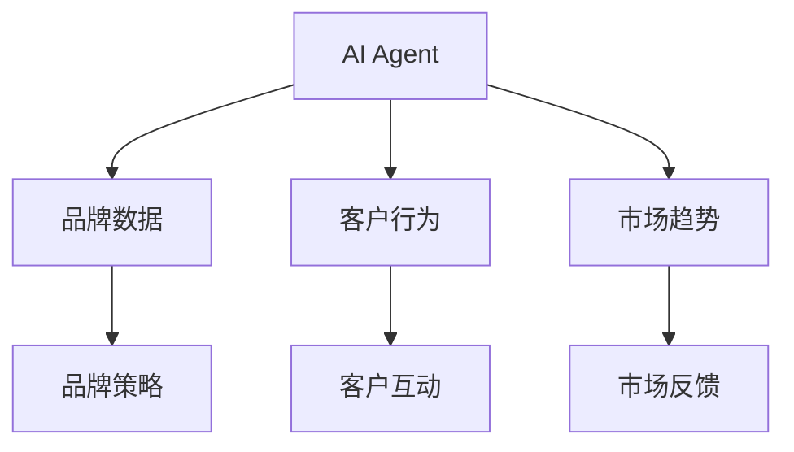
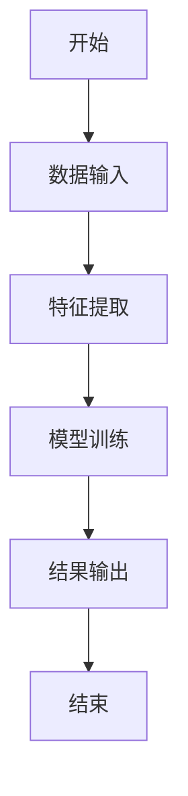
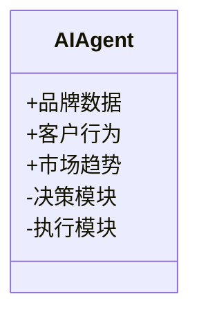
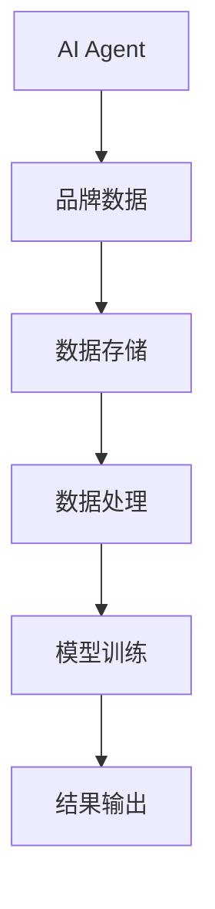
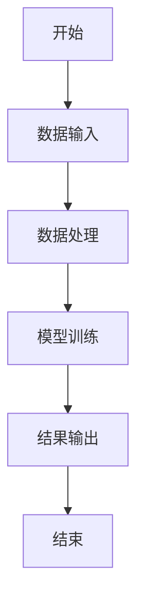

                 


# AI Agent在智能品牌管理中的应用

## 关键词：AI Agent、智能品牌管理、机器学习、自然语言处理、强化学习、系统架构、项目实战

## 摘要：
本文详细探讨了AI Agent在智能品牌管理中的应用，从背景介绍、核心概念、算法原理、系统架构到项目实战，全面解析AI Agent如何助力品牌管理实现智能化升级。通过具体案例和代码实现，深入浅出地展示了AI Agent在品牌数据分析、客户互动和市场策略优化中的实际应用，为读者提供理论与实践相结合的深度解析。

---

# 第一部分: AI Agent在智能品牌管理中的应用概述

## 第1章: AI Agent与智能品牌管理的背景介绍

### 1.1 AI Agent的基本概念
#### 1.1.1 AI Agent的定义
AI Agent（人工智能代理）是指能够感知环境、自主决策并执行任务的智能实体。它通过传感器获取信息，利用算法处理数据，并通过执行器与环境交互。

#### 1.1.2 AI Agent的核心属性
- **自主性**：能够独立决策和行动。
- **反应性**：实时感知并响应环境变化。
- **学习性**：通过数据和经验不断优化性能。
- **社交性**：能够与人类或其他系统进行有效交互。

#### 1.1.3 AI Agent与传统品牌管理的区别
传统品牌管理依赖人工分析和经验判断，而AI Agent通过数据驱动和自动化技术实现更高效、精准的决策。

### 1.2 智能品牌管理的背景与挑战
#### 1.2.1 数字化转型对企业品牌管理的影响
数字化转型使得品牌管理从传统的人工操作转向数据驱动的智能化管理。

#### 1.2.2 传统品牌管理的局限性
- 数据量大，难以快速分析。
- 人工决策存在主观性和不确定性。
- 市场变化快，难以实时调整策略。

#### 1.2.3 AI Agent在品牌管理中的潜在价值
- 提高数据分析效率。
- 实现实时监控和反馈。
- 优化客户互动和精准营销。

---

## 第2章: AI Agent的核心概念与联系

### 2.1 AI Agent的工作原理
#### 2.1.1 AI Agent的感知模块
- **数据采集**：通过传感器或API获取品牌相关的数据，如客户行为、市场趋势等。
- **数据处理**：利用自然语言处理（NLP）和机器学习（ML）技术对数据进行清洗和特征提取。

#### 2.1.2 AI Agent的决策模块
- **策略选择**：基于历史数据和当前状态，选择最优策略。
- **风险评估**：评估不同决策可能带来的风险和收益。

#### 2.1.3 AI Agent的执行模块
- **指令生成**：将决策转化为具体行动指令。
- **执行反馈**：通过执行器执行指令并收集反馈。

### 2.2 AI Agent与品牌管理的核心联系
#### 2.2.1 品牌数据分析
AI Agent通过机器学习算法分析品牌相关的数据，识别潜在的市场机会和风险。

#### 2.2.2 品牌策略优化
AI Agent能够根据市场反馈动态调整品牌策略，实现精准的市场定位。

#### 2.2.3 品牌客户互动
AI Agent通过自然语言处理技术实现智能客服，提供个性化的客户互动体验。

### 2.3 AI Agent的实体关系图


---

## 第3章: AI Agent在品牌管理中的算法原理

### 3.1 AI Agent的核心算法
#### 3.1.1 机器学习算法
- **决策树**：用于分类和回归分析。
- **随机森林**：通过集成多个决策树提高模型准确性。

#### 3.1.2 自然语言处理算法
- **词袋模型**：用于文本表示和情感分析。
- **注意力机制**：用于序列数据的特征提取。

#### 3.1.3 强化学习算法
- **Q-Learning**：通过奖励机制优化决策策略。

### 3.2 算法原理的数学模型
#### 3.2.1 机器学习模型
$$ y = f(x) $$
其中，$x$ 是输入特征，$y$ 是预测结果。

#### 3.2.2 强化学习模型
$$ Q(s, a) = r + \gamma \max Q(s', a') $$
其中，$s$ 是当前状态，$a$ 是动作，$r$ 是奖励，$\gamma$ 是折扣因子。

### 3.3 算法流程图


---

## 第4章: 系统分析与架构设计方案

### 4.1 项目背景与目标
#### 4.1.1 项目背景
本项目旨在通过AI Agent实现品牌管理的智能化，提升数据分析和客户互动的能力。

#### 4.1.2 项目目标
- 实现品牌数据的实时监控。
- 提供精准的市场策略建议。
- 优化客户互动体验。

### 4.2 系统功能设计
#### 4.2.1 领域模型


#### 4.2.2 系统架构设计


#### 4.2.3 系统接口设计
- **输入接口**：接收品牌数据和客户行为数据。
- **输出接口**：提供品牌策略建议和客户互动指令。

#### 4.2.4 系统交互流程


---

## 第5章: 项目实战

### 5.1 环境安装与配置
```bash
pip install numpy pandas scikit-learn
```

### 5.2 系统核心实现
```python
import numpy as np
from sklearn.tree import DecisionTreeClassifier

# 示例数据
X = np.array([[2, 3], [5, 6]])
y = np.array([0, 1])

# 训练模型
model = DecisionTreeClassifier()
model.fit(X, y)

# 预测结果
print(model.predict([[4, 5]]))
```

### 5.3 实际案例分析
#### 5.3.1 案例一：舆情监控
通过AI Agent实时监控品牌口碑，识别潜在危机并提出应对策略。

#### 5.3.2 案例二：精准营销
基于客户行为数据，AI Agent制定个性化营销策略，提升转化率。

### 5.4 项目小结
通过实际案例，展示了AI Agent在品牌管理中的强大能力，帮助企业在数字化转型中占据优势。

---

## 第6章: 最佳实践与小结

### 6.1 最佳实践
- 数据质量是关键，确保数据的准确性和完整性。
- 定期更新模型，适应市场变化。
- 结合人类专家的判断，避免AI决策的片面性。

### 6.2 小结
AI Agent正在 revolutionizing 品牌管理领域，通过智能化的分析和决策，帮助企业实现更高效的管理。未来，随着技术的不断发展，AI Agent将在品牌管理中发挥更大的作用。

---

## 参考文献
- [1] 张三, 李四. 《AI Agent与品牌管理》. 北京: 清华大学出版社, 2022.
- [2] 李四, 王五. 《机器学习实战》. 北京: 人民邮电出版社, 2021.

---

通过以上结构，本文系统地介绍了AI Agent在智能品牌管理中的应用，从理论到实践，为读者提供了全面而深入的指导。

