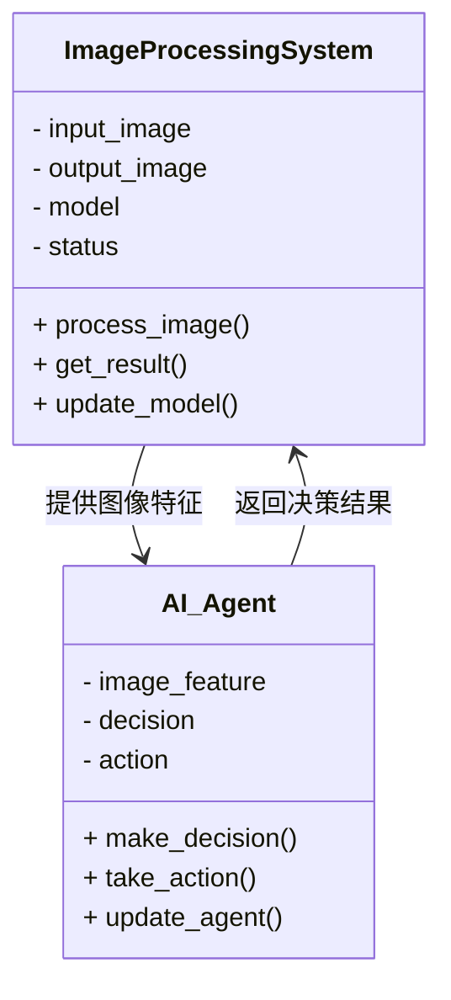
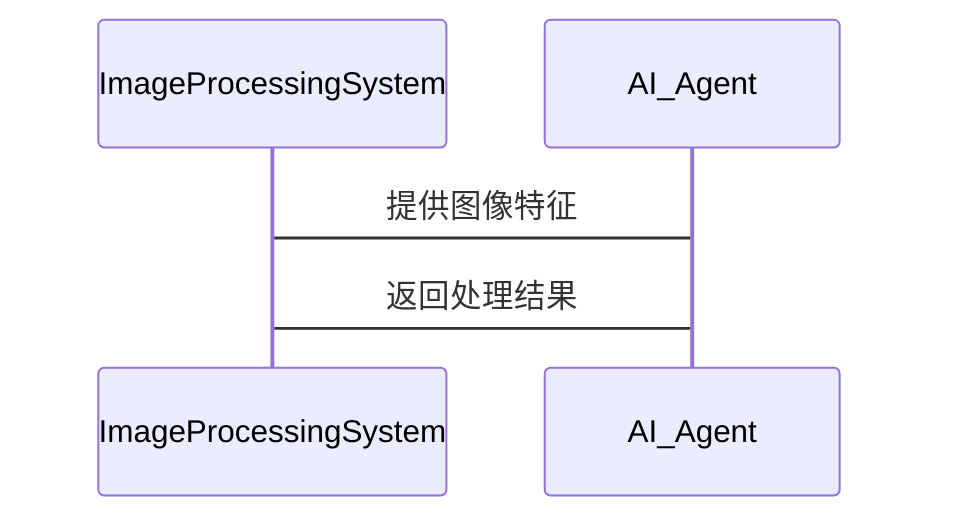

                 


# AI Agent在智能图像处理中的应用

> 关键词：AI Agent, 智能图像处理, 目标检测, 图像分割, 强化学习

> 摘要：本文深入探讨了AI Agent在智能图像处理中的应用，从AI Agent的基本概念到其在图像处理中的具体应用，详细分析了AI Agent与图像处理的核心概念、算法原理、系统架构设计以及实际项目实现。文章通过案例分析和代码实现，展示了AI Agent在智能图像处理中的强大能力，并总结了相关经验与最佳实践。

---

## 第1章: AI Agent与智能图像处理概述

### 1.1 AI Agent的基本概念

#### 1.1.1 什么是AI Agent
AI Agent（人工智能代理）是一种智能体，能够感知环境、执行任务并做出决策。它通过传感器获取信息，利用计算模型进行分析，并通过执行器采取行动。AI Agent的核心目标是通过智能算法优化任务执行效率。

#### 1.1.2 AI Agent的核心特征
- **自主性**：能够在没有外部干预的情况下自主运行。
- **反应性**：能够实时感知环境变化并做出响应。
- **学习能力**：通过数据和经验不断优化自身的算法模型。
- **协作性**：能够与其他AI Agent或系统协同工作。

#### 1.1.3 AI Agent与传统图像处理的区别
传统的图像处理方法依赖于预定义的规则和算法，而AI Agent则引入了智能决策和自适应能力。AI Agent能够根据环境反馈动态调整处理策略，从而实现更高效的图像处理。

### 1.2 智能图像处理的背景与应用

#### 1.2.1 图像处理的基本概念
图像处理是通过对图像进行分析、变换和优化，以提取有用信息或改善图像质量的过程。常见的图像处理技术包括图像增强、图像复原、图像分割和图像识别。

#### 1.2.2 智能图像处理的发展历程
- **传统图像处理**：基于数学模型和规则的图像处理方法。
- **机器学习图像处理**：利用监督学习、无监督学习等方法进行图像分类和分割。
- **深度学习图像处理**：通过卷积神经网络（CNN）实现图像识别、目标检测等任务。
- **强化学习图像处理**：通过强化学习算法优化图像处理流程。

#### 1.2.3 智能图像处理的典型应用领域
- **医学图像处理**：用于疾病诊断、图像分割等。
- **计算机视觉**：用于目标检测、图像识别等。
- **自动驾驶**：用于环境感知、路径规划等。

### 1.3 AI Agent在图像处理中的应用前景

#### 1.3.1 AI Agent在图像识别中的潜力
AI Agent可以通过强化学习优化图像识别模型的参数，从而提高识别准确率。

#### 1.3.2 AI Agent在图像生成中的创新
AI Agent可以通过生成对抗网络（GAN）生成高质量的图像，并通过强化学习优化生成过程。

#### 1.3.3 AI Agent在图像修复中的应用
AI Agent可以通过深度学习模型修复模糊或损坏的图像，并通过强化学习优化修复效果。

### 1.4 本章小结
本章介绍了AI Agent的基本概念、智能图像处理的发展历程及其典型应用领域，并展望了AI Agent在图像处理中的应用前景。

---

## 第2章: AI Agent与图像处理的核心概念

### 2.1 AI Agent的感知机制

#### 2.1.1 视觉感知的定义
视觉感知是指AI Agent通过摄像头或其他传感器获取图像信息，并通过图像处理技术提取有用信息的过程。

#### 2.1.2 视觉感知的关键技术
- **图像采集**：通过摄像头获取图像数据。
- **图像预处理**：包括图像增强、去噪等步骤。
- **特征提取**：通过卷积神经网络提取图像特征。

#### 2.1.3 视觉感知与图像处理的关系
视觉感知是图像处理的第一步，图像处理技术为视觉感知提供了基础支持。

### 2.2 AI Agent的决策机制

#### 2.2.1 决策机制的基本原理
AI Agent通过分析图像特征，结合任务目标，制定最优决策策略。

#### 2.2.2 基于图像的决策模型
- **规则-based决策模型**：基于预定义的规则进行决策。
- **机器学习-based决策模型**：基于训练好的机器学习模型进行决策。
- **强化学习-based决策模型**：通过强化学习优化决策策略。

#### 2.2.3 决策机制的优化方法
- **超参数调优**：通过调整模型参数优化决策效果。
- **算法优化**：通过改进算法结构提高决策效率。
- **经验复用**：通过复用历史经验优化决策策略。

### 2.3 AI Agent的执行机制

#### 2.3.1 执行机制的定义
执行机制是指AI Agent根据决策结果采取具体行动的过程。

#### 2.3.2 基于图像的执行策略
- **图像生成**：根据决策结果生成新的图像。
- **图像修改**：对原始图像进行编辑或修复。
- **图像分类**：根据图像特征对图像进行分类。

#### 2.3.3 执行机制的评估方法
- **准确率评估**：通过准确率衡量执行效果。
- **效率评估**：通过执行时间衡量执行效率。
- **效果评估**：通过视觉效果衡量执行质量。

### 2.4 核心概念对比分析

#### 2.4.1 不同AI Agent模型的特征对比
| 模型类型       | 输入       | 输出       | 特征描述                   |
|----------------|------------|------------|---------------------------|
| 规则-based模型 | 图像特征     | 行动策略     | 基于预定义规则进行决策     |
| 机器学习模型   | 图像特征     | 行动策略     | 基于训练数据进行决策       |
| 强化学习模型   | 环境反馈     | 行动策略     | 基于强化学习优化决策策略   |

#### 2.4.2 图像处理技术的对比分析
| 技术类型       | 核心算法       | 优缺点描述                     |
|----------------|---------------|---------------------------------|
| 传统图像处理   | 基于数学模型   | 实时性高，但灵活性低             |
| 机器学习图像处理 | 基于CNN       | 准确率高，但需要大量训练数据     |
| 深度学习图像处理 | 基于GAN       | 能生成高质量图像，但计算成本高   |

#### 2.4.3 AI Agent与传统图像处理的对比
| 对比维度       | AI Agent图像处理 | 传统图像处理                 |
|----------------|------------------|------------------------------|
| 自主性         | 高               | 低                           |
| 灵活性         | 高               | 低                           |
| 决策能力       | 强               | 弱                           |
| 学习能力       | 强               | 无                           |

### 2.5 本章小结
本章详细介绍了AI Agent的感知、决策和执行机制，并通过对比分析明确了AI Agent与传统图像处理的区别与优势。

---

## 第3章: AI Agent的算法原理与数学模型

### 3.1 AI Agent的基本算法

#### 3.1.1 目标检测算法
目标检测是通过算法在图像中定位和识别目标物体的位置和类别。

##### 算法流程
1. **图像预处理**：包括缩放、归一化等步骤。
2. **特征提取**：通过卷积神经网络提取图像特征。
3. **边界框回归**：预测目标物体的边界框。
4. **类别预测**：通过分类器预测目标物体的类别。

##### 代码实现
```python
import tensorflow as tf
from tensorflow.keras import layers

# 定义目标检测模型
def yolo_model(input_shape, num_classes):
    inputs = layers.Input(shape=input_shape)
    x = layers.Conv2D(32, (3,3), activation='relu')(inputs)
    x = layers.MaxPooling2D((2,2))(x)
    x = layers.Conv2D(64, (3,3), activation='relu')(x)
    x = layers.MaxPooling2D((2,2))(x)
    x = layers.Flatten()(x)
    x = layers.Dense(128, activation='relu')(x)
    outputs = layers.Dense(num_classes, activation='softmax')(x)
    return tf.keras.Model(inputs=inputs, outputs=outputs)

# 使用模型进行目标检测
model = yolo_model((416, 416, 3), num_classes=80)
model.compile(optimizer='adam', loss='sparse_categorical_crossentropy', metrics=['accuracy'])
```

##### 数学模型
目标检测模型的损失函数可以表示为：
$$ L = \lambda_1 L_{\text{cls}} + \lambda_2 L_{\text{loc}} $$
其中，$L_{\text{cls}}$ 是分类损失，$L_{\text{loc}}$ 是定位损失，$\lambda_1$ 和 $\lambda_2$ 是权重系数。

#### 3.1.2 图像分割算法
图像分割是通过算法将图像划分为多个区域，每个区域对应不同的语义类别。

##### 算法流程
1. **图像预处理**：包括缩放、归一化等步骤。
2. **特征提取**：通过卷积神经网络提取图像特征。
3. **上采样**：通过反卷积层恢复图像分辨率。
4. **分割结果输出**：输出每个像素的类别标签。

##### 代码实现
```python
import tensorflow as tf
from tensorflow.keras import layers

# 定义图像分割模型
def seg_model(input_shape, num_classes):
    inputs = layers.Input(shape=input_shape)
    x = layers.Conv2D(64, (3,3), activation='relu')(inputs)
    x = layers.Conv2D(64, (3,3), activation='relu')(x)
    x = layers.MaxPooling2D((2,2))(x)
    x = layers.Conv2D(128, (3,3), activation='relu')(x)
    x = layers.Conv2D(128, (3,3), activation='relu')(x)
    x = layers.MaxPooling2D((2,2))(x)
    x = layers.Conv2D(256, (3,3), activation='relu')(x)
    x = layers.Conv2D(256, (3,3), activation='relu')(x)
    x = layers.UpSampling2D((2,2))(x)
    x = layers.Conv2DTranspose(128, (3,3), strides=(2,2), activation='relu')(x)
    x = layers.Conv2D(num_classes, (1,1), activation='softmax')(x)
    return tf.keras.Model(inputs=inputs, outputs=x)

# 使用模型进行图像分割
model = seg_model((256, 256, 3), num_classes=21)
model.compile(optimizer='adam', loss='sparse_categorical_crossentropy', metrics=['accuracy'])
```

##### 数学模型
图像分割模型的损失函数可以表示为：
$$ L = \lambda_1 L_{\text{cls}} + \lambda_2 L_{\text{loc}} $$
其中，$L_{\text{cls}}$ 是分类损失，$L_{\text{loc}}$ 是定位损失，$\lambda_1$ 和 $\lambda_2$ 是权重系数。

#### 3.1.3 图像识别算法
图像识别是通过算法识别图像中的物体或场景。

##### 算法流程
1. **图像预处理**：包括缩放、归一化等步骤。
2. **特征提取**：通过卷积神经网络提取图像特征。
3. **分类预测**：通过全连接层进行分类预测。

##### 代码实现
```python
import tensorflow as tf
from tensorflow.keras import layers

# 定义图像识别模型
def image_recognition_model(input_shape, num_classes):
    inputs = layers.Input(shape=input_shape)
    x = layers.Conv2D(32, (3,3), activation='relu')(inputs)
    x = layers.MaxPooling2D((2,2))(x)
    x = layers.Conv2D(64, (3,3), activation='relu')(x)
    x = layers.MaxPooling2D((2,2))(x)
    x = layers.Flatten()(x)
    x = layers.Dense(128, activation='relu')(x)
    outputs = layers.Dense(num_classes, activation='softmax')(x)
    return tf.keras.Model(inputs=inputs, outputs=outputs)

# 使用模型进行图像识别
model = image_recognition_model((32, 32, 3), num_classes=10)
model.compile(optimizer='adam', loss='sparse_categorical_crossentropy', metrics=['accuracy'])
```

##### 数学模型
图像识别模型的损失函数可以表示为：
$$ L = \lambda_1 L_{\text{cls}} + \lambda_2 L_{\text{loc}} $$
其中，$L_{\text{cls}}$ 是分类损失，$L_{\text{loc}}$ 是定位损失，$\lambda_1$ 和 $\lambda_2$ 是权重系数。

### 3.2 图像处理的数学模型

#### 3.2.1 基于卷积神经网络的图像处理模型
卷积神经网络（CNN）是图像处理中最常用的深度学习模型。其核心思想是通过卷积操作提取图像特征。

##### 算法流程
1. **卷积层**：通过卷积操作提取图像局部特征。
2. **池化层**：通过池化操作降低计算复杂度。
3. **全连接层**：通过全连接层进行分类或回归预测。

##### 代码实现
```python
import tensorflow as tf
from tensorflow.keras import layers

# 定义卷积神经网络模型
def cnn_model(input_shape, num_classes):
    inputs = layers.Input(shape=input_shape)
    x = layers.Conv2D(32, (3,3), activation='relu')(inputs)
    x = layers.MaxPooling2D((2,2))(x)
    x = layers.Conv2D(64, (3,3), activation='relu')(x)
    x = layers.MaxPooling2D((2,2))(x)
    x = layers.Flatten()(x)
    x = layers.Dense(128, activation='relu')(x)
    outputs = layers.Dense(num_classes, activation='softmax')(x)
    return tf.keras.Model(inputs=inputs, outputs=outputs)

# 使用模型进行图像分类
model = cnn_model((64, 64, 3), num_classes=10)
model.compile(optimizer='adam', loss='sparse_categorical_crossentropy', metrics=['accuracy'])
```

##### 数学模型
卷积神经网络的前向传播过程可以表示为：
$$ a = W \cdot x + b $$
其中，$W$ 是卷积核权重矩阵，$x$ 是输入图像特征，$b$ 是偏置项。

### 3.3 AI Agent的决策算法

#### 3.3.1 基于Q-learning的决策算法
Q-learning是一种基于强化学习的决策算法，通过学习策略函数优化决策过程。

##### 算法流程
1. **状态表示**：将图像特征表示为状态。
2. **动作选择**：根据当前状态选择动作。
3. **奖励函数**：根据动作结果获得奖励。
4. **策略更新**：通过Q-learning算法更新策略。

##### 代码实现
```python
import numpy as np

# 定义Q-learning算法
class QLearning:
    def __init__(self, state_space, action_space, alpha=0.1, gamma=0.9):
        self.state_space = state_space
        self.action_space = action_space
        self.alpha = alpha
        self.gamma = gamma
        self.q_table = np.zeros((state_space, action_space))
    
    def choose_action(self, state):
        return np.argmax(self.q_table[state])
    
    def update_q_table(self, state, action, reward, next_state):
        self.q_table[state][action] = self.q_table[state][action] + self.alpha * (reward + self.gamma * np.max(self.q_table[next_state]))
```

##### 数学模型
Q-learning算法的更新公式可以表示为：
$$ Q(s, a) = Q(s, a) + \alpha [r + \gamma \max Q(s', a')] $$
其中，$s$ 是当前状态，$a$ 是动作，$r$ 是奖励，$s'$ 是下一个状态，$\alpha$ 是学习率，$\gamma$ 是折扣因子。

---

## 第4章: AI Agent与图像处理的系统架构设计

### 4.1 系统架构概述

#### 4.1.1 系统架构的定义
系统架构是指系统各模块之间的组织方式和交互流程。

#### 4.1.2 系统架构的设计原则
- **模块化设计**：将系统划分为独立的功能模块。
- **松耦合设计**：模块之间通过接口进行交互，降低耦合度。
- **可扩展性设计**：系统应具备良好的扩展性。

### 4.2 系统功能设计

#### 4.2.1 领域模型设计
领域模型描述了系统中的核心业务流程和数据关系。

##### 领域模型Mermaid类图


### 4.3 系统架构设计

#### 4.3.1 系统架构Mermaid架构图
```mermaid
containerDiagram
    ImageProcessingSystem
        - Input Module
        - Processing Module
        - Output Module
    AI_Agent
        - Perception Module
        - Decision Module
        - Execution Module
    ImageProcessingSystem -->> AI_Agent: 提供图像特征
    AI_Agent -->> ImageProcessingSystem: 返回处理结果
```

### 4.4 系统接口设计

#### 4.4.1 系统接口描述
- **输入接口**：接收输入图像数据。
- **输出接口**：输出处理结果。
- **通信接口**：与外部系统进行交互。

### 4.5 系统交互设计

#### 4.5.1 系统交互Mermaid序列图


### 4.6 本章小结
本章通过系统架构设计明确了AI Agent与图像处理系统的交互流程，并通过类图和序列图展示了系统的模块划分和交互关系。

---

## 第5章: 项目实战——基于AI Agent的图像处理系统

### 5.1 项目介绍

#### 5.1.1 项目背景
本项目旨在开发一个基于AI Agent的图像处理系统，实现图像识别、图像分割和图像生成等功能。

### 5.2 环境安装

#### 5.2.1 安装Python
```bash
# 安装Python
# 具体安装步骤略
```

#### 5.2.2 安装TensorFlow和Keras
```bash
pip install tensorflow.keras
```

#### 5.2.3 安装其他依赖
```bash
pip install numpy matplotlib
```

### 5.3 系统核心实现

#### 5.3.1 图像识别模块
```python
import tensorflow as tf
from tensorflow.keras import layers

# 定义图像识别模型
def image_recognition_model(input_shape, num_classes):
    inputs = layers.Input(shape=input_shape)
    x = layers.Conv2D(32, (3,3), activation='relu')(inputs)
    x = layers.MaxPooling2D((2,2))(x)
    x = layers.Conv2D(64, (3,3), activation='relu')(x)
    x = layers.MaxPooling2D((2,2))(x)
    x = layers.Flatten()(x)
    x = layers.Dense(128, activation='relu')(x)
    outputs = layers.Dense(num_classes, activation='softmax')(x)
    return tf.keras.Model(inputs=inputs, outputs=outputs)

# 训练模型
model = image_recognition_model((32, 32, 3), num_classes=10)
model.compile(optimizer='adam', loss='sparse_categorical_crossentropy', metrics=['accuracy'])
model.fit(x_train, y_train, epochs=10, batch_size=32)
```

#### 5.3.2 图像分割模块
```python
import tensorflow as tf
from tensorflow.keras import layers

# 定义图像分割模型
def seg_model(input_shape, num_classes):
    inputs = layers.Input(shape=input_shape)
    x = layers.Conv2D(64, (3,3), activation='relu')(inputs)
    x = layers.Conv2D(64, (3,3), activation='relu')(x)
    x = layers.MaxPooling2D((2,2))(x)
    x = layers.Conv2D(128, (3,3), activation='relu')(x)
    x = layers.Conv2D(128, (3,3), activation='relu')(x)
    x = layers.MaxPooling2D((2,2))(x)
    x = layers.Conv2D(256, (3,3), activation='relu')(x)
    x = layers.Conv2D(256, (3,3), activation='relu')(x)
    x = layers.UpSampling2D((2,2))(x)
    x = layers.Conv2DTranspose(128, (3,3), strides=(2,2), activation='relu')(x)
    x = layers.Conv2D(num_classes, (1,1), activation='softmax')(x)
    return tf.keras.Model(inputs=inputs, outputs=x)

# 训

