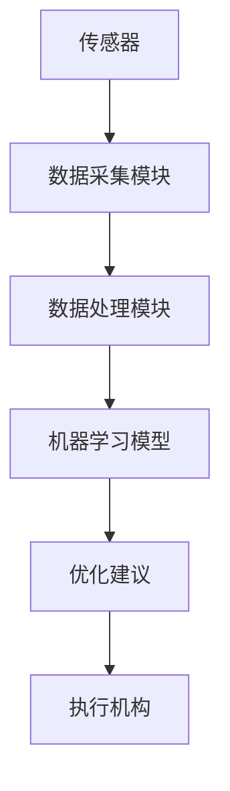

                 


# AI Agent在智能土壤分析中的实践

## 关键词：AI Agent, 智能土壤分析, 机器学习, 农业科技, 土壤健康监测

## 摘要：  
本文详细探讨了AI Agent在智能土壤分析中的实际应用，从理论基础到系统设计，再到项目实现，全面解析了AI Agent如何助力土壤健康监测和农业可持续发展。文章首先介绍了土壤分析的重要性和AI Agent的基本概念，然后深入分析了AI Agent的核心原理及其在土壤数据处理中的应用，详细讲解了基于机器学习和自然语言处理的土壤分析算法。接着，文章从系统架构的角度，设计了一个完整的AI Agent驱动的土壤分析系统，并通过具体案例展示了项目的实现过程。最后，文章总结了AI Agent在土壤分析中的优势与挑战，提出了未来的发展方向。

---

# 第一部分: AI Agent与智能土壤分析的背景与概念

## 第1章: 智能土壤分析的背景与挑战

### 1.1 土壤分析的重要性

#### 1.1.1 土壤健康与农业可持续发展的关联  
土壤是农业生产的基石，其健康状况直接影响农作物的产量和质量。通过智能土壤分析，可以实时监测土壤的养分含量、pH值、水分含量等关键指标，帮助农民优化施肥策略，减少资源浪费，降低环境污染，推动农业的可持续发展。

#### 1.1.2 当前土壤分析的主要挑战  
传统的土壤分析方法依赖人工采样和实验室检测，耗时长、成本高且效率低。随着农业规模的扩大，如何快速、精准地获取土壤数据成为一大挑战。此外，土壤数据的多样性和复杂性也增加了分析的难度。

#### 1.1.3 AI技术在土壤分析中的潜力  
AI技术可以通过传感器数据、历史数据和环境数据，构建土壤健康评估模型，实现土壤的实时监测和预测分析。AI Agent（人工智能代理）能够自动化执行土壤分析任务，优化资源分配，为农民提供智能化的决策支持。

---

### 1.2 AI Agent的基本概念

#### 1.2.1 什么是AI Agent  
AI Agent是一种能够感知环境、自主决策并执行任务的智能实体。它能够通过传感器获取数据，利用算法进行分析，并根据结果采取行动。在土壤分析中，AI Agent可以执行数据采集、分析和优化建议等任务。

#### 1.2.2 AI Agent的核心特征  
1. **自主性**：AI Agent能够自主决策，无需人工干预。  
2. **反应性**：能够实时感知环境变化并做出响应。  
3. **目标导向**：以特定目标为导向，优化土壤分析结果。  
4. **学习能力**：通过机器学习不断优化自身的分析能力。

#### 1.2.3 AI Agent与传统自动化系统的区别  
AI Agent不仅仅是一个执行命令的工具，它具备学习和推理能力，能够根据土壤数据的变化动态调整分析策略。与传统自动化系统相比，AI Agent更加灵活和智能。

---

### 1.3 AI Agent在土壤分析中的应用前景

#### 1.3.1 AI Agent在土壤监测中的作用  
AI Agent可以通过传感器实时采集土壤数据，如温度、湿度、pH值等，并通过机器学习模型预测土壤健康状况。

#### 1.3.2 AI Agent如何优化土壤数据分析  
AI Agent能够快速处理大量土壤数据，识别关键指标之间的关联性，帮助农民制定精准的施肥和灌溉计划。

#### 1.3.3 未来的土壤分析发展方向  
随着AI技术的不断进步，未来的土壤分析将更加智能化和个性化，AI Agent将在农业智能化中发挥重要作用。

---

## 第2章: AI Agent的核心原理与土壤分析的结合

### 2.1 AI Agent的核心原理

#### 2.1.1 感知与数据采集  
AI Agent通过多种传感器（如温度传感器、湿度传感器、pH传感器）采集土壤数据，并通过无线通信技术（如LoRa、Wi-Fi）将数据传输到云端。

#### 2.1.2 决策与推理机制  
AI Agent利用机器学习模型（如随机森林、支持向量机）对土壤数据进行分析，生成土壤健康评估结果，并根据结果制定优化建议。

#### 2.1.3 执行与反馈  
AI Agent根据分析结果，通过执行机构（如自动喷灌系统）调整土壤条件，并通过反馈机制不断优化分析模型。

---

### 2.2 土壤分析中的数据特征

#### 2.2.1 土壤数据的多样性  
土壤数据包括物理属性（如质地、结构）、化学属性（如养分含量、pH值）和生物属性（如微生物活性）。

#### 2.2.2 数据的时空特性  
土壤数据具有时空相关性，不同地区的土壤特性差异显著，且随时间变化而变化。

---

## 第3章: AI Agent在土壤分析中的算法原理

### 3.1 基于机器学习的土壤分析算法

#### 3.1.1 数据预处理  
1. **数据清洗**：去除异常值和缺失值。  
2. **特征提取**：提取关键土壤指标（如氮、磷、钾含量）。  
3. **数据标准化**：将数据归一化处理，确保模型训练的稳定性。

#### 3.1.2 算法选择  
使用随机森林算法对土壤健康状况进行分类，模型训练流程如下：

1. 数据预处理：清洗、特征提取、标准化。  
2. 模型训练：使用训练数据训练随机森林模型。  
3. 模型验证：通过交叉验证评估模型性能。  
4. 模型部署：将模型部署到AI Agent中，实时分析土壤数据。

#### 3.1.3 算法实现代码  
```python
from sklearn.ensemble import RandomForestClassifier
from sklearn.model_selection import train_test_split
import pandas as pd

# 加载数据
data = pd.read_csv('soil_data.csv')

# 数据预处理
X = data.drop(['label'], axis=1)
y = data['label']

# 划分训练集和测试集
X_train, X_test, y_train, y_test = train_test_split(X, y, test_size=0.2, random_state=42)

# 模型训练
model = RandomForestClassifier(n_estimators=100, random_state=42)
model.fit(X_train, y_train)

# 模型验证
score = model.score(X_test, y_test)
print(f"模型准确率：{score}")
```

---

### 3.2 基于自然语言处理的土壤分析

#### 3.2.1 土壤报告分析  
AI Agent可以通过自然语言处理技术分析土壤检测报告，提取关键信息（如养分含量建议）。

#### 3.2.2 技术实现  
1. 文本预处理：分词、去停用词。  
2. 模型训练：使用BERT模型进行文本分类。  
3. 结果提取：从报告中提取关键指标。

---

## 第4章: AI Agent驱动的土壤分析系统设计

### 4.1 系统架构设计

#### 4.1.1 系统功能设计  
1. 数据采集模块：通过传感器采集土壤数据。  
2. 数据处理模块：预处理和特征提取。  
3. 分析模块：基于机器学习模型分析土壤健康状况。  
4. 决策模块：生成优化建议。  
5. 执行模块：通过执行机构调整土壤条件。

#### 4.1.2 系统架构图  


---

## 第5章: 项目实战

### 5.1 环境配置

#### 5.1.1 硬件设备  
1. 土壤传感器（温度、湿度、pH值）。  
2. 无线通信模块（LoRa、Wi-Fi）。  
3. 执行机构（自动喷灌系统）。  

#### 5.1.2 软件工具  
1. Python编程语言。  
2. 机器学习库（scikit-learn、TensorFlow）。  
3. 数据可视化工具（Matplotlib、Seaborn）。  

---

### 5.2 核心代码实现

#### 5.2.1 传感器数据采集  
```python
import serial

# 连接传感器
ser = serial.Serial('COM3', 9600)
while True:
    data = ser.readline().decode().strip()
    print(data)
```

#### 5.2.2 机器学习模型训练  
```python
from sklearn.ensemble import RandomForestClassifier
from sklearn.metrics import accuracy_score

# 数据预处理
X_train, X_test, y_train, y_test = ...  # 假设已经完成数据划分

# 模型训练
model = RandomForestClassifier()
model.fit(X_train, y_train)

# 模型预测
y_pred = model.predict(X_test)
print(f"准确率：{accuracy_score(y_test, y_pred)}")
```

---

### 5.3 项目小结

#### 5.3.1 成功经验  
AI Agent能够显著提高土壤分析的效率和准确性，帮助农民优化施肥和灌溉策略。

#### 5.3.2 注意事项  
1. 数据质量是关键，需确保传感器数据的准确性和完整性。  
2. 模型的泛化能力需通过交叉验证进行评估。  
3. 系统的安全性和稳定性需重点关注。  

---

## 第6章: 最佳实践与未来展望

### 6.1 小结  
AI Agent在智能土壤分析中的应用前景广阔，能够显著提升农业生产的效率和可持续性。

### 6.2 注意事项  
1. 确保数据的实时性和准确性。  
2. 定期更新模型，避免过时。  
3. 加强系统的容错性和可扩展性。  

### 6.3 未来展望  
随着AI技术的不断进步，未来的土壤分析将更加智能化和个性化，AI Agent将在农业智能化中发挥更加重要的作用。

---

通过以上步骤，我们可以看到AI Agent在智能土壤分析中的巨大潜力和实际应用价值。希望本文能够为相关领域的研究者和实践者提供有价值的参考。

