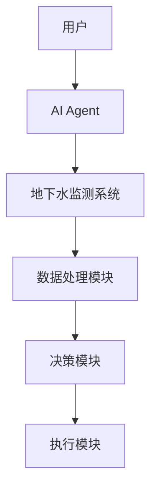
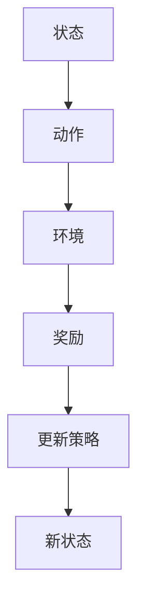
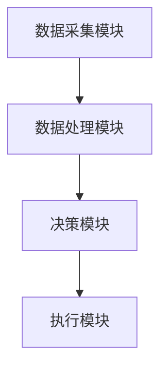
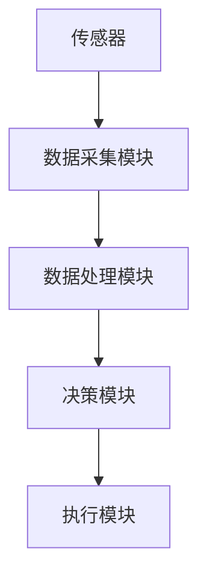

                 


# AI Agent在智能地下水资源管理中的实践

> 关键词：AI Agent、智能地下水资源管理、强化学习、系统架构、算法优化

> 摘要：随着全球水资源短缺问题的加剧，智能地下水资源管理成为一项迫切的任务。AI Agent（人工智能代理）作为一种能够自主决策和学习的智能体，为地下水资源管理提供了新的解决方案。本文从AI Agent的核心概念出发，结合强化学习算法，详细探讨了AI Agent在地下水监测、优化分配和污染控制等场景中的应用，并通过实际案例分析了AI Agent在智能地下水资源管理中的系统架构和算法优化方法。本文旨在为地下水资源管理提供一种高效、智能的解决方案，推动人工智能技术在水资源管理领域的深入应用。

---

# 第1章: AI Agent与地下水资源管理的背景概述

## 1.1 地下水资源管理的背景与挑战

### 1.1.1 地下水资源的重要性
地下水是全球水资源的重要组成部分，约占全球淡水总量的30%。地下水资源是农业灌溉、工业生产和居民生活的重要水源，对社会经济发展具有重要意义。

### 1.1.2 当前地下水资源管理中的问题
1. **过度开发**：由于人口增长和资源短缺，地下水被过度抽取，导致地下水位下降，引发地面沉降等问题。
2. **污染问题**：工业废水、农业化肥和生活垃圾的排放，导致地下水污染，威胁水安全。
3. **数据不足**：地下水分布复杂，监测站点有限，数据采集困难，难以实现精准管理。

### 1.1.3 AI技术在地下水资源管理中的应用前景
AI技术可以通过大数据分析、智能预测和自主决策，帮助解决地下水管理中的复杂问题，实现地下水的可持续利用。

## 1.2 AI Agent的基本概念与特点

### 1.2.1 AI Agent的定义与分类
AI Agent是一种能够感知环境、自主决策并执行任务的智能体。根据应用场景的不同，AI Agent可以分为**简单反射型**、**基于模型的反应型**、**目标驱动型**和**效用驱动型**。

### 1.2.2 AI Agent的核心属性与特征
1. **自主性**：AI Agent能够自主决策，无需人工干预。
2. **反应性**：能够实时感知环境变化并做出反应。
3. **目标导向性**：具有明确的目标，能够优化决策以实现目标。
4. **学习能力**：通过数据和经验不断优化自身性能。

### 1.2.3 AI Agent与传统算法的区别
| 特性         | AI Agent                          | 传统算法                          |
|--------------|------------------------------------|------------------------------------|
| 决策能力     | 自主决策，动态调整策略           | 预先定义规则，固定执行步骤         |
| 学习能力     | 可通过经验优化性能               | 无法学习，仅能执行固定逻辑         |
| 适应能力     | 能够适应环境变化                 | 适应性较弱，需人工调整             |

## 1.3 地下水资源管理中的AI Agent应用场景

### 1.3.1 地下水监测与预测
AI Agent可以通过传感器数据，实时监测地下水位、水质等指标，并利用强化学习模型预测地下水位变化趋势。

### 1.3.2 水资源优化分配
AI Agent可以根据实时需求和地下水储量，优化水资源分配方案，确保农业、工业和居民用水的合理分配。

### 1.3.3 环境保护与污染控制
AI Agent可以监测地下水污染源，并通过优化控制策略，减少污染物扩散，保护地下水资源。

## 1.4 本章小结
本章介绍了地下水资源管理的重要性和面临的挑战，阐述了AI Agent的基本概念、核心属性和应用场景，为后续章节的分析奠定了基础。

---

# 第2章: AI Agent的核心概念与系统架构

## 2.1 AI Agent的核心概念

### 2.1.1 状态空间与动作空间
- **状态空间**：AI Agent感知的环境状态，例如地下水位、水质参数等。
- **动作空间**：AI Agent可以执行的动作，例如调整抽水速率、关闭抽水设备等。

### 2.1.2 环境模型与决策模型
- **环境模型**：描述环境状态与动作之间的关系。
- **决策模型**：基于环境模型，生成最优决策策略。

### 2.1.3 多智能体协作机制
在复杂的地下水资源管理场景中，多个AI Agent需要协同工作，例如不同区域的地下水监测与管理。

## 2.2 AI Agent的系统架构设计

### 2.2.1 分层架构
- **感知层**：负责数据采集和环境感知。
- **决策层**：负责策略生成和决策优化。
- **执行层**：负责执行决策并反馈结果。

### 2.2.2 分布式架构
- **分布式决策**：多个AI Agent协同决策，避免单点故障。
- **通信机制**：通过通信模块实现AI Agent之间的信息共享。

### 2.2.3 混合架构
结合分层架构和分布式架构的优势，适用于复杂的地下水管理场景。

## 2.3 AI Agent的实体关系与流程图



## 2.4 本章小结
本章详细阐述了AI Agent的核心概念和系统架构，为后续章节的算法设计和系统实现提供了理论基础。

---

# 第3章: AI Agent的算法原理与数学模型

## 3.1 强化学习算法

### 3.1.1 Q-Learning算法
- **原理**：通过状态-动作-奖励机制，学习最优策略。
- **数学模型**：
  $$ Q(s,a) = Q(s,a) + \alpha (r + \gamma \max Q(s',a') - Q(s,a)) $$
  其中，$\alpha$ 是学习率，$\gamma$ 是折扣因子。

### 3.1.2 Deep Q-Networks (DQN)算法
- **原理**：使用深度神经网络近似Q值函数，提升算法性能。
- **流程图**：
  ```mermaid
  graph TD
  A[状态] --> B[动作]
  B --> C[环境]
  C --> D[奖励]
  D --> E[更新策略]
  E --> F[新状态]
  ```

### 3.1.3 多智能体强化学习
- **挑战**：多个AI Agent需要协同决策，避免策略冲突。
- **解决方案**：通过通信机制共享信息，优化全局策略。

## 3.2 监督学习与无监督学习

### 3.2.1 监督学习在地下水预测中的应用
- **原理**：利用历史数据训练模型，预测地下水位变化。
- **数学模型**：
  $$ y = w x + b $$
  其中，$w$ 是权重，$b$ 是偏置。

### 3.2.2 无监督学习在异常检测中的应用
- **原理**：通过聚类算法，识别地下水监测数据中的异常值。

## 3.3 算法流程图



## 3.4 数学公式与代码实现

### Q-Learning算法代码示例

```python
import numpy as np

class QLearning:
    def __init__(self, state_size, action_size, learning_rate=0.1, gamma=0.9):
        self.state_size = state_size
        self.action_size = action_size
        self.Q = np.zeros((state_size, action_size))
        self.alpha = learning_rate
        self.gamma = gamma

    def get_action(self, state):
        return np.argmax(self.Q[state, :])

    def update_Q(self, state, action, reward, next_state):
        self.Q[state, action] = self.Q[state, action] + self.alpha * (reward + self.gamma * np.max(self.Q[next_state, :]) - self.Q[state, action])
```

## 3.5 本章小结
本章详细介绍了AI Agent的核心算法原理，并通过数学模型和代码示例，阐述了强化学习和监督学习在地下水管理中的应用。

---

# 第4章: 地下水资源管理中的系统架构设计

## 4.1 系统功能设计

### 4.1.1 数据采集模块
- **功能**：采集地下水位、水质等数据。
- **技术选型**：使用传感器和物联网技术。

### 4.1.2 数据处理模块
- **功能**：对采集数据进行清洗、归一化处理。
- **技术选型**：使用Python的Pandas库。

### 4.1.3 决策模块
- **功能**：基于强化学习算法，生成最优决策策略。
- **技术选型**：使用TensorFlow框架。

### 4.1.4 执行模块
- **功能**：根据决策结果，执行控制动作。
- **技术选型**：通过物联网平台实现。

## 4.2 系统架构设计

### 4.2.1 系统架构图


### 4.2.2 数据流图


## 4.3 系统接口设计

### 4.3.1 数据接口
- **输入接口**：接收传感器数据。
- **输出接口**：输出处理后的数据。

### 4.3.2 控制接口
- **输入接口**：接收决策模块的控制指令。
- **输出接口**：执行控制动作，反馈执行结果。

## 4.4 本章小结
本章详细描述了地下水资源管理系统的功能设计和架构设计，为后续章节的系统实现提供了指导。

---

# 第5章: AI Agent在地下水管理中的项目实战

## 5.1 项目背景与目标

### 5.1.1 项目背景
以某城市地下水管理项目为例，该城市面临地下水位下降和污染问题，亟需引入AI Agent技术实现智能管理。

### 5.1.2 项目目标
1. 实现地下水位实时监测与预测。
2. 优化水资源分配方案。
3. 控制地下水污染扩散。

## 5.2 数据来源与预处理

### 5.2.1 数据来源
- **地下水位数据**：来自地下水监测站点。
- **水质数据**：来自水质传感器。
- **气象数据**：来自气象站。

### 5.2.2 数据预处理
1. 数据清洗：处理缺失值和异常值。
2. 数据归一化：将数据转换到统一范围内。

## 5.3 模型训练与部署

### 5.3.1 模型训练
- **训练数据**：地下水位和水质数据。
- **训练目标**：优化AI Agent的决策策略。

### 5.3.2 模型部署
- **部署环境**：云服务器。
- **部署方式**：通过API接口提供服务。

## 5.4 实际案例分析

### 5.4.1 案例1：地下水位预测
- **输入数据**：地下水位历史数据。
- **预测结果**：未来7天地下水位变化趋势。

### 5.4.2 案例2：水资源分配优化
- **输入数据**：农业、工业和居民用水需求。
- **优化结果**：最优水资源分配方案。

## 5.5 本章小结
本章通过实际案例分析，展示了AI Agent在地下水管理中的应用效果，验证了系统的可行性和有效性。

---

# 第6章: 总结与展望

## 6.1 本章总结
本文详细探讨了AI Agent在智能地下水资源管理中的应用，从算法原理到系统架构，再到实际案例，全面展示了AI技术在地下水管理中的巨大潜力。

## 6.2 未来展望
1. **算法优化**：进一步提升AI Agent的学习能力和决策效率。
2. **多智能体协作**：研究多智能体协同决策机制，提高系统的整体性能。
3. **应用场景扩展**：将AI Agent技术应用于更多领域，如智慧农业、智慧交通等。

## 6.3 总结
AI Agent作为一种高效、智能的决策工具，将在未来地下水资源管理中发挥重要作用。通过不断的技术创新和实践积累，我们有信心将AI Agent技术应用于更多领域，为社会经济发展提供有力支持。

---

# 参考文献
（此处列出相关参考文献）

---

# 附录: 代码实现与详细说明

（此处可提供完整的代码实现和详细说明）

---

通过本文的系统分析和实践探索，我们深入理解了AI Agent在智能地下水资源管理中的应用价值，为后续研究和实践提供了重要参考。

