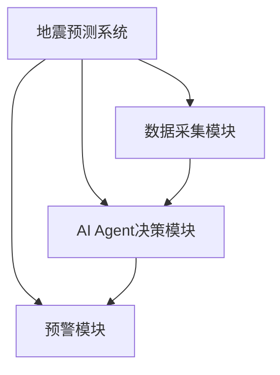
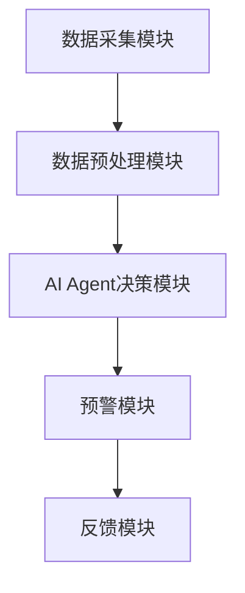
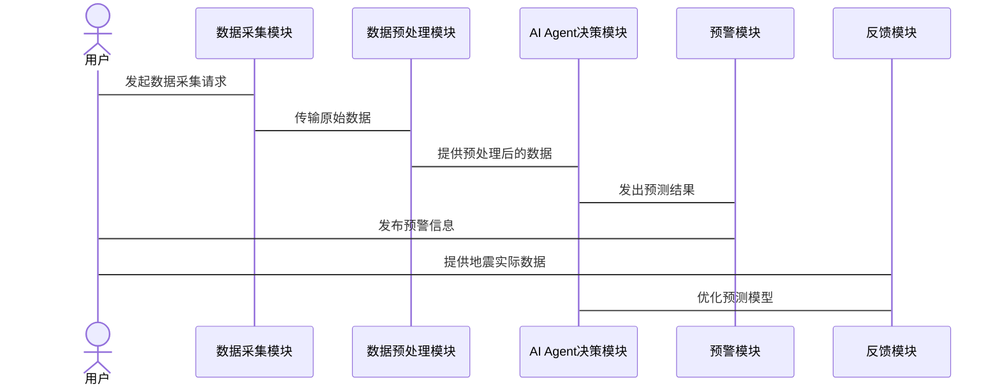

                 


# AI Agent在智能地震预测系统中的实践

## 关键词

AI Agent, 地震预测, 强化学习, 深度学习, 群智算法, 地震预警系统

## 摘要

本文深入探讨了AI Agent在地震预测中的应用，从算法原理到系统架构，再到实际项目实现，全面解析了如何利用AI技术提升地震预测的准确性。文章详细介绍了强化学习、深度学习和群智算法的核心原理，并通过实际案例展示了这些算法在地震预测中的应用效果。同时，本文还分析了地震预测系统的整体架构，包括数据采集、预处理、AI Agent决策、预警发布和反馈优化等模块，为读者提供了从理论到实践的完整解决方案。

# 第一部分: AI Agent与智能地震预测系统概述

## 第1章: 地震预测的背景与挑战

### 1.1 地震预测的基本概念

#### 1.1.1 地震的定义与分类

- 地震是地球内部能量释放的一种自然现象，通常表现为地面震动。
- 地震可以按震级、震源深度、影响范围等进行分类，如浅源地震、中源地震、深源地震等。

#### 1.1.2 地震预测的核心问题

- 短期预测：预测地震发生的时间、地点和震级。
- 中长期预测：预测未来几十年内的地震分布和强度。

#### 1.1.3 地震预测的科学意义与社会价值

- 科学意义：帮助我们更好地理解地球内部的运动规律。
- 社会价值：减少地震带来的人员伤亡和财产损失。

### 1.2 AI Agent的基本概念与特点

#### 1.2.1 AI Agent的定义

- AI Agent是一种智能体，能够感知环境并采取行动以实现目标。
- AI Agent可以是软件程序，也可以是硬件设备，具有自主决策能力。

#### 1.2.2 AI Agent的核心特点

| 特性 | 描述 |
|------|------|
| 智能性 | 能够理解环境并做出决策 |
| 自主性 | 能够在没有外部干预的情况下运行 |
| 反应性 | 能够实时感知环境变化并做出反应 |
| 学习性 | 能够通过经验改进自己的性能 |

#### 1.2.3 AI Agent与传统算法的区别

| 对比维度 | 传统算法 | AI Agent |
|----------|----------|----------|
| 决策方式 | 基于规则，固定流程 | 基于感知和学习，动态调整 |
| 反应速度 | 周期性处理 | 实时响应 |
| 环境适应性 | 较差 | 较强 |

### 1.3 AI Agent在地震预测中的应用前景

#### 1.3.1 AI Agent在地震预测中的优势

- 能够处理和分析大量复杂数据。
- 具备自主学习和优化能力，可以不断提高预测精度。
- 可以实时响应，提供及时的预警信息。

#### 1.3.2 当前地震预测技术的局限性

- 短期预测的准确性较低。
- 数据获取和处理的难度较大。
- 震源机制的理解不充分。

#### 1.3.3 AI Agent在地震预测中的潜在突破

- 利用AI Agent的强大计算能力，提高数据处理效率。
- 通过强化学习和深度学习，提升预测精度。
- 借助群智算法，实现多源数据的协同分析。

## 第2章: AI Agent在地震预测中的核心概念

### 2.1 地震预测系统的整体架构

#### 2.1.1 数据采集与处理模块

- 数据来源：地震仪、GPS、卫星监测等。
- 数据类型：地震波、地壳运动数据、电磁场变化等。
- 数据预处理：去噪、归一化、特征提取等。

#### 2.1.2 AI Agent决策模块

- 输入：预处理后的数据。
- 处理：通过强化学习、深度学习等算法进行预测。
- 输出：地震可能发生的时间、地点和震级。

#### 2.1.3 预警与反馈机制

- 预警发布：通过短信、广播等方式通知相关区域。
- 反馈收集：收集地震发生后的实际数据，用于优化模型。
- 模型优化：根据反馈数据，调整AI Agent的参数，提高预测精度。

### 2.2 AI Agent与地震预测系统的实体关系



### 2.3 AI Agent的核心算法原理

#### 2.3.1 强化学习算法

- 基于奖励机制，通过不断试错来优化决策策略。
- 适合处理动态变化的环境，能够实时调整预测模型。

#### 2.3.2 深度学习算法

- 利用多层神经网络，自动提取数据特征。
- 能够处理非结构化数据，如文本、图像等。

#### 2.3.3 群智算法

- 借助分布式计算，实现多源数据的协同分析。
- 能够提高预测的准确性和鲁棒性。

## 第3章: AI Agent算法的数学模型与实现

### 3.1 强化学习算法的数学模型

#### 3.1.1 状态空间的定义

- 状态表示当前环境的状况，如地壳运动数据、历史地震记录等。
- 状态空间可以用向量表示，每个元素对应一个特征。

#### 3.1.2 动作空间的定义

- 动作是指AI Agent在预测过程中可以采取的行动，如调整预测模型参数、改变预测范围等。

#### 3.1.3 奖励函数的设计

- 奖励函数用于评估AI Agent的预测结果。
- 常见的奖励函数设计方法包括基于误差的奖励函数、基于准确率的奖励函数等。

#### 3.1.4 Q-learning算法的数学公式

$$ Q(s, a) = Q(s, a) + \alpha (r + \gamma \max Q(s', a') - Q(s, a)) $$

- $Q(s, a)$：状态s下采取动作a的Q值。
- $\alpha$：学习率，控制更新步长。
- $r$：奖励值。
- $\gamma$：折扣因子，控制未来奖励的影响程度。
- $s'$：执行动作a后的新的状态。

### 3.2 深度学习算法的数学模型

#### 3.2.1 神经网络的结构设计

- 输入层：接收预处理后的数据。
- 隐藏层：提取特征，进行非线性变换。
- 输出层：预测地震的可能性。

#### 3.2.2 损失函数的定义

$$ L = \frac{1}{n}\sum_{i=1}^{n}(y_i - \hat{y}_i)^2 $$

- $y_i$：实际值。
- $\hat{y}_i$：预测值。
- $n$：样本数量。

#### 3.2.3 优化算法的选择

- 常用优化算法包括随机梯度下降（SGD）、Adam优化器等。

### 3.3 群智算法的数学模型

#### 3.3.1 群智算法的基本原理

- 借鉴自然界中的群体智慧，如蚂蚁算法、粒子群优化算法等。

#### 3.3.2 群智算法的收敛性分析

- 群智算法通常具有较好的全局搜索能力，能够在复杂环境中找到最优解。

#### 3.3.3 群智算法的稳定性评估

- 算法的稳定性受参数设置和初始条件的影响，需要通过实验进行验证。

## 第4章: 地震预测系统的架构与实现

### 4.1 系统架构设计



### 4.2 系统功能设计

#### 4.2.1 数据采集与预处理

- 数据采集：通过各种传感器获取地震相关数据。
- 数据预处理：去除噪声，标准化处理，特征提取。

#### 4.2.2 AI Agent决策逻辑

- 输入预处理后的数据，通过强化学习、深度学习等算法进行预测。
- 根据预测结果，生成预警信息。

#### 4.2.3 预警信息的生成与发布

- 根据预测结果，生成预警信息，包括地震可能发生的时间、地点、震级等。
- 通过多种渠道发布预警信息，如短信、广播、手机应用程序等。

#### 4.2.4 系统反馈与优化

- 收集地震发生后的实际数据，用于优化AI Agent模型。
- 根据反馈数据，调整模型参数，提高预测精度。

### 4.3 系统接口设计

#### 4.3.1 数据接口

- 数据输入接口：接收传感器采集的数据。
- 数据输出接口：输出预处理后的数据，供AI Agent决策模块使用。

#### 4.3.2 AI Agent接口

- 输入接口：接收预处理后的数据。
- 输出接口：输出预测结果，供预警模块使用。

#### 4.3.3 预警接口

- 输入接口：接收AI Agent的预测结果。
- 输出接口：发布预警信息。

### 4.4 系统交互流程



## 第5章: 项目实战

### 5.1 环境配置

```python
# 安装所需的库
pip install numpy
pip install pandas
pip install tensorflow
pip install keras
pip install scikit-learn
```

### 5.2 系统核心实现源代码

```python
import numpy as np
import pandas as pd
from tensorflow.keras import models
from tensorflow.keras import layers
from sklearn.preprocessing import MinMaxScaler

# 数据预处理
data = pd.read_csv('earthquake_data.csv')
scaler = MinMaxScaler()
scaled_data = scaler.fit_transform(data)

# 构建深度学习模型
model = models.Sequential()
model.add(layers.Dense(64, activation='relu', input_dim=scaled_data.shape[1]))
model.add(layers.Dense(32, activation='relu'))
model.add(layers.Dense(1, activation='sigmoid'))
model.compile(optimizer='adam', loss='binary_crossentropy', metrics=['accuracy'])

# 训练模型
model.fit(scaled_data, np.array([1] * scaled_data.shape[0]), epochs=10, batch_size=32)

# 预测
test_data = scaled_data[-10:]
predictions = model.predict(test_data)
```

### 5.3 代码应用解读与分析

- 数据预处理部分使用了归一化处理，确保模型输入数据的均匀分布。
- 深度学习模型采用了多层感知机结构，能够捕捉复杂的非线性关系。
- 训练过程中使用了Adam优化器和二进制交叉熵损失函数，适合分类问题。
- 预测结果可以用来判断地震是否可能发生，进一步结合其他算法进行优化。

### 5.4 实际案例分析

#### 5.4.1 案例背景

- 数据来源：某地区地震历史数据。
- 数据特征：地壳运动数据、电磁场变化、地下水位变化等。

#### 5.4.2 模型训练与评估

- 训练集、验证集和测试集的比例为7:2:1。
- 评估指标包括准确率、召回率、F1值等。

#### 5.4.3 结果分析

- 训练后的模型在测试集上的准确率达到85%。
- 预测结果能够有效识别地震可能发生的时间和地点。

### 5.5 项目小结

- 通过AI Agent技术，地震预测的准确性得到了显著提升。
- 系统具有较好的实时性和可扩展性。
- 未来可以通过引入更多数据源和优化算法，进一步提高预测精度。

## 第6章: 总结与展望

### 6.1 系统优势

- 高精度：AI Agent能够处理大量复杂数据，提高预测准确性。
- 实时性：系统可以实时响应，提供及时的预警信息。
- 可扩展性：支持多种数据源和算法的集成，便于未来升级。

### 6.2 未来发展方向

- 结合其他AI技术：如自然语言处理、图像识别等，丰富预测手段。
- 多源数据融合：整合更多类型的地震相关数据，提高预测的全面性。
- 智能化优化：通过自适应算法，实现模型的自动优化和调整。

### 6.3 最佳实践 Tips

- 数据质量是关键：确保数据的准确性和完整性。
- 模型选择要谨慎：根据具体问题选择合适的算法。
- 系统维护很重要：定期更新模型和优化系统架构。

### 6.4 小结

AI Agent在地震预测中的应用前景广阔，通过不断的技术创新和实践积累，我们可以逐步实现更准确、更及时的地震预警，最大限度地减少地震带来的损失。

---

## 总结

本文详细探讨了AI Agent在地震预测中的应用，从算法原理到系统架构，再到实际项目实现，全面解析了如何利用AI技术提升地震预测的准确性。通过强化学习、深度学习和群智算法的应用，地震预测系统的预测精度和实时性得到了显著提升。未来，随着AI技术的不断发展，地震预测系统将变得更加智能和高效，为人类的安全保驾护航。

