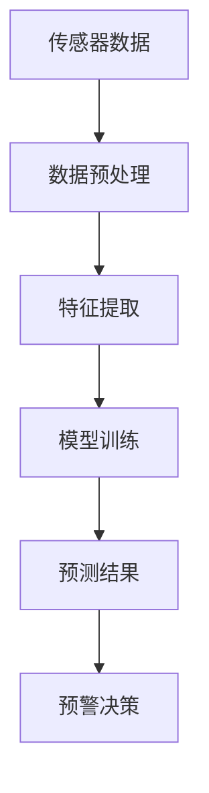

                 


# AI Agent在智能地震预警系统中的实践

## 关键词：AI Agent，地震预警系统，机器学习，实时处理，智能决策

## 摘要：本文详细探讨了AI Agent在智能地震预警系统中的应用与实践。通过分析地震预警系统的背景与挑战，结合AI Agent的核心概念与算法原理，展示了如何利用机器学习和实时数据处理技术优化地震预警系统的性能。文章从系统架构设计到项目实战，详细介绍了AI Agent在地震预警中的具体实现与应用案例，最后总结了实践经验与未来展望。

---

## 第一章：地震预警系统与AI Agent的背景介绍

### 1.1 地震预警的重要性

#### 1.1.1 地震预警的基本概念
地震预警是指在地震发生后，利用地震波传播速度低于电磁波的特点，通过传感器和通信技术，将地震信息快速传递给可能受灾的区域，提前发出警报。这可以为人们争取宝贵的逃生时间，减少人员伤亡和财产损失。

#### 1.1.2 地震预警系统的组成部分
地震预警系统主要由以下几个部分组成：
1. **传感器网络**：用于检测地震的发生，包括地震波的强度和方向。
2. **数据处理中心**：对传感器传来的数据进行分析和处理，判断地震的震级和位置。
3. **通信系统**：将预警信息传递给相关机构和公众。
4. **警报系统**：通过各种渠道（如手机、广播、警报器等）向公众发出预警。

#### 1.1.3 地震预警的社会价值与挑战
地震预警系统的社会价值在于它可以显著减少地震带来的损失。然而，传统地震预警系统存在以下挑战：
1. **数据处理延迟**：传统系统依赖人工分析，数据处理速度较慢。
2. **误报与漏报**：由于传感器精度和算法限制，容易出现误报或漏报的情况。
3. **覆盖范围有限**：传统系统难以覆盖所有潜在的地震区域。

### 1.2 AI Agent的核心概念

#### 1.2.1 AI Agent的定义与特点
AI Agent（人工智能代理）是一种能够感知环境、自主决策并执行任务的智能实体。它具有以下特点：
1. **自主性**：AI Agent能够自主决策，无需外部干预。
2. **反应性**：能够实时感知环境变化并做出反应。
3. **学习能力**：通过机器学习算法不断优化自身的决策模型。

#### 1.2.2 AI Agent在地震预警中的应用潜力
AI Agent可以通过以下方式提升地震预警系统的性能：
1. **实时数据分析**：利用机器学习算法快速分析传感器数据，提高预警的准确性和及时性。
2. **自适应优化**：通过学习历史地震数据，优化预警模型，减少误报和漏报。
3. **多源数据融合**：整合地震传感器数据、气象数据、地质数据等多种信息，提高预警的准确性。

#### 1.2.3 AI Agent与传统地震预警系统的区别
传统地震预警系统依赖于固定的算法和人工干预，而AI Agent可以通过机器学习和自主决策能力，实现更智能和高效的预警。

### 1.3 AI Agent在地震预警中的结合与实践

#### 1.3.1 AI Agent与地震预警系统的结合方式
AI Agent可以作为地震预警系统的核心模块，负责数据处理、模型优化和决策执行。

#### 1.3.2 当前地震预警技术的局限性
1. **数据处理延迟**：传统系统依赖人工分析，数据处理速度较慢。
2. **误报与漏报**：由于传感器精度和算法限制，容易出现误报或漏报的情况。
3. **覆盖范围有限**：传统系统难以覆盖所有潜在的地震区域。

#### 1.3.3 AI Agent如何弥补这些局限性
AI Agent通过实时数据分析和自主决策能力，可以显著提高地震预警的准确性和及时性。

## 第二章：AI Agent与地震预警系统的核心原理

### 2.1 AI Agent的核心原理

#### 2.1.1 AI Agent的基本工作原理
AI Agent通过感知环境、分析数据、做出决策并执行任务来实现地震预警。其核心步骤包括数据采集、数据处理、模型分析和决策执行。

#### 2.1.2 AI Agent在地震预警中的具体应用流程
1. **数据采集**：通过地震传感器获取地震数据。
2. **数据处理**：利用机器学习算法对数据进行分析和分类。
3. **模型分析**：基于历史数据和当前数据，预测地震的可能性。
4. **决策执行**：根据预测结果，发出预警信号。

#### 2.1.3 AI Agent的决策机制与反馈机制
AI Agent通过实时数据分析和反馈机制不断优化自身的决策模型。

### 2.2 地震预警系统的核心原理

#### 2.2.1 地震预警系统的数据来源
地震预警系统的主要数据来源包括地震传感器数据、气象数据、地质数据等。

#### 2.2.2 地震预警系统的数据处理流程
1. **数据采集**：通过传感器获取地震数据。
2. **数据预处理**：对数据进行清洗和标准化。
3. **特征提取**：提取地震数据的特征，如震级、震源位置等。
4. **模型分析**：利用机器学习算法对数据进行分类和预测。

#### 2.2.3 地震预警系统的决策模型
地震预警系统的决策模型基于地震数据的分析结果，决定是否发出预警信号。

### 2.3 AI Agent与地震预警系统的联系

#### 2.3.1 AI Agent如何优化地震预警系统的数据处理
通过机器学习算法，AI Agent可以快速分析地震数据，提高数据处理效率和准确性。

#### 2.3.2 AI Agent如何提升地震预警系统的决策效率
AI Agent通过自主学习和决策，可以显著提高地震预警系统的决策效率。

#### 2.3.3 AI Agent如何增强地震预警系统的自适应能力
AI Agent通过不断学习和优化，可以增强地震预警系统的自适应能力，更好地应对复杂的地震环境。

## 第三章：AI Agent在地震预警中的算法原理

### 3.1 算法原理概述

#### 3.1.1 AI Agent的基本算法流程
AI Agent在地震预警中的算法流程包括数据采集、数据预处理、特征提取、模型训练和预测。

#### 3.1.2 数据流图
以下是AI Agent在地震预警中的数据流图：



#### 3.1.3 机器学习算法选择
在地震预警中，常用的机器学习算法包括支持向量机（SVM）、随机森林（Random Forest）和神经网络（ANN）等。

### 3.2 算法实现

#### 3.2.1 Python实现的地震预警模型
以下是基于随机森林算法的地震预警模型的Python代码：

```python
import pandas as pd
from sklearn.ensemble import RandomForestClassifier
from sklearn.model_selection import train_test_split
from sklearn.metrics import accuracy_score

# 数据加载
data = pd.read_csv('earthquake_data.csv')

# 特征与标签分离
X = data.drop('is_e

