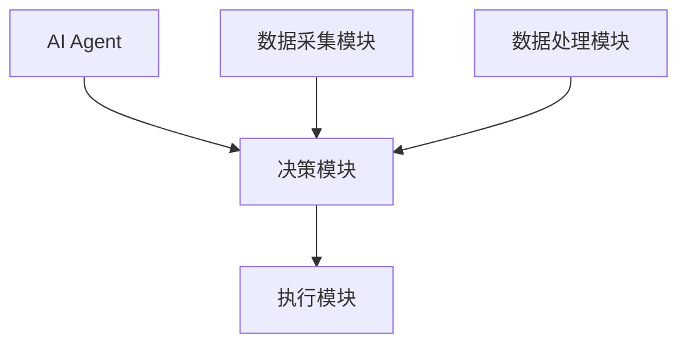
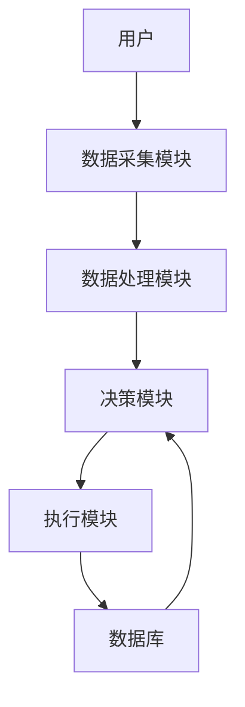
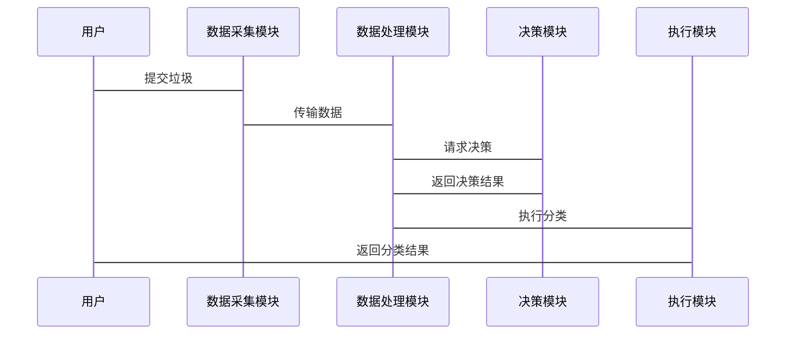

                 


# AI Agent在智能垃圾分类中的实践

> 关键词：AI Agent、智能垃圾分类、机器学习、图像识别、边缘计算

> 摘要：随着城市化进程的加快，垃圾处理问题日益突出，智能垃圾分类成为解决这一问题的重要手段。AI Agent（人工智能代理）作为一种能够感知环境、自主决策的智能体，在智能垃圾分类系统中发挥着重要作用。本文从AI Agent的基本概念出发，结合智能垃圾分类的实际需求，详细探讨了AI Agent在垃圾分类中的应用场景、核心算法、系统架构设计以及实际项目实现。通过本文的分析，读者将深入了解AI Agent在智能垃圾分类中的实践价值和未来发展方向。

---

## 第1章: AI Agent的基本概念与背景

### 1.1 AI Agent的定义与特点

AI Agent（人工智能代理）是一种能够感知环境、自主决策并执行任务的智能体。它具有以下核心特点：
- **自主性**：能够在没有外部干预的情况下独立运作。
- **反应性**：能够根据环境变化实时调整行为。
- **主动性**：主动寻找问题并提出解决方案。
- **社会性**：能够与其他智能体或人类进行协作与交互。

### 1.2 智能垃圾分类的背景与问题

#### 1.2.1 垃圾分类的重要性
垃圾分类是环境保护的重要环节，能够减少资源浪费、降低环境污染并提高可回收资源的利用率。

#### 1.2.2 当前垃圾分类的痛点
- **人工成本高**：传统垃圾分类依赖人工操作，效率低且成本高。
- **分类不准确**：人工分类容易出错，影响后续处理效率。
- **缺乏智能化**：现有系统缺乏智能决策能力，难以应对复杂场景。

#### 1.2.3 AI Agent在垃圾分类中的应用前景
AI Agent能够通过图像识别、机器学习等技术实现对垃圾的智能分类，显著提高分类效率和准确性。

---

## 第2章: AI Agent在智能垃圾分类中的问题描述

### 2.1 垃圾分类的复杂性

#### 2.1.1 垃圾种类的多样性
垃圾种类繁多，包括可回收物、厨余垃圾、有害垃圾和其他垃圾，不同类型的垃圾需要不同的处理方式。

#### 2.1.2 垃圾识别的挑战
垃圾的形状、颜色、材质等特征复杂多变，识别难度大。

#### 2.1.3 垃圾分类的效率问题
传统分类方式效率低下，无法满足大规模垃圾分类的需求。

### 2.2 AI Agent在垃圾分类中的应用目标

#### 2.2.1 提高分类效率
通过AI Agent实现快速、准确的分类，减少人工干预。

#### 2.2.2 减少人工干预
降低人工成本，提高垃圾分类的效率和准确性。

#### 2.2.3 实现智能化管理
通过智能化决策优化垃圾分类流程，提升整体管理水平。

---

## 第3章: AI Agent与智能垃圾分类的核心概念

### 3.1 AI Agent在垃圾分类中的角色

#### 3.1.1 AI Agent作为决策者
AI Agent能够根据输入的数据（如图像、传感器信息）进行分析，生成分类决策。

#### 3.1.2 AI Agent作为执行者
AI Agent能够通过与硬件设备（如机械臂、分类器）交互，执行具体的分类操作。

#### 3.1.3 AI Agent作为协调者
AI Agent能够协调多个设备或人员，优化垃圾分类流程。

### 3.2 智能垃圾分类系统的组成

#### 3.2.1 数据采集模块
通过摄像头、传感器等设备采集垃圾的图像和特征信息。

#### 3.2.2 数据处理模块
对采集到的数据进行预处理、特征提取和分类。

#### 3.2.3 决策模块
基于处理后的数据，生成分类决策。

#### 3.2.4 执行模块
根据决策结果，执行具体的分类操作。

---

## 第4章: AI Agent与智能垃圾分类的概念结构与核心要素

### 4.1 概念结构图

通过概念结构图，我们可以清晰地看到AI Agent在智能垃圾分类系统中的位置和作用。



### 4.2 核心要素组成

#### 4.2.1 数据输入
包括图像数据、传感器数据等。

#### 4.2.2 决策模型
基于机器学习的分类模型，如卷积神经网络（CNN）。

#### 4.2.3 执行机构
如机械臂、分类器等硬件设备。

#### 4.2.4 人机交互界面
用于用户与AI Agent之间的交互，如手机APP、触摸屏等。

---

## 第5章: AI Agent的核心原理

### 5.1 AI Agent的基本原理

#### 5.1.1 信息感知
通过摄像头、传感器等设备感知环境中的垃圾信息。

#### 5.1.2 信息处理
对感知到的数据进行特征提取和分析。

#### 5.1.3 决策制定
基于分析结果，生成分类决策。

#### 5.1.4 行为执行
根据决策结果，执行具体的分类操作。

### 5.2 AI Agent的决策机制

#### 5.2.1 基于规则的决策
根据预设的规则进行分类，适用于简单场景。

#### 5.2.2 基于学习的决策
通过机器学习模型进行分类，适用于复杂场景。

#### 5.2.3 基于推理的决策
通过逻辑推理生成决策，适用于需要复杂判断的场景。

---

## 第6章: AI Agent在智能垃圾分类中的核心联系

### 6.1 AI Agent在垃圾分类中的应用场景

#### 6.1.1 垃圾识别与分类
通过图像识别技术，准确识别垃圾种类。

#### 6.1.2 垃圾处理流程优化
通过AI Agent优化垃圾分类流程，提高效率。

#### 6.1.3 垃圾分类的动态调整
根据环境变化实时调整分类策略。

### 6.2 AI Agent与垃圾分类系统的交互

#### 6.2.1 数据流的传递
数据从采集模块传输到决策模块，再传输到执行模块。

#### 6.2.2 信息的实时反馈
执行模块将分类结果反馈给决策模块，形成闭环。

#### 6.2.3 系统的动态调整
AI Agent根据反馈实时调整决策策略。

---

## 第7章: AI Agent在智能垃圾分类中的算法原理

### 7.1 垃圾分类的算法实现

#### 7.1.1 图像分类模型
使用卷积神经网络（CNN）进行图像分类。

#### 7.1.2 数据预处理
对图像进行归一化、增强等处理。

#### 7.1.3 模型训练
使用标注数据训练模型，优化分类性能。

#### 7.1.4 模型部署
将训练好的模型部署到实际系统中。

### 7.2 垃圾分类的优化算法

#### 7.2.1 迁移学习
利用预训练模型加快训练速度。

#### 7.2.2 数据增强
通过数据增强技术扩展训练数据。

#### 7.2.3 集成学习
通过集成学习提升分类准确率。

---

## 第8章: 智能垃圾分类系统的系统架构设计

### 8.1 系统功能设计

#### 8.1.1 数据采集模块
负责采集垃圾图像和特征信息。

#### 8.1.2 数据处理模块
对数据进行预处理和特征提取。

#### 8.1.3 决策模块
基于处理后的数据生成分类决策。

#### 8.1.4 执行模块
根据决策结果执行分类操作。

#### 8.1.5 人机交互模块
提供用户与系统的交互界面。

### 8.2 系统架构设计

通过以下架构图，我们可以清晰地看到系统的整体结构。



### 8.3 系统接口设计

#### 8.3.1 数据接口
数据采集模块与数据处理模块之间的接口。

#### 8.3.2 决策接口
数据处理模块与决策模块之间的接口。

#### 8.3.3 执行接口
决策模块与执行模块之间的接口。

#### 8.3.4 人机交互接口
用户与系统之间的交互接口。

### 8.4 系统交互设计

通过以下序列图，我们可以看到系统中各模块的交互流程。



---

## 第9章: 项目实战

### 9.1 环境安装

#### 9.1.1 系统要求
- 操作系统：Linux/Windows/MacOS
- Python版本：3.6+

#### 9.1.2 安装依赖
```bash
pip install numpy matplotlib scikit-learn tensorflow
```

### 9.2 核心实现

#### 9.2.1 图像分类模型实现

```python
import tensorflow as tf
from tensorflow.keras import layers

model = tf.keras.Sequential([
    layers.Conv2D(32, (3,3), activation='relu', input_shape=(224, 224, 3)),
    layers.MaxPooling2D((2,2)),
    layers.Conv2D(64, (3,3), activation='relu'),
    layers.MaxPooling2D((2,2)),
    layers.Flatten(),
    layers.Dense(128, activation='relu'),
    layers.Dense(5, activation='softmax')
])

model.compile(optimizer='adam', loss='sparse_categorical_crossentropy', metrics=['accuracy'])
model.summary()
```

#### 9.2.2 数据处理模块实现

```python
import cv2
import numpy as np

def preprocess_image(image_path):
    image = cv2.imread(image_path)
    image = cv2.resize(image, (224, 224))
    image = image / 255.0
    return image
```

#### 9.2.3 决策模块实现

```python
def classify_image(model, image_path):
    image = preprocess_image(image_path)
    image = np.expand_dims(image, axis=0)
    prediction = model.predict(image)
    predicted_class = np.argmax(prediction[0])
    return predicted_class
```

### 9.3 案例分析

#### 9.3.1 数据准备
准备不同类型的垃圾图像，如纸张、塑料、玻璃等。

#### 9.3.2 模型训练
使用预处理后的数据训练分类模型。

#### 9.3.3 模型测试
使用测试数据验证模型的分类准确率。

#### 9.3.4 系统集成
将模型集成到实际垃圾分类系统中，进行实时分类测试。

---

## 第10章: 最佳实践与总结

### 10.1 最佳实践

#### 10.1.1 数据质量
确保训练数据的多样性和代表性，避免过拟合。

#### 10.1.2 模型优化
通过迁移学习、数据增强等技术优化模型性能。

#### 10.1.3 系统稳定性
确保系统在实际运行中的稳定性和可靠性。

### 10.2 小结

AI Agent在智能垃圾分类中的应用显著提高了分类效率和准确性，降低了人工成本。通过本文的分析，我们深入了解了AI Agent的核心原理、系统架构设计以及实际项目实现。

### 10.3 注意事项

- 在实际应用中，需要考虑系统的实时性和响应速度。
- 确保系统的安全性，避免数据泄露和隐私问题。
- 定期更新模型，以应对垃圾类型的变化和新垃圾种类的出现。

### 10.4 拓展阅读

- 《机器学习实战》
- 《深度学习》
- 《Python机器学习》

---

通过本文的详细讲解，读者可以全面了解AI Agent在智能垃圾分类中的实践应用。未来，随着技术的不断发展，AI Agent在垃圾分类中的应用将更加广泛，为环境保护和资源利用做出更大的贡献。

