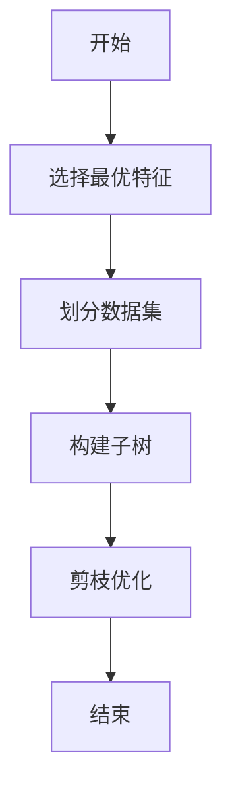
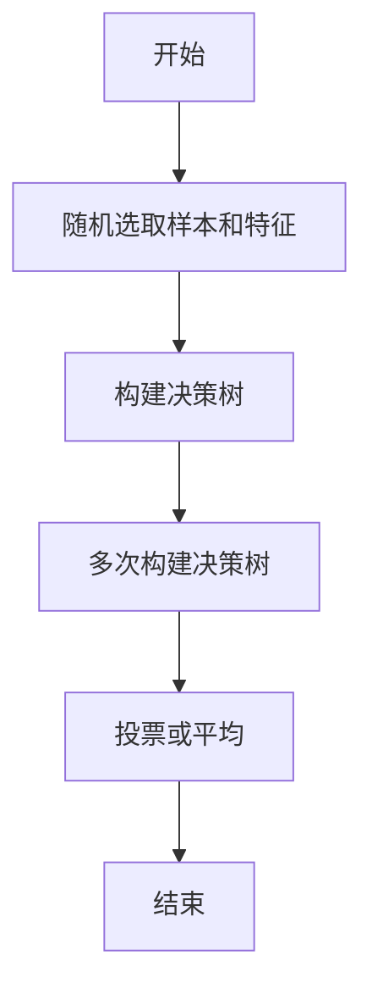
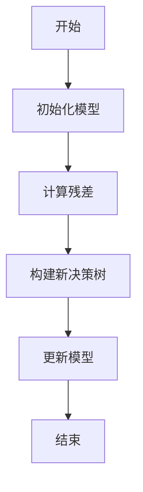
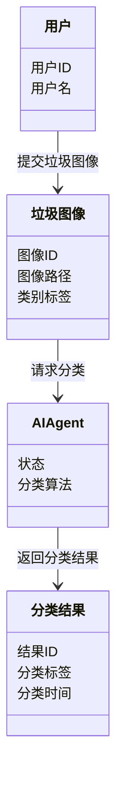
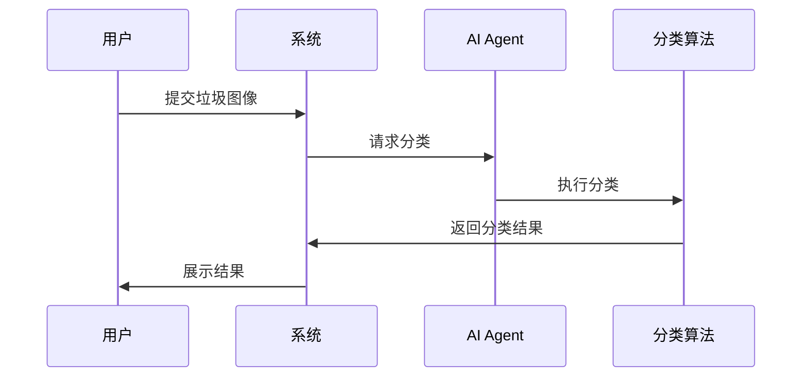

                 


# AI Agent在智能垃圾分类系统中的实践

> **关键词**：AI Agent，智能垃圾分类，决策树算法，随机森林，梯度提升树，系统架构设计

> **摘要**：本文详细探讨了AI Agent在智能垃圾分类系统中的应用实践。通过分析垃圾分类的背景和挑战，介绍AI Agent的核心概念和算法原理，结合系统架构设计和项目实战，展示了如何利用AI技术提升垃圾分类的效率和准确性。文章最后总结了实践经验，为读者提供实用的建议和进一步的学习方向。

---

# 第3章: AI Agent的核心算法原理

## 3.1 决策树算法

### 3.1.1 决策树的基本原理

决策树是一种基于树结构的预测模型，通过特征选择和分割数据来构建分类或回归树。决策树的优势在于直观、易于解释，且适用于离散和连续数据。

#### 决策树的构建流程：

1. 选择最优特征：计算特征的信息增益或信息增益率，选择增益最大的特征作为当前节点的分割依据。
2. 划分数据集：根据选择的特征将数据集划分为子集。
3. 递归构建子树：对子集重复上述过程，直到所有数据点都属于同一类别或数据集无法再分割。
4. 剪枝优化：为防止过拟合，对决策树进行剪枝处理，平衡模型复杂度和泛化能力。

#### 决策树的优缺点：

- **优点**：
  - 易于理解和解释。
  - 适合处理非线性数据。
  - 无需数据预处理（如归一化）。
- **缺点**：
  - 易受噪声数据影响。
  - 对缺失值敏感。
  - 过拟合风险较高。

### 3.1.2 ID3算法与信息增益

ID3算法使用信息增益来选择最优特征。信息增益的计算公式为：

$$
\text{信息增益}(D, A) = H(D) - H(D|A)
$$

其中，$H(D)$是数据集$D$的熵，$H(D|A)$是特征$A$条件下的熵。

#### ID3算法的步骤：

1. 计算数据集的熵$H(D)$。
2. 对每个特征计算条件熵$H(D|A)$。
3. 计算信息增益，选择增益最大的特征作为分割依据。
4. 递归构建决策树。

### 3.1.3 C4.5算法与信息增益率

C4.5算法改进了ID3算法，使用信息增益率来选择特征，避免了对偏基类特征的偏好。

信息增益率的计算公式为：

$$
\text{信息增益率}(D, A) = \frac{\text{信息增益}(D, A)}{\text{特征$A$的熵}}
$$

C4.5算法的步骤与ID3类似，但选择特征时使用信息增益率。

### 3.1.4 CART算法与基尼指数

CART算法用于构建分类和回归树，使用基尼指数来衡量数据的纯度。

基尼指数的计算公式为：

$$
\text{基尼指数}(D, A) = \sum_{i=1}^{n} p_i (1 - p_i)
$$

其中，$p_i$是第$i$个特征的分布概率。

CART算法的步骤：

1. 计算数据集的基尼指数。
2. 对每个特征计算基尼指数，选择最小的特征作为分割依据。
3. 递归构建决策树。

### 3.1.5 决策树的优缺点分析

- **优点**：
  - 简单易懂，适合非专业人士使用。
  - 适合处理多分类问题。
- **缺点**：
  - 易受噪声影响，可能产生不合理的分支。
  - 对训练数据中的异常值敏感。

### 3.1.6 决策树构建的Mermaid流程图



### 3.1.7 Python代码实现

以下是使用Scikit-learn库实现决策树分类的代码示例：

```python
from sklearn.tree import DecisionTreeClassifier
from sklearn.datasets import make_classification
from sklearn.model_selection import train_test_split
from sklearn.metrics import accuracy_score

# 生成数据集
X, y = make_classification(n_samples=100, n_features=2, n_classes=2, random_state=42)

# 划分训练集和测试集
X_train, X_test, y_train, y_test = train_test_split(X, y, test_size=0.2, random_state=42)

# 初始化决策树分类器
clf = DecisionTreeClassifier()

# 训练模型
clf.fit(X_train, y_train)

# 预测
y_pred = clf.predict(X_test)

# 计算准确率
print("决策树分类准确率:", accuracy_score(y_test, y_pred))
```

---

## 3.2 随机森林与梯度提升树

### 3.2.1 随机森林算法

随机森林是通过集成多个决策树构建的分类器，具有较高的准确性和鲁棒性。

#### 随机森林的构建流程：

1. 从训练数据中随机选取样本和特征，构建多棵决策树。
2. 对所有决策树进行投票或平均，得到最终结果。

#### 随机森林的优缺点：

- **优点**：
  - 高准确性和鲁棒性。
  - 能处理高维数据。
- **缺点**：
  - 计算复杂度较高。
  - 可能存在过拟合风险。

### 3.2.2 梯度提升树

梯度提升树是一种迭代的 boosting 方法，通过不断优化模型来减少误差。

#### 梯度提升树的构建流程：

1. 初始化基础模型（如决策树）。
2. 计算当前模型的残差。
3. 使用残差作为新数据，构建新的决策树。
4. 将新树的预测结果与原模型结合，更新整体模型。
5. 重复步骤2-4，直到达到指定迭代次数。

### 3.2.3 随机森林与梯度提升树的Mermaid流程图

随机森林：



梯度提升树：



### 3.2.4 Python代码实现

以下是使用Scikit-learn库实现随机森林和梯度提升树的代码示例：

```python
from sklearn.ensemble import RandomForestClassifier, GradientBoostingClassifier
from sklearn.metrics import accuracy_score

# 初始化随机森林分类器
rf_clf = RandomForestClassifier()
rf_clf.fit(X_train, y_train)
y_pred_rf = rf_clf.predict(X_test)
print("随机森林分类准确率:", accuracy_score(y_test, y_pred_rf))

# 初始化梯度提升树分类器
gbt_clf = GradientBoostingClassifier()
gbt_clf.fit(X_train, y_train)
y_pred_gbt = gbt_clf.predict(X_test)
print("梯度提升树分类准确率:", accuracy_score(y_test, y_pred_gbt))
```

---

## 3.3 算法对比与选择

### 3.3.1 决策树、随机森林和梯度提升树的对比

| 特性                | 决策树       | 随机森林       | 梯度提升树       |
|---------------------|--------------|----------------|-----------------|
| **优势**            | 简单易懂     | 高准确率         | 高准确率和鲁棒性 |
| **缺点**            | 易过拟合       | 计算复杂度高     | 易过拟合         |
| **适用场景**        | 小数据集     | 大数据集         | 高维数据         |

### 3.3.2 算法选择建议

- 数据量小：使用决策树或随机森林。
- 数据量大：使用随机森林或梯度提升树。
- 对解释性要求高：使用决策树。
- 对准确率要求高：使用随机森林或梯度提升树。

---

# 第4章: 系统分析与架构设计

## 4.1 问题场景介绍

智能垃圾分类系统旨在通过AI Agent实现对垃圾的自动分类，提高分类效率和准确性。系统需要处理大量的图像数据，快速响应用户的请求，并确保分类结果的准确性和稳定性。

## 4.2 系统功能设计

### 4.2.1 领域模型设计

系统的主要实体包括：用户、垃圾图像、分类结果、AI Agent。



### 4.2.2 系统架构设计

系统采用分层架构，包括数据采集层、业务逻辑层和用户界面层。


### 4.2.3 系统接口设计

系统主要接口包括：

- 用户提交垃圾图像接口：接收图像数据，调用分类算法。
- 分类结果查询接口：返回分类结果和分类时间。

### 4.2.4 系统交互流程



---

# 第5章: 项目实战

## 5.1 环境安装

### 5.1.1 安装Python和必要的库

```bash
pip install numpy scikit-learn matplotlib
```

## 5.2 系统核心实现源代码

### 5.2.1 决策树分类器实现

```python
from sklearn.tree import DecisionTreeClassifier
from sklearn.datasets import make_classification
from sklearn.model_selection import train_test_split
from sklearn.metrics import accuracy_score

# 生成数据集
X, y = make_classification(n_samples=100, n_features=2, n_classes=2, random_state=42)

# 划分训练集和测试集
X_train, X_test, y_train, y_test = train_test_split(X, y, test_size=0.2, random_state=42)

# 初始化决策树分类器
clf = DecisionTreeClassifier()

# 训练模型
clf.fit(X_train, y_train)

# 预测
y_pred = clf.predict(X_test)

# 计算准确率
print("决策树分类准确率:", accuracy_score(y_test, y_pred))
```

### 5.2.2 随机森林分类器实现

```python
from sklearn.ensemble import RandomForestClassifier
from sklearn.metrics import accuracy_score

# 初始化随机森林分类器
rf_clf = RandomForestClassifier()

# 训练模型
rf_clf.fit(X_train, y_train)

# 预测
y_pred_rf = rf_clf.predict(X_test)

# 计算准确率
print("随机森林分类准确率:", accuracy_score(y_test, y_pred_rf))
```

### 5.2.3 梯度提升树分类器实现

```python
from sklearn.ensemble import GradientBoostingClassifier
from sklearn.metrics import accuracy_score

# 初始化梯度提升树分类器
gbt_clf = GradientBoostingClassifier()

# 训练模型
gbt_clf.fit(X_train, y_train)

# 预测
y_pred_gbt = gbt_clf.predict(X_test)

# 计算准确率
print("梯度提升树分类准确率:", accuracy_score(y_test, y_pred_gbt))
```

## 5.3 代码应用解读与分析

### 5.3.1 决策树分类器解读

上述代码生成一个简单的二分类问题，使用决策树分类器进行分类，并输出准确率。通过调整参数，可以优化模型性能。

### 5.3.2 随机森林分类器解读

随机森林通过集成多个决策树，显著提高了分类准确率，但计算时间较长。

### 5.3.3 梯度提升树分类器解读

梯度提升树通过迭代优化，进一步提高了分类准确率，但需要调整参数以防止过拟合。

---

## 5.4 实际案例分析

假设我们有一个垃圾分类系统，需要将垃圾分为可回收和不可回收两类。使用上述代码进行训练和测试，可以得到不同算法的分类准确率，从而选择最适合的算法。

---

## 5.5 项目小结

通过本项目，我们了解了AI Agent在智能垃圾分类系统中的应用，掌握了决策树、随机森林和梯度提升树的实现方法，并通过实际案例分析，验证了不同算法的优劣。

---

# 第6章: 最佳实践

## 6.1 小结

本文详细介绍了AI Agent在智能垃圾分类系统中的应用，从算法原理到系统设计，再到项目实战，为读者提供了全面的指导。

## 6.2 注意事项

- 数据预处理是关键，需确保数据质量和完整性。
- 模型选择需结合实际需求和数据特点。
- 模型部署需考虑性能和可扩展性。

## 6.3 拓展阅读

- 《机器学习实战》
- 《Python机器学习》
- 《深入理解随机森林》

---

# 结语

通过本文的学习，读者可以掌握AI Agent在智能垃圾分类系统中的实践方法，为后续的深入学习和项目开发打下坚实基础。

--- 

**感谢您的耐心阅读，希望本文对您有所帮助！**

