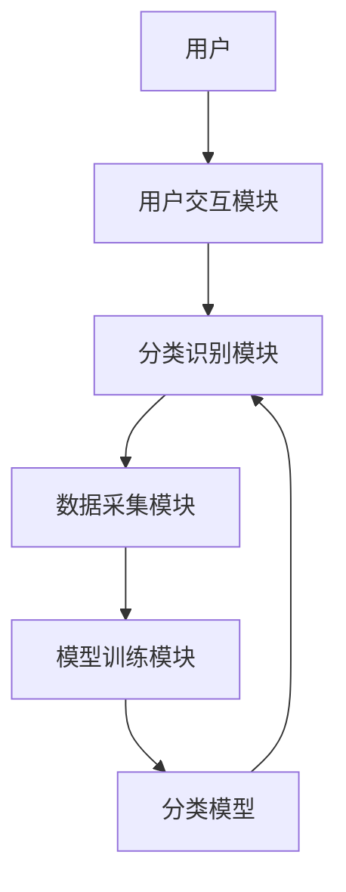
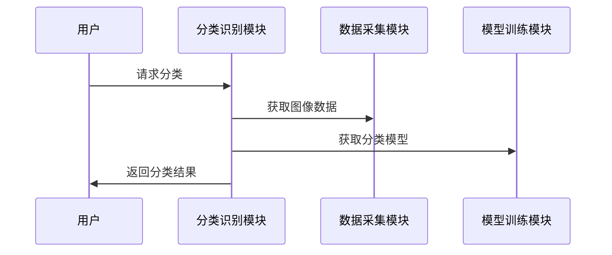

                 


```markdown
# AI Agent在智能垃圾分类识别中的实践

> 关键词：AI Agent, 智能垃圾分类, 图像识别, 机器学习, 系统架构

> 摘要：AI Agent作为人工智能领域的前沿技术，正在逐步应用于各个行业。智能垃圾分类识别是其中的重要应用之一。本文将详细探讨AI Agent在垃圾分类中的实践，涵盖技术背景、核心算法、系统架构、项目实现及优化等方面，帮助读者全面理解AI Agent在智能垃圾分类中的应用价值和实现方法。

---

## 第一部分: AI Agent与智能垃圾分类识别概述

### 第1章: AI Agent与智能垃圾分类识别概述

#### 1.1 AI Agent的基本概念

##### 1.1.1 什么是AI Agent
AI Agent（人工智能代理）是指能够感知环境、自主决策并执行任务的智能实体。它具备以下核心特征：
- **自主性**：能够在没有外部干预的情况下独立运作。
- **反应性**：能够实时感知环境并做出反应。
- **目标导向**：基于明确的目标执行任务。
- **学习能力**：通过数据和经验不断优化自身性能。

##### 1.1.2 AI Agent的核心特征
- **感知能力**：通过传感器或数据输入接口获取环境信息。
- **推理能力**：利用逻辑推理或机器学习算法对信息进行处理。
- **决策能力**：基于推理结果做出最优决策。
- **执行能力**：通过执行机构或接口将决策转化为实际操作。

##### 1.1.3 AI Agent与传统自动化的区别
AI Agent的核心区别在于其智能化和自主性。传统自动化基于固定的程序逻辑，而AI Agent能够通过学习和适应环境不断优化自身行为。

#### 1.2 智能垃圾分类识别的背景与意义

##### 1.2.1 垃圾分类的重要性
随着城市化进程的加快，垃圾量急剧增加，垃圾分类成为解决环境污染和资源浪费的重要手段。智能垃圾分类能够提高分类效率，减少人工成本，同时促进资源的循环利用。

##### 1.2.2 传统垃圾分类的局限性
传统垃圾分类主要依赖人工操作，存在效率低、分类标准不统一、成本高等问题。人工分类容易出现错误，且难以应对复杂多样的垃圾类型。

##### 1.2.3 AI Agent在垃圾分类中的优势
AI Agent能够通过图像识别、机器学习等技术实现智能化分类，具有高效、精准、可扩展性强的特点。

---

## 第二部分: AI Agent在垃圾分类中的核心概念与技术原理

### 第2章: AI Agent与图像识别技术

#### 2.1 图像识别技术的基本原理

##### 2.1.1 图像处理的基础知识
图像处理是将图像转换为计算机能够理解的数据格式，并通过算法提取图像中的有用信息。常见的图像处理技术包括图像分割、边缘检测、特征提取等。

##### 2.1.2 常见的图像识别算法
- **模板匹配**：将待识别图像与已知模板进行匹配，找到最相似的部分。
- **霍夫变换**：用于检测图像中的直线、圆等几何形状。
- **SIFT（尺度不变特征变换）**：用于提取图像中的局部特征。

##### 2.1.3 图像识别的挑战与解决方案
图像识别面临光照变化、视角变换、遮挡等问题。通过深度学习算法（如CNN）可以有效解决这些问题。

#### 2.2 AI Agent在图像识别中的应用

##### 2.2.1 垃圾分类中的图像采集与预处理
图像采集是垃圾分类的第一步，通常使用摄像头或扫描仪获取图像。预处理包括图像灰度化、二值化、平滑处理等。

##### 2.2.2 基于深度学习的图像识别模型
卷积神经网络（CNN）是图像识别中最常用的深度学习模型。其核心思想是通过卷积操作提取图像特征，并通过全连接层进行分类。

##### 2.2.3 模型训练与优化
模型训练需要大量标注数据，通过反向传播算法优化模型参数。训练过程中需要处理过拟合、欠拟合等问题，可以通过数据增强、Dropout等技术进行优化。

### 第3章: 机器学习与AI Agent的结合

#### 3.1 机器学习的基本原理

##### 3.1.1 机器学习的定义与分类
机器学习是一种通过数据和经验自动优化模型的算法。常见的机器学习算法包括监督学习、无监督学习、强化学习等。

##### 3.1.2 监督学习、无监督学习与强化学习
- **监督学习**：基于有标签的数据进行训练，适用于分类、回归等任务。
- **无监督学习**：基于无标签的数据进行训练，适用于聚类、降维等任务。
- **强化学习**：通过与环境交互，学习最优策略，适用于游戏、机器人控制等任务。

##### 3.1.3 机器学习算法的优缺点
- **优点**：能够处理复杂数据，适应性强。
- **缺点**：需要大量数据，计算成本高。

#### 3.2 AI Agent与机器学习的结合

##### 3.2.1 机器学习在垃圾分类中的应用
通过机器学习算法，AI Agent能够自动识别垃圾类型，优化分类策略。

##### 3.2.2 基于机器学习的分类模型构建
- **数据准备**：收集和标注垃圾图像数据。
- **特征提取**：通过CNN提取图像特征。
- **模型训练**：基于训练数据训练分类模型。
- **模型评估**：通过测试数据评估模型性能。

##### 3.2.3 模型的训练与调优
通过调整学习率、批量大小、正则化参数等，优化模型性能。

### 第4章: 智能垃圾分类识别的数学模型与算法

#### 4.1 图像分类的数学模型

##### 4.1.1 卷积神经网络（CNN）的基本结构
CNN由卷积层、池化层、全连接层等组成。其数学模型如下：
$$
\text{输出} = \text{卷积操作}(\text{输入}, \text{卷积核}) + \text{偏置}
$$

##### 4.1.2 池化操作的数学原理
池化操作用于降低计算复杂度和提取空间不变性。常用的池化方式包括最大池化、平均池化等。

##### 4.1.3 激活函数的作用与选择
激活函数用于引入非线性，使模型能够学习复杂特征。常用的激活函数包括Sigmoid、ReLU、Tanh等。

#### 4.2 垃圾分类的算法实现

##### 4.2.1 基于CNN的垃圾分类算法流程
1. **数据预处理**：将图像归一化到固定尺寸。
2. **特征提取**：通过卷积层提取图像特征。
3. **分类预测**：通过全连接层输出概率分布。
4. **结果输出**：选择概率最高的类别作为预测结果。

##### 4.2.2 模型训练的数学公式
损失函数通常采用交叉熵损失：
$$
\text{损失} = -\sum_{i=1}^{n} y_i \log p_i + (1-y_i)\log (1-p_i)
$$
其中，\(y_i\)是真实标签，\(p_i\)是预测概率。

##### 4.2.3 模型优化与调参技巧
通过调整学习率、批量大小、正则化系数等参数，优化模型性能。

---

## 第三部分: 系统设计与实现

### 第5章: 智能垃圾分类识别系统的架构设计

#### 5.1 系统功能需求分析

##### 5.1.1 用户需求与功能模块划分
- **数据采集模块**：负责图像采集和预处理。
- **模型训练模块**：负责训练和优化分类模型。
- **分类识别模块**：负责图像分类和结果输出。
- **用户交互模块**：负责与用户进行交互。

##### 5.1.2 系统性能需求
- **处理速度**：每秒处理若干张图像。
- **分类精度**：达到90%以上。
- **稳定性**：能够长时间稳定运行。

##### 5.1.3 系统安全与稳定性要求
- **数据安全**：防止数据泄露。
- **系统稳定性**：具备容错和自我修复能力。

#### 5.2 系统架构

##### 5.2.1 系统架构图


##### 5.2.2 实体关系图
```mermaid
erd
    entity 用户 {
        id: int
        用户名: string
    }
    entity 图像数据 {
        id: int
        图像路径: string
        标签: string
    }
    entity 分类模型 {
        id: int
        模型权重: blob
    }
    用户 -->> 图像数据: 上传图像
    图像数据 -->> 分类模型: 训练模型
    分类模型 -->> 分类识别模块: 使用模型进行分类
```

#### 5.3 系统接口设计

##### 5.3.1 数据接口
- **输入接口**：接收用户上传的图像数据。
- **输出接口**：返回分类结果。

##### 5.3.2 模型接口
- **训练接口**：接收训练数据，输出训练好的模型。
- **预测接口**：接收待分类图像，输出分类结果。

#### 5.4 系统交互流程

##### 5.4.1 系统交互图


---

## 第四部分: 项目实战与优化

### 第6章: 项目实战

#### 6.1 环境安装

##### 6.1.1 安装Python
安装Python 3.8及以上版本。

##### 6.1.2 安装依赖库
安装以下依赖库：
```bash
pip install numpy
pip install pandas
pip install tensorflow
pip install matplotlib
pip install scikit-learn
```

#### 6.2 核心实现

##### 6.2.1 数据预处理代码
```python
import numpy as np
import cv2

def preprocess_image(image_path):
    image = cv2.imread(image_path)
    image = cv2.resize(image, (224, 224))
    image = image / 255.0
    return image
```

##### 6.2.2 模型训练代码
```python
import tensorflow as tf
from tensorflow.keras import layers

model = tf.keras.Sequential([
    layers.Conv2D(32, (3, 3), activation='relu', input_shape=(224, 224, 3)),
    layers.MaxPooling2D((2, 2)),
    layers.Conv2D(64, (3, 3), activation='relu'),
    layers.MaxPooling2D((2, 2)),
    layers.Flatten(),
    layers.Dense(128, activation='relu'),
    layers.Dense(10, activation='softmax')
])

model.compile(optimizer='adam', loss='sparse_categorical_crossentropy', metrics=['accuracy'])
model.fit(x_train, y_train, epochs=10, batch_size=32)
```

##### 6.2.3 分类识别代码
```python
def classify_image(model, image_path):
    image = preprocess_image(image_path)
    image = np.expand_dims(image, axis=0)
    prediction = model.predict(image)
    predicted_class = np.argmax(prediction[0])
    return predicted_class
```

#### 6.3 案例分析

##### 6.3.1 数据集准备
使用公开的垃圾图像数据集，例如ImageNet或自建数据集。

##### 6.3.2 模型训练与优化
通过交叉验证、网格搜索等方法优化模型参数。

##### 6.3.3 系统测试
在实际场景中测试系统的分类准确率、处理速度等性能指标。

---

## 第五部分: 总结与展望

### 第7章: 总结与展望

#### 7.1 本章小结
本文详细探讨了AI Agent在智能垃圾分类识别中的实践，涵盖了技术背景、核心算法、系统设计、项目实现等多个方面。

#### 7.2 项目优化建议
- **数据增强**：增加数据多样性，提高模型鲁棒性。
- **模型优化**：尝试不同的网络结构，优化模型性能。
- **系统优化**：优化系统架构，提高处理速度。

#### 7.3 未来展望
随着AI技术的不断发展，AI Agent在垃圾分类中的应用将更加智能化、自动化。未来的研究方向包括更高效的算法、更智能的硬件、更人性化的交互等。

---

## 第六部分: 扩展阅读

### 6.1 推荐书籍
- 《深度学习》—— Ian Goodfellow
- 《机器学习实战》—— 周志华

### 6.2 推荐博客与文章
- [AI Agent在智能分类中的应用](#)
- [深度学习与图像识别](#)

### 6.3 推荐工具与库
- **TensorFlow**：谷歌的深度学习框架。
- **Keras**：基于TensorFlow的高级接口。
- **OpenCV**：图像处理库。

---

通过本文的详细讲解，读者可以全面了解AI Agent在智能垃圾分类识别中的应用，并能够实际操作相关技术。希望本文对读者在AI Agent和智能垃圾分类领域的学习和研究有所帮助。
```

