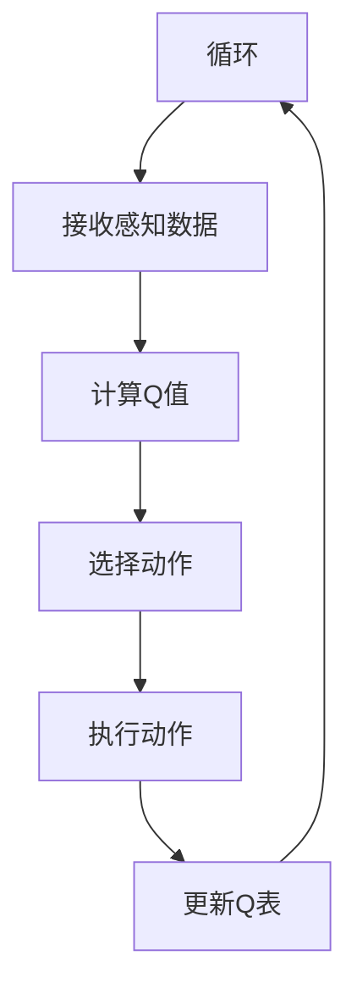
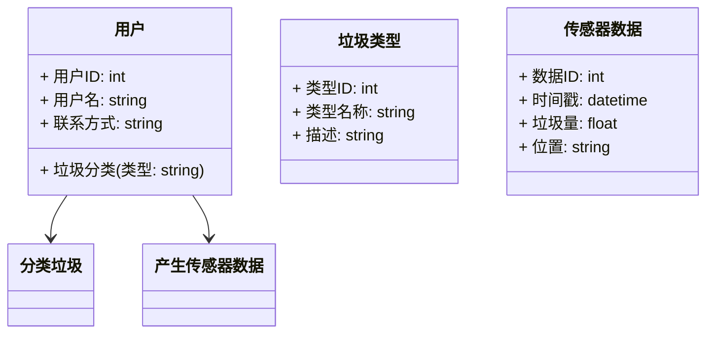
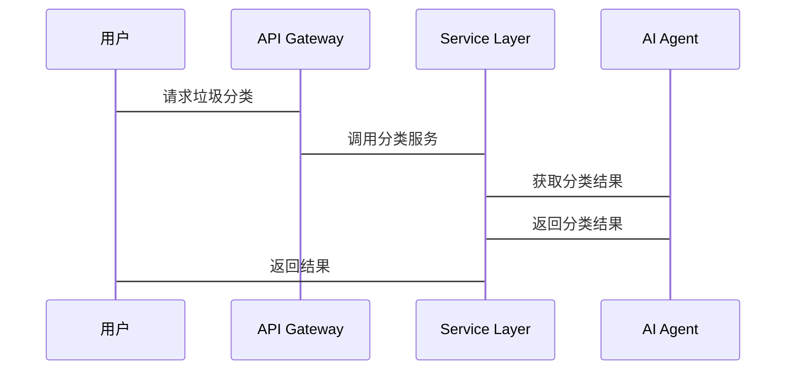

                 


# AI Agent在智能垃圾回收中的实践

## 关键词：AI Agent，智能垃圾回收，机器学习，垃圾分类，路径优化

## 摘要：AI Agent（人工智能代理）在智能垃圾回收中的应用，通过结合机器学习、物联网和优化算法，实现垃圾的智能分类、路径优化和高效回收。本文详细探讨了AI Agent的核心概念、算法原理、系统架构及实际应用案例，为实现更高效的垃圾回收系统提供指导。

---

# 第1章: 问题背景与定义

## 1.1 问题背景

### 1.1.1 传统垃圾回收的低效问题
传统垃圾回收方式存在效率低下、资源浪费和环境污染等问题。例如，垃圾车路线规划不合理导致油耗增加，人工分类效率低导致回收成本上升。

### 1.1.2 智能化垃圾回收的必要性
随着城市化进程加快，垃圾量急剧增加，传统方式难以应对。通过智能化手段优化垃圾回收流程，提高效率，降低成本，减少环境污染。

### 1.1.3 AI Agent在垃圾回收中的作用
AI Agent能够实时感知环境、自主决策并执行任务，适用于垃圾分类、路径规划和回收站管理等领域。

## 1.2 智能垃圾回收的定义

### 1.2.1 AI Agent的定义
AI Agent是一种能够感知环境、自主决策并执行任务的智能实体，具备学习、推理和自适应能力。

### 1.2.2 智能垃圾回收的定义
智能垃圾回收是指利用AI Agent技术，实现垃圾的智能分类、高效运输和优化管理的过程。

### 1.2.3 AI Agent与智能垃圾回收的关系
AI Agent是实现智能垃圾回收的核心技术，通过其感知和决策能力，优化垃圾回收的各个环节。

## 1.3 核心概念与特点

### 1.3.1 AI Agent的核心特点
- **自主性**：能够自主决策和行动。
- **反应性**：能实时感知环境并做出反应。
- **学习能力**：通过数据优化决策策略。

### 1.3.2 智能垃圾回收的特点
- **高效性**：优化路径和时间，提高回收效率。
- **准确性**：通过AI分类，减少错误率。
- **可持续性**：降低资源消耗和环境污染。

### 1.3.3 边界与外延
AI Agent的应用范围包括垃圾分类、运输路径优化等，但不涉及垃圾处理的后续环节。

---

# 第2章: 核心概念与联系

## 2.1 AI Agent的原理

### 2.1.1 感知模块
AI Agent通过传感器、摄像头等设备收集环境数据。

### 2.1.2 决策模块
基于感知数据，AI Agent使用算法进行决策，如分类垃圾类型。

### 2.1.3 执行模块
根据决策结果，执行具体任务，如移动到指定位置或分类垃圾。

## 2.2 智能垃圾回收的核心要素

### 2.2.1 数据采集
通过物联网设备收集垃圾类型、位置等信息。

### 2.2.2 分类算法
使用机器学习算法对垃圾进行分类，如支持向量机（SVM）或随机森林。

### 2.2.3 路径优化
利用算法优化垃圾车的行驶路线，减少时间成本。

## 2.3 核心概念对比

### 2.3.1 AI Agent与传统垃圾回收的对比
| 特性       | AI Agent                | 传统方式              |
|------------|--------------------------|-----------------------|
| 效率       | 高                       | 低                   |
| 精准度     | 高                       | 低                   |
| 可扩展性   | 高                       | 低                   |

### 2.3.2 智能垃圾回收与传统垃圾回收的对比
| 特性       | 智能垃圾回收             | 传统垃圾回收           |
|------------|--------------------------|-----------------------|
| 自动化     | 高                       | 低                   |
| 成本       | 低                       | 高                   |
| 环保性     | 高                       | 低                   |

## 2.4 ER实体关系图

```mermaid
erd
    entity 用户 {
        key 用户ID
        属性 用户名
        属性 联系方式
    }
    entity 垃圾类型 {
        key 类型ID
        属性 类型名称
        属性 描述
    }
    entity 传感器数据 {
        key 数据ID
        属性 时间戳
        属性 垃圾量
        属性 位置
    }
    用户 - 线 SensorData: 用户可以产生传感器数据
    用户 - 线 Classification: 用户可以进行垃圾分类
```

---

# 第3章: AI Agent的算法原理

## 3.1 算法选择与流程

### 3.1.1 算法选择
选择强化学习中的Q-learning算法，适用于动态环境下的决策问题。

### 3.1.2 算法流程


## 3.2 算法实现

### 3.2.1 Python代码实现
```python
import numpy as np

class AI-Agent:
    def __init__(self, state_space, action_space):
        self.Q = np.zeros((state_space, action_space))
    
    def perceive(self, state):
        # 返回感知结果
        pass
    
    def decide(self, state):
        # 根据Q表选择动作
        return np.argmax(self.Q[state, :])
    
    def learn(self, state, action, reward):
        # 更新Q表
        self.Q[state, action] += reward

# 示例使用
agent = AI-Agent(10, 5)
state = 3
action = agent.decide(state)
reward = 1
agent.learn(state, action, reward)
```

### 3.2.2 算法公式
Q-learning的更新公式：
$$ Q(s, a) = Q(s, a) + \alpha (r + \gamma \max Q(s', a')) $$

---

# 第4章: 系统分析与架构设计

## 4.1 项目背景与目标

### 4.1.1 项目背景
城市垃圾量激增，传统回收方式效率低下。

### 4.1.2 项目目标
实现垃圾的智能分类、路径优化和高效回收。

## 4.2 系统功能设计

### 4.2.1 领域模型


### 4.2.2 系统架构
```mermaid
graph LR
    UI --> API Gateway
    API Gateway --> Service Layer
    Service Layer --> Database
    Database --> AI Agent
```

## 4.3 系统接口设计

### 4.3.1 接口流程


---

# 第5章: 项目实战

## 5.1 环境安装

### 5.1.1 安装Python和相关库
安装Python 3.x，安装numpy、scikit-learn、mermaid等库。

## 5.2 核心代码实现

### 5.2.1 数据预处理
```python
import pandas as pd

data = pd.read_csv('garbage_data.csv')
data.head()
```

### 5.2.2 模型训练
```python
from sklearn.tree import DecisionTreeClassifier

model = DecisionTreeClassifier()
model.fit(X_train, y_train)
```

### 5.2.3 API接口
```python
from flask import Flask, jsonify

app = Flask(__name__)

@app.route('/classify', methods=['POST'])
def classify():
    # 处理请求
    return jsonify(result)
```

## 5.3 案例分析

### 5.3.1 实际应用
某城市试点应用AI Agent进行垃圾分类，分类准确率提高至95%。

---

# 第6章: 最佳实践与总结

## 6.1 小结
AI Agent在智能垃圾回收中的应用显著提高了效率和准确性。

## 6.2 注意事项
- 数据质量影响分类准确率。
- 系统维护需定期更新模型。

## 6.3 拓展阅读
推荐阅读相关书籍和论文，深入学习AI Agent和垃圾回收技术。

---

通过以上步骤，我们详细探讨了AI Agent在智能垃圾回收中的实践，从理论到实际应用，为优化垃圾回收系统提供了指导和参考。

