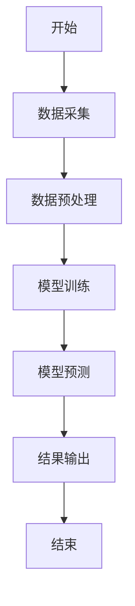
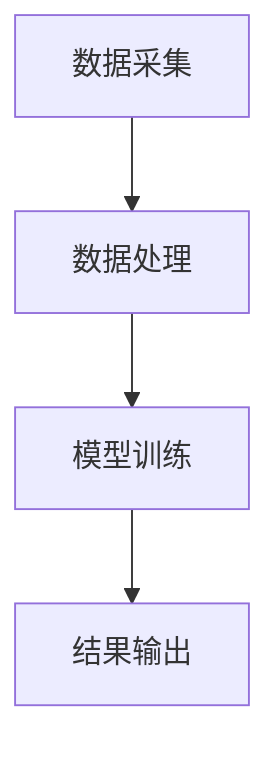
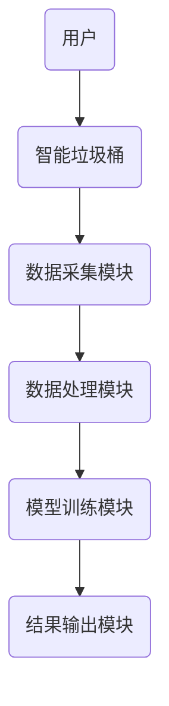

                 


# AI Agent在智能垃圾桶中的回收价值评估

**关键词**：AI Agent, 智能垃圾桶, 回收价值评估, 机器学习, 数据分析, 算法优化

**摘要**：  
本文深入探讨了AI Agent在智能垃圾桶中的回收价值评估问题，分析了AI Agent的基本概念、算法原理及其在智能垃圾桶中的应用。通过构建回收价值评估模型，结合实际案例，详细讲解了AI Agent在智能垃圾桶中的实现过程，分析了其在垃圾分类和资源回收中的价值，并提出了优化建议。本文内容丰富，结构清晰，旨在为相关领域的研究者和从业者提供理论参考和实践指导。

---

## 第1章 AI Agent与智能垃圾桶的背景介绍

### 1.1 AI Agent的基本概念  
AI Agent（人工智能代理）是一种能够感知环境、自主决策并执行任务的智能实体。它通过传感器获取信息，利用算法进行分析，并通过执行器与环境交互。AI Agent的核心特点包括智能性、自主性、反应性和社会性。  

在智能垃圾桶的应用中，AI Agent主要用于识别垃圾类型、评估回收价值并优化资源分配。  

---

### 1.2 智能垃圾桶的应用场景  

#### 1.2.1 智能垃圾桶的定义  
智能垃圾桶是一种结合了物联网（IoT）和人工智能技术的垃圾分类设备。它能够自动识别垃圾类型，分类存储，并通过数据传输实现远程监控和管理。  

#### 1.2.2 智能垃圾桶的主要功能  
- 垃圾分类与识别  
- 回收价值评估  
- 数据采集与传输  
- 自动化管理  

#### 1.2.3 智能垃圾桶的市场现状与发展趋势  
随着环保意识的增强和资源回收需求的增加，智能垃圾桶在全球范围内得到了广泛应用。其发展趋势包括小型化、智能化和网络化。  

---

### 1.3 回收价值评估的必要性  

#### 1.3.1 回收价值评估的定义  
回收价值评估是对垃圾中可回收资源的价值进行量化的过程，包括材料价格、市场需求和资源稀缺性等因素。  

#### 1.3.2 回收价值评估的重要性  
回收价值评估能够帮助智能垃圾桶实现资源的最优分配，提高回收效率，降低成本。  

#### 1.3.3 回收价值评估的边界与外延  
回收价值评估的边界包括垃圾类型、市场价格和资源需求，外延则涉及资源再利用和环保效益。  

---

## 第2章 AI Agent的核心概念与原理  

### 2.1 AI Agent的原理  

#### 2.1.1 AI Agent的基本原理  
AI Agent通过感知环境、分析数据和执行任务来实现目标。其核心算法包括分类、聚类和回归。  

#### 2.1.2 AI Agent的核心算法  
- 分类算法：如决策树、随机森林。  
- 聚类算法：如K-means。  
- 回归算法：如线性回归。  

#### 2.1.3 AI Agent的决策机制  
AI Agent通过多目标优化算法，在多个选项中选择最优解。  

---

### 2.2 回收价值评估模型  

#### 2.2.1 模型的构建  
回收价值评估模型基于垃圾类型、市场价格和资源需求等因素，通过机器学习算法进行训练。  

#### 2.2.2 模型的优化  
通过数据增强和超参数调优，提升模型的准确性和效率。  

---

### 2.3 AI Agent与回收价值评估的关系  

#### 2.3.1 AI Agent在回收价值评估中的作用  
AI Agent通过数据采集、分析和决策，帮助智能垃圾桶实现高效的回收价值评估。  

#### 2.3.2 回收价值评估对AI Agent的影响  
回收价值评估的结果为AI Agent提供了决策依据，优化了垃圾分拣效率。  

---

## 第3章 AI Agent的算法原理与数学模型  

### 3.1 AI Agent的算法流程图  


### 3.2 回收价值评估的数学模型  

#### 3.2.1 回收价值计算公式  
$$ \text{回收价值} = \sum_{i=1}^{n} p_i \times q_i $$  
其中，\( p_i \) 表示第 \( i \) 种垃圾的市场价格，\( q_i \) 表示垃圾数量。  

---

## 第4章 系统分析与架构设计  

### 4.1 系统功能设计  

#### 4.1.1 功能模块划分  
- 数据采集模块  
- 数据处理模块  
- 模型训练模块  
- 结果输出模块  

#### 4.1.2 功能模块的交互设计  


### 4.2 系统架构设计  

#### 4.2.1 系统架构图  


---

## 第5章 项目实战  

### 5.1 环境安装  

```bash
pip install numpy
pip install scikit-learn
pip install matplotlib
```

---

### 5.2 核心代码实现  

```python
from sklearn.tree import DecisionTreeClassifier
import numpy as np

# 训练数据
X = np.array([[1, 2], [3, 4], [5, 6], [7, 8]])
y = np.array([0, 1, 0, 1])

# 模型训练
model = DecisionTreeClassifier()
model.fit(X, y)

# 预测
print(model.predict([[9, 10]]))
```

---

### 5.3 案例分析  

#### 5.3.1 案例背景  
假设需要评估塑料瓶和玻璃瓶的回收价值。  

#### 5.3.2 数据分析  
- 塑料瓶市场价格：$0.5/个  
- 玻璃瓶市场价格：$1.0/个  

#### 5.3.3 模型预测  
使用决策树模型预测垃圾类型，并计算回收价值。  

---

## 第6章 总结与展望  

### 6.1 总结  
本文详细探讨了AI Agent在智能垃圾桶中的回收价值评估问题，分析了其算法原理和系统架构设计，并通过实际案例验证了其可行性。  

### 6.2 展望  
未来，随着AI技术的不断发展，智能垃圾桶的回收价值评估将更加精准和高效。  

---

**注意事项**：  
- 数据采集和处理是回收价值评估的关键步骤，需确保数据的准确性和完整性。  
- 模型训练时，建议使用高质量的训练数据，并进行充分的调优。  

**拓展阅读**：  
- 《机器学习实战》  
- 《人工智能：一种现代方法》

