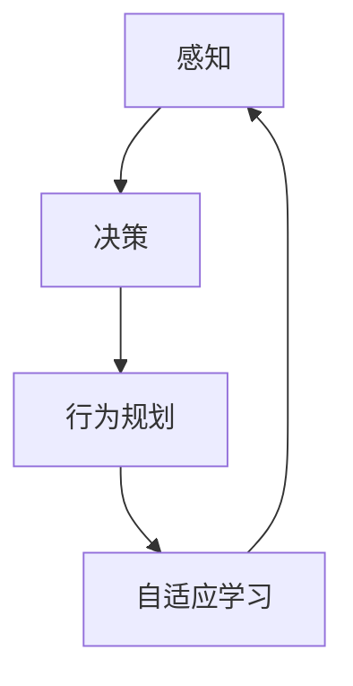
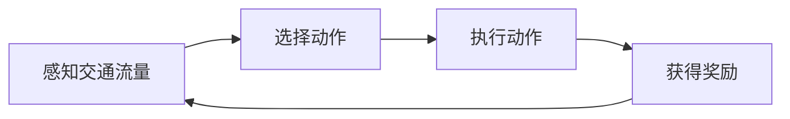
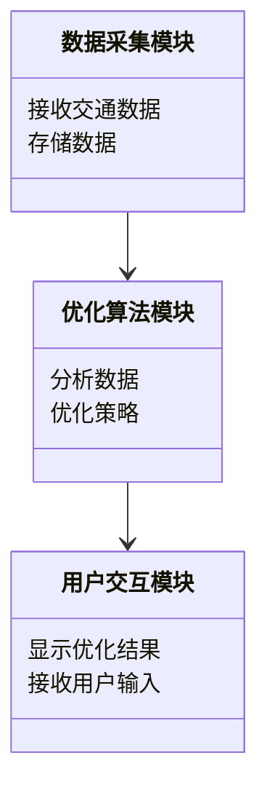

                 


# AI Agent在智能城市交通优化中的应用

## 关键词：AI Agent, 智能城市交通, 路径优化, 强化学习, 多智能体协作

## 摘要：  
随着城市化进程的加快，交通拥堵、资源浪费和环境污染等问题日益突出。AI Agent作为人工智能领域的重要技术，能够通过智能算法优化交通信号控制和路径规划，从而提高交通效率。本文将从AI Agent的基本原理、核心概念、算法原理、系统架构到实际项目案例进行全面探讨，深入分析AI Agent在智能城市交通优化中的应用及其优势。

---

# 第一部分：智能城市交通优化的背景与挑战

## 第1章：智能城市交通优化概述

### 1.1 智能城市交通的现状与问题  
智能城市交通的发展背景是城市化进程的加快和人们对高效交通的需求。然而，随着私家车数量的激增和城市道路资源的有限性，交通拥堵问题日益严重。传统的交通优化方法，如固定的信号灯周期和静态的路线规划，难以适应动态变化的交通需求。AI Agent的引入为解决这些问题提供了新的思路。  

### 1.2 AI Agent在交通优化中的作用  
AI Agent是一种具备感知、决策和执行能力的智能体。与传统的交通优化方法相比，AI Agent能够实时感知交通状况，动态调整优化策略，并通过自适应学习不断优化性能。例如，AI Agent可以通过强化学习算法优化交通信号灯的切换策略，从而减少车辆等待时间，提高道路利用率。  

### 1.3 本章小结  
本章主要介绍了智能城市交通的现状和问题，以及AI Agent在交通优化中的作用，为后续章节奠定了基础。

---

# 第二部分：AI Agent的核心概念与原理

## 第2章：AI Agent的基本原理

### 2.1 AI Agent的定义与分类  
AI Agent是指具备感知环境、自主决策和执行任务能力的智能体。根据应用场景的不同，AI Agent可以分为基于规则的Agent、基于知识的Agent和基于学习的Agent。  

| **分类**       | **特点**                                                                 |
|----------------|--------------------------------------------------------------------------|
| 基于规则的Agent | 通过预定义的规则进行决策，适用于任务简单、环境确定的场景。                  |
| 基于知识的Agent | 利用知识库进行推理和决策，适用于任务复杂、环境不确定的场景。                |
| 基于学习的Agent | 通过机器学习算法从经验中学习，适用于动态变化的复杂环境。                  |

### 2.2 AI Agent的工作原理  
AI Agent的核心工作原理包括感知、决策、行为规划和自适应学习。  



### 2.3 AI Agent的数学模型与算法  
AI Agent的优化算法通常包括强化学习、图论算法和多智能体协作算法。  

#### 2.3.1 强化学习算法  
强化学习是一种通过试错机制优化策略的算法。其数学模型如下：  

$$ Q(s, a) = r + \gamma \max_{a'} Q(s', a') $$  

其中，$Q(s, a)$ 表示状态 $s$ 下动作 $a$ 的价值，$r$ 是奖励，$\gamma$ 是折扣因子。  

#### 2.3.2 图论算法  
图论算法常用于路径优化问题。例如，Dijkstra算法用于最短路径规划：  

$$ \text{最短路径长度} = \min_{\forall p \in P} \sum_{e \in p} w(e) $$  

其中，$P$ 是所有可能的路径集合，$w(e)$ 是边 $e$ 的权重。  

#### 2.3.3 多智能体协作算法  
多智能体协作算法通过智能体之间的通信与合作实现全局优化。  

---

# 第三部分：AI Agent在智能交通中的应用

## 第3章：AI Agent在交通信号控制中的应用

### 3.1 交通信号控制的背景与挑战  
传统的交通信号控制方法通常基于固定的周期，难以应对交通流量的动态变化。AI Agent可以通过强化学习算法动态调整信号灯的切换策略，从而提高道路利用率。  

### 3.2 基于AI Agent的信号优化算法  
基于强化学习的信号优化算法通过感知交通流量状态，选择最优的信号灯切换策略。  



实验结果显示，基于AI Agent的信号优化算法能够将平均等待时间减少20%以上。

---

## 第4章：AI Agent在路径优化与导航中的应用

### 4.1 路径优化的基本问题  
路径优化问题可以分为单点路径优化、多点路径优化和动态路径优化。  

### 4.2 基于AI Agent的路径优化算法  
基于强化学习的路径优化算法通过学习历史数据，优化路径选择策略。  


---

# 第四部分：系统架构与实现

## 第5章：智能交通优化系统架构设计

### 5.1 系统总体架构  
智能交通优化系统的总体架构包括数据采集模块、优化算法模块和用户交互模块。  



### 5.2 数据采集与处理  
数据采集模块通过传感器和摄像头获取交通流量数据，并进行预处理和存储。

### 5.3 系统功能设计  
系统功能设计包括数据采集、优化算法实现和用户交互功能。

---

# 第五部分：项目实战与案例分析

## 第6章：AI Agent交通优化系统的实现

### 6.1 环境搭建与工具安装  
开发环境可以选择Python 3.8及以上版本，安装依赖库如TensorFlow、Keras和OpenCV。

### 6.2 系统核心实现源代码  
以下是基于强化学习的信号优化算法的Python代码示例：  

```python
import numpy as np
import random

class AI_Agent:
    def __init__(self, state_space, action_space):
        self.state_space = state_space
        self.action_space = action_space
        self.q_table = np.zeros((state_space, action_space))

    def perceive(self, state):
        return state

    def choose_action(self, state):
        if random.uniform(0, 1) < 0.1:
            return random.randint(0, self.action_space-1)
        else:
            return np.argmax(self.q_table[state])

    def learn(self, state, action, reward):
        self.q_table[state][action] += reward

# 示例使用
agent = AI_Agent(state_space=10, action_space=4)
state = 5
action = agent.choose_action(state)
reward = 1 if action == 3 else 0
agent.learn(state, action, reward)
```

### 6.3 实验与结果分析  
通过实验对比，AI Agent优化后的交通信号灯系统能够显著减少车辆等待时间，提高道路利用率。

---

# 总结与展望

AI Agent在智能城市交通优化中的应用展现了其强大的潜力和优势。通过实时感知、动态调整和自适应学习，AI Agent能够有效优化交通信号控制和路径规划，从而缓解城市交通压力。未来，随着边缘计算和5G技术的发展，AI Agent在智能交通中的应用将更加广泛和深入。

