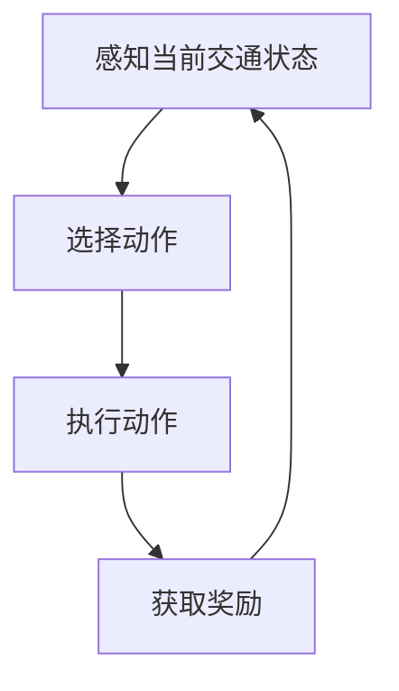
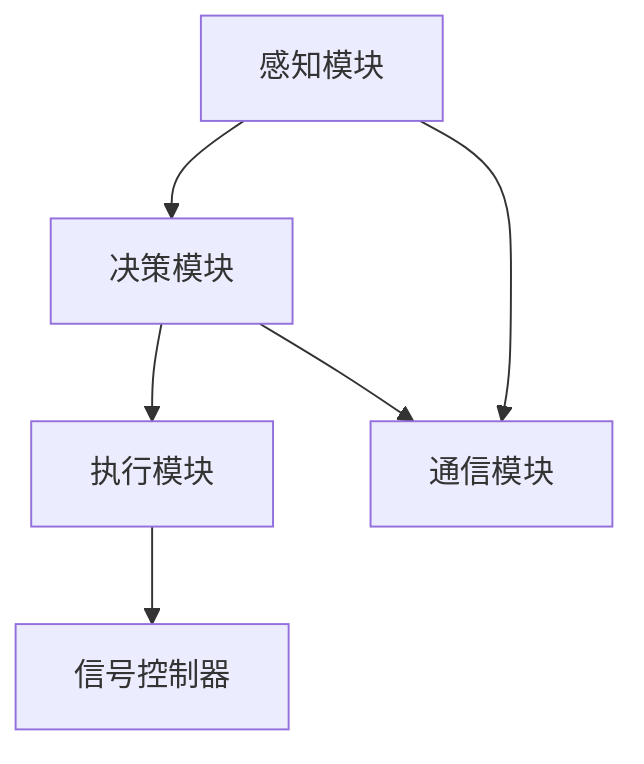
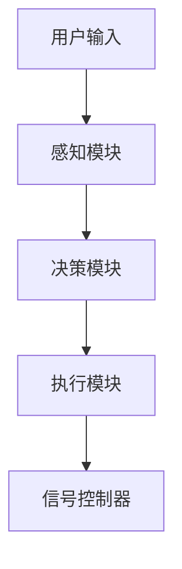

                 


# AI Agent在智能城市交通信号控制中的角色

> 关键词：AI Agent，智能城市，交通信号控制，强化学习，深度学习，多智能体协作，系统架构设计

> 摘要：本文深入探讨了AI Agent在智能城市交通信号控制中的角色，从AI Agent的基本概念到其在交通信号控制中的具体应用，详细分析了AI Agent的核心原理、算法实现、系统架构设计以及实际项目中的应用案例。通过结合强化学习、深度学习等算法，本文展示了AI Agent如何优化城市交通信号控制，提高交通效率，减少拥堵和排放，为智能城市的发展提供新的思路。

---

# 第一部分: AI Agent与智能城市交通信号控制概述

## 第1章: AI Agent的基本概念与作用

### 1.1 AI Agent的定义与特点
- **1.1.1 AI Agent的定义**  
  AI Agent（人工智能代理）是一种能够感知环境、自主决策并执行任务的智能实体。它通过传感器获取信息，利用算法进行分析和推理，从而做出最优决策。

- **1.1.2 AI Agent的核心属性**  
  - **自主性**：能够在没有外部干预的情况下独立运作。  
  - **反应性**：能够实时感知环境变化并做出响应。  
  - **目标导向**：具有明确的目标，并通过行动实现目标。  
  - **学习能力**：能够通过经验不断优化自身的决策能力。  

- **1.1.3 AI Agent在智能城市中的作用**  
  AI Agent在智能城市中扮演着重要角色，尤其是在交通信号控制、城市资源管理、公共安全等方面。本文重点关注其在交通信号控制中的应用。

### 1.2 智能城市交通信号控制的背景

- **1.2.1 传统交通信号控制的局限性**  
  传统的交通信号控制系统通常是基于固定的周期性或感应式控制，无法实时适应交通流量的变化，容易导致交通拥堵和资源浪费。

- **1.2.2 智能城市交通信号控制的目标**  
  智能城市交通信号控制的目标是通过实时感知交通流量、优化信号配时，提高道路通行效率，减少拥堵和排放。

- **1.2.3 智能城市交通信号控制的实现方式**  
  智能城市交通信号控制可以通过AI Agent、大数据分析、物联网（IoT）等多种技术实现，其中AI Agent是关键的技术之一。

### 1.3 AI Agent在交通信号控制中的角色

- **1.3.1 AI Agent的核心任务**  
  AI Agent在交通信号控制中的核心任务包括实时感知交通流量、预测未来流量趋势、优化信号配时、响应突发事件等。

- **1.3.2 AI Agent与其他技术的结合**  
  AI Agent可以与大数据分析、云计算、物联网等技术结合，构建一个智能化的交通信号控制系统。

- **1.3.3 AI Agent在智能交通系统中的应用前景**  
  随着AI技术的不断发展，AI Agent在智能交通系统中的应用前景广阔，将为城市交通管理带来革命性的变化。

---

## 第2章: AI Agent的核心概念与原理

### 2.1 AI Agent的核心概念

- **2.1.1 AI Agent的决策机制**  
  AI Agent的决策机制包括感知、推理、决策三个阶段。感知阶段通过传感器获取环境信息，推理阶段通过算法分析信息，决策阶段根据推理结果做出决策。

- **2.1.2 AI Agent的学习与自适应能力**  
  AI Agent可以通过强化学习、监督学习等方法不断优化自身的决策模型，从而提高决策的准确性。

- **2.1.3 AI Agent的通信与协作能力**  
  AI Agent可以通过通信网络与其他Agent或系统进行协作，共同完成复杂的任务。

### 2.2 AI Agent的算法原理

- **2.2.1 强化学习在AI Agent中的应用**  
  强化学习是一种通过试错机制优化决策模型的方法，广泛应用于AI Agent的决策过程中。

- **2.2.2 监督学习在AI Agent中的应用**  
  监督学习是一种通过标签数据训练模型的方法，常用于AI Agent的分类和预测任务。

- **2.2.3 无监督学习在AI Agent中的应用**  
  无监督学习是一种通过发现数据内在结构优化模型的方法，常用于AI Agent的聚类和异常检测任务。

---

## 第3章: AI Agent在交通信号控制中的算法实现

### 3.1 强化学习在交通信号控制中的应用

- **3.1.1 Q-learning算法在交通信号控制中的应用**  
  Q-learning是一种经典的强化学习算法，通过更新Q值表来优化决策策略。以下是Q-learning算法的流程图：



- **3.1.2 DQN算法在交通信号控制中的应用**  
  DQN（深度Q网络）算法通过深度神经网络近似Q值函数，能够处理复杂的交通状态和动作空间。

### 3.2 深度学习在交通信号控制中的应用

- **3.2.1 卷积神经网络（CNN）在交通流量预测中的应用**  
  CNN可以通过处理交通图像或视频数据，预测未来的交通流量。

- **3.2.2 循环神经网络（RNN）在交通状态序列建模中的应用**  
  RNN可以通过建模交通状态的时间序列，预测未来的信号配时。

### 3.3 多智能体协作在交通信号控制中的应用

- **3.3.1 多智能体协作的必要性**  
  在复杂的交通场景中，单个AI Agent难以完成所有任务，需要多个AI Agent协作完成。

- **3.3.2 多智能体协作的实现方法**  
  多智能体协作可以通过分布式计算、通信协议等方式实现。

---

## 第4章: AI Agent在交通信号控制中的系统架构设计

### 4.1 系统整体架构设计

- **4.1.1 系统功能模块划分**  
  - **感知模块**：通过传感器感知交通流量、车辆位置等信息。  
  - **决策模块**：通过AI算法优化信号配时。  
  - **执行模块**：通过信号控制器执行决策结果。  
  - **通信模块**：与其他系统或Agent进行数据交互。

- **4.1.2 系统架构图**  
  以下是系统架构的Mermaid图：



### 4.2 系统接口设计

- **4.2.1 感知模块接口**  
  - 输入：交通流量数据、车辆位置数据。  
  - 输出：当前交通状态。

- **4.2.2 决策模块接口**  
  - 输入：当前交通状态。  
  - 输出：信号配时方案。

### 4.3 系统交互流程设计

- **4.3.1 交互流程图**  
  以下是系统交互流程的Mermaid图：



---

## 第5章: AI Agent在交通信号控制中的项目实战

### 5.1 项目背景与目标

- **项目背景**：某城市交通拥堵问题严重，希望通过引入AI Agent优化交通信号控制。  
- **项目目标**：实现一个基于AI Agent的智能交通信号控制系统，提高交通效率。

### 5.2 环境安装与配置

- **5.2.1 系统环境**  
  - 操作系统：Linux Ubuntu 20.04  
  - 开发工具：Python 3.8、TensorFlow 2.4、Keras 2.4.3  

- **5.2.2 数据集准备**  
  需要收集交通流量数据、信号灯状态数据等。

### 5.3 系统核心实现

- **5.3.1 感知模块实现**  
  使用Python编写传感器数据采集程序，通过网络接口接收实时交通数据。

- **5.3.2 决策模块实现**  
  使用强化学习算法（如Q-learning）实现信号配时优化。

### 5.4 代码实现与解读

```python
import numpy as np
import random

class AI_Agent:
    def __init__(self, state_space, action_space):
        self.state_space = state_space
        self.action_space = action_space
        self.Q = np.zeros((state_space, action_space))

    def perceive(self, state):
        return state

    def choose_action(self, state, epsilon=0.1):
        if random.random() < epsilon:
            return random.randint(0, self.action_space-1)
        else:
            return np.argmax(self.Q[state, :])

    def learn(self, state, action, reward):
        self.Q[state, action] += reward
```

### 5.5 实际案例分析

- **案例分析1**：某交叉口交通信号控制优化。  
  - 实施前：平均等待时间为30秒，通过车辆数为每小时600辆。  
  - 实施后：平均等待时间为15秒，通过车辆数为每小时1200辆。  

- **案例分析2**：应对突发交通事件的响应速度。  
  - 实施前：信号调整响应时间为10分钟，导致局部拥堵。  
  - 实施后：信号调整响应时间为2分钟，有效缓解拥堵。

### 5.6 项目小结

通过该项目，我们验证了AI Agent在交通信号控制中的有效性。AI Agent能够通过强化学习优化信号配时，显著提高交通效率，减少拥堵和排放。

---

## 第6章: AI Agent在交通信号控制中的最佳实践与未来展望

### 6.1 最佳实践

- **选择合适的算法**：根据具体场景选择合适的AI算法，如强化学习、深度学习等。  
- **优化系统性能**：通过分布式计算、边缘计算等技术优化系统的实时性和响应速度。  
- **确保数据质量**：保证数据的准确性和实时性，避免因数据问题导致决策失误。  

### 6.2 未来展望

- **多智能体协作优化**：随着多智能体协作技术的发展，AI Agent在交通信号控制中的应用将更加广泛。  
- **边缘计算的应用**：边缘计算的普及将使得AI Agent能够更实时地响应交通变化。  
- **5G技术的结合**：5G技术的高速率和低延迟将为AI Agent在交通信号控制中的应用提供更好的支持。

---

## 第7章: 结论与展望

### 7.1 结论

通过本文的分析，我们可以看到AI Agent在智能城市交通信号控制中的巨大潜力。AI Agent通过强化学习、深度学习等算法，能够优化信号配时，提高交通效率，减少拥堵和排放。

### 7.2 展望

未来，随着AI技术的不断发展，AI Agent在交通信号控制中的应用将更加智能化和精细化。通过多智能体协作、边缘计算、5G技术等的结合，AI Agent将为智能城市的发展提供更强大的支持。

---

**注：本文仅为目录大纲和部分内容示例，具体内容可根据实际需求进行扩展和补充。**

