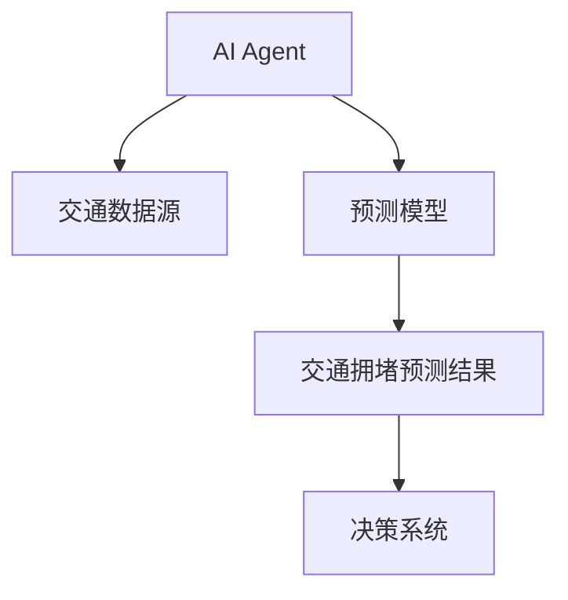
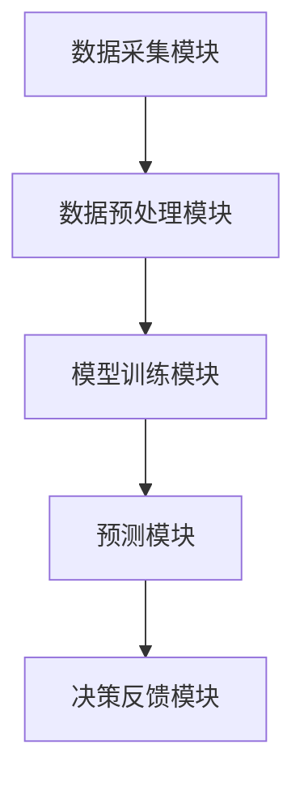
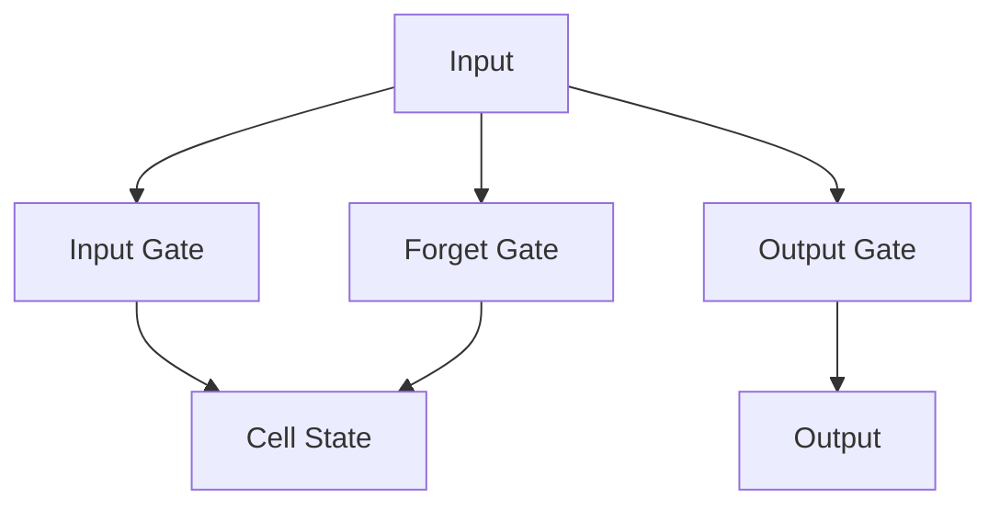
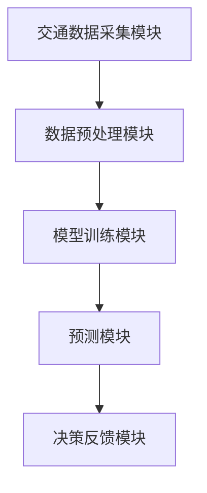
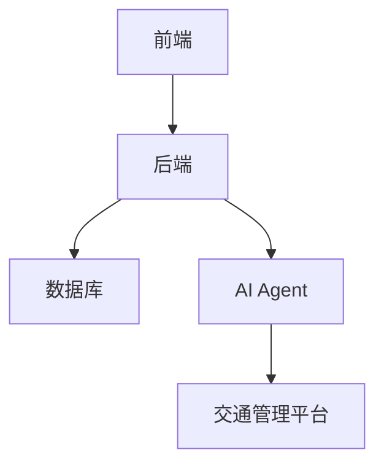
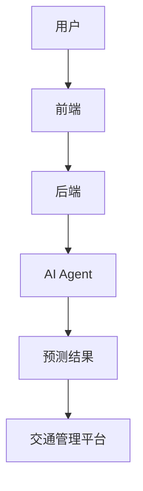

                 


# AI Agent在智能城市交通拥堵预测中的应用

## 关键词：AI Agent、智能城市、交通拥堵预测、深度学习、交通管理、城市规划

## 摘要

随着城市化进程的加速，交通拥堵问题日益严重，已成为现代城市发展面临的主要挑战之一。AI Agent作为一种智能体，能够通过数据收集、分析和决策，为交通拥堵预测提供高效解决方案。本文从AI Agent的基本概念出发，探讨其在智能城市交通拥堵预测中的应用，详细分析其算法原理、系统架构，并通过实际案例展示其在缓解交通拥堵中的潜力。文章最后总结了AI Agent在交通拥堵预测中的优势与未来发展方向。

---

## 第1章: AI Agent与智能城市交通拥堵预测的背景介绍

### 1.1 AI Agent的基本概念

#### 1.1.1 AI Agent的定义与特点

AI Agent（人工智能代理）是一种能够感知环境、自主决策并执行任务的智能实体。它可以基于传感器数据、历史信息或用户输入，通过学习和推理，做出最优决策。AI Agent的特点包括：

- **自主性**：能够独立运行，无需人工干预。
- **反应性**：能够实时感知环境变化并做出响应。
- **学习能力**：通过数据和经验不断优化自身行为。
- **协作性**：能够与其他Agent或系统协同工作。

#### 1.1.2 AI Agent的核心要素与功能

AI Agent的核心要素包括感知、推理、决策和执行四个部分：

1. **感知**：通过传感器、数据库或API获取环境数据。
2. **推理**：利用算法对数据进行分析和理解。
3. **决策**：基于推理结果做出最优决策。
4. **执行**：通过执行机构或接口将决策转化为实际操作。

#### 1.1.3 AI Agent在智能城市中的应用前景

智能城市通过AI Agent可以实现交通、能源、医疗等领域的智能化管理。在交通领域，AI Agent能够实时监控交通流量、预测拥堵情况，并优化交通信号灯控制，从而提升城市交通效率。

### 1.2 智能城市的发展与交通问题

#### 1.2.1 智能城市的定义与特征

智能城市是指通过物联网、大数据、人工智能等技术，实现城市基础设施、服务和管理的智能化。其主要特征包括：

- **数据驱动**：基于海量数据进行决策。
- **智能化**：通过AI技术实现自动化管理。
- **可持续性**：注重资源的高效利用和环境保护。

#### 1.2.2 智能城市交通系统的目标与挑战

智能城市交通系统的目标是实现交通资源的优化配置，减少拥堵、污染和能源浪费。然而，其发展面临以下挑战：

- **数据多样性**：交通数据来源广泛，包括GPS、摄像头、传感器等。
- **实时性要求高**：交通预测需要快速响应。
- **复杂性**：城市交通系统涉及多个变量，如天气、交通事故等。

#### 1.2.3 交通拥堵问题的严重性与影响

交通拥堵不仅浪费时间，还增加了能源消耗和污染物排放。据统计，全球每年因交通拥堵造成的经济损失高达数千亿美元。因此，有效预测和缓解交通拥堵对于城市可持续发展至关重要。

### 1.3 交通拥堵预测的必要性与技术需求

#### 1.3.1 交通拥堵预测的定义与意义

交通拥堵预测是通过分析历史和实时数据，预测未来某一时间段内交通网络的拥堵情况。其意义在于：

- **优化交通信号灯控制**：减少车辆等待时间。
- **提高道路利用率**：通过动态调整交通流量。
- **辅助城市规划**：为城市道路建设和优化提供数据支持。

#### 1.3.2 传统交通拥堵预测方法的局限性

传统预测方法主要依赖统计模型，如线性回归和时间序列分析。然而，这些方法存在以下问题：

- **预测精度低**：难以捕捉复杂的交通模式。
- **实时性差**：无法快速响应突发情况。
- **数据利用率低**：难以处理多源异构数据。

#### 1.3.3 AI Agent在交通拥堵预测中的优势

AI Agent通过集成机器学习、自然语言处理和计算机视觉等技术，能够更准确地预测交通拥堵情况。其优势包括：

- **高精度**：利用深度学习模型，能够捕捉非线性关系。
- **实时性**：能够快速处理实时数据并做出响应。
- **自适应性**：能够根据环境变化自动调整预测模型。

### 1.4 本章小结

本章介绍了AI Agent的基本概念、智能城市的定义与发展，以及交通拥堵预测的必要性与技术需求。通过对比传统方法与AI Agent的优势，为后续章节的分析奠定了基础。

---

## 第2章: AI Agent与交通拥堵预测的核心概念

### 2.1 AI Agent在交通拥堵预测中的原理

#### 2.1.1 AI Agent的数据收集与处理机制

AI Agent通过多种渠道收集交通数据，包括：

- **传感器数据**：如交通摄像头、GPS信号。
- **历史数据**：如交通管理部门的数据库。
- **实时数据**：如社交媒体上的用户报告。

数据处理流程包括数据清洗、特征提取和数据增强。

#### 2.1.2 AI Agent的预测模型构建与优化

AI Agent利用机器学习算法构建预测模型，常用的算法包括：

- **监督学习**：如随机森林、支持向量机（SVM）。
- **无监督学习**：如聚类分析。
- **深度学习**：如卷积神经网络（CNN）、长短期记忆网络（LSTM）。

模型优化包括参数调优和模型评估。

#### 2.1.3 AI Agent的决策与反馈机制

AI Agent根据预测结果做出决策，并通过反馈机制不断优化模型。反馈机制包括：

- **实时调整**：根据实际交通状况动态优化预测模型。
- **历史记录**：记录历史预测结果，用于模型优化。

### 2.2 交通拥堵预测的核心要素分析

#### 2.2.1 交通流量数据的特征与属性

交通流量数据的特征包括：

- **时间特征**：如小时、星期、节假日。
- **空间特征**：如地理位置、道路节点。
- **属性特征**：如车流量、事故率。

#### 2.2.2 时间、空间与天气因素的影响

时间因素包括高峰时段和非高峰时段，空间因素包括道路网络结构，天气因素包括雨雪天气对交通的影响。

#### 2.2.3 交通网络结构与节点关系

交通网络结构包括主干道、支路、交叉路口等，节点关系包括节点之间的流量分配和瓶颈。

### 2.3 AI Agent与交通拥堵预测的系统架构

#### 2.3.1 系统实体关系图



#### 2.3.2 系统功能模块划分



### 2.4 本章小结

本章详细介绍了AI Agent在交通拥堵预测中的原理，分析了核心要素，并通过系统架构图展示了AI Agent与交通系统的交互关系。

---

## 第3章: AI Agent交通拥堵预测的算法原理

### 3.1 基于历史数据的回归分析

#### 3.1.1 线性回归模型的原理与实现

线性回归是一种简单而有效的回归分析方法，其基本假设是因变量与自变量之间存在线性关系。数学模型如下：

$$ y = \beta_0 + \beta_1x_1 + \beta_2x_2 + \cdots + \beta_nx_n + \epsilon $$

其中，$y$为因变量，$x_i$为自变量，$\beta_i$为回归系数，$\epsilon$为误差项。

#### 3.1.2 非线性回归模型的应用

当变量之间的关系为非线性时，可以采用多项式回归或逻辑回归等方法。例如，逻辑回归适用于二分类问题。

#### 3.1.3 回归分析的优缺点与适用场景

- **优点**：简单易懂，计算效率高。
- **缺点**：假设线性关系可能不成立，预测精度有限。
- **适用场景**：适用于简单线性关系的数据。

### 3.2 基于深度学习的交通预测算法

#### 3.2.1 LSTM网络的原理与结构

LSTM（长短期记忆网络）是一种特殊的RNN（循环神经网络），能够有效捕捉时间序列数据中的长距离依赖关系。其核心组件包括输入门、遗忘门和输出门。

#### 3.2.2 LSTM在交通预测中的应用

LSTM适用于交通流量预测，因为其能够捕捉时间序列数据中的复杂模式。以下是LSTM的基本结构：



#### 3.2.3 LSTM的数学模型

LSTM的主要运算包括：

1. **输入门**：$$ i = \sigma(W_i x + U_i h) $$
2. **遗忘门**：$$ f = \sigma(W_f x + U_f h) $$
3. **输出门**：$$ o = \sigma(W_o x + U_o h) $$
4. **细胞状态更新**：$$ c = f \odot c_{prev} + i \odot tanh(W_c x + U_c h) $$
5. **输出**：$$ h = o \odot tanh(c) $$

其中，$\sigma$为sigmoid函数，$\odot$为逐元素乘法，$tanh$为双曲正切函数。

#### 3.2.4 LSTM的优势与适用场景

- **优点**：能够捕捉长距离依赖关系，适合时间序列预测。
- **缺点**：计算复杂度高，需要大量训练数据。
- **适用场景**：适用于交通流量预测、股票价格预测等时间序列问题。

### 3.3 基于强化学习的交通预测算法

#### 3.3.1 强化学习的基本原理

强化学习是一种通过试错机制来优化决策的算法。其核心是通过智能体与环境的交互，最大化累积奖励。

#### 3.3.2 强化学习在交通预测中的应用

强化学习可以用于动态交通管理，例如优化交通信号灯控制。以下是强化学习的基本流程：

1. **状态表示**：定义状态空间，如交通流量、信号灯状态。
2. **动作选择**：根据当前状态选择动作，如调整信号灯周期。
3. **奖励机制**：根据动作的结果给予奖励，如减少拥堵时间。

#### 3.3.3 强化学习的数学模型

强化学习的核心是Q-learning算法，其数学模型如下：

$$ Q(s, a) = Q(s, a) + \alpha [r + \gamma \max Q(s', a') - Q(s, a)] $$

其中，$s$为状态，$a$为动作，$r$为奖励，$\gamma$为折扣因子，$\alpha$为学习率。

### 3.4 本章小结

本章详细介绍了回归分析和深度学习在交通拥堵预测中的应用，重点讲解了LSTM和强化学习的原理与实现。

---

## 第4章: 系统分析与架构设计方案

### 4.1 问题场景介绍

本文设计的AI Agent交通拥堵预测系统主要用于城市交通管理，目标是通过实时数据预测交通拥堵情况，并优化交通信号灯控制。

### 4.2 系统功能设计

#### 4.2.1 领域模型设计

以下是系统领域模型：



#### 4.2.2 系统架构设计

以下是系统架构图：



### 4.3 系统接口设计

系统主要接口包括：

1. 数据采集接口：与交通传感器、摄像头等设备对接。
2. 数据处理接口：与数据预处理模块对接。
3. 模型训练接口：与机器学习模型对接。
4. 预测结果接口：与交通管理平台对接。

### 4.4 系统交互设计

以下是系统交互流程图：



### 4.5 本章小结

本章详细描述了AI Agent交通拥堵预测系统的功能模块、架构设计和交互流程。

---

## 第5章: 项目实战

### 5.1 环境安装

需要安装以下环境：

1. Python 3.6+
2. TensorFlow 2.0+
3. Keras 2.2.5
4. Mermaid CLI
5. Jupyter Notebook

### 5.2 系统核心实现源代码

以下是AI Agent交通拥堵预测系统的Python实现代码：

```python
import numpy as np
import pandas as pd
from sklearn.metrics import mean_squared_error
from keras.models import Sequential
from keras.layers import LSTM, Dense

# 数据加载
data = pd.read_csv('traffic_data.csv')
X_train = data['flow'].values.reshape(-1, 1, 1)
y_train = data['label'].values

# 模型构建
model = Sequential()
model.add(LSTM(64, input_shape=(1, 1)))
model.add(Dense(1))
model.compile(loss='mean_squared_error', optimizer='adam')

# 模型训练
model.fit(X_train, y_train, epochs=100, batch_size=32)

# 模型预测
X_test = new_data.reshape(-1, 1, 1)
y_pred = model.predict(X_test)
```

### 5.3 代码应用解读与分析

- **数据加载**：读取交通流量数据。
- **模型构建**：构建LSTM网络模型。
- **模型训练**：训练模型并优化参数。
- **模型预测**：对新数据进行预测。

### 5.4 实际案例分析

假设我们有一个包含交通流量和天气数据的案例，AI Agent可以根据历史数据和实时信息，预测未来一小时的交通拥堵情况，并优化交通信号灯控制。

### 5.5 项目小结

本章通过实际案例展示了AI Agent交通拥堵预测系统的实现过程，从环境搭建到代码实现，再到案例分析，为读者提供了完整的实战指导。

---

## 第6章: 最佳实践、小结、注意事项与拓展阅读

### 6.1 最佳实践

1. **数据预处理**：确保数据质量，进行特征工程。
2. **模型优化**：尝试不同的算法和超参数。
3. **实时性保障**：优化系统架构，提高响应速度。

### 6.2 小结

本文从AI Agent的基本概念出发，详细探讨了其在智能城市交通拥堵预测中的应用，分析了算法原理和系统架构，并通过实际案例展示了系统的实现过程。

### 6.3 注意事项

1. **数据隐私**：注意保护用户隐私，遵守相关法律法规。
2. **系统稳定性**：确保系统在高负载下的稳定性。
3. **可扩展性**：设计时考虑系统的可扩展性。

### 6.4 拓展阅读

1. 《Deep Learning for Time Series Forecasting》
2. 《Reinforcement Learning: Theory and Applications》
3. 《Smart City: Principles and Applications》

---

## 第7章: 结语

随着AI技术的不断发展，AI Agent在智能城市交通拥堵预测中的应用将越来越广泛。通过本文的分析，读者可以深入了解AI Agent的核心原理和实现方法，为后续的研究和实践提供有价值的参考。

---

## 参考文献

1. LeCun, Y., Bengio, Y., & Hinton, G. (2015). Deep learning. Nature, 521(7555), 436-444.
2. Hochreiter, S., & Schmidhuber, J. (1997). Long short-term memory. Neural computation, 9(8), 1735-1780.
3. Sutton, R. S., & Barto, A. G. (2018). Reinforcement learning: An introduction. MIT press.

---

通过以上内容，我们可以看到AI Agent在智能城市交通拥堵预测中的巨大潜力。未来，随着技术的不断进步，AI Agent将为城市交通管理提供更加智能化和高效的解决方案。

