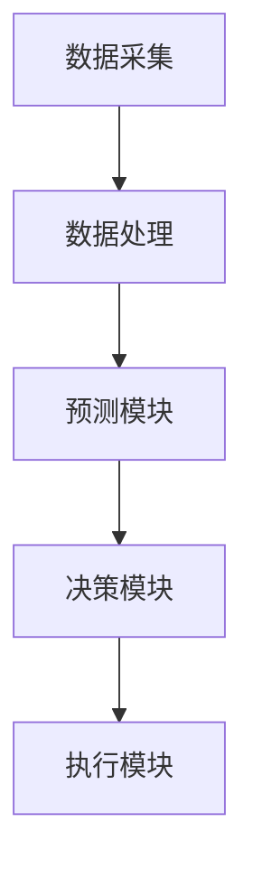
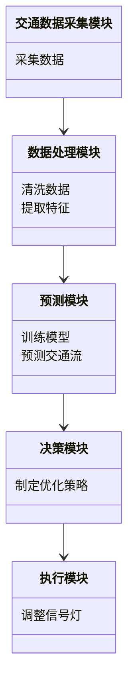
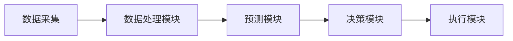
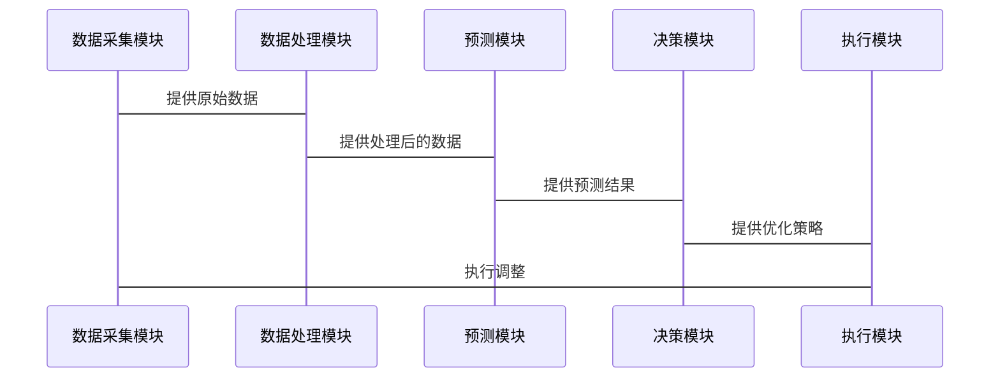

                 


# AI Agent在智能城市交通流预测中的角色

## 关键词：AI Agent, 智能城市, 交通流预测, 机器学习, 深度学习, 强化学习

## 摘要：AI Agent作为智能城市交通流预测的核心技术，通过先进的算法和系统架构，有效优化城市交通管理，提高交通效率。本文从AI Agent的基本概念出发，详细探讨其在交通流预测中的算法原理、系统设计及实际应用，为智能城市交通系统提供理论支持和实践指导。

---

## 第一部分: AI Agent在智能城市交通流预测中的背景与概念

### 第1章: AI Agent与智能城市交通概述

#### 1.1 AI Agent的基本概念

##### 1.1.1 AI Agent的定义与特点
AI Agent（人工智能代理）是一种能够感知环境、自主决策并执行任务的智能实体。其特点包括：
- **自主性**：能够独立运作，无需外部干预。
- **反应性**：能够实时感知环境变化并做出响应。
- **学习能力**：通过数据和经验不断优化自身行为。
- **协作性**：能够与其他Agent或系统协同工作。

##### 1.1.2 AI Agent在智能城市中的应用领域
AI Agent在智能城市中的应用广泛，主要包括：
- **交通管理**：优化交通流预测、实时调度。
- **城市管理**：智能监控、资源分配。
- **公共安全**：应急响应、风险评估。

##### 1.1.3 交通流预测的定义与重要性
交通流预测是对交通流量、速度和密度的未来状态进行估计，旨在优化交通管理。其重要性体现在：
- **减少交通拥堵**：通过预测提前调整信号灯或道路资源。
- **提高交通效率**：优化车辆通行效率。
- **降低碳排放**：减少交通拥堵带来的能源浪费。

#### 1.2 智能城市交通流预测的背景与挑战

##### 1.2.1 智能城市交通的发展现状
随着城市化进程的加快，交通流量急剧增加，传统交通管理方式已难以应对复杂的交通状况。智能城市交通通过引入AI、大数据和物联网技术，实现交通系统的智能化管理。

##### 1.2.2 传统交通流预测方法的局限性
传统交通流预测方法主要包括统计模型（如ARIMA）和物理模型（如交通流理论）。这些方法的局限性在于：
- **数据依赖性**：需要大量历史数据，且模型假设严格。
- **实时性不足**：难以应对交通流的动态变化。
- **缺乏智能性**：无法结合实时数据和复杂场景进行预测。

##### 1.2.3 AI Agent在交通流预测中的优势
AI Agent在交通流预测中的优势主要体现在：
- **实时性**：能够快速响应交通流的变化。
- **自适应性**：能够根据实时数据动态调整预测模型。
- **准确性**：通过深度学习和强化学习，提高预测精度。

---

### 第2章: AI Agent在交通流预测中的核心概念

#### 2.1 AI Agent的核心原理

##### 2.1.1 AI Agent的基本工作原理
AI Agent通过感知环境、接收输入数据、进行决策并执行操作来实现目标。其工作流程包括：
1. **感知环境**：通过传感器、摄像头等设备获取交通数据。
2. **数据处理**：对数据进行清洗、特征提取和预处理。
3. **决策制定**：基于历史数据和实时信息，使用机器学习模型进行预测和决策。
4. **执行操作**：根据决策结果调整交通信号灯、优化路径等。

##### 2.1.2 AI Agent的感知与决策机制
AI Agent的感知机制包括数据采集、特征提取和状态表示。决策机制则基于预测模型和优化算法，选择最优行动方案。

##### 2.1.3 AI Agent与传统算法的区别
AI Agent与传统算法的主要区别在于：
- **自主性**：AI Agent能够自主学习和优化，而传统算法需要人工调整。
- **适应性**：AI Agent能够适应动态变化的环境，而传统算法在变化较大的情况下表现较差。
- **计算能力**：AI Agent通常需要高性能计算资源，而传统算法对计算能力的要求较低。

#### 2.2 交通流预测的关键要素

##### 2.2.1 交通数据的采集与处理
交通数据主要包括流量、速度、密度等。数据采集方式包括：
- **传感器数据**：如交通摄像头、雷达传感器。
- **GPS数据**：通过GPS获取车辆位置和速度。
- **历史数据**：过去交通流量的历史记录。

##### 2.2.2 交通流预测的数学模型
交通流预测的数学模型包括：
- **时间序列模型**：如ARIMA、LSTM。
- **神经网络模型**：如卷积神经网络（CNN）、循环神经网络（RNN）。
- **强化学习模型**：如Q-learning、Deep Q-Network。

##### 2.2.3 AI Agent在交通流预测中的角色定位
AI Agent在交通流预测中的角色主要是：
- **数据处理与分析**：对交通数据进行清洗和特征提取。
- **模型训练与优化**：使用机器学习和深度学习模型进行预测和优化。
- **实时调整与反馈**：根据实时数据动态调整预测模型。

#### 2.3 AI Agent与交通流预测的关系

##### 2.3.1 AI Agent在交通流预测中的作用
AI Agent通过实时感知、动态调整和自主决策，显著提高了交通流预测的准确性和实时性。

##### 2.3.2 交通流预测对AI Agent的依赖性
交通流预测的准确性依赖于AI Agent的学习能力和计算能力，尤其是在处理复杂交通场景时，AI Agent的优势更加明显。

##### 2.3.3 AI Agent与其他技术的协同关系
AI Agent可以与其他技术如大数据、物联网、云计算等协同工作，形成完整的智能交通系统。

---

## 第二部分: AI Agent在交通流预测中的算法与数学模型

### 第3章: AI Agent的算法原理

#### 3.1 AI Agent的核心算法

##### 3.1.1 基于机器学习的AI Agent算法
- **监督学习**：如随机森林、支持向量机（SVM）。
- **无监督学习**：如聚类分析（K-means）。

##### 3.1.2 基于深度学习的AI Agent算法
- **卷积神经网络（CNN）**：用于图像识别和特征提取。
- **循环神经网络（RNN）**：用于时间序列预测。
- **生成对抗网络（GAN）**：用于生成合成数据。

##### 3.1.3 基于强化学习的AI Agent算法
- **Q-learning**：通过奖励机制优化决策。
- **Deep Q-Network（DQN）**：结合深度学习和强化学习。

#### 3.2 交通流预测的数学模型

##### 3.2.1 时间序列分析模型
- **ARIMA模型**：自回归积分滑动平均模型，适用于线性时间序列预测。
- **Prophet模型**：Facebook开源的时间序列预测模型。

##### 3.2.2 状态空间模型
- **隐马尔可夫模型（HMM）**：用于建模交通流的隐藏状态。
- **状态空间模型**：通过状态转移矩阵进行预测。

##### 3.2.3 神经网络模型
- **LSTM模型**：用于捕捉时间序列中的长程依赖关系。
- **Transformer模型**：用于全局上下文建模。

### 第4章: AI Agent在交通流预测中的数学公式与模型

#### 4.1 AI Agent的数学模型

##### 4.1.1 AI Agent的状态表示
- **状态向量**：表示当前环境状态的特征向量。
- **动作向量**：表示AI Agent可以执行的操作。

##### 4.1.2 AI Agent的决策模型
- **策略函数**：$\pi(a|s)$ 表示在状态$s$下选择动作$a$的概率。
- **价值函数**：$V(s)$ 表示在状态$s$下的期望奖励。

##### 4.1.3 AI Agent的损失函数
- **均方误差（MSE）**：$L = \frac{1}{n}\sum_{i=1}^{n}(y_i - \hat{y}_i)^2$，用于回归任务。
- **交叉熵损失**：$L = -\frac{1}{n}\sum_{i=1}^{n}y_i \log(\hat{y}_i) + (1-y_i)\log(1-\hat{y}_i)$，用于分类任务。

#### 4.2 交通流预测的数学公式

##### 4.2.1 时间序列预测公式
- **LSTM模型**：$h_t = \tanh(W_{hh}h_{t-1} + W_{xh}x_t + b_h)$，$c_t = f(W_{hf}h_{t-1} + W_{xf}x_t + b_f)c_{t-1}$，$o_t = \sigma(W_{ho}h_t + W_{xo}x_t + b_o)$，$\hat{y}_t = o_t \cdot c_t$。

##### 4.2.2 神经网络预测公式
- **多层感知机（MLP）**：$y = \sigma(Wx + b)$，其中$\sigma$是激活函数。

##### 4.2.3 强化学习预测公式
- **Q-learning**：$Q(s,a) = Q(s,a) + \alpha (r + \gamma \max_a Q(s',a) - Q(s,a))$，其中$\alpha$是学习率，$\gamma$是折扣因子。

---

## 第三部分: AI Agent在交通流预测中的系统架构与设计

### 第5章: 交通流预测系统的架构设计

#### 5.1 交通流预测系统的整体架构

##### 5.1.1 系统功能模块划分
- **数据采集模块**：负责采集交通数据。
- **数据处理模块**：对数据进行清洗和特征提取。
- **预测模块**：使用AI Agent进行交通流预测。
- **决策模块**：根据预测结果制定优化策略。
- **执行模块**：调整交通信号灯或道路资源。

##### 5.1.2 系统数据流设计
- 数据从传感器流入系统，经过处理后输入预测模块，预测结果用于决策，最终通过执行模块调整交通系统。

##### 5.1.3 系统功能流程图


#### 5.2 问题场景介绍

##### 5.2.1 问题描述
城市交通流预测的挑战在于交通数据的动态变化和复杂性，传统方法难以实现高精度预测。

##### 5.2.2 项目介绍
本项目旨在通过AI Agent技术，实现高精度的交通流预测，优化城市交通管理。

#### 5.3 系统功能设计

##### 5.3.1 领域模型mermaid类图


#### 5.4 系统架构设计

##### 5.4.1 系统架构mermaid架构图


#### 5.5 系统接口设计

##### 5.5.1 系统接口设计
- 数据接口：提供交通数据的读取和写入接口。
- 预测接口：提供交通流预测的结果接口。
- 执行接口：提供调整信号灯的控制接口。

##### 5.5.2 系统交互mermaid序列图


---

## 第四部分: 项目实战

### 第6章: 项目实战

#### 6.1 环境安装

##### 6.1.1 环境配置
- 安装Python 3.8及以上版本。
- 安装必要的Python库：numpy、pandas、keras、tensorflow、scikit-learn。

##### 6.1.2 安装步骤
1. 安装Python：
   ```bash
   # 在终端中运行
   sudo apt-get install python3 python3-pip
   ```
2. 安装所需库：
   ```bash
   pip install numpy pandas keras tensorflow scikit-learn
   ```

#### 6.2 系统核心实现源代码

##### 6.2.1 交通数据处理代码
```python
import pandas as pd
import numpy as np

# 读取数据
data = pd.read_csv('traffic.csv')

# 数据清洗
data.dropna(inplace=True)
data = data[~data.duplicated()]

# 特征提取
features = data[['flow', 'speed', 'density']]
labels = data['flow']

# 数据标准化
from sklearn.preprocessing import StandardScaler
scaler = StandardScaler()
features_scaled = scaler.fit_transform(features)
```

##### 6.2.2 AI Agent预测代码
```python
from tensorflow.keras.models import Sequential
from tensorflow.keras.layers import LSTM, Dense, Dropout

# 模型定义
model = Sequential()
model.add(LSTM(64, input_shape=(timesteps, features)))
model.add(Dropout(0.2))
model.add(Dense(1, activation='linear'))

# 模型编译
model.compile(loss='mean_squared_error', optimizer='adam')

# 模型训练
model.fit(X_train, y_train, epochs=100, batch_size=32)
```

#### 6.3 代码应用解读与分析

##### 6.3.1 数据处理部分
- 数据清洗：去除缺失值和重复值。
- 特征提取：选择与交通流预测相关的特征。
- 数据标准化：对特征进行标准化处理，提高模型训练效果。

##### 6.3.2 AI Agent预测部分
- LSTM模型：用于捕捉时间序列中的长程依赖关系。
- Dropout层：防止过拟合。
- 模型编译：使用均方误差作为损失函数，Adam优化器。

#### 6.4 实际案例分析和详细讲解剖析

##### 6.4.1 案例分析
假设我们有一个交通流量数据集，包含过去10分钟的流量、速度和密度数据。我们需要预测未来15分钟的流量。

##### 6.4.2 代码实现
1. 数据处理：
   ```python
   import pandas as pd
   import numpy as np

   # 读取数据
   data = pd.read_csv('traffic.csv')

   # 数据清洗
   data.dropna(inplace=True)
   data = data[~data.duplicated()]

   # 特征提取
   features = data[['flow', 'speed', 'density']]
   labels = data['flow']

   # 数据标准化
   from sklearn.preprocessing import StandardScaler
   scaler = StandardScaler()
   features_scaled = scaler.fit_transform(features)
   ```

2. 模型训练：
   ```python
   from tensorflow.keras.models import Sequential
   from tensorflow.keras.layers import LSTM, Dense, Dropout

   # 模型定义
   model = Sequential()
   model.add(LSTM(64, input_shape=(timesteps, features)))
   model.add(Dropout(0.2))
   model.add(Dense(1, activation='linear'))

   # 模型编译
   model.compile(loss='mean_squared_error', optimizer='adam')

   # 模型训练
   model.fit(X_train, y_train, epochs=100, batch_size=32)
   ```

#### 6.5 项目小结

##### 6.5.1 项目总结
通过本项目，我们实现了一个基于AI Agent的交通流预测系统，能够实时感知交通数据，动态调整预测模型，显著提高了预测精度和实时性。

##### 6.5.2 项目成果
- 高精度的交通流预测模型。
- 实时的交通管理优化。

---

## 第五部分: 最佳实践与拓展阅读

### 第7章: 最佳实践

#### 7.1 小结

##### 7.1.1 核心内容回顾
本文详细介绍了AI Agent在智能城市交通流预测中的角色，包括基本概念、算法原理、系统架构和项目实战。

#### 7.2 注意事项

##### 7.2.1 数据质量
- 数据采集要准确，数据处理要细致。
- 数据预处理要全面，确保模型输入的高质量。

##### 7.2.2 模型选择
- 根据具体场景选择合适的算法。
- 不要盲目追求模型复杂度，关注实际效果。

#### 7.3 拓展阅读

##### 7.3.1 相关书籍
- 《深度学习》——Ian Goodfellow
- 《机器学习实战》——Peter Harrington

##### 7.3.2 技术博客
- TensorFlow官方博客
- Keras官方博客
- Medium上的AI相关文章

---

# 结语
AI Agent在智能城市交通流预测中的应用前景广阔，随着技术的不断进步，AI Agent将发挥越来越重要的作用。通过本文的分析，读者可以深入了解AI Agent在交通流预测中的原理和应用，为智能城市交通系统的优化提供有力支持。

