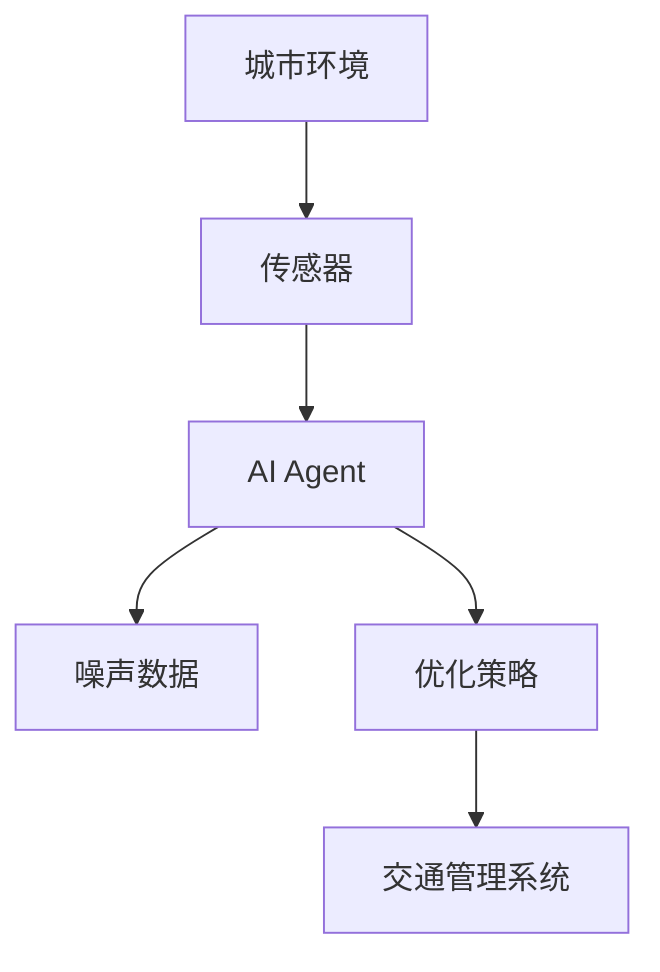
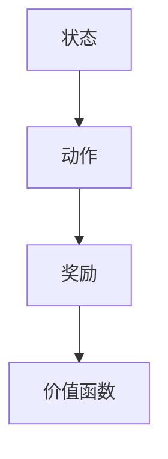
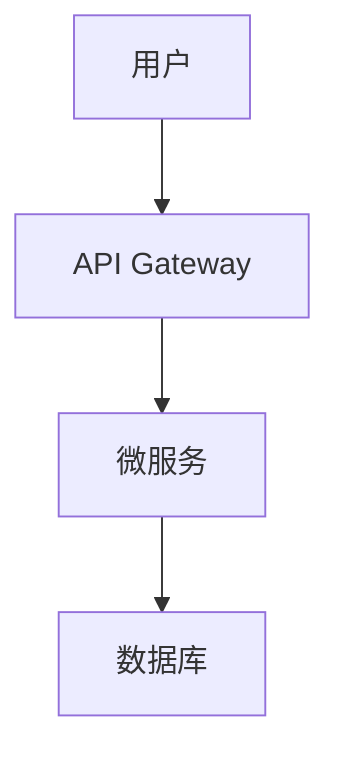

                 


# AI Agent在智能城市噪声管理中的实践

## 关键词：AI Agent，智能城市，噪声管理，城市环境，智能系统

## 摘要：本文探讨AI Agent在智能城市噪声管理中的应用，分析其实现原理、系统架构及实际案例，为城市噪声治理提供创新思路。

---

# 第1章: AI Agent与智能城市噪声管理概述

## 1.1 AI Agent的基本概念

### 1.1.1 AI Agent的定义

AI Agent（人工智能代理）是指能够感知环境、自主决策并执行任务的智能实体。它通过传感器获取数据，利用算法处理信息，采取行动以实现特定目标。

### 1.1.2 AI Agent的核心特征

- **自主性**：无需外部干预，自主完成任务。
- **反应性**：能实时感知环境变化并作出反应。
- **学习能力**：通过数据优化决策策略。
- **协作性**：与其他系统或Agent协同工作。

### 1.1.3 AI Agent在智能城市中的作用

AI Agent在智能城市中充当信息处理和决策的核心角色，优化资源配置，提升城市管理效率。

## 1.2 智能城市噪声管理的背景与挑战

### 1.2.1 城市噪声污染的现状

城市噪声污染主要来源于交通、工业和建筑活动，影响居民生活质量和健康。

### 1.2.2 智能城市噪声管理的需求

传统噪声管理依赖人工监测，效率低下。智能城市需要实时、动态的噪声管理解决方案。

### 1.2.3 AI Agent在噪声管理中的优势

AI Agent能够实时采集数据，快速分析并制定最优策略，有效降低噪声污染。

---

# 第2章: AI Agent的核心概念与联系

## 2.1 AI Agent的原理与架构

### 2.1.1 AI Agent的感知模块

通过传感器收集噪声数据，结合历史数据进行分析。

### 2.1.2 AI Agent的决策模块

基于感知数据，利用算法制定最优决策。

### 2.1.3 AI Agent的执行模块

通过执行机构或系统接口，实施决策方案。

## 2.2 AI Agent与其他技术的对比

### 2.2.1 AI Agent与传统算法的对比

| 特性       | AI Agent             | 传统算法             |
|------------|----------------------|----------------------|
| 自主性       | 高                   | 低                   |
| 适应性       | 高                   | 低                   |
| 决策方式     | 基于学习和优化       | 基于固定规则         |

### 2.2.2 AI Agent与机器学习的对比

AI Agent结合了机器学习算法，但更强调自主决策和执行。

### 2.2.3 AI Agent与规则引擎的对比

AI Agent具备学习能力，而规则引擎依赖预设规则。

## 2.3 基于AI Agent的噪声管理实体关系图



---

# 第3章: AI Agent的算法原理与数学模型

## 3.1 AI Agent的核心算法

### 3.1.1 强化学习算法



```python
class Agent:
    def __init__(self, actions):
        self.actions = actions
        self.Q = {state: {action: 0 for action in actions} for state in states}
    
    def learn(self, state, action, reward):
        self.Q[state][action] = self.Q[state][action] + 0.1*(reward + max(self.Q[state].values()) - self.Q[state][action])
```

### 3.1.2 协同过滤算法

```python
import numpy as np

def collaborative_filtering(user, items, ratings, neighbors):
    similar_users = []
    for u in users:
        if u != user:
            similarity = np.corrcoef(ratings[user], ratings[u])[0,1]
            if similarity > threshold:
                similar_users.append(u)
    avg_rating = sum(ratings[u][item] for u in similar_users) / len(similar_users)
    return avg_rating
```

## 3.2 数学模型与公式

噪声预测模型：

$$
N(t) = \alpha \cdot N(t-1) + \beta \cdot A(t) + \gamma \cdot C(t)
$$

其中：
- \( N(t) \)：当前噪声水平
- \( \alpha \)：自回归系数
- \( N(t-1) \)：前一时刻的噪声水平
- \( A(t) \)：当前时刻的活动强度
- \( C(t) \)：当前时刻的环境条件

---

# 第4章: 基于AI Agent的噪声管理系统分析与设计

## 4.1 问题场景介绍

实时监测和优化城市交通信号灯，以降低噪声污染。

## 4.2 系统功能设计

### 4.2.1 数据采集模块

- 采集噪声、交通流量等数据。

### 4.2.2 数据处理模块

- 对数据进行清洗和预处理。

### 4.2.3 数据分析模块

- 使用机器学习模型预测噪声水平。

### 4.2.4 优化策略模块

- 制定交通信号灯优化方案。

### 4.2.5 反馈模块

- 根据结果调整策略。

## 4.3 系统架构设计



## 4.4 接口设计

- RESTful API接口，如`/api/noise/predict`。

---

# 第5章: 项目实战

## 5.1 环境搭建

安装Python、TensorFlow、Flask等工具。

## 5.2 核心功能实现

### 5.2.1 数据采集接口

```python
from flask import Flask, jsonify

app = Flask(__name__)

@app.route('/api/noise', methods=['GET'])
def get_noise_data():
    # 获取数据并返回
    return jsonify(data)
```

### 5.2.2 噪声预测模型

```python
from sklearn.ensemble import RandomForestRegressor

model = RandomForestRegressor()
model.fit(X_train, y_train)
y_pred = model.predict(X_test)
```

### 5.2.3 优化策略实现

```python
def optimize_traffic_lights():
    # 调整信号灯参数以减少噪声
    pass
```

## 5.3 实际案例分析

分析某城市区域的噪声数据，展示系统优化效果。

---

# 第6章: 最佳实践与总结

## 6.1 最佳实践

- 数据质量至关重要。
- 选择合适的算法和模型。
- 确保系统的可扩展性和可维护性。

## 6.2 项目总结

AI Agent在噪声管理中表现出强大的能力和潜力，值得进一步研究和应用。

## 6.3 展望

未来，AI Agent将与其他智能技术结合，推动城市管理更加智能化和高效化。

---

# 结语

AI Agent为智能城市噪声管理提供了创新的解决方案，通过实时监测和优化，显著提升了城市管理效率和居民生活质量。

