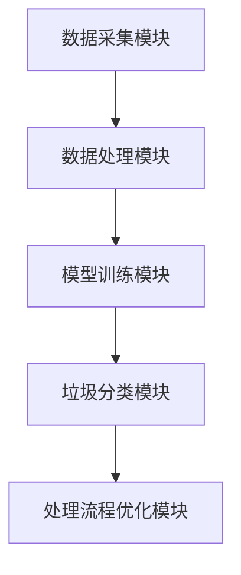

                 


# AI Agent在智能城市垃圾分类中的实践

## 关键词：AI Agent, 智能城市, 垃圾分类, 机器学习, 计算机视觉, 自然语言处理

## 摘要：  
随着城市化进程的加快，垃圾分类成为智能城市建设中的重要一环。AI Agent作为一种智能化的解决方案，通过机器学习、计算机视觉和自然语言处理等技术，能够高效地实现垃圾的识别、分类和处理。本文详细探讨AI Agent在智能城市垃圾分类中的实践，从算法原理到系统设计，再到项目实战，全面解析其在智能城市管理中的应用价值。

---

## 第一部分: AI Agent在智能城市垃圾分类中的背景与概念

### 第1章: 智能城市垃圾分类的背景与问题

#### 1.1 智能城市的发展背景  
城市化进程的加快带来了城市管理的复杂性增加，特别是在环境保护方面，垃圾分类成为一项重要任务。AI技术的快速发展为城市管理提供了新的解决方案。  

#### 1.2 垃圾分类的现状与问题  
传统的垃圾分类依赖人工操作，存在效率低、成本高、分类不准确等问题。AI Agent的引入能够有效解决这些问题，推动垃圾分类的智能化和高效化。

---

### 第2章: AI Agent的核心概念与特点

#### 2.1 AI Agent的基本定义  
AI Agent是一种能够感知环境、自主决策并执行任务的智能实体。它具备学习能力、适应能力和自主决策能力。  

#### 2.2 AI Agent在智能城市中的应用  
AI Agent在垃圾分类中的应用主要体现在垃圾识别、分类优化和处理流程管理等方面。  

#### 2.3 AI Agent的核心技术与算法  
AI Agent的核心技术包括机器学习、计算机视觉和自然语言处理。这些技术使其能够实现垃圾的精准识别和分类。

---

### 第3章: AI Agent与智能城市垃圾分类的结合

#### 3.1 AI Agent在垃圾分类中的应用场景  
AI Agent可以用于垃圾识别、分类优化和处理流程管理，从而提高垃圾分类的效率和准确性。  

#### 3.2 AI Agent在智能城市中的系统架构  
AI Agent的系统架构包括数据采集、数据处理、模型训练和执行模块。这些模块协同工作，实现垃圾分类的智能化管理。

---

## 第二部分: AI Agent在智能城市垃圾分类中的算法与系统设计

### 第4章: AI Agent的算法原理与实现

#### 4.1 机器学习算法在垃圾分类中的应用  
- 监督学习算法：用于垃圾类别分类，如支持向量机（SVM）和随机森林（Random Forest）。  
- 无监督学习算法：用于垃圾聚类分析，如K-means算法。  
- 强化学习算法：用于优化垃圾处理流程。  

#### 4.2 计算机视觉技术在垃圾识别中的应用  
- 图像分类算法：用于垃圾种类的识别，如卷积神经网络（CNN）。  
- 目标检测算法：用于垃圾位置的精确定位，如YOLO算法。  

#### 4.3 自然语言处理技术在垃圾分类中的应用  
- 文本分类算法：用于垃圾描述的分类，如TF-IDF和朴素贝叶斯算法。  

---

### 第5章: AI Agent的系统架构与设计

#### 5.1 系统功能模块划分  
- 数据采集模块：负责采集垃圾图像、文本和位置信息。  
- 数据处理模块：对采集的数据进行预处理和特征提取。  
- 模型训练模块：基于机器学习算法训练垃圾分类模型。  

#### 5.2 系统架构图  


---

## 第三部分: AI Agent在智能城市垃圾分类中的项目实战

### 第6章: 项目环境安装与核心代码实现

#### 6.1 环境安装  
- 安装Python和相关库：`pip install numpy, pandas, scikit-learn, tensorflow`  
- 安装计算机视觉库：`pip install opencv-python`  

#### 6.2 核心代码实现  
```python
import numpy as np
from sklearn.svm import SVC
from sklearn.metrics import accuracy_score

# 数据预处理
X = np.array([...])  # 特征数据
y = np.array([...])  # 标签数据

# 训练模型
model = SVC()
model.fit(X, y)

# 模型预测
y_pred = model.predict(X)
print("Accuracy:", accuracy_score(y, y_pred))
```

---

### 第7章: 项目案例分析与总结

#### 7.1 案例分析  
通过实际案例分析AI Agent在垃圾分类中的应用效果，验证算法的准确性和效率。  

#### 7.2 项目总结  
总结项目实施的经验和教训，提出改进建议，为未来的垃圾分类系统设计提供参考。

---

## 第四部分: AI Agent在智能城市垃圾分类中的最佳实践

### 第8章: 最佳实践与小结

#### 8.1 小结  
AI Agent在智能城市垃圾分类中的应用前景广阔，能够显著提高垃圾分类的效率和准确性。  

#### 8.2 注意事项  
在实际应用中，需要注意数据质量、模型优化和系统维护等问题。  

#### 8.3 拓展阅读  
推荐相关技术文献和项目案例，供读者进一步学习和研究。

---

## 总结  
AI Agent作为智能化解决方案，在智能城市垃圾分类中具有重要的应用价值。通过机器学习、计算机视觉和自然语言处理等技术，AI Agent能够实现垃圾的高效识别和分类，推动城市管理的智能化发展。

